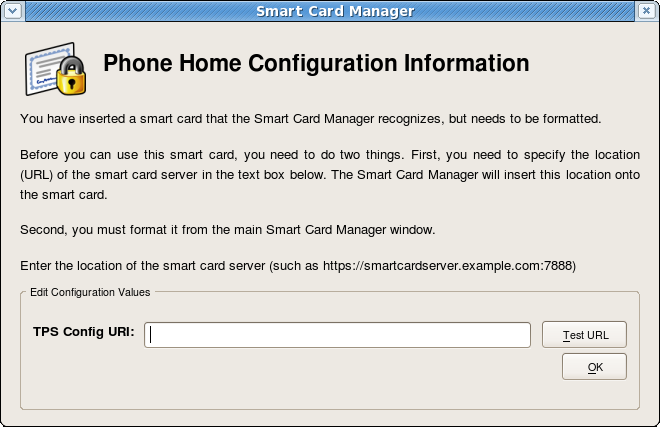
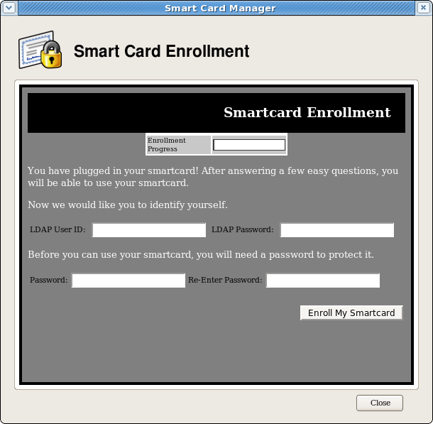

# ESC Guide
-----------



Introduction
------------

The Smart Card Manager is a simple client application designed manage security smart card within the context of the overall Dogtag Certificate System. Update!! Dogtag Certificate System is now live. More information on Dogtag can be found here: [Dogtag](http://pki-svn.fedora.redhat.com/wiki/PKI_Main_Page). Specifically this component interacts with the Token Processing System component of Dogtag Certificate System providing the following functions:

-   The enrollment of supported smart cards supervised by TPS.
-   The subsequent management of the cards:
    -   Reformat the card back to its original state.
    -   Reset the card's password or "PIN" to a new value.
    -   Re-enroll the card if appropriate.
    -   Display information about the card itself including any embedded digital certificates.

More information on the Token Processing System portion of Dogtag can be found here: [TPS](http://pki-svn.fedora.redhat.com/wiki/PKI_Documentation#Token_Processing_System)

The Dogtag Certificate System creates, manages, renews, and deletes certificates and keys within an organization. There are five subsystems which govern the behavior of the public-key infrastructure (PKI) of the organization:

-   The Certificate Authority (CA), which creates, renews, and revokes certificates.
-   The Data Recovery Manager (DRM), which archives and recovers keys.
-   The Online Certificate Status Manager, which stores lists of revoked certificates for client applications to use to check if a certificate is valid.
-   The Token Processing System (TPS), which interacts with smart cards to generate and store keys and certificates for a specific user.
-   The Token Key Service (TKS), which generates and stores master keys used by the TPS.

End users can use security tokens, which are also called smart cards, to store user certificates used for applications such as single sign-on access and client authentication. End users are issued the tokens containing certificates and keys required for signing, encryption, and other cryptographic functions. To use the tokens, the TPS must be able to recognize and communicate with them. The tokens have to be *enrolled*, the process of formatting tokens with keys and certificates and adding them to the Certificate System. Smart Card Manager provides the user interface for end entities to enroll tokens and to communicate with the TPS. Smart Card Manager provides the conduit through which TPS communicates with each token over a secure HTTP channel (HTTPS).

After a token is enrolled, applications such as Mozilla Firefox and Thunderbird can be configured to recognize the token and use it for security operations, like client authentication and S/MIME mail. Smart Card Manager provides the following capabilities:

-   Supports Visa Open Platform-compliant smart cards like Axalto Cyberflex egate 32k tokens.
-   Enrolls security tokens so they are recognized by TPS.
-   Maintains the security token, such as re-enrolling a token with TPS.
-   Provides information about the current status of the token or tokens being managed.
-   Supports server-side key generation so that keys can be archived and recovered on a separate token if a token is lost.

### Technologies

The Smart Card Manager makes heavy use of Mozilla browser technology in its operation:

-   Smart Card Manager is a Xulrunner application with the majority of the UI coded in the XUL language. There is also support for externally served HTML UI deployed for the function of enrolling a smart card.
-   Smart Card Manager currently relies upon a privately deployed Xulrunner framework on all three platforms.
-   The application makes use of a native XPCOM component written in C++ that performs many of the low level smart card related functions such as enrolling the card and querying the card for specific card information. The following Mozilla document provides more information into XPCOM development [Creating XPCOM Components](http://www.mozilla.org/projects/xpcom/book/cxc/)
-   High level program logic is controlled by scripts written in Javascript that control the UI while calling down into scriptable portions of the XPCOM component responsible for low level operations.
-   A small set of XPCOM components have been written per platform to assist in providing any useful tray icon functionality.
-   Some tricky processing is done to allow low level XPCOM native code to send messages up to the Javascript/XUL layer of the application.
-   The application communicates with the TPS server system through the use of persistent HTTP connection using the Transfer Chunked Encoding format. This format allows the application to perform operations such at enrollment by routing messages between itself, the card, and the TPS server. During these operations, Smart Card Manager merely acts as a conduit of through which TPS communicates with the card.
-   The application has the ability to kick off various card operations with TPS, but for the rest of the transaction, TPS supervises what is done to the card and what is written to the card.

#### Supporting Components

On each platform , Smart Card Manager, depends upon a variety of low level components for its operation. Following is a list of the low level components:

-   <b>Xulrunner</b>- The Mozilla application environment allows the application to run using Mozilla XUL UI technology as well as leverage a wide range of XPCOM services built into the Mozilla platform.
-   <b>CoolKey</b> - The applications depends upon the CoolKey PKCS \#11 module for many of the low level smart card operations such as:
    -   Detection of smart card insertion and deletion events.
    -   Retrieval of important low level information from the card such as certificate information and cryptographic key material information.
-   <b>PCSC-Lite </b>- This daemon on Linux and the Mac and built into Windows provides low level card functionality to CoolKey itself.
    -   On Linux this daemon is shipped with the Base OS.
    -   On Windows PCSC is built in to the system.
    -   On the Mac, Apple maintains their own distribution of the PCSC daemon as part of the OS.
-   <b>IFD-EGATE</b> - This driver , which is installed on all three platforms, is a plug-in module to PCSC-Lite that allows PCSC to interact with our specific type of Cyberflex smart cards.
-   <b>LIB-USB</b> - IFD-EGATE depends upon this driver for USB functionality.
-   Mac Specific Components
    -   <b>TokenD</b> - The TokenD software installed on Mac provides a link between the Certificate System CoolKeys and the Mac CDSA security API, which provides a wide variety of security functionality. For example, the Apple Mail application can use a KeyChain to perform security-related tasks. A KeyChain can hold entities such as certificates, passwords, and private and public keys. Although most KeyChains are stored in software, the CDSA API allows KeyChains to be stored on smart cards or keys. CoolKey TokenD allows a Certificate System key to show as a KeyChain.
-   Windows Specific Components
    -   Windows Cryptographic Service Provider - 4.3. Windows Cryptographic Service Provider
        -   The Windows version of the Smart Card Manager installs a Windows Cryptographic Service Provider (CSP) that is compatible with the Certificate System-supported smart cards.
        -   Microsoft Windows supports a software library designed to implement the Microsoft Cryptographic Application Programming Interface (CAPI). CAPI allows Windows-based applications, such as the Windows-version of the Smart Card Manager, to be developed to perform secure, cryptographic functions. This API, also known as CryptoAPI, provides a layer between an application which supports it, such as Certificate System, and the details of the cryptographic services provided by the API.
        -   The CAPI interface can be used to create custom CSP libraries. In Certificate System, custom CSP libraries have been created to use the Certificate System-supported smart cards.
        -   The CAPI store is a repository controlled by Windows that houses a collection of digital certificates associated with a given CSP. CAPI oversees the certificates, while each CSP controls the cryptographic keys belonging to the certificates.
        -   The Certificate System CSP is designed to provide cryptographic functions on behalf of Windows using our supported smart cards. The Windows CSP performs its requested cryptographic functionality by calling the Certificate System PKCS \#11 module.
        -   The Certificate System CSP, which has been signed by Microsoft, provides the following features:
            -   Allows the user to send and receive encrypted and signed emails with Microsoft Outlook.
            -   Allows the user to visit SSL-protected websites with Microsoft Internet Explorer.
            -   Allows the user to use smart cards with certain VPN clients, which provides secure access to protected networks.
        -   The required CSP libraries are automatically installed with the Smart Card Manager. There are several common situations when a Windows user interacts directly with the CSP.
            -   When a smart card is enrolled with the Smart Card Manager, the newly created certificates are automatically inserted into the user's CAPI store.
            -   When a smart card is formatted, the certificates associated with that card are removed from the CAPI store.
            -   When using applications like Outlook or Internet Explorer, the user may be prompted to enter the smart card's password. This is required when the smart card is asked to perform protected cryptographic operations such as creating digital signatures.

Platforms
---------

Smart Card Manager runs on the following platforms:

-   Fedora- Latest versions
-   Windows -XP
-   Has been observed running on Win2000 and Vista.
-   Mac OS X 10.4x

Features
--------

Smart Card Manager brings the following set of features:

-   The **Phone Home** feature defines the token issuer name, TPS server, and TPS end-entities interface URL without requiring any user configuration.
-   Smart Card Manager has diagnostic logging that records common access and events and records potential errors such as interruptions with the connection between the Smart Card Manager and the TPS server.
-   The Smart Card Manager user interface incorporates Mozilla XULRunner technology. XULRunner is a runtime package which hosts standalone applications based on XUL, an XML markup language with a rich feature set for user interfaces. XUL has the following advantages over HTML for applications:
    -   XUL provides a wide UI widget set and greater control over the presentation.
    -   XUL markup is local to the client machine, so it has a greater privilege level than HTML.
    -   XUL also uses Javascript as the scripting language for convenient program logic scripting.
    -   XUL Javascript code can make use of the array of Mozilla functionality by using their XPCOM technology.
-   The Mac Smart Card Manager can make use of the CoolKey a smart card-specific TokenD component which bridges the gap between Certificate System-supported tokens and the Mac CDSA security layer, allowing current OS X applications like Apple Mail and Safari to take advantage of the capabilities of Certificate System tokens:
    -   The Mac Keychain Access utility can be used to view the certificates and keys on Certificate System tokens.
    -   The Apple Mail client can be used to view signed and encrypted emails using Certificate System tokens.
    -   The Apple Safari browser can use Certificate System tokens to log onto secure SSL web sites.

How to Get ESC
--------------

The following pre-built binaries of ESC are available as follows:

-   Fedora 6 and 7
    -   ESC is built in and ready to run on these systems.
-   Fedora 8
    -   ESC is part of Fedora 8 in the Extras group. To get ESC simply as root:

        yum install esc

-   Windows XP
    -   [Windows installer](http://directory.fedora.redhat.com/download/SmartCardManagerSetup-1.0.1-6.win32.i386.exe)

Build Instructions
------------------

Being able to build Smart Card Manager on each platform at this point depends upon one's ability to build a Mozilla browser. This is the case since Xulrunner is simply a build variation of the Mozilla browser base. The Linux and Windows platform build Xulrunner 1.8.0.4 while Mac builds Xulrunner 1.8.0.7 for Universal binary functionality. Building the browsers can be a lengthy process based on machine.

### How to get the source

The code is available on CVS. To check out the code,simply do the following:

    cvs -d :pserver:anonymous@cvs.fedora.redhat.com/cvs/dirsec co esc

The following build instructions are divided per platform:

### Linux

#### Prerequisites

Building on Linux requires that one can build the Mozilla Lizard. Building has been tested on F6 and F7. Requirements for this can be found here: [Linux Build Prerequisites](http://developer.mozilla.org/en/docs/Linux_Build_Prerequisites)

Inspection of the current spec file BuildRequires section also reveals what is needed:

    BuildRequires: doxygen fontconfig-devel freetype-devel >= 2.1
    BuildRequires: glib2-devel libIDL-devel atk-devel gtk2-devel libjpeg-devel
    BuildRequires: pango-devel libpng-devel pkgconfig zlib-devel
    BuildRequires: nspr-devel nss-devel
    BuildRequires: autoconf213 libX11-devel libXt-devel

    BuildRequires: pcsc-lite-devel coolkey-devel
    BuildRequires: desktop-file-utils zip binutils libnotify-devel
    BuildRequires: dbus-devel
    Requires: pcsc-lite ifd-egate coolkey nss nspr
    Requires: zip dbus >= 0.90 libnotify >= 0.4.2

#### Steps:

-   Make sure the prerequisites are satisfied on the system.
-   Check out the code from CVS.
-   cd esc/rpm
-   ./build.sh
-   The result raw ESC is placed in BUILD/esc-1.0.1/esc/dist/<kernel>\_glibc\_PTH\_OPT.OBJ/esc\_build/esc
-   The rebuilt RPM will be in the RPMS directory.
-   The rebuilt Source RPM will be in the SRPMS directory.

The above kicks off a simple script that will download the latest SRPM and build it under a buildroot under the current "rpm" directory.

### Mac OS X

Smart Card Manager and supporting components are built as universal binary executables able to run on Intel or PPC hardware.

#### Prerequisites

-   Mac OS X 10.4.x, Intel or Mac.
-   Building Smart Card Manager on the cat requires once again that Mozilla can be built.

-   Simple (relatively) instructions for getting Mozilla to build on OS X Tiger can be found

here: [OS X Mozilla Build Prerequisites](http://developer.mozilla.org/en/docs/Mac_OS_X_Build_Prerequisites)

-   When satisfying the Mozilla requirements make sure to install both Fink and MacPorts package management systems as directed or the build will not complete.

-   XCode 2.2 and greater, 2.2 and 2.3 have been tested.

-   RPM for OS X is helpful in building one of the sub components find it here: <http://rpm4darwin.sourceforge.net/>

##### Steps:

-   Check out the source code from CVS.
-   cd esc/mac
-   Either build as root or insert the following in the sudoers file:
    -   username ALL = NOPASSWD: /usr/sbin/gcc\_select
    -   username ALL = NOPASSWD: /usr/sbin/chown
    -   username ALL = NOPASSWD: /bin/chmod
-   Set the optional environment variable containing the path to the TokenD component. The script is expecting \$TOKEND\_PATH\_NAME=<path>/COOLKEY.zip.
-   ./mac-build.sh

        Note the building of the Xulrunner portion will take quite some time since Mozilla essentially builds xulrunner twice, once for PPC and once for i386.

-   The output Smart Card Manager bundle will be in:

        ./esc/dist/Darwin`<kernel>`_OPT.OBJ/esc_build/ESC.app

-   If the installer completes it will be in:

        SmartCardManager-`<version>`.OSX4.darwin.dmg which contains:
        SmartCardManager-`<version>`.pkg

-   The build script does the following:
    -   Builds the libusb library.
    -   Builds the egate driver.
    -   Builds the CoolKeyPKCS\#11 module.
    -   Builds Smart Card Manager itself.
    -   Obtains the TokenD data, if TOKEND\_PATH\_NAME is set.
    -   Builds the Mac installer bundle.
-   The build script can be re-run to build only a specific component:

        ./mac-build.sh [ -do Usb || -doEgate || -DoESC || -doCoolKey || -doTokenD || -doInstaller]

##### Build TokenD

The current CoolKey TokenD is built with a recent (10.4.9) version of the Mac "darwinbuild" system. "Darwinbuild" refers to an open source set of scripts designed to easily build projects included as part of their open source offerings. Previously, the CoolKey TokenD was built with an early version of darwinbuild. This version of TokenD experienced binary compatibility issues with the upcoming revision of the OS, thus the need to upgrade the version of "darwinbuild" used to build the source. The build process creates a universal TokenD for both Intel and PPC. The following is how this build can be done:

-   Have a PPC mac available for this, building on an Intel is problematic.
-   Make sure XCode is installed
-   Obtain and use Subversion to get a recent build of darwinbuild from MacOSForge.org:
-   Subversion packages for the mac are readily available on the net.

        % svn checkout http://svn.macosforge.org/repository/darwinbuild/trunk/
        % cd trunk
        % make
        % sudo make install 

-   The above will install darwinbuild under /usr/local/bin/darwinbuild
-   To change the intallation tree simply do:

        %sudo make install DESTDIR=<alternate_path>

-   To install it under <alternate_path>/usr/local/bin/darwinbuild
-   Create a disk image where darwinbuild will build everything

        hdiutil create -size 8g -type SPARSE -fs HFSX -volname Builds -uid 0 -gid 0 -attach Builds.dmg

-   Once the image is created double click on it to mount it. This will have to be done each time the machine is booted. Also note, that successive builds of darwinbuild projects can eventually fill this Volume with data. It is a simple matter to remove old builds in an effort to make room for new ones.
-   cd /Volumes/Builds
-   mkdir Build8P2137 : cd Build8P1237
-   /usr/local/bin/darwinbuild -init 8P1237 , this sets up the darwinbuild build area for building darwinbuild projects.
-   The setup done above results in a self contained build environment consisting of a subset of the XCode build tools and libraries that already exist on the target machine. When actual darwinbuild builds are attempted, the darwinbuild script will create a chroot world used to build the requested projects.
-   Attempt to build the stock apple Tokend project:
    -   /usr/local/bin/darwinbuild Tokend
    -   This should take awhile and if everything works out ok the stock Apple TokenD's should be built.
    -   The output for the stock TokenD's should be under BuildRoot/private/var/tmp/Tokend/Tokend-30557.root/System/Library/security/tokend
    -   If the initial build sequence fails, it often can be the result of some needed library or command line tool that was not copied correctly into the local darwinbuild build chroot environment. The error condition is usually printed clearly on the screen. This information can be used to determine which tool or library is missing from the darwinbuild environment. For instance, the error may state the the "tar" utility could not be found. This kind of error can be fixed by taking the "tar" utility from the actual system and placing into the darwinbuild area.

Ex:

        cp /usr/bin/tar /Volumes/Builds/Build8P1237/usr/bin

-   This test build of the stock TokenD system will result in the following:
    -   The builds for the CAC and BELPIC tokend's. Each tokenD is designed for a particular type of smart card.
    -   The file ...Build8P1237/Sources/Tokend-30557.tar.gz which represents a source bundle for Apple's stock TokenD project. If modifications to the stock TokenD are desired simply unpack that tar.gz file into a directory called "Tokend-30557".
    -   This allows the developer to modify the source and rebuild the TokenD using the method above.

-   The following is how to build the COOLKEY tokenD from source.
    -   Now take the CoolKey TokenD code from the directory esc/mac/Tokend-30557 and transport it here:

            /Volumes/Builds/Build8P1237/Sources/Tokend-30557

-   Attempt another build of TokenD

        /usr/local/bin/darwinbiuld Tokend

-   At this point the CoolKey TokenD should only be built.
-   Darwinbuild places the results of the latest build here:

        Build8C46/BuildRoot/provate/var/tmp/Tokend/Tokend-11.root/System/Library/Security/tokend/COOLKEY.tokend, a directory bundle

        The subdirectory /System/Library/Security/tokend is the actual destination on the system a TokenD lives once installed.

        If the SmartCardManager installer is built with the optional TokenD, the installer will install the TokenD in the proper location.
        Also a symbolic link to the CoolKey library is make from the directory "/Library/Application Support/CoolKey/PKCS11".
        This link is needed to allow TokenD the access to the CoolKey PKCS#11 module that it requires for operation.

### Windows

Smart Card Manager and supporting components can be built on the Windows platform using the Cygwin platform.

#### Prerequisites

Once again, in order to build the application on Windows, the machine must be capable of building Xulrunner or Mozilla.

-   Windows XP or Windows 2000 works
-   MSVC 7.1 has been tested.
-   Cygwin- This is discussed in the Mozilla building instructions below:

-   The prerequisites for building Mozilla are listed here: [(http://developer.mozilla.org/en/docs/Windows\_Build\_Prerequisites\_on\_the\_1.7\_and\_1.8\_Branches) Windows Mozilla Prerequisites]

-   The build process for Smart Card Manager also builds the CoolKey component. Prerequisites for CoolKey on Windows are located here (http://www.directory.fedora.redhat.com/wiki/BuildCoolKey)

-   The INNO setup up installer is required if the build process is to create an installer for Smart Card Manager. This software can be found here: [INNO Setup](http://www.jrsoftware.org/isinfo.php) We have tested with INNO Setup 5. If no installer is desired this one is optional.

##### Inno Setup Script

The installer is assisted by the INNO setup compiler script called "setup.iss" Following are a few snippets containing settings for the registry that are optional:

    [Registry]`
    ;The following lines register the CSP. Comment out if not available
    Root: HKLM; Subkey: Software\Microsoft\Cryptography\Defaults\Provider\CoolKey PKCS#11 CSP; ValueType: string; ValueName:        PKCS11Module; ValueData: coolkeypk11.dll; Flags: uninsdeletekey
    ; The following lines set up Smart Card login if desired`
    Root: HKLM; Subkey: Software\Microsoft\Cryptography\Calais\SmartCards\Axalto Developer; ValueType: binary; ValueName: ATRMask; ValueData: ff ff ff ff ff ff ff ff 00 00; Flags: uninsdeletekey`
    Root: HKLM; Subkey: Software\Microsoft\Cryptography\Calais\SmartCards\Axalto Developer; ValueType: string; ValueName: Crypto   Provider; ValueData: CoolKey PKCS#11 CSP`
    Root: HKLM; Subkey: Software\Microsoft\Cryptography\Calais\SmartCards\Axalto Developer; ValueType: binary; ValueName: ATR; ValueData: 3b 75 94 00 00 62 02 02 00 00`
    ;End CSP registration`
    Root: HKLM; Subkey: Software\`
    ; Turn off the "pick a cert" dialog box`
    Root: HKCU; Subkey: Software\Microsoft\Windows\CurrentVersion\Internet Settings\Zones\3; ValueType: dword; ValueName: 1A04; ValueData: 0`
    ; Enable TLS 1.0`
    Root: HKCU; Subkey: Software\Microsoft\Windows\CurrentVersion\Internet Settings; ValueType: dword; ValueName: SecureProtocols; ValueData: 168`

### Steps:

-   Make sure the prerequisites for building Mozilla on Windows are satisfied.
-   Check out the source code from CVS.
-   cd esc/win32
-   Set up the following optional environment variables:
    -   CAPI\_PATH - This is a directory containing a signed Fedora CAPI CSP, containing the files:
        -   clkcsp.dll clkcsp.sig cspres.dll
        -   Ex: set CAPI\_PATH=c:/CSP
    -   MSVC\_PATH - This is a directory containing the MFC dlls needed to run the application:
        -   atl71.dll mfc71.dll msvcp71.dll msvcr71.dll
    -   INNO\_SETUP\_PATH - This is the path to the optional INNO setup compiler. Ex: c:/"Program Files/Inno Setup 5"
-   ./build.sh

The build script does the following:

-   Builds NSS simply to provide NSS libraries for CoolKey to link against
-   Obtains the optional CoolKey CSP files
-   Obtains the egate drivers
-   Obtains the zlib compression library
-   Builds the CoolKey PKCS\#11 module
-   Builds Smart Card Manager itself
-   If the above environment variables have been set correctly, attempt to build the optional installer executable.
-   The output is placed in esc/dist/WIN<version>/esc\_build/ESC
-   The build script can be re-run with certain arguments to re-create single steps of the build process:

        ./build.sh [ -doEsc || -doCoolKey || -doNSS || -doInstaller ]

-   -doEsc will rebuild the Smart Card Manager, -doCoolKey will rebuild CoolKey , and -doInstaller will re-generate the installer, useful for quick changes to the install script.

### Build the CSP

Building the CSP requires that one satisfies most of the requirements needed to build CoolKey. Information on the Windows CSP along with build instructions are available [here](http://www.directory.fedora.redhat.com/wiki/CoolKey#Windows_CSP)

### General Build Information

Once the Smart Card Manager has been built, the following information should be useful if attempting to add any code and rebuild.

-   The following major directories are present:
    -   esc/src/lib - Contains low level libraries for CoolKey, Http Communication, and Linux tray icon functionality.
    -   esc/src/app/xpcom - Contains the XPCOM components for Smart Card Manager itself and platform specific tray icon functionality.
    -   esc/src/app/daemon - Contains the smart card daemon, which on Linux only detects key insertions without having the full application running.
    -   esc/src/app/xul - Contains the XUL and Javascript code for Smart Card Manager. Also, it contains global preferences as well as the bundled strings for the application.

The application can be rebuilt fairly easily during development. There are just a few things to keep in mind:

-   The Smart Card Manager's initial build invocation builds Xulrunner. After Xulrunner has been built, this step does not have to be repeated.
-   The rebuild can be done as follows:
    -   cd <build_path>/esc
    -   make BUILD\_OPT=1 ESC\_VERSION=\$ESC\_VERSION CKY\_INCLUDE=-I\$COOLKEY\_PATH/include CKY\_LIB\_LDD=-L\$COOLKEY\_PATH/lib
        -   ESC\_VERSION controls what is shown in the diagnostics information window for version information.
        -   CKY\_INCLUDE is a simple variable that points to the include directory of a CoolKey build which is needed on Mac and Windows. Linux installs these headers in well known locations with the CoolKey devel package.
        -   CKY\_LIB\_LDD is a simple variable that points to the CoolKey libraries themselves useful on Mac and Windows.
    -   make clean at the top level cleans everything, except Xulrunner.
    -   If changes only to the XUL markup is done a rebuild can be done as follows:
        -   cd <build_path>/esc/src/app/xpcom
        -   make clean
        -   make BUILD\_OPT=1 ESC\_VERSION=\$ESC\_VERSION CKY\_INCLUDE=-I\$COOLKEY\_PATH/include CKY\_LIB\_LDD=-L\$COOLKEY\_PATH/lib

Basic Smart Card Manager Usage
------------------------------

The following section contains basic instructions on using the Smart Card Manager for token enrollment, formating, and password reset operations.

Launching Smart Card Manager
----------------------------

-   On Linux , launch Smart Card Manager by typing `esc` at the command prompt; this brings up the Smart Card Manager daemon process, which silently watches for inserted smart cards. The client can also be launched by selecting **System Settings**, then **Smart Card Manager**, from the system menu.
-   On Windows, Smart Card Manager is launched from the desktop or the start menu; Smart Card Manager is also configured to launch on reboot.
-   On Mac OS X, Smart Card Manager is launched by double-clicking the Smart Card Manager icon wherever the application was installed. Currently the installation procedure places Smart Card Manager in the "/Applications" folder.

Phone Home
----------

The Smart Card Manager offers a feature called **Phone Home** that associates information within each smart card with information which points to distinct TPS servers and Smart Card Manager UI pages. Whenever the Smart Card Manager accesses a new smart card, it connects to the TPS server and retrieves the Phone Home information.

Phone Home quickly retrieves and then caches this information; because the information is cached locally, the TPS subsystem does not have to be contacted each time a formatted smart card is inserted.

The information can be different for every key or token, which means different TPS servers and enrollment URLs can be configured for different corporate or customer groups. Phone Home makes it possible to configure different TPS servers for different issuers or company units, without having to configure the Smart Card Manager manually to find the proper server and URL.

In order for the TPS subsystem to utilize the Phone Home feature, Phone Home must be enabled in the TPS configuration file:

    op.format.tokenKey.issuerinfo.enable=true
    op.format.tokenKey.issuerinfo.value=http://server.example.com

Since the Smart Card Manager is based on Mozilla XULRunner, each user has a profile similar to the user profiles used by Mozilla Firefox or Thunderbird. The Smart Card Manager accesses the configuration preferences file. When the Smart Card Manager caches information for each token, the information is stored in the user's configuration file. The next time the Smart Card Manager is launched, it retrieves the information from the configuration file instead of contacting the server again.

The Phone Home information is put on the token in one of two ways:

-   The preferred method is that the information is burned onto the token at the factory. When the tokens are ordered from the manufacturer, the company should also supply detailed information on how the tokens should be configured when shipped.
-   If tokens are blank, the company IT department can supply the information when formating small groups of tokens.

The following information is used by the Phone Home feature for each smart card:

-   The TPS server and port. For example:

        "esc.key.40900062ff020000ba87.tps.url" = "http://tps.example.com:12443//nk_service"

-   The TPS enrollment interface URL. For example:

        "esc.key.40900062ff020000ba87.tps.url" = "http://tps.example.com:12443/cgi_bin/esc.cgi?"

-   The issuing company name or ID. For example:

        "esc.key.40900062ff020000ba87.issuer.name" = "Example Corp"

-   The Phone Home URL. For example:

        "esc.key.40900062ff020000ba87.phone.home.url" = "http://tps.example.com:12443/phone_home/phone_home.cgi?"

-   Optionally, a default browser URL to access when an enrolled smart card is inserted.

        "esc.key.40900062ff020000ba87.EnrolledTokenBrowserURL" = "http://www.test.example.com)"

The Phone Home feature and the different type of information used by it only work when the TPS has been properly configured to use Phone Home. If the TPS is not configured for Phone Home, then this feature is ignored. The code below shows an example XML file used by the TPS subsystem to configure the Phone Home feature.

    <ServiceInfo><IssuerName>`Example Corp`</IssuerName>
        `<Services>
            `<Operation>[`http://tps.example.com:12443/nk_service`](http://tps.example.com:12443/nk_service)` ## TPS server URL
            `</Operation>
            `<UI>[`http://tps.example.com:12443/cgi_bin/esc.cgi`](http://tps.example.com:12443/cgi_bin/esc.cgi)`   ## Optional
    Enrollment UI
            `</UI>
            `<EnrolledTokenBrowserURL>[`http://www.test.url.com`](http://www.test.url.com)`   ## Optional
    enrolled token url
            `</EnrolledTokenBrowserURL>;
         </Services>
    </ServiceInfo>

**Example TPS Phone Home Configuration File**

Phone Home is triggered automatically when a security token is inserted into a machine. The system immediately attempts to read the Phone Home URL from the token and to contact the TPS server.

If no Phone Home information is stored on the token, the the user is prompted for the Phone Home URL, as shown below. The other information is supplied and stored when the token is formatted. In this case, the company supplies the specific Phone Home URL for the user. After the user submits the URL, the format process adds the rest of the information to the Phone Home profile. The format process is not any different for the user.

**Figure Prompt for Phone Home Information**

The TPS configuration URI is the URL of the TPS server which returns the rest of the Phone Home information to the Smart Card Manager. An example of this URL is `https://test.example.com:12443/cgi-bin/home/index.cgi`. When the TPS configuration URI is accessed, the TPS server is prompted to return all of the Phone Home information to the Smart Card Manager.

The **Test** button can be used to test of the entered URL. If the server is successfully contacted, a message box indicates success. If the test connection fails, an error dialog appears. The **Update Values** button saves the new URLs.

Smart Card Auto Enrollment
--------------------------

Because the Smart Card Manager is configured through the Phone Home feature, simple enrollment of a smart card is extremely easy. Since the information needed to contact the backend TPS server is provided with each smart card, the enrollment process for the user is very simple.

Assuming that the smart card being enrolled is uninitialized and the appropriate Phone Home information has been configured, the user's enrollment process is as follows:

1.  The Smart Card Manager is running.
2.  An uninitialized smart card, pre-formatted with the Phone Home information for the TPS and enrollment interface URL for the user's organization, is inserted. The smart card can be added either by placing a USB form factor smart card into a free USB slot or by inserting a traditional full-sized smart card into a smart card reader.
3.  When the system recognizes the smart card, it displays a message indicating it has detected an uninitiated smart card.

**Figure Smart Card Enrollment with a Card**

This screen gives the option either to close the dialog or to proceed with enrolling the smart card. If the card be removed, a message appears that the smart card is no longer detected.

**Figure . Smart Card Enrollment Message When the Card Is Removed**

Reinserting the card brings the previous dialog back with the option to enroll the smart card. Click **Enroll My Smart Card** to continue with the enrollment process.

1.  Since the application now knows where the enrollment UI is located because of Phone Home, the enrollment form opens for the user to enter the required information. This UI can be customized.

**Figure . Smart Card Enrollment Page**

1.  This example is the default enrollment UI included with the TPS server. This UI is a standard HTML form, so simple modifications, such as setting the company logo or adding extra text or changing field text, is possible.
2.  The sample enrollment UI requires the following information for the TPS server to process the smart card enrollment operation:

**LDAP User ID.** This is the LDAP directory user ID of the user enrolling the smart card; this can also be a screen name or employee or customer ID number.

**LDAP Password.** This is the alpha-numeric password corresponding to the user ID entered; this can be a simple password or a customer number.

The LDAP user ID and password refer to the fact that the TPS server is usually associated with a Directory Server which stores user information and to which the TPS refers to authenticate users.

**Password.** This sets the smart card's password, used to protect the card information.

**Re-Enter Password.** This confirms the smart card's password.

1.  Once the form is filled out, click **Enroll My Smartcard** to submit the information and enroll the card.
2.  When the enrollment process is complete, a message page opens which shows that the card was successfully enrolled and can offer custom instructions on using the newly-enrolled smart card.

**Figure . Smart Card Enrollment Success Message**

Managing Smart Cards
--------------------

The **Manage Smart Cards** page contains many of the operations that can be applied to one of the keys. This page allows users to format the token, set and reset the card's password, and show the card information. Two other operations, enrolling tokens and viewing the diagnostic logging, are also accessed through the **Manage Smart Cards** page. These are addressed in other sections.

**Figure . Manage Smart Cards Page**

### Formatting the Smart Card

Formatting the card brings the smart card to the uninitialized state, which removes all the user keypairs previously generated and erases the password set on the smart card during enrollment.

The TPS server can be configured to load newer versions of the applet and symmetric keys onto the card. Do the following to format the smart card:

1.  Place a supported smart card into the USB slot of the computer. Make sure the card shows up in the **Active Smart Cards** table.

For formatting the smart card, there is no need to enter the key password.

1.  Select **Format** from the **Smart Card Functions** section in the **Manage Smart Cards** screen.
2.  The TPS can be configured to authenticate smart card operations using credentials such as an LDAP user ID and password. If the TPS has been configured for user authentication, fill in the user credentials in the authentication prompt, and click **OK**.
3.  Wait for the token to finish being formatted. A success message will be displayed when the formatting operation is complete.
4.  When the formatting is complete, the **Active Smart Cards** table shows the key as uninitialized.

### Reset Smart Card Password

If a user forgets the password for a smart card after the card is enrolled, it is possible to reset the password by doing the following:

1.  Place a supported smart card into the USB slot of the computer. Make sure the smart card shows up in the **Active Smart Cards** table.
2.  Click the **Reset Password** button in the **Smart Card Functions** window. A dialog for resetting the password on the card then opens.
3.  Enter a new smart card password value in the **Enter new password** field.
4.  Confirm the new smart card password value in the **Re-Enter password** field.

**Figure . Changing Password Dialog**

1.  The TPS can be configured to authenticate smart card operations using credentials such as an LDAP user ID and password. If the TPS has been configured for user authentication, fill in the user credentials in the authentication prompt.
2.  Wait for the token password to finish being reset.

### Viewing Certificates

The **View Certificates** button shows basic information about the selected smart card, including the keys and certificates stored on it.

1.  Place a supported smart card into the USB slot of the computer. Make sure the card shows up in the **Active Smart Cards** table.
2.  Select the card from the list.
3.  Press the **View Certificates** button.
4.  Basic information about the certificates stored on the card is shown, including the serial number, certificate nickname, and validity dates. More detailed information about the certificate can be viewed by selecting a certificate from the list, and clicking **View**.

### Enrolling Smart Cards

Although most smart cards will be enrolled using the automated enrollment,there is an alternative way of enrolling smart cards through the **Manage Smart Cards** page.

**Figure. Manual Enrollment Form**

Enrolling a token with the user key pairs means the token can be used for certificate-based operations such as SSL client authentication and S/MIME.

The TPS server can be configured to generate the user key pairs on the server and then archived in the DRM subsystem for recovery if the token is lost.

1.  Place a supported, unenrolled, smart card into the USB slot of the computer. Make sure the card shows up in the **Active Smart Cards** table at the top.
2.  Press the **Enroll** button. This button is active only if the inserted card is unenrolled.
3.  A dialog opens which is used to set the password on the smart card. Enter a new key password value in the **Enter a password** field.

Confirm the new card password value in the **Re-Enter a password** field.

1.  Click **OK** to begin the enrollment.
2.  The TPS server can be configured to authenticate the enrollment operation. If the TPS has been configured for authentication, enter the user credentials when the dialog box appears, and click **OK**.

**Figure LDAP Authentication Prompt**

1.  The enrollment process will begin generating and archiving keys, if the TPS is configured to archive keys to the DRM.
2.  When the enrollment is complete, the smart card will be listed as `enrolled`.

Diagnosing Problems
-------------------

The Smart Card Manager includes basic diagnostic tools and a simple interface to log errors and common events such as inserting and removing a smart card or changing the card's password. The diagnostic tools can identify and notify users about problems with the Smart Card Manager, smart cards, and TPS connections.

To open the diagnostics page, click on the **Diagnostics** button in the **Manage Smart Cards** screen.

The following problems or events are logged by the Smart Card Manager:

-   The Smart Card Manager does not recognize a card.
-   Problems occur during a smart card operation, such as a certificate enrollment, password reset, or format operation.
-   The Smart Card Manager loses the connection to the smart card. This can happen when problems communicating with the PCSC daemon.
-   Simple events are detected, like card insertions and removals, user-initiated canceled operations, and successfully completed operations.
-   Errors are reported from the TPS to the Smart Card Manager.
-   The connection between the Smart Card Manager and TPS is lost.
-   The NSS crypto library is initialized.
-   Other low-level smart card events are detected.

**Figure Diagnostics Screen**

The diagnostics screen displays the following information:

-   The Smart Card Manager version number.
-   The version information for the system upon which the client is running.
-   The number of cards detected by the Smart Card Manager.

For each card detected, the following information is shown:

-   The version of the applet running inside the smart card.
-   The alpha-numeric ID of the card.
-   The card's status, which can be `Unformatted` (no key is detected), `Formatted` (the key is detected, but no certificates have been enrolled), or `Enrolled` (the detected card has been enrolled with certificate and card information).
-   The card's Phone Home URL. This is the URL from which all Phone Home information is obtained.
-   The card issuer name, such as `Example Corp.`
-   The TPS server URL. This is retrieved through Phone Home.
-   The TPS enrollment form URL. This is retrieved through Phone Home.
-   Detailed information about each certificate contained on the card.

Smart Card Manager Configuration
--------------------------------

Previously, Smart Card Manager relied on an application-specific configuration file. Smart Card Manager is now based on Mozilla XULRunner technology, which allows the preferences facility built into Mozilla to be used for simple configuration of the Smart Card Manager.

` The Smart Card Manager can be launched without requiring extra configuration.`

Configuration
-------------

Smart Card Manager uses the Mozilla configuration preferences system on all three supported platforms. A default configuration file is located in the following directories on each platform:

-   *Windows*: `C:\Program Files\Fedora\ESC\defaults\preferences\esc-prefs.js`
-   *Linux*: `/usr/lib/esc-1.0.0/esc/defaults/preferences/esc-prefs.js`
-   *Mac*: `~/Desktop/ESC.app/defaults/preferences/esc-prefs.js`

This default configuration Javascript file contains the default Smart Card Manager configuration used when Smart Card Manager is first launched.

When Smart Card Manager is launched, a separate, unique profile directory for each user on the system is created; these profiles are stored in different, accessible locations on each platform, as shown:

` When the Smart Card Manager requires any changes to a user's configuration values, the updated values are written to the user's profile area, not to the default Javascript file.`

-   *Windows*: `C:\Documents and Settings\$USER\Application Data\RedHat\ESC\Profiles`
-   *Linux*: `~/.redhat/esc`
-   *Mac*: `~/Library/Application Support/ESC/Profiles`

The `esc-prefs.js` file section below shows the Smart Card Manager-supported configuration values.

**Example Configuration File**
    #################################################################`
    #The entry below is the XUL chrome page where Smart Card Manager`
    #proceeds on startup. `
    #`
     pref("toolkit.defaultChromeURI",
      "(chrome://esc/content/settings.xul)");
    #The entry below is the URL Smart Card Manager consults
    #for back end TPS functionality. 
    #Note this is only a fallback setting. This information
    #is normally obtained through the "Phone Home" functionality.
     pref("esc.tps.url","https://test.host.com:7888/nk_service)");
    #The following three entries are for internal use
     pref("signed.applets.codebase_principal_support",true);
     pref("capability.principal.codebase.p0.granted",
        "UniversalXPConnect");
     pref("capability.principal.codebase.p0.id", "file://");
    #The entry below sets how many seconds Smart Card Manager
    #should wait while TPS is processing a message
     pref("esc.tps.message.timeout","90");
    #The entry can be set allow Smart Card Manager to write
    #newly created certificates 
    #to the local CAPI store after an enrollment operation. 
    #Also, when a format is done, those same certs will be removed 
    #from the local CAPI store.
    pref("esc.windows.do.capi","yes");

Smart Card Manager Mac TokenD
-----------------------------

The TokenD software installed on Mac provides a link between the Certificate System CoolKeys and the Mac CDSA security API, which provides a wide variety of security functionality. For example, the Apple Mail application can use a *KeyChain* to perform security-related tasks. A KeyChain can hold entities such as certificates, passwords, and private and public keys. Although most KeyChains are stored in software, the CDSA API allows KeyChains to be stored on smart cards or keys. CoolKey TokenD allows a Certificate System key to show as a KeyChain.

### Verifying the TokenD Is Working

1.  Make sure Smart Card Manager has been installed on the Mac computer.
2.  Use Smart Card Manager to enroll a token, enabling it with the proper certificates and key information.
3.  Put the enrolled token into a USB slot on the machine.
4.  If TokenD is working, the token blinks for a few seconds while the information is obtained from the token because the Mac CDSA layer is requesting data.
5.  Open the Mac `Keychain Access` utility in the `Applications/Utilities` folder.
6.  Find the new `$Keychain` entry in the list of valid chains. The chain has the the key's UID in its name.
7.  Click on the CoolKey KeyChain. The certificates and keys on the token can easily be viewed.

Smart Card Manager File Locations
---------------------------------

This reference shows the different directories and file locations for the different client machines.

-   The location of the Smart Card Manager main directory on the different client platforms is as follows:
    -   **Windows**: `C:\Program Files\Fedora\ESC`
    -   **Red Hat Enterprise Linux**: `/usr/lib/esc-1.0.1/esc`
    -   **Mac**: User preference for the `ESC.app` directory, usually the desktop, with the default being "/Applicatons".

### Windows

On Windows, Smart Card Manager uses the following directories and files:

-   Main directory: `C:\Program Files\Fedora\ESC`
    -   Smart Card Manager XULRunner application configuration file: `application.ini`
    -   Smart Card Manager XPCOM components directory: `components\`
    -   Directory for Chrome components and additional application files for Smart Card Manager XUL and Javascript: `chrome\`
    -   Smart Card Manager default preferences: `defaults\`
    -   The executable which launches Smart Card Manager in XULRunner: `esc.exe`
    -   Privately-deployed XULRunner bundle: `xulrunner\`

### Linux

On Linux, Smart Card Manager is installed by its binary RPM to the default location `/usr/lib/esc-1.0.1/esc/`.

-   Smart Card Manager XULRunner application configuration file: `application.ini`
-   Smart Card Manager XPCOM components: `components/`
-   Directory for Chrome components and additional application files for Smart Card Manager XUL and Javascript: `chrome/`
-   Smart Card Manager default preferences: `defaults/`
-   The script which launches the Smart Card Manager: `esc`
-   Privately-deployed XULRunner directory: `xulrunner/`

### Mac OS X

On Mac OS X, the XULRunner framework located in `ESC.app` as follows:

-   Privately deployed XUL framework in `Contents/`
    -   `Info.plist`
    -   `Frameworks/`
    -   `XUL.framework/`
    -   Resources
        -   Smart Card Manager XULRunner application configuration file: `application.ini`
        -   Smart Card Manager XPCOM components: `components/`
        -   Directory for Chrome components and additional application files for Smart Card Manager XUL and Javascript: `chrome/`
        -   Smart Card Manager default preferences: `defaults/`

-   The script which launches Smart Card Manager: `xulrunner`

Smart Card Manager XUL, HTML, and Javascript Functionality
----------------------------------------------------------

Smart Card Manager stores the XUL markup and Javascript functionality in the **ESC_INSTALL_PATH** `/chrome/content/esc` directory, where **ESC_INSTALL_PATH** is the Smart Card Manager installation directory.

The following are the primary Smart Card Manager XUL files:

-   `settings.xul` contains the code for the **Settings** page.
-   `esc.xul` contains the code for the **Enrollment** page.
-   `config.xul` contains the code for the configuration UI.
-   `esc_browser.xul` contains the code for hosting the external HTML Smart Card Manager enrollment UI.

The following are the primary Smart Card Manager Javascript files:

-   `ESC.js` contains most of the Smart Card Manager Javascript functionality.
-   `TRAY.js` contains the tray icon functionality.
-   `AdvancedInfo.js` contains the code for the **Diagnostics** feature.
-   `GenericAuth.js` contains the code for the authentication prompt. This prompt is configurable from the TPS server, which requires dynamic processing by Smart Card Manager.

External Enrollment UI Customization Guide
------------------------------------------

Certificate System (specifically the TPS subsystem) comes out of the box with generic external smart card enrollment UI. Since this UI consists of HTML and Javascript, this UI can be customized for a specific deployment as desired.

Given a default TPS instance on a given machine, the enrollment UI can be located here:

    /var/lib/rhpki-tps/cgi-bin/home/Enroll.html

The UI references resources such as images and Javascript files within its code. These resources are located here:

    /var/lib/rhpki-tps/docroot/home

Below is a snippet of the default UI sprinkled with comments on how it might be customized:

      <html> 
       <head> 
       <meta http-equiv="Content-Type" content="text/html; charset=utf-8">
       <link rel=stylesheet href="/home/style.css" type="text/css">

       <!-- Change the title if desired -->
       <title>Enrollment</title>

       </head>
       
       <body onload="InitializeBindingTable();" onunload=cleanup();>
       <progressmeter id="progress-id" hidden="true" align = "center"/>

       <table width="100%" class="logobar">
          <tr>
            <td>

               <!-- Use customized logo here... -->
               

            </td>
            <td>
              
Smartcard Enrollment

            </td>
            </tr>
          </table>
            <table id="BindingTable" width="200px"align="center">
           <tr id="HeaderRow">
           </tr>
         </table>
         
         <!-- Insert customized descriptive text here. -->
         
You have plugged in your smartcard! After answering a few easy questions, you will be able to use your smartcard.

         

         

             Now we would like you to identify yourself.
          

           <table>
             <tr>
               <td>
LDAP User ID: 
</td>
               <td> </td>
               <td><input type="text" id="snametf"  value=""></td>
                <td> </td>
               <td>
LDAP Password: 
</td>
                <td> </td>
               <td><input type="password" id="snamepwd" value=""></td>
             </tr>
             </table>
             
 Before you can use your smartcard, you will need a password to protect it.

             <table>
             <tr>
               <td>
Password:
</td>
               <td><input type="password" id="pintf" name="pintf" value=""></td>
               <td>
Re-Enter Password:
</td>
               <td><input type="password" id="reenterpintf" name="reenterpintf" value=""></td>
           </table>
            
           <table width="100%">
             <tr>
               <td align="right">
                 <input type="button" id="enrollbtn" name="enrollbtn" value="Enroll My Smartcard"    onClick="DoEnrollCOOLKey();">
               </td>
             </tr>
           </table>
       </body></html>

Future Smart Card Manager Enhancements
--------------------------------------

-   Currently Smart Card Manager relies upon a back-end Ceritificate System Token Management System instance to accomplish the bulk of it's functionality. In the future we would like to provide the ability for developers to easily import certificates within the PKCS\#12 format onto a card. This simpler procedure will encourage greater experimentation and use of smart cards.
-   If Fedora eventually releases a system wide Xulrunner, create Smart Card Manager as a simple XPI installer into the global Xulrunner.

