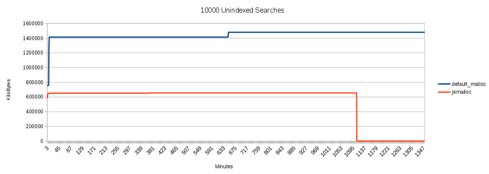

# "jemalloc" Memory Library testing with 389 DS
----------------



## Overview

Compare the behavior of **jemalloc** to the standard OS memory allocator.  This document details various tests(short term and long term), and compares the differences when using different allocators.

## Key

    Test Length    - The time it took ldclt to complete
    Average Rate   - The global average rate reported by ldclt
    Start Memsize  - The start of the DS process before running the test
    End Memsize    - The final size of the DS process after running the test
    Growth         - The memory growth during the test run
    Memory Profile - A profile showing the memory growth

## Setup Information

Loading the jemalloc library

- **yum install jemalloc**

- Systemd enabled:  edit **/etc/sysconfig/dirsrv**
    
        LD_PRELOAD=/usr/lib64/libjemalloc.so.1
        export LD_PRELOAD

- Or, non-systemd: Edit **/etc/init.d/dirsrv**, and add:

        LD_PRELOAD=/usr/lib64/libjemalloc.so.1
        export LD_PRELOAD

- Restart the server: 

        # restart-dirsrv

- Testing with 100k entry database
- DS Verison 1.3.5 (master branch 7/15/2015)
- OS:  Fedora 20 - Linux localhost.localdomain 3.19.8-100.fc20.x86_64
- Default Allocator:  glibc-2.18-19.fc20.x86_64

 

## Reduced cache settings (test the cache churn)
------------------------------------------------

Normalized DN cache: reduced to 2mb from 20mb
nsslapd-cachesize:   500 (cn=userroot,cn=ldbm database,cn=plugins,cn=config)

### Search Tests
--------------------------------------

#### 100K searches per thread 

    # time ldclt -h localhost -p 389 -D "cn=dm" -w password -b "dc=example,dc=com" -f uid=testXXXXX -e esearch,random -r1 -R99999 -I 32 n 2 -T 100000

**Default Library**

    Test Length:    40 secs
    Average rate:   100000.00/thr  (5000.00/sec), total: 200000
    Start Memsize:    928,688 kb
    End MemSize:    2,763,696 kb
    Growth:         1,835,008 kb

    Memory Profile
    -----------------------------------------------------------------------
    07/14-[14:47:55] ------- 28291 928688 35688  0.4    growth:   0 k
    07/14-[14:48:00] ------- 28291 2763696 45076 8.1    growth:   1835008 k
    07/14-[14:48:05] ------- 28291 2763696 56872 28.0   growth:   0 k

**jemalloc**

    Test Length:    40 secs
    Average rate:   100000.00/thr  (5000.00/sec), total: 200000
    Start Memsize:  629,796 kb
    End Memsize:    748,580 kb
    Growth:         118,784 kb

    Memory Profile
    ----------------------------------------------------------------------
    07/14-[14:52:01] ------- 28952 629796 35556  0.8    growth:   0 k
    07/14-[14:52:06] ------- 28952 740388 48380 29.7    growth:   110592 k
    07/14-[14:52:11] ------- 28952 740388 53676 59.8    growth:   0 k
    07/14-[14:52:16] ------- 28952 748580 57092 79.7    growth:   8192 k
    07/14-[14:52:21] ------- 28952 748580 58656 94.1    growth:   0 k

**Results**

    Final Memory Size

    Default Library: 1,835,008 kb
    jemalloc:          748,580 kb

-----------------

#### 1 Million Searches Per Thread

    # time ldclt -h localhost -p 389 -D "cn=dm" -w password -b "dc=example,dc=com" -f uid=testXXXXX -e esearch,random -r1 -R99999 -I 32 n 2 -T 1000000

**Default Library**
    
    Test Legnth:   3 min 50 secs
    Average rate:  1000000.00/thr  (8695.65/sec), total: 2000000
    Start Memsize:   928,684 kb
    End Memsize:   2,763,692 kb
    Growth:        1,835,008 kb

    Memory Profile
    -----------------------------------------------------------------------
    07/14-[14:42:33] ------- 27426 928684 35720  0.4    growth:   0 k
    07/14-[14:42:38] ------- 27426 2763692 41428 1.7    growth:   1835008 k
    07/14-[14:42:43] ------- 27426 2763692 47924 24.2   growth:   0 k

**jemalloc**

    Test Legnth:    3 min 20 secs
    Average rate:   1000000.00/thr  (10000.00/sec), total: 2000000
    Start Memsize:  629,796 kb
    End Memsize:    748,580 kb
    Growth:         118,784 kb

    Memory Profile
    ----------------------------------------------------------------------
    07/14-[14:29:37] ------- 25550 629796 35800  0.4    growth:   0 k
    07/14-[14:29:42] ------- 25550 740388 49252 24.1    growth:   110592 k
    07/14-[14:29:47] ------- 25550 740388 54780 42.5    growth:   0 k
    07/14-[14:29:52] ------- 25550 748580 57684 57.0    growth:   8192 k
    07/14-[14:29:57] ------- 25550 748580 59252 68.6    growth:   0 k

**Results**

    Final Memory Size

    Default Library: 2,763,692 kb
    jemalloc:          748,580 kb

 

### Modify Tests
--------------------------------------

#### 10k Modifies Per Thread 

    # time ldclt -h localhost -p 389 -D "cn=dm" -w password -b "dc=example,dc=com" -f uid=testXXXXX  -r1 -R99999 -n 2 -T 10000 -e random -e attreplace='description: random modify XXXXX'

**Default Library**

    Test Length:   60 secs
    Average rate:  10000.00/thr  (333.33/sec), total:  20000
    Start Memsize:   928,680 kb
    End Memsize:   2,763,688 kb 
    Growth:        1,835,008 kb

    Memory Profile
    -------------------------------------------------------------------------
    07/14-[14:23:00] ------- 24405 928680 35668  0.1    growth:   0 k
    07/14-[14:23:05] ------- 24405 2763688 42232 0.9    growth:   1,835,008 k
    07/14-[14:23:10] ------- 24405 2763688 48940 3.0    growth:   0 k

**jemalloc**
    
    Test Legnth:    60 secs
    Average rate:   10000.00/thr  (333.33/sec), total:  20000
    Start Memsize:  625,700 kb
    End Memsize:    629,796 kb
    Growth:           4,096 kb

    Memory Profile
    ---------------------------------------------------------------------
    07/14-[14:26:35] ------- 25042 625700 35712  0.3    growth:   0 k
    07/14-[14:26:40] ------- 25042 629796 35712  0.9    growth:   4,096 k
    07/14-[14:26:45] ------- 25042 629796 35712  0.7    growth:   0 k

**Results**

    Final Memory Size

    Default Library: 2,763,688 kb
    jemalloc:          629,796 kb

-----------------------

#### 100k Modifies Per Thread 

    # time ldclt -h localhost -p 389 -D "cn=dm" -w password -b "dc=example,dc=com" -f uid=testXXXXX  -r1 -R99999 -n 2 -T 50000 -e random -e attreplace='description: random modify XXXXX'

**Default Library**

    Test Legnth:   7 min 20 secs
    Average rate:  100000.00/thr  (454.55/sec), total: 200000
    Start Memsize:   928,684 kb
    End Memsize:   2,829,228 kb
    Growth:        1,900,544 kb

    Memory Profile
    -----------------------------------------------------------------------
    07/14-[14:23:00] ------- 24405 928680 35668  0.1    growth:   0 k
    07/14-[14:23:05] ------- 24405 2763688 42232 0.9    growth:   1835008 k
    07/14-[14:23:10] ------- 24405 2763688 48940 3.0    growth:   0 k

**jemalloc**

    Test Length:   7 min 20 secs
    Average rate:  100000.00/thr  (454.55/sec), total: 200000
    Start Memsize: 629,788 kb
    End Memsize:   752,668 kb
    Growth:        122,880 kb
   
    Memory Profile
    ----------------------------------------------------------------------
    07/14-[14:29:37] ------- 25550 629796 35800  0.4    growth:   0 k
    07/14-[14:29:42] ------- 25550 740388 49252 24.1    growth:   110592 k
    07/14-[14:29:47] ------- 25550 740388 54780 42.5    growth:   0 k
    07/14-[14:29:52] ------- 25550 748580 57684 57.0    growth:   8192 k
    07/14-[14:29:57] ------- 25550 748580 59252 68.6    growth:   0 k

**Results**

    Final Memory Size

    Default Library: 2,829,228 kb
    jemalloc:          752,668 kb

 

### Add/Delete Test
-----------------------------------------

Two ldapmodifies adding and deleting 10000k (20k total entries)

-------------------------------------------

#### 10k Add/Delete 

**Default Library**

    Test Length:   3 min 19 sec
    Start Memsize:   928,680 kb
    End Memsize:   2,763,688 kb
    Growth:        1,835,008 kb

    Memory Profile
    -----------------------------------------------------------------------
    07/14-[15:14:11] ------- 30815 928680 35628  0.3    growth:   0 k
    07/14-[15:14:16] ------- 30815 2763688 36936 0.9    growth:   1835008 k
    07/14-[15:14:26] ------- 30815 2763688 47768 11.3   growth:   0 k
    07/14-[15:14:36] ------- 30815 2763688 49096 18.0   growth:   0 k

**jemalloc**

    Test length:    3 min 19 sec
    Start Memsize:  629,792 kb
    End Memsize:    744,480 kb
    Growth:         114,688 kb

    Memory Profile
    ----------------------------------------------------------------------
    07/14-[15:08:02] ------- 29659 629792 35600  0.1    growth:   0 k
    07/14-[15:08:07] ------- 29659 736288 45704  2.6    growth:   106496 k
    07/14-[15:08:17] ------- 29659 736288 49556  6.7    growth:   0 k
    07/14-[15:08:27] ------- 29659 740384 50836 10.5    growth:   4096 k
    07/14-[15:08:37] ------- 29659 740384 51976 13.5    growth:   0 k
    07/14-[15:08:47] ------- 29659 740384 52728 16.3    growth:   0 k
    07/14-[15:08:57] ------- 29659 744480 53544 18.8    growth:   4096 k
    07/14-[15:09:07] ------- 29659 744480 53788 20.7    growth:   0 k
    07/14-[15:09:17] ------- 29659 744480 53844 22.0    growth:   0 k

**Results**

    Final Memory Size

    Default Library: 2,763,688 kb
    jemalloc:          744,480 kb

---------------------------

#### Add/Delete 10k - Run 10 Times

**Default Library**

    Test length:    31 min  10 sec
    Start Memsize:    928,688 kb
    End Memsize:    2,829,232 kb
    Growth:         1,900,544 kb

    Memory Profile
    ----------------------------------------------------------------------
    07/14-[16:31:52] ------- 4719 928688 35692  0.2    growth:   0 k
    07/14-[16:32:02] ------- 4719 2763696 42208 3.2    growth:   1835008 k
    ...
    07/14-[16:45:51] ------- 4719 2763696 79300 48.8   growth:   0 k
    07/14-[16:46:01] ------- 4719 2829232 79460 48.9   growth:   65536 k
    07/14-[16:46:11] ------- 4719 2829232 80420 49.0   growth:   0 k
    ...
    07/14-[17:03:02] ------- 4719 2829232 106804 51.0  growth:   0 k

**jemalloc**

    Test length:    34 min 1 sec
    Start Memsize:  629,792 kb
    End Memsize:    805,920 kb
    Growth:         176,128 kb

    Memory Profile
    ---------------------------------------------------------------------
    07/14-[17:05:36] ------- 7471 629792 35652  0.5
    07/14-[17:06:36] ------- 7471 740384 52508 21.5    growth:   110592 k
    07/14-[17:07:36] ------- 7471 744480 57604 34.7    growth:   4096 k
    07/14-[17:08:36] ------- 7471 744480 56516 39.4    growth:   0 k
    07/14-[17:09:36] ------- 7471 748576 56200 42.5    growth:   4096 k
    07/14-[17:10:36] ------- 7471 752672 59376 44.5    growth:   4096 k
    07/14-[17:11:36] ------- 7471 752672 59452 45.8    growth:   0 k
    07/14-[17:12:36] ------- 7471 756768 58044 46.7    growth:   4096 k
    07/14-[17:13:36] ------- 7471 760864 58896 47.2    growth:   4096 k
    07/14-[17:14:36] ------- 7471 760864 59964 47.7    growth:   0 k
    07/14-[17:15:36] ------- 7471 764960 58268 48.1    growth:   4096 k
    07/14-[17:16:36] ------- 7471 764960 58136 48.4    growth:   0 k
    07/14-[17:17:36] ------- 7471 769056 61524 48.8    growth:   4096 k
    07/14-[17:18:36] ------- 7471 773152 59264 49.1    growth:   4096 k
    07/14-[17:19:36] ------- 7471 773152 58492 49.3    growth:   0 k
    07/14-[17:20:36] ------- 7471 777248 61244 49.6    growth:   4096 k
    07/14-[17:21:36] ------- 7471 777248 58644 49.7    growth:   0 k
    07/14-[17:22:36] ------- 7471 781344 58940 49.8    growth:   4096 k
    07/14-[17:23:36] ------- 7471 785440 61720 50.0    growth:   4096 k
    07/14-[17:24:36] ------- 7471 785440 61256 50.1    growth:   0 k
    07/14-[17:25:36] ------- 7471 789536 59520 50.2    growth:   4096 k
    07/14-[17:26:36] ------- 7471 793632 61980 50.3    growth:   4096 k
    07/14-[17:27:36] ------- 7471 793632 62596 50.3    growth:   0 k
    07/14-[17:28:36] ------- 7471 797728 59592 50.3    growth:   4096 k
    07/14-[17:29:36] ------- 7471 797728 61664 50.3    growth:   0 k
    07/14-[17:30:36] ------- 7471 797728 62104 50.3    growth:   0 k
    07/14-[17:31:36] ------- 7471 797728 59580 50.2    growth:   0 k
    07/14-[17:32:36] ------- 7471 797728 61732 50.3    growth:   0 k
    07/14-[17:33:37] ------- 7471 797728 62048 50.2    growth:   0 k
    07/14-[17:34:37] ------- 7471 801824 59032 50.2    growth:   4096 k
    07/14-[17:35:37] ------- 7471 801824 60440 50.2    growth:   0 k
    07/14-[17:36:37] ------- 7471 801824 61992 50.2    growth:   0 k
    07/14-[17:37:37] ------- 7471 801824 60220 50.1    growth:   0 k
    07/14-[17:38:37] ------- 7471 805920 56808 48.7    growth:   4096 k
    07/14-[17:39:37] ------- 7471 805920 56808 47.3    growth:   0 k

**Results**

     Final Memory Size

     Default Library: 2,829,232 kb
     jemalloc:          805,920 kb

 

### Unindexed Searches
-----------------------------------------

Two threads issuing unindexed searches

-------------------------------

#### 20 Searches Per Thread 

    # time ldclt -h localhost -p 389 -D "cn=dm" -w password -b "dc=example,dc=com" -f objectclass=top -e esearch -n 2 -T 20

**Default Library**

    Test Length:   3 min 40 secs
    Average rate:  20.00/thr  (  0.18/sec), total:     40
    Start Memsize:   928,680 kb
    End Memsize:   1,321,896 kb
    Growth:          393,216 kb

    Memory Profile
    -----------------------------------------------------------------------
    07/14-[15:23:16] ------- 32157 928680 35392  0.2     growth:   0 k
    07/14-[15:23:26] ------- 32157 1190824 62768 26.1    growth:   262144 k
    07/14-[15:23:36] ------- 32157 1321896 75152 47.1    growth:   131072 k
    07/14-[15:23:46] ------- 32157 1321896 75420 63.5    growth:   0 k

**jemalloc**

    Test Length:    3 min 20 secs
    Global average rate:   20.00/thr  (  0.20/sec), total:     40
    Start Memsize:  629,796 kb
    End Memsize:    670,756 kb
    Growth:          40,960 kb

    Memory Profile
    -------------------------------------------------------------------
    07/14-[15:31:30] ------- 344 629796 35600  0.4    growth:   0 k
    07/14-[15:31:40] ------- 344 658468 50212 27.8    growth:   28672 k
    07/14-[15:31:50] ------- 344 670756 59224 60.5    growth:   12288 k

**Results**

     Final Memory Size

     Default Library: 1,321,896 kb
     jemalloc:          670,756 kb

----------------------------

#### 100 Searches Per Thread 

     # time ldclt -h localhost -p 389 -D "cn=dm" -w password -b "dc=example,dc=com" -f objectclass=top -e esearch -n 2 -T 100

**Default Library**

    Test Length:   171 min 40 sec
    Average rate:  20.00/thr  (  0.18/sec), total:     200
    Start Memsize:   928,684 kb
    End Memsize:   1,321,900 kb
    Growth:          393,216 kb

    Memory Profile
    ---------------------------------------------------------------------
    07/14-[16:00:05] ------- 2716 928684 35772  0.5    growth:   0 k
    07/14-[16:00:15] ------- 2716 1190828 56820 44.7   growth:   262144 k
    07/14-[16:00:25] ------- 2716 1321900 78512 79.6   growth:   131072 k
    07/14-[16:00:35] ------- 2716 1321900 79172 101    growth:   0 k
    07/14-[16:00:45] ------- 2716 1321900 78928 116    growth:   0 k

**jemalloc**

    Test Length:    15 min 30 sec
    Average rate:   100.00/thr  (  0.22/sec), total:    200
    Start Memsize:  629,792 kb
    End Memsize:    670,752 kb
    Growth:          40,960 kb

    Memory Profile
    -------------------------------------------------------------------
    07/14-[15:39:10] ------- 874 629792 35532
    07/14-[15:39:20] ------- 874 662560 54756 42.5    growth:   32768 k
    07/14-[15:39:30] ------- 874 670752 59632 72.1    growth:   8192 k
    07/14-[15:39:40] ------- 874 670752 60052 92.4    growth:   0 k
    07/14-[15:39:50] ------- 874 670752 60152  107    growth:   0 k

**Results**

     Final Memory Size

     Default Library: 1,321,900 kb
     jemalloc:          670,752 kb

 

## Large Entry Cache (cache primed)
---------------------------------------

Default Normalized DN Cache size
Database size: 100,000 user entries
3 gig Entry Cache Memory Size

### Search Tests
----------------

#### Search for 100k Entries

    # time ldclt -h localhost -p 389 -D "cn=dm" -w password -b "dc=example,dc=com" -f uid=testXXXXX -e esearch,random -r1 -R99999 -n 2 -T 100000

**Default Library**

    Test Length:   30 secs
    Average rate:  100000.00/thr  (6666.67/sec), total: 200000
    Start Memsize: 2,135,848 kb
    End Memsize:   3,774,248 kb
    Growth:        1,638,400 kb

    Memory Profile
    --------------------------------------------------------------------------
    07/15-[07:57:27] ------- 13489 2135848 1020904 15.8    growth:   0 k
    07/15-[07:57:37] ------- 13489 3774248 1022348 27.5    growth:   1638400 k
    07/15-[07:57:47] ------- 13489 3774248 1022348 39.3    growth:   0 k

**jemalloc**

    Test Length:   30 secs
    Average rate:  100000.00/thr  (6666.67/sec), total: 200000
    Start Memsize: 1,489,956 kb
    End Memsize:   1,584,164 kb
    Growth:           94,208 kb

    Memory Profile
    ----------------------------------------------------------------------
    07/15-[07:52:31] ------- 12879 1489956 833836 2.8    growth:   0 k
    07/15-[07:52:41] ------- 12879 1584164 838540 8.1    growth:   94208 k
    07/15-[07:52:51] ------- 12879 1584164 838540 8.8    growth:   0 k

**Results**

     Final Memory Size

     Default Library: 3,774,248 kb
     jemalloc:        1,584,164 kb

------------------------

#### Search for 1 Million Entries

     # time ldclt -h localhost -p 389 -D "cn=dm" -w password -b "dc=example,dc=com" -f uid=testXXXXX -e esearch,random -r1 -R99999 -I 32 -n 2 -T 1000000

**Default Library**

    Test Length:    2 mins 10 secs
    Average rate:   1000000.00/thr  (15384.62/sec), total: 2000000
    Start Memsize:  2,135,844 kb
    End Memsize:    3,774,244 kb
    Growth:         1,638,400 kb

    Memory Profile
    --------------------------------------------------------------------------
    07/15-[08:00:49] ------- 13878 2135844 1020804 16.9    growth:   0 k
    07/15-[08:00:59] ------- 13878 3774244 1020804 35.5    growth:   1638400 k
    07/15-[08:01:09] ------- 13878 3774244 1020960 54.5    growth:   0 k

**jemalloc**

    Test Length:    2 min 10 secs
    Average rate:   1000000.00/thr  (15384.62/sec), total: 2000000
    Start Memsize:  1,489,952 kb
    End Memsize:    1,584,160 kb
    Growth:            94,208 kb

    Memory Profile
    -----------------------------------------------------------------------
    07/15-[08:06:09] ------- 14556 1489952 833804 20.0    growth:   0 k
    07/15-[08:06:19] ------- 14556 1584160 838792 33.5    growth:   94208 k
    07/15-[08:06:29] ------- 14556 1584160 838784 55.8    growth:   0 k

**Results**

     Final Memory Size

     Default Library: 3,774,244 kb
     jemalloc:        1,584,160 kb

 

### Modify Tests
----------------

#### 10k Modifies Per Thread

    # time ldclt -h localhost -p 389 -D "cn=dm" -w password -b "dc=example,dc=com" -f uid=testXXXXX  -r1 -R99999 -n 2 -T 10000 -e random -e attreplace='description: random modify XXXXX'

**Default Library**

    Test Length:   50 secs
    Average rate:  10000.00/thr  (400.00/sec), total:  20000
    Start Memsize: 2,135,844 kb
    End Memsize:   3,971,876 kb
    Growth:        1,836,032 kb

    Memory Profile
    --------------------------------------------------------------------------
    07/15-[08:14:41] ------- 15468 2135844 1020608 26.1    growth:   0 k
    07/15-[08:14:51] ------- 15468 3839780 1066064 28.8    growth:   1703936 k
    07/15-[08:15:01] ------- 15468 3839780 1121936 30.2    growth:   0 k
    07/15-[08:15:11] ------- 15468 3840804 1175088 31.0    growth:   1024 k
    07/15-[08:15:21] ------- 15468 3971876 1197852 29.0    growth:   131072 k
    07/15-[08:15:31] ------- 15468 3971876 1197852 25.6    growth:   0 k

**jemalloc**

    Test Length:    50 secs
    Average rate:   10000.00/thr  (400.00/sec), total:  20000
    Start Memsize:  1,489,948 kb
    End Memsize:    1,604,636 kb
    Growth:           114,688 kb

    Memory Profile
    -----------------------------------------------------------------------
    07/15-[08:11:03] ------- 15033 1489948 833680 13.6    growth:   0 k
    07/15-[08:11:13] ------- 15033 1584156 843472 15.9    growth:   94208 k
    07/15-[08:11:23] ------- 15033 1592348 853888 18.3    growth:   8192 k
    07/15-[08:11:33] ------- 15033 1604636 865492 20.2    growth:   12288 k
    07/15-[08:11:43] ------- 15033 1608732 870444 20.3    growth:   4096 k
    07/15-[08:11:53] ------- 15033 1608732 870444 18.5    growth:   0 k

**Results**

     Final Memory Size

     Default Library: 3,971,876 kb
     jemalloc:        1,604,636 kb

--------------------------------

#### 100k Modifies Per Thread

    # time ldclt -h localhost -p 389 -D "cn=dm" -w password -b "dc=example,dc=com" -f uid=testXXXXX  -r1 -R99999 -n 2 -T 100000 -e random -e attreplace='description: random modify XXXXX'

**Default Library**

    Test Length:    7 mins 20 secs
    Average rate:   100000.00/thr  (454.55/sec), total: 200000
    Start Memsize:  2,135,844 kb
    End Memsize:    4,627,236 kb
    Growth:         2,491,392 kb

    Memory Profile
    --------------------------------------------------------------------------
    07/15-[08:17:44] ------- 15843 2135844 1020628 25.6    growth:   0 k
    07/15-[08:17:54] ------- 15843 3774244 1032928 22.9    growth:   1638400 k
    07/15-[08:18:05] ------- 15843 3839780 1089536 25.9    growth:   65536 k
    07/15-[08:18:15] ------- 15843 3839780 1143112 27.2    growth:   0 k
    07/15-[08:18:25] ------- 15843 3971876 1195516 28.3    growth:   132096 k
    07/15-[08:18:35] ------- 15843 3971876 1232144 27.9    growth:   0 k
    07/15-[08:18:45] ------- 15843 3971876 1266892 28.0    growth:   0 k
    07/15-[08:18:55] ------- 15843 3971876 1300076 28.1    growth:   0 k
    07/15-[08:19:05] ------- 15843 4102948 1331140 28.1    growth:   131072 k
    07/15-[08:19:15] ------- 15843 4102948 1355864 27.8    growth:   0 k
    07/15-[08:19:25] ------- 15843 4102948 1385068 27.9    growth:   0 k
    07/15-[08:19:35] ------- 15843 4102948 1412656 27.9    growth:   0 k
    07/15-[08:19:45] ------- 15843 4102948 1439216 27.9    growth:   0 k
    07/15-[08:19:55] ------- 15843 4234020 1464740 28.0    growth:   131072 k
    07/15-[08:20:05] ------- 15843 4234020 1488680 28.0    growth:   0 k
    07/15-[08:20:15] ------- 15843 4234020 1511268 28.0    growth:   0 k
    07/15-[08:20:25] ------- 15843 4234020 1533364 28.1    growth:   0 k
    07/15-[08:20:35] ------- 15843 4234020 1554144 28.1    growth:   0 k
    07/15-[08:20:45] ------- 15843 4299556 1574628 28.2    growth:   65536 k
    07/15-[08:20:55] ------- 15843 4365092 1593288 28.2    growth:   65536 k
    07/15-[08:21:05] ------- 15843 4365092 1611440 28.2    growth:   0 k
    07/15-[08:21:15] ------- 15843 4365092 1628768 28.2    growth:   0 k
    07/15-[08:21:25] ------- 15843 4365092 1646368 28.2    growth:   0 k
    07/15-[08:21:35] ------- 15843 4365092 1662436 28.2    growth:   0 k
    07/15-[08:21:45] ------- 15843 4365092 1678172 28.3    growth:   0 k
    07/15-[08:21:55] ------- 15843 4365092 1692604 28.3    growth:   0 k
    07/15-[08:22:05] ------- 15843 4430628 1706256 28.3    growth:   65536 k
    07/15-[08:22:15] ------- 15843 4496164 1720128 28.3    growth:   65536 k
    07/15-[08:22:25] ------- 15843 4496164 1732980 28.4    growth:   0 k
    07/15-[08:22:35] ------- 15843 4496164 1745288 28.4    growth:   0 k
    07/15-[08:22:45] ------- 15843 4496164 1756812 28.4    growth:   0 k
    07/15-[08:22:55] ------- 15843 4496164 1768064 28.4    growth:   0 k
    07/15-[08:23:05] ------- 15843 4496164 1777024 28.3    growth:   0 k
    07/15-[08:23:15] ------- 15843 4496164 1787192 28.3    growth:   0 k
    07/15-[08:23:25] ------- 15843 4496164 1796868 28.3    growth:   0 k
    07/15-[08:23:35] ------- 15843 4496164 1805792 28.3    growth:   0 k
    07/15-[08:23:45] ------- 15843 4496164 1814392 28.4    growth:   0 k
    07/15-[08:23:55] ------- 15843 4496164 1822472 28.4    growth:   0 k
    07/15-[08:24:05] ------- 15843 4496164 1830116 28.4    growth:   0 k
    07/15-[08:24:15] ------- 15843 4627236 1837624 28.4    growth:   131072 k
    07/15-[08:24:25] ------- 15843 4627236 1845452 28.4    growth:   0 k

**jemalloc**

    Test Length:    7 min 30 secs
    Average rate:   100000.00/thr  (444.44/sec), total: 200000 
    Start Memsize:  1,489,952 kb
    End Memsize:    1,805,344 kb
    Growth:           315,392 kb

    Memory Profile
    -----------------------------------------------------------------------
    07/15-[08:27:46] ------- 16728 1489952 833708 24.5    growth:   0 k
    07/15-[08:27:56] ------- 16728 1584160 843004 23.8    growth:   94208 k
    07/15-[08:28:06] ------- 16728 1588256 846628 24.8    growth:   4096 k
    07/15-[08:28:17] ------- 16728 1592352 850736 25.4    growth:   4096 k
    07/15-[08:28:27] ------- 16728 1596448 856628 25.9    growth:   4096 k
    07/15-[08:28:37] ------- 16728 1600544 860316 26.2    growth:   4096 k
    07/15-[08:28:47] ------- 16728 1604640 863908 26.2    growth:   4096 k
    07/15-[08:28:57] ------- 16728 1608736 867532 26.4    growth:   4096 k
    07/15-[08:29:07] ------- 16728 1612832 870812 26.7    growth:   4096 k
    07/15-[08:29:17] ------- 16728 1612832 874216 26.8    growth:   0 k
    07/15-[08:29:27] ------- 16728 1621024 877700 27.0    growth:   8192 k
    07/15-[08:29:37] ------- 16728 1621024 880928 27.1    growth:   0 k
    07/15-[08:29:47] ------- 16728 1621024 883996 27.3    growth:   0 k
    07/15-[08:29:57] ------- 16728 1629216 887084 27.4    growth:   8192 k
    07/15-[08:30:07] ------- 16728 1629216 889832 27.5    growth:   0 k
    07/15-[08:30:17] ------- 16728 1629216 892376 27.6    growth:   0 k
    07/15-[08:30:27] ------- 16728 1637408 894636 27.6    growth:   8192 k
    07/15-[08:30:37] ------- 16728 1637408 896932 27.7    growth:   0 k
    07/15-[08:30:47] ------- 16728 1637408 899464 27.8    growth:   0 k
    07/15-[08:30:57] ------- 16728 1645600 901768 27.9    growth:   8192 k
    07/15-[08:31:07] ------- 16728 1645600 903768 28.0    growth:   0 k
    07/15-[08:31:17] ------- 16728 1645600 906036 28.0    growth:   0 k
    07/15-[08:31:27] ------- 16728 1645600 908440 28.1    growth:   0 k
    07/15-[08:31:37] ------- 16728 1653792 910332 28.2    growth:   8192 k
    07/15-[08:31:47] ------- 16728 1653792 912588 28.3    growth:   0 k
    07/15-[08:31:57] ------- 16728 1657888 918300 28.3    growth:   4096 k
    07/15-[08:32:07] ------- 16728 1666080 925276 28.4    growth:   8192 k
    07/15-[08:32:17] ------- 16728 1674272 931772 28.5    growth:   8192 k
    07/15-[08:32:27] ------- 16728 1678368 938968 28.5    growth:   4096 k
    07/15-[08:32:37] ------- 16728 1686560 945536 28.6    growth:   8192 k
    07/15-[08:32:47] ------- 16728 1690656 951764 28.7    growth:   4096 k
    07/15-[08:32:57] ------- 16728 1698848 958284 28.7    growth:   8192 k
    07/15-[08:33:07] ------- 16728 1707040 964220 28.8    growth:   8192 k
    07/15-[08:33:17] ------- 16728 1711136 970424 28.8    growth:   4096 k
    07/15-[08:33:27] ------- 16728 1715232 975780 28.8    growth:   4096 k
    07/15-[08:33:37] ------- 16728 1719328 981328 28.8    growth:   4096 k
    07/15-[08:33:47] ------- 16728 1727520 987296 28.9    growth:   8192 k
    07/15-[08:33:57] ------- 16728 1739808 997128 28.9    growth:   12288 k
    07/15-[08:34:07] ------- 16728 1748000 1007388 29.0   growth:   8192 k
    07/15-[08:34:17] ------- 16728 1756192 1017556 29.0   growth:   8192 k
    07/15-[08:34:27] ------- 16728 1768480 1027668 29.1   growth:   12288 k
    07/15-[08:34:37] ------- 16728 1776672 1037368 29.1   growth:   8192 k
    07/15-[08:34:47] ------- 16728 1788960 1047264 29.1   growth:   12288 k
    07/15-[08:34:57] ------- 16728 1797152 1056704 29.1   growth:   8192 k
    07/15-[08:35:07] ------- 16728 1805344 1065480 29.2   growth:   8192 k
    07/15-[08:35:17] ------- 16728 1805344 1067028 28.7   growth:   0 k

**Results**

     Final Memory Size

     Default Library: 4,627,236 kb
     jemalloc:        1,805,344 kb

 

### Unindexed Search Tests
--------------------------

Two threads issuing unindexed searches

---------------------------

#### 20 Searches Per Thread

    # time ldclt -h localhost -p 389 -D "cn=dm" -w password -b "dc=example,dc=com" -f objectclass=top -e esearch -n 2 -T 20

**Default Library**

    Test Length:    1 min 10 secs
    Average rate:   20.00/thr  (  0.57/sec), total:     40
    Start Memsize:  2,135,848 kb
    End Memsize:    2,660,136 kb
    Growth:           524,288 kb

    Memory Profile
    -------------------------------------------------------------------------
    07/15-[09:01:02] ------- 20177 2135848 1020760 16.8    growth:   0 k
    07/15-[09:01:13] ------- 20177 2660136 1020944 43.3    growth:   524288 k
    07/15-[09:01:23] ------- 20177 2660136 1021036 63.8    growth:   0 k

**jemalloc**

    Test Length:    1 min 10 secs
    Average rate:   20.00/thr  (  0.57/sec), total:     40
    Start Memsize:  1,489,952 kb
    End Memsize:    1,530,912 kb
    Growth:            40,960 kb

    Memory Profile
    -----------------------------------------------------------------------
    07/15-[08:41:00] ------- 18683 1489952 833904 16.1    growth:   0 k
    07/15-[08:41:10] ------- 18683 1522720 834960 38.4    growth:   32768 k
    07/15-[08:41:20] ------- 18683 1530912 835304 59.6    growth:   8192 k
    07/15-[08:41:30] ------- 18683 1530912 835312 75.8    growth:   0 k

**Results**

     Final Memory Size

     Default Library: 2,660,136 kb
     jemalloc:        1,530,912 kb

---------------------------

#### 100 Searches Per Thread

    # time ldclt -h localhost -p 389 -D "cn=dm" -w password -b "dc=example,dc=com" -f objectclass=top -e esearch -n 2 -T 100

**Default Library**

    Test Length:    4 min 40 sec
    Average rate:   100.00/thr  (  0.71/sec), total:    200
    Start Memsize:  2,135,840 kb
    End Memsize:    2,791,200 kb
    Growth:           655,360 kb

    Memory Profile
    -------------------------------------------------------------------------
    07/15-[09:05:28] ------- 20830 2135840 1020572 12.0    growth:   0 k
    07/15-[09:05:38] ------- 20830 2660128 1020664 24.3    growth:   524288 k
    07/15-[09:05:48] ------- 20830 2791200 1020756 42.4    growth:   131072 k
    07/15-[09:05:58] ------- 20830 2791200 1020756 57.1    growth:   0 k

**jemalloc**

    Test Length:    4 min 40 sec
    Average rate:   100.00/thr  (  0.74/sec), total:    200
    Start Memsize:  1,489,956 kb
    End Memsize:    1,522,724 kb
    Growth:            327,68 kb

    Memory Profile
    -----------------------------------------------------------------------
    07/15-[09:12:18] ------- 21556 1489956 833684 19.5    growth:   0 k
    07/15-[09:12:28] ------- 21556 1522724 834736 49.6    growth:   32768 k
    07/15-[09:12:38] ------- 21556 1522724 834760 72.3    growth:   0 k

**Results**

     Final Memory Size

     Default Library: 2,791,200 kb
     jemalloc:        1,522,724 kb

 

## Basic Tests Conclusion
-------------

While there are some cases where performance is slightly better with **jemalloc**, the major difference between the default memory library and *jemalloc* is the memory usage.  **jemalloc** uses significantly less memory.  In most cases, the majority of the memory growth occured within the first few seconds, and then stablized for the remained of the test.

--------------------------

## Long Duration Tests

Tests that run for many hours, or days, looking for fragmentation/memory usage.

### Add/Delete Long Duration

Testing 10,000,000 adds & deletes (20 million total ops)

Test Length:    ~2 days 3 hours

**Default Library**

    Start Memsize:  1,020,700 kb
    End Memsize:    4,888,352 kb
    Growth:         3,867,652 kb

**jemalloc**

    Start Memsize:    728,100 kb
    End Memsize:    3,083,300 kb
    Growth:         2,355,200 kb

**Memory Usage Chart**

--------------------------------

### Unindexed Search Long Duration 10k

Yet to be performed

**Default library**

    Test Length:    22 hrs 15 min
    Average Rate:   (0.12/sec)
    Start Memsize:    757,164 kb
    End Memsize:    1,480,112 kb
    Growth:           722,948 kb

**jemalloc**

    Test Length:    18 hrs 25 min
    Average Rate:   (0.15/sec)
    Start Memsize:  581,992 kb
    End Memsize:    655,720 kb
    Growth:          73,728 kb

**Memory Usage Chart**

--------------------------------

### Search Long Duration 200 Million Searches

Entry Cache set to 512k

ldclt -h localhost -p 389 -D "cn=dm" -w password -b "dc=example,dc=com" -f uid=testXXXXX -e esearch,random -r1 -R99999  -n 2 -T 100000000

**Default Library**

    Test Length:    8 hours 40 minutes
    Average Rate:   (6428.80/sec)
    Start Memsize:    757,164 kb
    End Memsize:    2,790,832 kb
    Growth:         2,033,668 kb

**jemalloc**

    Test Length:    7 hours 50 min
    Average rate:   (7107.32/sec)
    Start Memsize:  581,992 kb
    End Memsize:    737,640 kb
    Growth:         155,648 kb

**Memory Usage Chart**

----------------------

### Modify Long Duration 100 Million Modifies

Entry Cache set to 512k

ldclt -h localhost -p 389 -D "cn=dm" -w password -b "dc=example,dc=com" -f uid=testXXXXX  -r1 -R99999 -n 2 -T 50000000 -e random -e attreplace='description: random modify XXXXX'

**Default Library**

    Test Length:    19.6 hours
    Start Memsize:  1,479,092 kb
    End Memsize:    2,790,836 kb
    Growth:         1,311,744 kb

**jemalloc**

    Test Length:    19.2 hours
    Start Memsize:  581,996 kb
    End Memsize:    762,220 kb
    Growth:         180,224 kb

**Memory Usage Chart**

------------------------

###  Mixed Load (Adds, Mods, Modrdn's, Deletes, and Searches)

**Default Library**

    Test Length:    39 hrs 0 min
    Start Memsize:    757,164 kb
    End Memsize:    2,921,904 kb
    Growth:         2,164,740 kb

**jemalloc**

    Test Length:    38 hrs 8 min
    Start Memsize:    581,992 kb
    End Memsize:    1,085,800 kb
    Growth:           503,808 kb

**Memory Usage Chart**

### Very Long Add Delete Tests

#### Small Cache set to 512 kb

**Default Library**

    Test Length:    5 days (stablized on day 1)
    Start Memsize:    757,168 kb
    End Memsize:    2,855,348 kb
    Growth:         2,098,180 kb

**jemalloc**

    Test Length:    5 days
    Start Memsize:  581,988 kb
    End Memsize:    848,228 kb
    Growth:         266,240 kb

**Memory Usage Chart**

#### Large Cache Set to 3 Gigs

**Default Library**

    Test Length:      6 days
    Start Memsize:    848,708 kb
    End Memsize:    8,517,448 kb
    Growth:         7,668,740 kb

**jemalloc**

    Test Length:    6 days 5 hours 30 minutes
    Start Memsize:  680,292 kb
    End Memsize:    210,604 kb
    Growth:       1,421,312 kb

**Memory Usage Chart**

 

### Long Duration Conclusion
-------------

