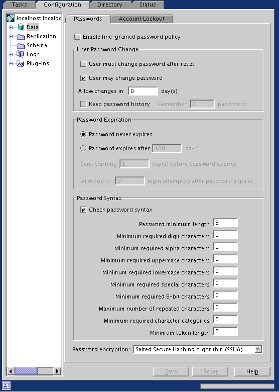

# Password Syntax Checking
--------------------------

### Introduction

Password syntax checking ensures that the password string meets or exceeds certain criteria set by the organization. Fedora Directory Server has supported for some time minimum password length requirements (default 6 characters) and that the string does not contain any "trivial" words. A trivial word is any value stored in the uid, cn, sn, givenName, ou, or mail attributes of the user's entry.

Fedora Directory Server 1.0.2 adds support for more password checking criteria:

-   minimum number of digit characters (0-9)
-   minimum number of ASCII alpha characters (a-z, A-Z)
-   minimum number of uppercase ASCII alpha characters (A-Z)
-   minimum number of lowercase ASCII alpha characters (a-z)
-   minimum number of special ASCII characters (!@\#\$, etc.)
-   minimum number of 8-bit characters
-   maximum number of times the same char can be immediately repeated (aaabbb)
-   minimum number of character categories that are represented (categories are lower, upper, digit, special, and 8-bit)
-   Default for minimum length is now 8 characters
-   Enhanced trivial words checking

All of the above password syntax checking is available on a global, per subtree, and per user basis.

### Configuration

Several new attributes have been added:

|Name|Range|Default|Description|
|----|-----|-------|-----------|
|passwordMinDigits|0-64|0|Minimum number of digits password must contain|
|passwordMinAlphas|0-64|0|Minimum number of alphabetic characters password must contain|
|passwordMinUppers|0-64|0|Minimum number of upper case letters password must contain|
|passwordMinLowers|0-64|0|Minimum number of lower case letters password must contain|
|passwordMinSpecials|0-64|0|Minimum number of "special" (i.e. non alphanumeric) characters password must contain|
|passwordMin8Bit|0-64|0|Minimum number of 8 bit characters password must contain (Note: the 7bit checking for userPassword must be disabled to use this)|
|passwordMaxRepeats|0-64|0|Maximum number of times the same character can appear sequentially in the password (0 is off, 1 will reject "aa", etc.)|
|passwordMinCategories|1-5|3|Minimum number of character categories that are represented in the password (categories are lower, upper, digit, special, and 8-bit)|
|passwordMinTokenLength|1-64|3|The smallest attribute value length that will be used for "trivial" words checking (ex - A givenName of "DJ" will not result in a policy that rejects "DJ" from being in the password with a passwordMinTokenLength of 3, but a givenName of "Bob" would cause the password to be rejected if it contained the string "Bob".)|

These attributes can be set in cn=config for global (i.e. server wide) scope or in the per-subtree or per-user password policy configuration entry.

### Screenshot

