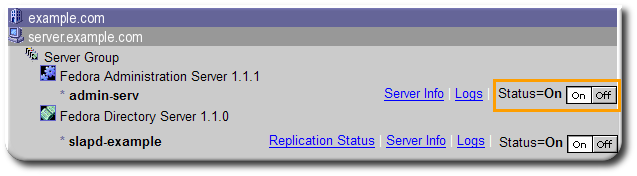
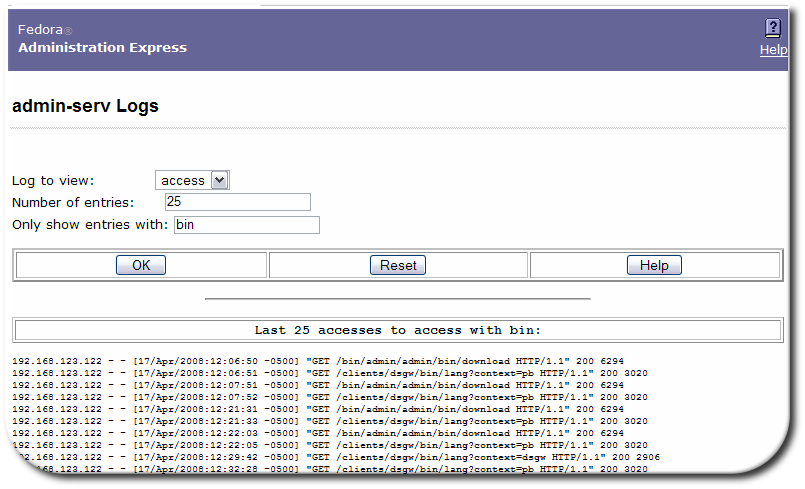
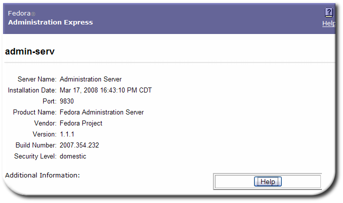
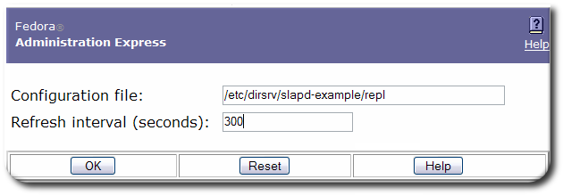
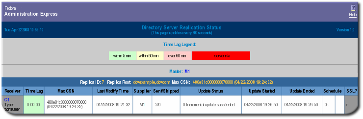
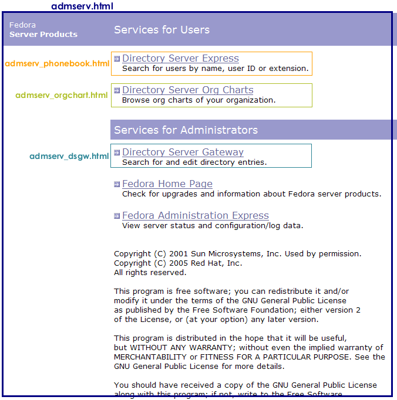
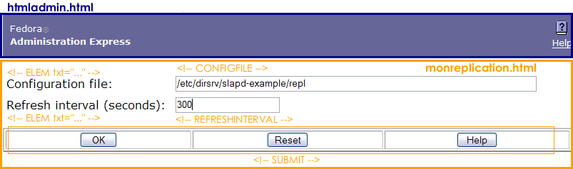
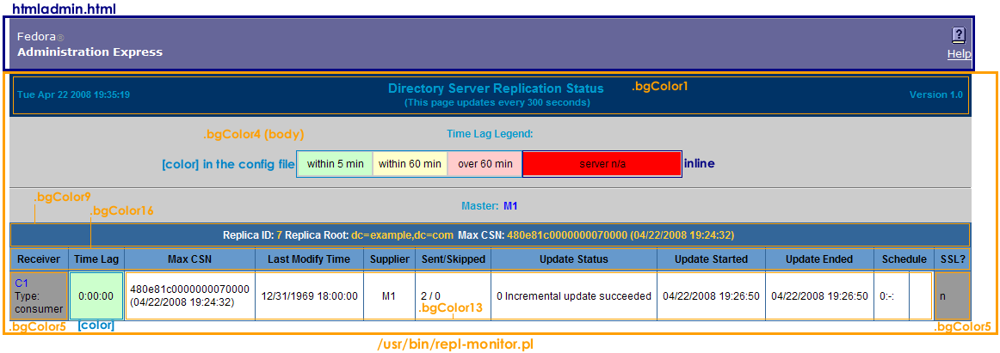
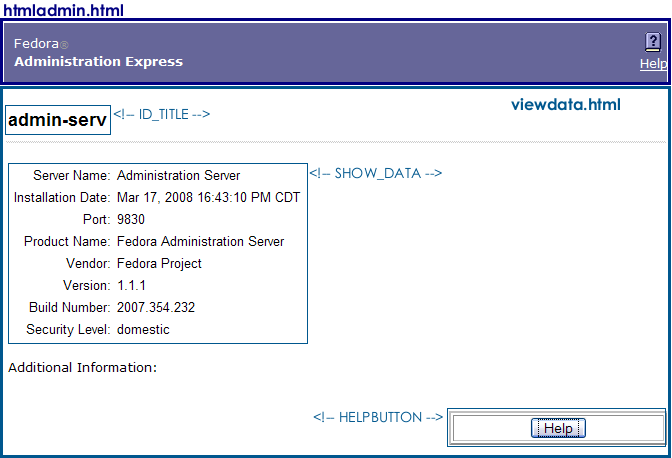
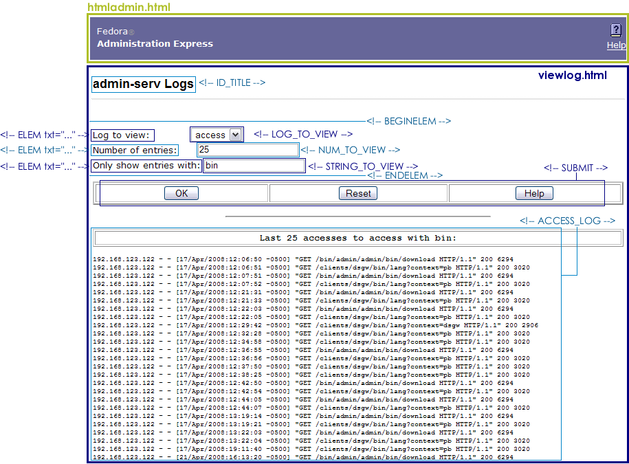

# Admin Express
---------------



### Managing Servers in Admin Express

Admin Express provides a quick, simple web-based gateway to do basic management of servers. There are three tasks that can be performed through Admin Express:

-   Stopping and starting the server
-   Checking the server access, error, and audit logs
-   Monitoring the progress and information for replication between Directory Servers

### Starting and Stopping Servers

On the main Admin Express page, there are buttons to turn servers off and on.

    IMPORTANT
    If either the Administration Server or the Configuration Directory Server is turned off through the Admin Express page, then it must be restarted through the command line, not through the Admin Express On/Off buttons because Admin Express requires access to both the Administration Server and Configuration Directory Server in order to function. Other Directory Server instances can be safely stopped and restarted through Admin Express.

### Viewing Server Logs

Admin Express can show and search the access and error logs for Directory Server and Administration Server and the audit logs for the Directory Server.

1.  In the Admin Express page, click the **Logs** link by the server name.
2.  Select which log type to view, how many lines to return, and any string to search for, and click **OK**.

### Viewing Server Information

The **Server Info** link on the Admin Express page opens a page with the basic description of the server instance, such as the build number, installation date, and server port number. This is the same information displayed in the Console when an instance is selected. 

The Directory Server information is located in the `/etc/dirsrv/slapd-<em class="replaceable"><code>instance_name`</em>/dse.ldif</code> file; the Administration Server information is located in the `/etc/dirsrv/admin-serv/local.conf` file.

### Monitoring Replication from Admin Express

Admin Express has an option to monitor replication status in real-time, meaning that it shows the number of updates, times the most recent updates were sent, error and success messages, replication schedule, the replicated directory suffix, and other information. Unlike other ways of checking replication status, the Admin Express **Replication Status** page shows the real-time status of replication, including updates in progress, current changes sequence numbers, and the lag between when a change is made on the supplier and when that change is sent to the consumer.
Monitoring replication is set up using a simple configuration file which specifies which server to monitor and what supplier and consumer replicas to include in the status page.
When trying to monitor replication status through Admin Express, remember two things:

-   The **Replication Status** page is only available for supplier servers. (It can be opened for other types of replicas; there's just no information available and has the message *The server is not a supplier or it has no replication agreement*.)
-   The configuration file must be in a directory that is accessible to Administration Server.

To view in-progress status of replication in Admin Express:

1.  Create a configuration file. The configuration file lists all of the servers to monitor for replication, giving their hostname, port, the bind credentials to use, and then optional settings for aliases and time lag colors.

        #Configuration File for Monitoring Replication Via Admin Express
        [connection] Required. Gives the server host, port, supplier bind DN, and password.
        host1.example.com:389:cn=replication manager:mypassword
        host2.example.com:3891:cn=replication manager:altpassword

        [alias] Optional. Gives a friendly-name alias to the servers and consumers.
        M1= host1.example.com:389
        M2= host2.example.com:3891
        C1= host3.example.com:3892
        C2= host4.example.com:3890

        [color] Optional. Sets the color for the time lag boxes.
        0= #ccffcc
        5= #FFFFCC
        60= #FFCCCC

2.  The configuration file must be in a directory that is accessible to the Administration Server.
3.  In the Administration Server web page, click the **Admin Express** link, and log in.
4.  Click the **Replication Status** link by the supplier server name.
5.  Type the path to the configuration file in the **Configuration file** field. Also, set the refresh rate, which is how frequently the replication status page updates; the default is 300 seconds.

    

6.  Click **OK**.

The **Replication Status** page shows the status for sending updates to every consumer listed in the configuration file.

|**Table** |**Description** |
|----------|----------------|
|Table header |The table header shows the replica ID of the supplier replica, the replicated suffix root (such as `dc=example,dc=com`), and the maximum change state number (CSN) on the supplier. (The CSN is the ID of the latest change on the supplier, while the max CSN for the supplier shows the last update it received.) |
|Max CSN |The ID number of the most recent CSN the consumer has received that originated from the supplier. |
|Time lag |How long it takes for the consumer to receive updates from the supplier; this is the time difference between the supplier and the consumer's max CSNs. When a consumer is in sync with its supplier, the time lag is `0`. |
|Last Modify Time |Gives the time of the last update for the consumer (the time the last CSN entry was sent). |
|Supplier |Gives the name of the supplier sending updates to that consumer; this can be useful if a consumer receives updates from multiple suppliers or there are multiple suppliers being monitored on the **Replication Status** page. |
|Sent/Skipped |The number of changes that were sent from the supplier and the number skipped in the replication update. The numbers are kept in suppliers' memory only and are cleared if the supplier is restarted. |
|Update Status |The status code (and meaning) for the last update. This column can indicate a possible deadlock if *all* the suppliers complain that they cannot acquire a busy replica. It is normal for there to be a busy message if one of the suppliers is doing an update. |
|Update Start and End |The timestamps for when the most recent update process started and ended. |
|Schedule |The configured replication schedule. `0:-:` means that the consumer is continually updated by the supplier. |
|SSL? |Indicates whether the supplier connects to the consumer over SSL. |

Configuring Admin Express
-------------------------

Admin Express can be edited for the page appearance, but most functionality is controlled through the web server or the Administration Server configuration and should be edited through those servers, not by editing the configuration files directly.

#### Admin Express File Locations

The directories for all of the Admin Express configuration files are listed in "Table: Admin Express File Directories"; the specific files are described in each section describing the different Admin Express page configurations.

|**Directory**|**Description** |
|-------------|----------------|
|/etc/dirsrv/admin-serv|Contains the `local.conf`, `httpd.conf`, and other configuration files which define the Administration Server and configure the web server. |
|/usr/share/dirsrv/html/|Contains the HTML files and graphics used for the Admin Express appearance. |

### Configuration Files

The behavior for Admin Express is mostly set through the web server configuration and should not be edited. The other Admin Express configuration is set through directives which insert data or form fields.
Unlike the other web applications (Directory Server Gateway, Directory Express, and Org Chart), there is not cascading style sheet (CSS) file to centralize the formatting for pages in Admin Express. All formatting is done inline with the tags or through `&lt;style&gt;` tags in the page head. For information on editing inline tags, see ["Editing Tags](#Editing_Tags "wikilink")."

#### Files for the Administration Server Welcome Page

The configuration files for the introductory page for all of the web applications is located in the Admin Express directory, `/etc/dirsrv/admin-serv`. One file sets the formatting, copyright text, and some web application text; three other files are used to set the text for the web apps that are not related to the Administration Server (Directory Server Gateway, Directory Express, and Org Chart). These are:

-   The main file, `admserv.html`
-   The file for the Directory Server Gateway text, `admserv_dsgw.html`
-   The file for the Org Chart text, `admserv_orgchart.html`
-   The file for the Directory Express text, `admserv_phonebook.html`

All of the formatting for the page is set inline. The text files are inserted using the `INCLUDEIFEXISTS` directive.

     <tr valign="TOP">
      <td> </td>;
      <td bgcolor="#9999cc" colspan="4"> Services
        for Administrators</td>
      <td> </td>;
     </tr>
     <tr valign="TOP">
      <td> </td>
      <td colspan="4">
        <table border="0" cellspacing="0" cellpadding="0">
          <tr valign="TOP">
            <td></td>
            <td></td>
          </tr>
    <!-- INCLUDEIFEXISTS admserv_dsgw.html -->

The text files themselves have inline formatting for the inserted table rows.

#### Files for the Replication Status Appearance

There are two pages for monitoring the replication status. The first is for the configuration page, which requires two files:

-   The body of the page, `/usr/share/dirsrv/html/monreplication.html`
-   The heading of the page, `/usr/share/dirsrv/html/htmladmin.html`

The **Replication Status** page uses two script-related configuration files:

-   The body of the page, which is configured in the replication monitoring script, `/usr/bin/repl-monitor.pl`
-   Optionally, the configuration file for the replication monitoring, which can configure the time lag colors with the `[colors]` section
-   The heading of the page, `/usr/share/dirsrv/html/htmladmin.html`

The text for the table headings, labels, and page sections are set in the Perl script. For example:

    #Print the header of consumer
      print "\n<tr class=bgColor16>\n";
      print "<th nowrap>Receiver</th>\n";
      print "<th nowrap>Time Lag</th>\n";
      print "<th nowrap>Max CSN</th>\n";
    ....
      print "</tr>\n"; 

The styles for the **Replication Status** page are printed in the Perl script in the \</head>\n<body class=bgColor4>\n"; 

#### Files for the Server Information Page

There are two files formatting the server information page:

-   The body of the page, `/usr/share/dirsrv/html/viewdata.html`
-   The heading of the page, `/usr/share/dirsrv/html/htmladmin.html`

The `viewdata.html` file is very simple, using only the two directives to insert the server data, plsut other directives to insert other information. For the Administration Server, the `SHOW_DATA` directive takes the information from the `/etc/dirsrv/admin-serv/local.conf` file. For the Directory Server, it takes the data from the `/etc/dirsrv/slapd-<em class="replaceable"><code>instance_name`</em>/dse.ldif</code> file. The `ID_TITLE` is the name of the server instance.

    <body text="#000000" bgcolor="#FFFFFF" link="#666699" vlink="#666699" alink="#333366">
     
    <table BORDER=0 CELLSPACING=2 CELLPADDING=2 WIDTH="100%">
    <!-- ID_TITLE -->
    

    <!-- SHOW_DATA -->
    

    Additional Information:
    

    <!-- CHECK_UPGRADE -->
    

    <!-- SHOW_URL -->
    </table>
    <!-- HELPBUTTON -->
    </body>

#### Files for the Server Logs Page

There are two files formatting the server logs page:

-   The body of the page, `/usr/share/dirsrv/html/viewlog.html`
-   The heading of the page, `/usr/share/dirsrv/html/htmladmin.html`

The page information is set through the inserted directives. The server instance name is set in the `ID_TITLE` directive. The log is displayed through the `ACCESS_LOG` directives. The form at the top is formatted with directive pairs, one which sets the descriptive text and the other inserting the field type. For example, this sets the log type menu:

    <form method=GET action=ViewLog>
    
    <!-- BEGINELEM -->
    <!-- ELEM txt="Log to view: " -->
    <!-- LOG_TO_VIEW -->
    ....
    <!-- SUBMIT -->
    
    </form>

### Admin Express Directives

The Admin Express directives are HTML comments that are interpreted by the CGI scripts; these directives are used to set form fields and to pull data from the server configuration and log files.

**Admin Express Directives**

|**Directive** |**Description** |**Example** |
|--------------|----------------|------------|
|ACCESS_LOG |Inserts the server log file. |\<!-- ACCESS_LOG --\> |
|ADMURL | |\<!-- ADMURL --\> |
|BEGINELEM |Marks the opening of form input elements. This is always paired with `ENDELEM`. |\<!-- BEGINELEM --\> |
|CHECK_UPGRADE | |\<!-- CHECK_UPGRADE --\> |
|ELEM |Inserts a text element. This has one argument, `txt=`, which defines the text to use. |\<!-- ELEM txt="Field name here: " --\> |
|ELEMADD |Inserts a text element. This has one argument, `txt=`, which defines the text to use. |\<!-- ELEMADD txt="Field name here: " --\> |
|ENDELEM |Marks the ending of form input elements. This is always paired with `BEGINELEM`. |\<!-- ENDELEM --\> |
|HELP_BUTTON |Inserts a button to open context-specific help. |\<!-- HELP_BUTTON --\> |
|HELPLINK |Inserts a link to the general Admin Express help file. |\<!-- HELPLINK --\> |
|HIDDEN_ID | |\<!-- HIDDEN\_ID --\> |
|ID\_TITLE |Inserts the name of the server instance, such as `admin-serv` or `example` (if the Directory Server instance name is `slapd-example`) |\<!-- ID\_TITLE --\> |
|INCLUDEIFEXISTS |Inserts the contents of the HTML file. The inserted file should include both the text and any HTML markup. |\<!-- INCLUDEIFEXISTS "file.html" --\> |
|LOG\_TO\_VIEW |Inserts a drop-down menu with the types of logs available to view. |\<!-- LOG\_TO\_VIEW --\> |
|NUM\_TO\_VIEW |Inserts a form field to set the number of lines to return. |\<!-- NUM\_TO\_VIEW --\> |
|REFRESHINTERVAL |Inserts a form field to set the refresh interval (in seconds) for replication monitoring. |\<!-- REFRESHINTERVAL --\> |
|SERVHOST | |\<!-- SERVHOST --\> |
|SERVPORT | |\<!-- SERVPORT --\> |
|SHOW\_DATA |Inserts the server data from the configuration file, including the port number, installation date, and build number. |\<!-- SHOW\_DATA --\> |
|SHOW\_URL | |\<!-- SHOW\_URL --\> |
|SITEROOT | |\<!-- SITEROOT --\> |
|STRING\_TO\_VIEW |Inserts a form field to use to set the search string for the logs. |\<!-- STRING\_TO\_VIEW --\> |
|SUBMIT |Inserts a three-button set: to save or submit the form; to reset the form; and to open a help topic. |\<!-- SUBMIT --\> |

See Also
========

-   Back to the [overview](webapps-overview.html)
-   How to [install and setup](webapps-install.html) the web apps
-   [ Directory Server Gateway](dsgw.html)
-   [ Directory Express](dsexpress.html)
-   [ Org Chart](orgchart.html)
-   Help with [ basic HTML editing](htmlediting.html)
-   [DSML gateway](dsml.html)

