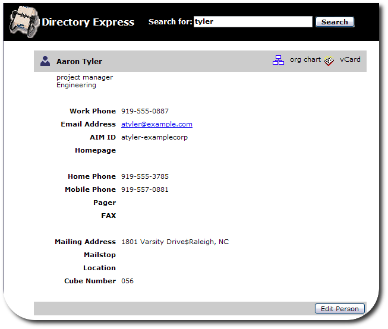
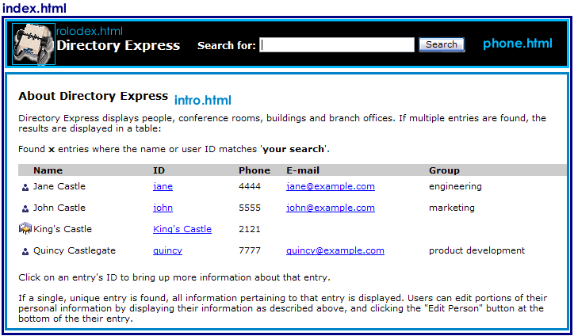
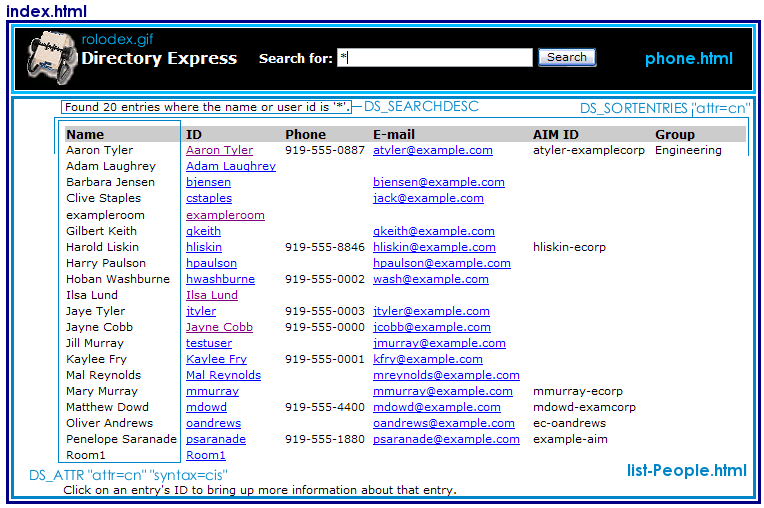
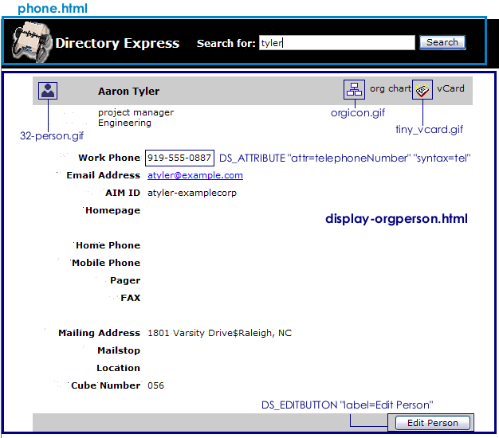
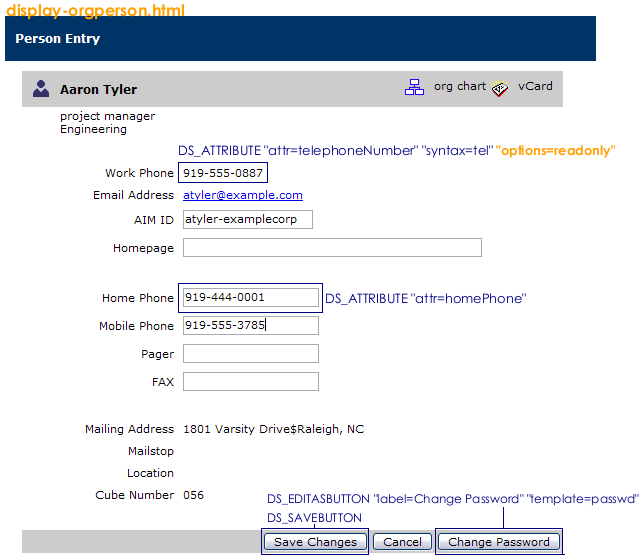

# Directory Express
-------------------



### Using Directory Express
-------------------------

Directory Express is a quick phonebook tool which has a simple search interface to look up contact and location information for people, rooms, and organizations (by default).

The default Directory Express instance is available through the menu at `http://`*adminHost:adminPort/* or using the specific URL `http://`*adminHost:adminPort*`/dsgwcmd/lang?context=pb`.
Additional instances of Directory Express can be accessed by substituting `context=pb` in the URL with `context=` whatever the new instance name is.

### Directory Express Directory Locations
-------------------------------------

The directories for all of the Directory Express configuration files are listed in "Table: Directory Express File Directories"; the specific files are described in each section describing the different Directory Express page configurations.

|**Directory**|**Description** |
|-------------|----------------|
|/etc/dirsrv/dsgw|Contains the `pb.conf` which controls the Directory Express behavior, like session length and the Directory Server suffix for searches. |
|/usr/share/dirsrv/dsgw/pbhtml|Contains the HTML files, stylesheets, and graphics used for the Directory Express appearance. |
|/usr/share/dirsrv/dsgw/pbconfig|Contains the HTML configuration files which control the Directory Express functionality, like search forms and entry management forms. |
|/usr/lib/dirsrv/dsgw-cgi-bin|Contains the Directory Express CGI files. |

### Directory Express Configuration File (pb.conf)
----------------------------------------------

The configuration file for Directory Express is `/etc/dirsrv/dsgw/pb.conf`. This has the same parameters and basic formatting options as the `/etc/dirsrv/dsgw/dsgw.conf` file for the Directory Server Gateway. It is possible to add additional object classes to the search preferences, changes the Directory Server access information, set the login lifetime, and authentication settings. For more information on editing Directory Express configuration, see:

-   ["Configuring General Gateway Behavior (the dsgw.conf File)"](dsgw.html#config-dsgw)
-   ["Adding a New Entry Type"](dsgw.html#add-entry-type)
-   ["Creating Multiple Gateway Instances"](dsgw.html#config-dsgw)
-   ["Parameter Reference"](dsgw.html#param-ref) (for a complete reference of `.conf` parameters, directives, and CGI scripts)

Some files, such as `dsgwsearchprefs.conf` and `dsgwfilter.conf`, are similar to the corresponding Directory Server Gateway files and are edited the same way, but are not identical.

### Changing the Directory Express Appearance
----------------------------------------------

Directory Express has two major functions: search for and displaying entries. All of the Directory Express pages use three files:

-   The frameset, with links to the other page elements (`/usr/share/dirsrv/dsgw/pbhtml/index.html`)
-   The search field (`/usr/share/dirsrv/dsgw/pbconfig/phone.html`)
-   The standard stylesheet file (`/usr/share/dirsrv/dsgw/pbhtml/style.css`), inserted on every HTML page `HEAD` section:

  
         <LINK REL=stylesheet TYPE="text/css" HREF="/dsgwcmd/lang?<!-- GCONTEXT -->&amp;file=style.css">

The welcome page also uses the `/usr/share/dirsrv/dsgw/pbconfig/intro.html`. All of the text, including the example results, can be edited.

The search results are displayed using the `/usr/share/dirsrv/dsgw/pbconfig/list-People.html` file. (If no results are found, the message is posted with the `dosearch` script.)

Search results are displayed in tables, which each cell is populated with attribute values. Attributes can be added to or removed from the search results by inserting and removing table cells for the heading title and the appropriate `DS_ATTRIBUTE` directive, which sets the LDAP attribute to insert along with other formatting, like the attribute syntax and the type and size of the attribute form fields.

    <!-- DS_ATTRIBUTE "attr=cn" syntax="cis" -->

The search results table has two rows, one for the heading, which has text labels for the column names, and the `DS_ATTRIBUTE` directives which define the attributes to display. For example:

    <tr align="left" bgcolor="#CCCCCC">
      <td class="boldbig">
        Name
      </td>
    </tr>
    <!-- DS_SORTENTRIES "attr=cn" -->

    <!-- DS_ENTRYBEGIN -->
    <tr valign="top" bgcolor="#FFFFFF">
      <td >
        <!-- DS_ATTRIBUTE "attr=cn" "syntax=cis" -->
      </td>
    </tr>`

Attribute directives are described more in the "DS_ATTRIBUTE" description in the ["Gateway Directives"](dsgw.html#gateway-directives) section.
The entry page is a simple table with `DS_ATTRIBUTE` directives which display the information for the entry.

On the edit page, the `DS_ATTRIBUTE` directive can have a very important argument, `options="readonly"`, which sets an attribute so it can be viewed by users but not changed. Other options, such as `type`, configure the form fields used for editable attributes.
For example, the first directive inserts a read-only work telephone number (<em class="parameter">`telephoneNumber`</em>) and the second inserts an editable field for a home telephone number.

`<!-- DS_ATTRIBUTE "attr=telephoneNumber" "syntax=tel" "cols=>20" "numfields=+1"  "options=readonly"-->`

To change the <em class="parameter">`mail`</em> attribute from read-only to an editable text area:

`<!-- DS_ATTRIBUTE "attr=postalAddress" "syntax=mls" "type=TEXTAREA" "cols=>40" -->` 

### Adding Search Support for Rooms
-------------------------------

Directory Express can search for locations, conference rooms, and buildings, but searches for these entry types are not enabled by default. To search for these entries, add the entry search object.

1.  Open the `/usr/share/dirsrv/dsgw/pbconfig` directory.
2.  By default, the `Room` object class is searched and returned with included in the search filter. This is set in the `dsgwsearchprefs.conf` file in the `/usr/share/dirsrv/dsgw/pbconfig` directory.
    
        "(&(|(objectClass=Person)(objectClass=inetOrgPerson)(objectClass=organizationalUnit))(objectClass=Room))"

3.  To add a search filter for the room number, add lines for the <em class="parameter">`roomNumber`</em> attribute in the `dsgwfilter.conf` file.
    
        ".*"        ". "    "(|(roomNumber=*%v1*)))"        "the room number is"

4.  Create an HTML file, `display-room.html`, to use to display room entries. For example:

        <html>
        <!-- HEAD -->
        <!-- DS_OBJECTCLASS "value=Room" -->
        <!-- DS_ENTRYBEGIN -->
        <title>
        Room Entry
        </title>
        <LINK REL=stylesheet TYPE="text/css" HREF="/dsgwcmd/lang?<!-- GCONTEXT -->&file=style.css">
        </head>
        <body bgcolor="white">

        <!-- DS_BEGIN_ENTRYFORM -->
        <!-- IF "Adding" -->
         <input type="hidden" name="add_objectClass" value="top">
         <input type="hidden" name="add_objectClass" value="Room">
        <!-- PCONTEXT -->
        <!-- ENDIF // Adding -->
    
        <!-- ############### Begin Header Info ################## -->
        <!-- single-pixel gif to enforce left alignment -->
        &file=pixel.gif" height="1" width="1" hspace="20" align="left" border="0">
        <table width="90%" border="0" cellpadding="2" cellspacing="0" align="left" bgcolor="#FFFFFF">
         <tr valign="middle" align="left" class="bgColor4">
           <td width="10" nowrap align="center">
            &file=32-conference.gif" height="32" width="32" border="0" align="middle">
          </td>
          <td nowrap class="boldbig">
        <!-- IF "Adding" -->
            New Room
        <!-- ENDIF // Adding -->
        <!-- DS_ATTRIBUTE "attr=cn" "syntax=dn" "options=readonly" -->
          </td>
          <td align="right">
            &file=pixel.gif" border="0" height="20" width="91">
            &file=pixel.gif" border="0" height="20" width="107">
          </td>
         </tr>
         <tr valign="top" align="left">
          <td>

          </td>
          <td colspan="2" nowrap>
        <!-- IF "AttributeHasValues" "roomNumber" -->
            Room
        <!-- DS_ATTRIBUTE "attr=roomNumber" "cols=>5"-->
        <!-- ENDIF -->
          </td>
         </tr>
         <tr valign="top">
          <td colspan="3">

        <!-- ################ Begin Table Data ################## -->
        <table border="0" cellpadding="4" cellspacing="1" width="100%" align="center">
         <tr>
          <td colspan="2"> </td>
         </tr>
         <tr valign="top">
          <td align="right" nowrap width="25%" class="bold">
            Phone Number
          </td>
          <td align="left" bgcolor="white">
        <!-- DS_ATTRIBUTE "attr=telephoneNumber" "syntax=tel" "cols=>20" "numfields=+1" -->
          </td>
         </tr>
         <tr valign="top">
          <td align="right" nowrap class="bold">
            Description
          </td>
          <td align="left" nowrap>
        <!-- DS_ATTRIBUTE "attr=description" "type=TEXTAREA" "cols=>50" "rows=>4" -->
          </td>
         </tr>
         <tr valign="top">
          <td align="right" nowrap width="25%" class="bold">
            Building Name
          </td>
          <td align="left" bgcolor="white">
        <!-- DS_ATTRIBUTE "attr=buildingName" "cols=>50" "numfields=+1" -->
          </td>
         </tr>
         <tr valign="top">
          <td align="right" nowrap width="25%" class="bold">
            Location
          </td>
          <td align="left" bgcolor="white">
        <!-- DS_ATTRIBUTE "attr=l" "cols=>50" "numfields=+1" -->
          </td>
         </tr>
         <tr>
          <td colspan="2">&nbsp ;</td>
         </tr>
        </table>
          </td>
         </tr>
         <tr valign="middle" align="left" class="bgColor4">
          <td colspan="3">
        <!-- IF "Displaying" -->
        <!-- DS_EDITBUTTON "label=Edit Room" -->
        <!-- ELIF "Editing" -->
        <!-- DS_SAVEBUTTON -->
        <!-- ENDIF // Editing -->

        <!-- IF "!Displaying" -->
        <!-- DS_CLOSEBUTTON "label=Cancel" -->
        <!-- ENDIF // !Displaying -->
          </td>
         </tr>
        </table>
         
        <!-- DS_END_ENTRYFORM -->
        <!-- DS_ENTRYEND -->
        <!-- ENDHTML -->

5.  Add the `template` line to the `pb.conf` file. The `template` line sets which HTML file to use to display room entries.

        template  room          room

See Also
========

-   Back to the [overview](webapps-overview.html)
-   How to [install and setup](webapps-install.html) the web apps
-   [ Directory Server Gateway](dsgw.html)
-   [ Admin Express](adminexpress.html)
-   [ Org Chart](orgchart.html)
-   Help with [ basic HTML editing](htmlediting.html)
-   [DSML gateway](dsml.html)

