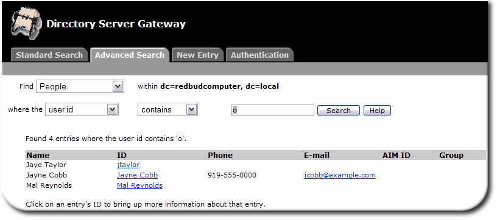
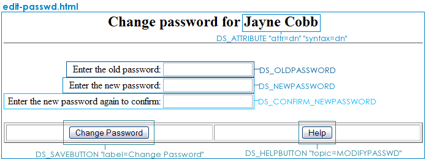

# The Directory Server Gateway
------------------------------



Using the Gateway
-----------------

The Directory Server Gateway is a quick tool to manage directory entries, which can be accessed from anywhere. The Gateway can search for any entry (with more flexible searches and entry types than the Directory Express Phonebook) and can also edit, delete, and add entries.
The default Directory Server Gateway instance is available through a link on the main page or through its specific URL:

    http://adminHost:adminPort/
    http://adminHost:adminPort/dsgwcmd/lang?context=dsgw

The Directory Server Gateway does three common operations:

-   Search for directory entries
-   Add, edit, and delete entries and reset user passwords
-   Log in (authenticate) to the Directory Server

The Directory Server Gateway allows anonymous searching by default, but a user must authenticate to the Directory Server, using their regular Directory Server username and password, before they can edit an entry.
The only difference between the standard and advanced searches are the search options listed. Standard searches have only two filters for the directory area (e.g., searching for **People** looks in the `ou=People` org unit), while the advanced search form has additional filters for other attributes like telephone numbers and for other types of searches, like "sounds like" searches. You can look at the Directory Server access log to see the exact search filters used for various types of searches.

Additional attributes can be added to the search form, or default ones can be removed, by editing the search configuration and HTML files. The attributes which are displayed in the search results can also be changed.
After searching for a specific directory entry, that entry can be edited or deleted, the user password can be changed, and attributes can be added or removed through the entry in the person's edit form. 

Configuring the Directory Server Gateway
----------------------------------------

Each section of the Directory Server Gateway has its own HTML files to control the appearance of the Gateway pages, HTML configuration which control the functionality, and a configuration file which controls global Directory Server Gateway behavior. There are also support files which the Directory Server Gateway uses to interact with the Directory Server and the web server, including CGI files and custom HTML directives.

### Directory Server Gateway File Directories

The directories for all of the Directory Server Gateway configuration files are listed in "Table: Directory Server Gateway File Directories"; the specific files are described in each section describing the different Directory Server Gateway page configurations.

|**Directory**|**Description** |
|-------------|----------------|
|/etc/dirsrv/dsgw|Contains the `dsgw.conf` which controls the Gateway behavior, like session length and the Directory Server suffix for searches. |
|/usr/share/dirsrv/dsgw/html|Contains the HTML files, stylesheets, and graphics used for the Gateway appearance. |
|/usr/share/dirsrv/dsgw/config|Contains the HTML configuration files which control the Gateway functionality, like search forms and entry management forms. |
|/usr/lib[64]/dirsrv/dsgw-cgi-bin|Contains the Directory Server Gateway CGI files. |
|/usr/share/dirsrv/manual/en/dsgw|Contains the Directory Server Gateway help files. |

### Configuring General Gateway Behavior (the dsgw.conf File)

The main configuration file, `dsgw.conf`, is in the `/etc/dirsrv/dsgw` directory.

    IMPORTANT
    There are five .conf files in the /etc/dirsrv/dsgw directory, three of which are used to configure the web applications: one for the Directory Server Gateway, one for Directory Express, and one for Org Chart. There are two other .conf files, as well. default.conf is a duplicate of dsgw.conf and can be used to restore the default settings for the Gateway if very wrong edits are made to the file. The other file, dsgw-httpd.conf, is used by the Administration Server directly; this file should never be edited. DO NOT edit the default.conf or dsgw-httpd.conf files.

The Directory Server Gateway `dsgw.conf` configuration file sets general Gateway behavior, such as:
-   How long authenticated sessions last (two hours by default)
-   The corresponding Directory Server instance (using its URL), the Directory Server suffix to use for entry management and searches, and the Directory Manager DN
-   Gateway file locations for the HTML configuration directories (so it is easy to create multiple Gateway instances)
-   Language localization files and allowed character sets
-   Login information, if the Directory Server doesn't allow anonymous searches

The `dsgw.conf` configuration file handles also basic mapping between the Gateway display information and the Directory Server data. Editing the text or LDAP attributes, changes the directory information viewable in the Directory Server Gateway this is described in [Adding New Entry and Search Object Types](#add-new-entry).

#### Changing the Login Time

To change the amount of time that a user stays authenticated to the directory, change the <em class="parameter">`authlifetime`</em> in the `dsgw.conf` file. This time is set in seconds; the default is `7200` (two hours). For example:

    authelifetime 3600

#### Changing the Directory Server Information

The `dsgw.conf` file sets the information about the Directory Server which the Gateway uses to connect to the directory instance. This includes the LDAP URL of the server, which has the hostname and port; the suffix to search and add entries to; and the Directory Manager DN. These are set in three parameters:

    baseurl         "ldap://server.example.com:389/dc=example, dc=com"
    dirmgr          "cn=Directory Manager"
    location-suffix "dc=example, dc=com"

`NOTE
For security reasons, set the gateway Directory Manager to an entry other than cn=Directory Manager. Create a new account, such as cn=gateway manager,cn=config), and then use ACLs to restrict access to Directory Server subsuffixes. This way, the Directory Server Gateway user has required access to Directory Server, but does not have complete control of the Directory Server.`

By default, the Directory Server Gateway communicates with the Directory Server using the non-SSL hostname and port number; to configure the Directory Server Gateway to use SSL when it communicates with the server, then edit the `baseurl` parameter to use the Directory Server's SSL port number and the `ldaps` protocol. For example:

    baseurl       "ldaps://server.example.com:636/dc=example, dc=com"

'NOTE
Before configuring SSL, make sure that the Directory Server Gateway's certificate database (set in the securitypath parameter) has a CA certificate (the certificate of the CA that issued the Directory Server's server cert) to use to communicate with the Directory Server.'

#### Changing Character Sets

The Gateway's default language is US English. The same Gateway instance can support clients in multiple locales (languages) by allowing international character sets.
The Directory Server and associated applications use UTF-8, but the Gateway can output web pages in different character sets, depending on the client and the allowed charsets in the Gateway configuration. Character sets given in the client's `HTTP Accept-charset` header are given top priority, although the charset must be defined in a localization directory in the Gateway configuration and can be overridden by the Gateway's <em class="parameter">`ignoreAcceptCharsetFrom`</em> parameter. Character sets can also be set for the Gateway using the <em class="parameter">`charset`</em> parameter in the `dsgw.conf` file.
When a client includes more than one character set in a request header which the Gateway support, the Gateway selects a character set according to this priority:

1.  UTF-8
2.  The character set with the highest Q value; for example, `de;q=1, en;q=0.5, fr;q=0.7` gives German the highest Q value
3.  The character set that appears first in the request header
4.  Latin-1 (ISO-8859-1)

If an HTTP client doesn't request any character set, then the web app uses the `charset` parameter definition or, if there is no <em class="parameter">`charset`</em> parameter, the default character set in HTTP, Latin-1.
In addition to UTF-8 and Latin-1, the Gateway can convert character sets such as ft\_JIS, Big5, and EUC-KR. A couple of parameter helps the web applications function with charsets other than UTF-8:

-   Non-breaking spaces in international character sets are converted to ideographic spaces according to how the <em class="parameter">`changeHTML`</em> parameter is set.
-   The Gateway embeds a UTF-8 string in a URL in a query string, the part of the URL that follows the question mark, to preserve a problem with environment variables for character sets other than Shift\_JIS. By URL-encoding the query string environment variable, the Gateway treats UTF-8 as ASCII.

#### Adding Language Support

The web application UI can be localized by including a language-specific configuration directory to contain translation files for the UI menu options and HTML forms.
For example, the German translation of `/usr/share/dirsrv/dsgw/config/search.html` is stored in `/usr/share/dirsrv/dsgw/config/de/search.html`, French in `/usr/share/dirsrv/dsgw/config/fr/search.html`, and Japanese in `/usr/share/dirsrv/dsgw/config/ja/search.html`.
\# Create a language directory in the `/usr/share/dirsrv/dsgw/config` directory. For example:
`cd /usr/share/dirsrv/dsgw/config mkdir zh`

1.  Copy the `dsgw-l10n.conf` file from the `config` directory to the language-specific directory.
2.  Edit the `dsgw-l10n.conf` file to have the translated strings to use in the **Search** and **Advanced Search** pull-down menus. If these strings aren't translated in the `dsgw-l10n.conf` file, then the English terms are used in the search form menus.
3.  Copy the HTML files to the `/usr/share/dirsrv/dsgw/config/zh` directory, and translate them appropriately.
4.  Edit the `/etc/dirsrv/dsgw/dsgw.conf` file so that it points to all of the available `dsgw-l10n.conf` files. For example:
    `include "/usr/share/dirsrv/dsgw/config/zh/dsgw-l10n.conf" include "/usr/share/dirsrv/dsgw/config/es/dsgw-l10n.conf"`

#### Configuring Anonymous Access

The Directory Server Gateway allows anonymous searches of the Directory Server by default. The Gateway anonymous access, however, only works if the Directory Server allows anonymous access. It is possible for the Directory Server itself to require authentication before it will allow anyone to perform a search. If you still want to allow anonymous searches through the Gateway, then specify a default bind DN and password through the <em class="parameter">`binddnfile`</em> parameter. The Gateway uses this identity to bind to the Directory Server. Using the bind DN file also allows you to create a special Gateway user for the Directory Server and to set any desired access controls and resource limits.
The bind DN file has a Directory Server username and password, stored in plain text. For example:

    binddn "uid=dsgwuser,ou=people,dc=example,dc=com"
    bindpw "password of dsgwuser"

The double quotes are only needed if the binddn or bindpw values contain spaces or other non-printable characters. Then add the <em class="parameter">`binddnfile`</em> parameter to the `dsgw.conf` file:

    binddnfile /path/to/binddnfile.txt

#### Requiring Authenticated Access

The Directory Server Gateway can be configured so that it requires a user to log in before allowing them to perform a search. To require authenticated access to the Directory Server Gateway, add these lines to the web server file used by the Directory Server Gateway, `/etc/dirsrv/dsgw/dsgw-httpd.conf`:

    <Location "/dsgwcmd">
        AuthUserFile /etc/dirsrv/admin-serv/admpw 
        AuthType basic 
        AuthName "Admin Server" 
        Require valid-user 
        AdminSDK on 
        ADMCgiBinDir /usr/lib[64]/dirsrv/dsgw-cgi-bin 
        Options +ExecCGI 
        Order allow,deny 
        Allow from all 
    </Location>

This brings up a login box to prompt users for their Directory Server user IDs and passwords before the Gateway open.

    CAUTION!
    Be extremely careful when editing the dsgw-http.conf file. If this file is improperly edited, the Administration Server cannot properly load it, and the Directory Server Gateway will not work. So always make a backup of this file before editing it.

#### Setting vCard Properties

Person entries can display vCards, electronic business cards commonly used with email address books. The vCard properties which are included in the person entries are mapped to corresponding LDAP attributes using the <em class="parameter">`vcard-property`</em> parameter in the `dsgw.conf` file. For example, this adds the `PHOTO` vCard property:

    vcard-property  PHOTO       bin    jpegPhoto

Some available vCard properties may require adding custom schema elements. For example, this adds the `BDAY` property and maps it to the custom LDAP attribute <em class="parameter">`dateOfBirth`</em>

    vcard-property  BDAY        cis    dateOfBirth

#### The Default dsgw.conf File

    baseurl            "ldap://server.example.com:389/dc=example,dc=com" --> The URL for the Directory Server
    dirmgr             "cn=Directory Manager"                            --> The Directory Manager DN
    location-suffix    "dc=example,dc=com"                               --> The suffix to use as the search and new entry base
    securitypath       /etc/dirsrv/dsgw                                  --> The location of the .conf file and any security databases
    htmldir            /usr/share/dirsrv/dsgw/html                       --> The location of the HTML file directory
    configdir          /usr/share/dirsrv/dsgw/config                     --> The location of the HTML configuration file directory
    gwnametrans        /dsgw/
    authlifetime       7200                                              --> How long an authenticated sessions lasts, in seconds
    changeHTML         "  " "Shift_JIS Big5 EUC-KR EUC-JP                --> Character sets to allow for Gateway clients
    url-orgchart-base  http://server.example.com:9830/dsgwcmd/org?context=dsgw&data=   --> The Org Chart URL
    enable-aim-presence         true   --> Whether to show if an AOL messaging user is online
    orgchart-attrib-farleft-rdn uid    --> The attribute value to use for Org Chart ID

    template  group         groupOfNames  --> Templates to use to display different kinds of directory entries
    template  ntgroup       groupOfUniqueNames ntGroup
    template  groupun       groupOfUniqueNames
    template  org           organization
    template  dc            domain
    template  orgunit       organizationalUnit
    template  ntperson      person  inetOrgPerson nTUser
    template  orgperson     person  inetOrgPerson
    template  person        person
    template  country       country

    location  country       "United States"         "c=US#"  --> Mappings for how directory tree areas are displayed in the Gateway
    location  org           "This Organization"     ""
    location  dc            "This Domaincomponent"  ""
    location  groups        "Groups"                "ou=Groups"
    location  people        "People"                "ou=People"
    location  special       "Special Users"         "ou=Special Users"

    newtype   orgperson     "Person"                uid  people special  --> Mappings for how entry types are displayed in the Gateway
    newtype   ntperson      "NT Person"             uid  people special
    newtype   ntgroup       "NT Group"              cn   groups
    newtype   groupun       "Group"                 cn   groups
    newtype   orgunit       "Organizational Unit"   ou   people org
    newtype   org           "Organization"          o    country
    newtype   dc            "Domaincomponent"       dc   dc org country people

    vcard-property  FN                      cis     cn  --> Maps Directory Server attributes to vCard (email addressbook) attributes and sets how the value is displayed
    vcard-property  N                       cis     sn      givenName
    vcard-property  ORG                     cis     o       ou
    vcard-property  ROLE                    cis     businessCategory
    vcard-property  ADR;WORK                mls     postalAddress
    vcard-property  ADR;HOME                mls     homePostalAddress
    vcard-property  EMAIL;INTERNET          cis     mail
    vcard-property  TITLE                   cis     title
    vcard-property  TEL;WORK                cis     telephoneNumber
    vcard-property  TEL;FAX                 cis     facsimileTelephoneNumber
    vcard-property  TEL;CELL                cis     mobile
    vcard-property  TEL;HOME                cis     homePhone
    vcard-property  NOTE                    cis     description

    include "/usr/share/dirsrv/dsgw/config/dsgw-l10n.conf"  --> Loads translated files for localizing the Gateway

### Files for Setting the Directory Server Gateway Appearance

#### Standard Search Display Files

A standard search looks for any entry which matches a particular string. The only filter option is for the organizational unit, such as **People** or **Groups**. Four HTML files are used to generate the **Standard Search** page, plus the CSS file:

-   The frameset, with links to the other page elements (`/usr/share/dirsrv/dsgw/config/search.html`)
-   The search form (`/usr/share/dirsrv/dsgw/config/searchString.html`)
-   The header (`/usr/share/dirsrv/dsgw/html/searchtitle.html`)
-   The introductory text for the other tabs (`/usr/share/dirsrv/dsgw/html/greeting.html`)
-   The standard stylesheet file (`/usr/share/dirsrv/dsgw/html/style.css`); this is inserted on every HTML page `HEAD` section:

        <LINK REL=stylesheet TYPE="text/css" HREF="/dsgwcmd/lang?<!-- GCONTEXT -->&file=style.css">

The search form, `/usr/share/dirsrv/dsgw/config/searchString.html`, really controls the functionality of the search through directives (setting the search type and base) and inputs which set the results time and size limits.

#### Advanced Search Display Files

An advanced search has different matching rule options, meaning that it can allow different ways to identify an entry which matches the search parameters (like an entry which contains the string, sounds like the string phonetically, or exactly matches the string). An advanced search can also look for different attributes within an entry, like a first name or phone number, while a standard search only looks for the common name (<em class="parameter">`cn`</em>).

-   The supplier frameset (`/usr/share/dirsrv/dsgw/config/csearch.html`)
-   The search type, such as **People** or **Groups** (`/usr/share/dirsrv/dsgw/config/csearchType.html`)
-   The search base, the Directory Server suffix (`/usr/share/dirsrv/dsgw/config/csearchBase.html`)
-   The entry attributes which can be searched (`/usr/share/dirsrv/dsgw/config/csearchAttr.html`); these can be extended to include other attributes
-   The matching rule to use (`/usr/share/dirsrv/dsgw/config/csearchMatch.html`); the matching rule is the way that entries are compared to the search object
-   The search strong and buttons (`/usr/share/dirsrv/dsgw/config/csearchString.html`)
-   The header (`/usr/share/dirsrv/dsgw/html/searchtitle.html`)
-   An empty frame used for spacing (`/usr/share/dirsrv/dsgw/html/emptyFrame.html`); this does not use `style.css`, so to change the background color, edit the tags directly
-   The standard stylesheet file (`/usr/share/dirsrv/dsgw/html/style.css`); this is inserted on every HTML page `HEAD` section:

        <LINK REL=stylesheet TYPE="text/css" HREF="/dsgwcmd/lang?<!-- GCONTEXT -->&file=style.css">

The advanced search form components are divided over several pages. The search options can be customized for specific attributes, matching rules, and result information. This is described in ["Adding a New Search Object"](#add-search-obj).

#### Search Result Display Files

The search results have whatever header and search form was used to perform the search, the standard CSS file, and then a file which formats the lists of the entry type. For example, search for the entry type **People** uses the page `list-People.html`.

There are nine files which format lists of entries:

-   list-Anything.html
-   list-Auth.html (used for searching entries for authentication)
-   list-Domaincomponent.html
-   list-Groups.html
-   list-NT-Groups.html
-   list-NT-People.html
-   list-Organizations.html
-   list-Org-Units.html
-   list-People.html

The same `list-*.html` file is used to format the search results even if no entries are returned.

#### Entry Display Files

When an entry is created, there are two separate pages involved: one which sets the type and basic information (like the <em class="parameter">`uid`</em>) for the entry, then a second page which sets more detailed entry information. The entry type sets the *object class* of the entry; by default, there are different object classes available for people (`inetorgperson`), groups, domain components, and Windows users and groups (for synchronization). A certain subset of attributes allowed to an object class are included by default in the entry edit page; for example, a new person has options for first and last names, email addresses, and telephone numbers. Additional object classes and attributes (including any custom attributes you add to the Directory Server) can be added as entry options.
The first page when adding any type of entry has the following page elements:

-   The new entry type (`/usr/share/dirsrv/dsgw/config/newentryType.html`)
-   The basic entry form (`/usr/share/dirsrv/dsgw/config/newentryName.html`)
-   The detailed entry form (`/usr/share/dirsrv/dsgw/config/display-*.html`); this is the second page that opens when an entry is created and the page used to edit existing entries and has a different name corresponding to the entry type, like `display-orgperson.html`
-   The file for the frameset (`/usr/share/dirsrv/dsgw/config/newentry.html`)
-   The header file (`/usr/share/dirsrv/dsgw/html/newentrytitle.html`)

    NOTE
    Although the entry page files all reference style.css, many of those pages use inline style tags to set attributes like the background color, so it may be necessary to edit the page elements directly.

The second page (which is also the edit page for the entry) includes more details for the entry; the available attributes depend on what `DS_ATTRIBUTE` directives are used. The file used for this page depends on the entry type; the file is named `display-`*Type*`.html`.

    NOTE
    Every content section in the display-Type.html file is formatted using tags on the tables to do some formatting, such as setting the table background color, so every table has to be edited separately, not through the CSS file.

There are seven different `display-`*Type*`.html` files, for the different search object classes:

-   display-dc.html (domainComponent)
-   display-groupun.html (groupOfUniqueNames)
-   display-ntgroup.html (ntGroup)
-   display-ntperson.html (ntUser)
-   display-org.html (o)
-   display-orgperson.html (inetOrgPerson)
-   display-orgunit.html (ou)

Another file, `display-dneditpeople.html`, is used to select DNs of other users to use in fields like **Manager** and **See Also**.
One last configuration file, `edit-passwd.html`, is used to reset user passwords. This page is also accessed through a button on the edit user page. The functionality for the password fields is set using Directory Server Gateway directives.

#### Authentication Display Files

When authenticating to the directory, there are three stages: inputting the name, submitting the password, and processing the *bind credentials* (username/password set). The authentication page has these elements:

-   The field for the username (`/usr/share/dirsrv/dsgw/config/authSearch.html`)
-   The field for the password (`/usr/share/dirsrv/dsgw/config/authPassword.html`)
-   The CGI script which processes the authentication attempt (`/usr/lib[64]/dirsrv/dsgw-cgi-bin/doauth`)
-   The file for the frameset (`/usr/share/dirsrv/dsgw/html/auth.html`)
-   The header file (`/usr/share/dirsrv/dsgw/html/authtitle.html`)

For both of the HTML files used for authentication, the functionality is implemented through Directory Server directives, as shown in "Figure: Authentication - Username" and "Figure: Authentication - Password."

The third authentication page shows whether the bind (login) attempt was successful. This is controlled by a CGI script, `doauth`, in the `/usr/lib[64]/dirsrv/dsgw-cgi-bin` directory. `doauth` is a binary file.

### Adding New Entry and Search Object Types

Each search or new entry is selected by an LDAP object class, which has a corresponding entry or search object in the Directory Server Gateway. New entry types and search objects can be added to the Directory Server Gateway by adding the appropriate entry configuration. Although new entry types and search objects can be added independently of one another, it's a good idea to add them together so that any entry that can be added through the Directory Server Gateway can be searched for in the Directory Server Gateway.
A *search object* is a menu option in the **Find** drop-down menu in the **Advanced Search** section of the Directory Server Gateway. Each search object, such as **People** and **Groups**, represent an object class (or multiple object classes) which the Directory Server Gateway searches for. For example, the **People** search object looks for entries with the `person` and `inetOrgPerson` object classes.
Existing search objects can be extended by adding additional attributes [Adding an Attribute to an Existing Search Object](#add-attr) or by adding object classes to the search object. Entirely new search objects, with new or custom object classes and attributes, can also be added to the Directory Server Gateway.
A object requires entries in five files:

-   <em class="parameter">`template`</em>, <em class="parameter">`location`</em>, and <em class="parameter">`newtype`</em> entries in the `dsgw.conf` file. This is for adding new entries or editing existing entries of this type.
-   An object entry in `dsgwsearchprefs.conf`. This is used for searches.
-   A filter entry in the `dsgwfilter.conf`. This is used for searches.
-   A search results HTML template. This is used for searches.
-   A display entry HTML template. This is used both for searches and for displaying and editing entries.

#### Adding a New Entry Type

A new entry type is added to the `/etc/dirsrv/dsgw/dsgw.conf` file. An entry type is defined by three parameters:

-   *template*, which defines the object classes associated with the entry, and, therefore, the available attributes; this parameter also map's the Gateway's HTML templates to the Directory Server's LDAP object classes. A template can be used for more than one <em class="parameter">`newtype`</em> entry.
-   *location*, which defines the directory suffix where the new entries will be added. The <em class="parameter">`location`</em> parameter definitions must precede <em class="parameter">`newtype`</em> parameter definitions in the `dsgw.conf` file. A location can be used for more than one <em class="parameter">`newtype`</em> entry.

        TIP!
        For simple directory structures, define locations for directory branch points. For complex directories, define branch points only for the most commonly-used branches.

-   *newtype*, which defines the DN formats for new entries, the name of the entry type to display in the drop-down menu, and the template to apply for the entry.

To create a new entry:

1.  Open the `dsgw.conf` file.
        cd /etc/dirsrv/dsgw
        vi dsgw.conf
2.  Add a new template for the entry. The format is:
        parameter template_name object_class
    For example:
        template  example    customObjectClass
3.  Add the location for the entry. The format is:
        parameter template_name menu_label object_class
    For example:
        location  example  "Example"  "ou=People"
4.  Add the entry type, specifying the template to use, the naming attribute, and locations. The format is:
        parameter template_name menu_label naming_attribute location(s)
    For example:
        newtype   example    "Example"   cn   people special

    NOTE
    The naming attribute in this example is common name (cn); for people entries, the naming attribute should probably be uid, since UIDs must be unique, to prevent naming collisions in the directory. Common names are frequently not unique in an organizations.

#### Adding a New Search Object

The `dsgwsearchprefs.conf` file specifies the search preferences for each object class (drop-down menu option) in the search form. Each option in the search forms, like **People** or **Groups**, has an entry like this one:

    People <Menu label>
    ""
    "Search for":
    "(objectClass=person)"        --> Object class to search for
    "dsgw-people"                 --> Defined object class filter
    subtree                       --> Search scope
    "full name" cn 111111 "" ""   --> Matching rule
    "last name" sn 111111 "" ""
    "phone number" "telephoneNumber" 111011 "" ""
    "e-mail address" "mail" 111111 "" ""
    "user id" "uid" 111111 "" ""
    "title" title 111111 "" ""
    "pager number" pagerTelephoneNumber 111011 "" ""

-   The menu label of the search object for the drop-down menu in the **Search** form
-   The object class attribute to search; this is similar to the filter in an `ldapsearch`
-   The search filter, defined in `dsgwfilter.conf`, to use to match entries to the search input
-   The search scope; this can be the default `subtree`, which at every entry under the suffix; `base`, which only searches the suffix; and `onelevel`, which looks at the level directly below the suffix
-   The attributes which can be searched for an advanced search; these lines give the drop-down menu name, the corresponding LDAP attribute, and the bits for the search. Each bit position corresponds to a match type; `1` means that the match type is valid for the attribute, and `0` means it is not valid.
    -   Position 1="contains"
    -   Position 2="ends with"
    -   Position 3="starts with"
    -   Position 4="sounds like"
    -   Position 5="is not"
    -   Position 6="is"

  
The two pairs of quotation marks are required by the Gateway and *must not* be removed.

The easiest way to create a new object class is to copy the files and configuration for and existing search object.

1.  Define the object class in `dsgw.conf` in the `/etc/dirsrv/dsgw` directory.
    Set the `template` parameter, the `location` parameter (if the appropriate directory suffix isn't set), and the `newtype` parameter (if new entries of this type can be set in the Gateway, instead of just displayed). Creating a new entry type is described in [Adding a New Entry Type](#add-entry-type).
        
        template  example    example location  example  "Example"  "ou=People" newtype   example    "Example"   cn   people special`

    When extending object class definitions, the child should appear below the parent object class in the HTML file so the Gateway can correctly interpret the HTML syntax.
2.  Open the `/usr/share/dirsrv/dsgw/config` directory.
3.  Open the `dsgwsearchpref.conf` file, and add the entry for the new search object.

        Example
        ""
        "Search for":
        "(&(objectClass=person)(objectclass=exampleperson)"
        "dsgw-example"
        subtree
        "full name" cn 111111 "" ""
        "last name" sn 111111 "" ""
        "phone number" "telephoneNumber" 111011 "" ""
        "e-mail address" "mail" 111111 "" ""
        "user id" "uid" 111111 "" ""
        "l" title 111111 "" ""
        "custom" customAttribute 111011 "" ""

4.  Create a search filter for the attributes. Filters are described more in [Setting Search Filters (dsgwfilter.conf)](#set-filter).

        dsgw-example
        ".*"     ". "    "(|(l=%v)))" "location is"
        "(|(l=*%v*))"    "location contains"

5.  Create a `display-*.html` file; a good idea is to copy an existing template. For example, if the template in the `dsgw.conf` is named `exampleperson`, then name the file `display-exampleperson.html`.
    1.  Edit the line in the header to give the name of the entry type and add the required object classes to the `DS_OBJECTCLASS`.
     
            <HTML>
            <!-- HEAD -->
            <!-- exampleperson.html -->
            <!-- DS_OBJECTCLASS "value=person,inetOrgPerson, exampleperson" -->

    2.  Add the value for `exampleperson` to the input type.

            <!-- IF "Adding" -->
            <INPUT TYPE="hidden" NAME="add_objectClass" VALUE="top">
            <INPUT TYPE="hidden" NAME="add_objectClass" VALUE="person">
            <INPUT TYPE="hidden" NAME="add_objectClass" VALUE="organizationalPerson">
            <INPUT TYPE="hidden" NAME="add_objectClass" VALUE="inetOrgPerson">
            <INPUT TYPE="hidden" NAME="add_objectClass" VALUE="exampleperson">

    3.  Be sure to add the line immediately before the `ENDIF` directive:

            <!-- ENDIF // Adding -->

    4.  Add the table rows for the appropriate attributes. For example:
            
            <TR>
              <TD VALIGN="TOP">
                Locality:
              </TD>
              <TD VALIGN="TOP">
                <B>
                  <!-- DS_ATTRIBUTE "attr=1" "cols=>8" -->
                </B>
              </TD>
              <TD VALIGN="TOP">
                Custom Attribute:
              </TD>
              <TD VALIGN="TOP">
                <B>
                  <!-- DS_ATTRIBUTE "attr=customAttribute" "cols=>6" -->
                </B>
              </TD>
            </TR>

        For more information on adding attributes, see [Adding an Attribute to an Existing Search Object](#add-new-entry).

6.  Create a search result form; like the display template, consider copying an existing template. Creating a new search results form is described in [ hanging the Attributes Shown in Search Results].

            <tr align="left" bgcolor="#CCCCCC">
              <td class="boldbig">
                Login ID
              </td>
              <td class="boldbig">
                Custom Attribute
              </td>
            </tr>
            <!-- DS_SORTENTRIES "attr=uid" -->

            <!-- DS_ENTRYBEGIN -->
              <tr valign="top" bgcolor="#FFFFFF">
                <td >
                  <!-- DS_ATTRIBUTE "attr=uid" "syntax=cis" -->
                </td>
              <td >
                <!-- DS_ATTRIBUTE "attr=customAttribute" "syntax=cis" -->
              </td>
            </tr>

#### <a name="add-attr"><a/>Adding an LDAP Attribute to an Existing Search Object

1.  Add a line for the attribute to the entry in `dsgwsearchprefs.conf`. For example, this adds the <em class="parameter">`l`</em> (locality) attribute:

        ""
        "Search for":
        "(&(objectClass=person)"
        "dsgw-people"
        subtree
        "full name" cn 111111 "" ""
        "last name" sn 111111 "" ""
        "phone number" "telephoneNumber" 111011 "" ""
        "e-mail address" "mail" 111111 "" ""
        "user id" "uid" 111111 "" ""
        "title" title 111111 "" ""
        "pager number" pagerTelephoneNumber 111011 "" ""
        "location" l 111111 "" ""

2.  Add the corresponding filter to the `dsgw-people` entry (the applied filter) in the `dsgwfilter.conf`. Filters are described more in [Setting Search Filters (dsgwfilter.conf)].

        ".*" ". " "(|(l=%v)))" "location is"
        "(|(l=*%v*))" "location contains"

3.  Edit the HTML template to include the attribute in the list of search results. This is described in more detail in [ Changing the Attributes Shown in Search Results]. For example, to add the <em class="parameter">`l`</em> (locality) attribute to the **People** search, add these lines to the `list-People.html` file:

    ...about line 95

          <td class="boldbig">
            Location
          </td>
        </tr>

    ...about line 138...

            <td>
              <!-- DS_ATTRIBUTE "attr=l" "syntax=cis"-->
            </td>
          </tr>
          <tr>
            <td colspan="5"></td>
          </tr>
          <!-- DS_ENTRYEND -->

        </table>
    
4.  Edit the HTML template to include the attribute in the display/edit page for an entry. This is described in more detail in [ Adding an Attribute to an Entry Display/Edit Page]. For example, to add the <em class="parameter">`l`</em> (locality) attribute to a person entry, add these lines to the `display-orgperson.html` file:

        <TR>
          <TD VALIGN="TOP"
          <!-- IF "Displaying" -->
            class="bold"
          <!-- ENDIF -->
          >Location:</TD>
          <TD VALIGN="TOP" COLSPAN="3" NOWRAP>
          <!-- DS_ATTRIBUTE "attr=l" "syntax=cis" "cols=>10" -->
          </TD></TR>

#### Setting Search Filters (dsgwfilter.conf)

The `dsgwfilter.conf` file contains an filter entry for each search object defined in `dsgwsearchprefs.conf`.

The Directory Server Gateway uses `dsgwfilter.conf` to map patterns in search strings to a relevant search pattern (a grep-style regular expression), LDAP attribute, and result description. This filter sets the formatting for people searches, for each of the default search attributes for the People object classes:

        "dsgw-people"
        "=" " " "(%v))" "LDAP filter is"
        "^[+]*[0-9][ 0-9-]*$" " " "(telephoneNumber=*%v))" "phone number ends with"
        "@" " " "(mail=%v))" "email address is"
                "(mail=%v*))" "email address starts with"
        "^.[. _].*" ". _" "(cn=%v1* %v2-))" "first initial + name is"
        ".*[. _].$" ". _" "(cn=%v1-*))" "name + last initial is"
        "[. _]" ". _" "(|(sn=%v1-)(cn=%v1-)))" "name is"
                    "(|(cn=*%v1-*)(sn=*%v1-*)(cn~=%v1-)(sn~=%v1-)))" "name sounds like or contains"
        "^\*$" " " "(|(cn=*)(sn=*)(uid=*)))" "name or user id is"
        "^.$" ". " "(|(cn=%v)(sn=%v)(uid=%v)))" "name or user id is"
        "^..$" ". " "(|(cn=%v*)(cn=*%v)(sn=%v*)(sn=*%v)(uid=%v*)(uid=*%v)))" "name or user id is"
        ".*" ". " "(|(cn=%v1)(sn=%v1)(uid=%v1)))" "name or user id is"
                    "(|(cn=*%v1*)(sn=*%v1*)(cn~=%v1)(sn~=%v1)))" "name sounds like or contains"

Each line defines a matching rule for the attribute type and the search type:

-   Regular expression pattern for which to search; for example, `"^\*$"`
-   Delimiters for the search pattern; for example, `". _" `
-   LDAP filter for generating search results; this specifies the LDAP attribute, wildcard location, and search string location, such as `"(mail=%v*))"`

        NOTE
        Standard searches use only the filters associated with the first matching pattern. Advanced searches use all filters defined for the entry.

-   Description of the search results matching the pattern, such as `"phone number ends with"`
-   Optionally, the search scope

`dsgwfilter.conf` can be optimized to respond to common user data patterns. For example, the email attribute is optimized for any search string containing the `@` symbol. The Directory Server Gateway responds to search strings containing the `@` symbol (the pattern) by searching the <em class="parameter">`mail`</em> attribute for values that are equal to or start with the supplied value (the filter). The Gateway returns the message (the description) on the search results page whenever a matching entry is returned.

        "@"      " "     "(mail=%v))"          "email address is"

The best way to add a filter for an attribute that is not included in a default filter, such as a custom attribute, is to add a line to an existing filter, with a filter setting the attribute's matching pattern, delimiters, LDAP filter, and description. It is also possible to add a new filter entry, which must be specified in the search object entry in the `dsgwsearchprefs.conf` file. For example:

        "example-filter"
        "[0-1][0-9]/[0-3][0-9]/[0-9]0-9]" " " "(|(dateOfBirth=%v))" "date of birth is"
                                      "(|(dateOfBirth=%v*))" "date of birth starts with"

`NOTE
Place new patterns near the top of the pattern definitions for an object. Patterns near the end of the entry are more general and will match many different strings.`

The name of the search filter to use for a search object is set in the search object entry in `dsgwsearchprefs.conf`.

    NOTE
    The Directory Server Gateway does exact matches for user ID strings, not substrings. To configure substring matching for user IDs, substring index the uid attribute, and then create your desired filter.

#### Changing the Attributes Shown in Search Results

Search results are displayed in tables, which each cell is populated with attribute values. The attributes displayed in the search results are added using directives. The `DS_ATTRIBUTE` directive sets the LDAP attribute to insert and, optionally, the syntax of the attribute being displayed. For example, to have the common name (<em class="parameter">`cn`</em>) of an entry used in the **Name** column, put the `DS_ATTRIBUTE` directive in the results table cell like this:

        <!-- DS_ATTRIBUTE "attr=cn" syntax="cis" -->

It is also possible to edit the values in a column entirely. For instance, this changes the **Name** column to **Login ID** and returns the <em class="parameter">`uid`</em> of the entry rather than the <em class="parameter">`cn`</em>:

        <tr align="left" bgcolor="#CCCCCC">
          <td class="boldbig">
            Login ID
          </td>
        </tr>
        <!-- DS_SORTENTRIES "attr=uid" -->

        <!-- DS_ENTRYBEGIN -->
          <tr valign="top" bgcolor="#FFFFFF">
            <td >
              <!-- DS_ATTRIBUTE "attr=uid" "syntax=cis" -->
            </td>
          </tr>

Attributes can be added to or removed from the search results by inserting and removing table cells for the heading title and the appropriate `DS_ATTRIBUTE` directive. Be certain to remove the heading title if you remove the attribute from the results, and vice versa.
Attribute directives are described more in the DS\_ATTRIBUTE parameter description in ["Gateway Directives](#Gateway_Directives "wikilink")."

#### Adding an Attribute to an Entry Display/Edit Page

Like search results, the display/edit page for an entry is laid out in a table. Attributes are displayed in two-column pair, one cell for the attribute name, the other for the attribute value.

For example, this lays out a new row for the <em class="parameter">`l`</em> (locality) attribute:

        <TR>
        <TD VALIGN="TOP"
        <!-- IF "Displaying" -->
          class="bold"
        <!-- ENDIF -->
        >Location:</TD>
        <TD VALIGN="TOP" COLSPAN="3" NOWRAP>
        <!-- DS_ATTRIBUTE "attr=l" "syntax=cis" "cols=>10" -->
        </TD>
        <TD>
          &nbsp;
        </TD>
        <TD>
          &nbsp;
        </TD>
        </TR>

Two cells are added with a non-breaking space; the table is four columns wide, and the extra cells help maintain the HTML table format. For Asian charactersets, substitute an ideographic space for the non-breaking space. The empty cells aren't necessary if two attributes are added on the same row.

### Creating Help Files

All of the web application helps files are stored in the `/usr/share/dirsrv/manual/en/dsgw` directory. Help buttons are inserted into the different HTML templates through the `DS_HELPBUTTON` directive, and the `topic` option sets which HTML help file to use. The help files are mapped to the topic names in the `index.map` in the help directory.
It's possible to add and edit help files, which can be useful if you customize the web applications, add entry types, or change search options.

1.  Open the Directory Server Gateway help directory.
    `/usr/share/dirsrv/manual/en/dsgw`
2.  Create a new help file or edit an existing help file.
3.  Edit the topic mapping file. You can either add a new help file or add a new topic section to an existing file. For example:

        vi index.map

        SEARCHING= search.htm
        SMARTSEARCH   = search.htm#Performing a Standard Search
        ASEARCH  = search.htm#Performing an Advanced Search
        SEARCH-CUSTOM= search.htm#New-search-parameters

        CUSTOM= custom.html
        CUSTOM-TOPIC= custom.html#Example-topic
        CUSTOM-PAGE= custom.html#New-help

4.  Insert the `DS_HELPBUTTON` in the HTML template file, and use the `topic` argument to point to the appropriate help file.

        <!-- DS_HELPBUTTON "topic=CUSTOM-PAGE" -->

Parameter Reference
-------------------

### <a name="param-ref"><a/>dsgw.conf File Parameters

<em class="parameter">`authlifetime`</em> 
Gives the amount of time in seconds before a user's authentication expires in the Gateway. The Gateway retains authentication credentials for the amount of time specified, then prompts the user to re-authenticate to the Directory Server when the credentials have expired. The default is two hours.

    authlifetime 7200

<em class="parameter">`baseurl`</em> 
Gives the hostname and port number used to contact the Directory Server, the search base, and the protocol of the URL (LDAP or LDAPS). This has the format:

    baseurl [ldap | ldaps]://dirHost:dirPort/searchBase

<em class="parameter">`dirHost`</em>  
The hostname of the machine where the Directory Server is installed. *dirPort* is the port number used by the Directory Server. Always specify a port number, even when using standard LDAP or LDAPS port numbers (`389` and `636`, respectively). *searchBase* is the distinguished name (DN) representing the point in the directory from which all searches are performed. Normally, *searchBase* is set to the directory's suffix. The equal sign, space, and comma in the search base have to be replaced by `%3D` (for the equal sign,=), `%20` (for a space), and `%2C` (for a comma).

    baseurl ldaps://dirserver.example.com:636/dc%3Dexample,dc%3Dcom

<em class="parameter">`binddnfile`</em> 
An optional parameter, gives the location of the file where the bind DN and bind password are stored for the Gateway to authenticate to the server for non-anonymous searching. This file should be stored in a different directory than the `.conf` file for the Gateway.

    binddnfile /export/TEST/binddnfile

<em class="parameter">`changeHTML`</em> 
The Gateway uses the `changeHTML` parameter to substitute ideographic space for non-breaking space (nbsp) in Asian charactersets.

    changeHTML space character space charac ter Shift_JIS

<em class="parameter">`charset`</em> 
This defines the default character set for HTTP clients. The default is UTF-8 (Unicode), which supports all the characters in the Directory Server. UTF-8 is the preferred character set. To use alternate charactersets, the <em class="parameter">`charset`</em> parameter setting may be overridden by creating a `/etc/dirsrv/dsgw/`*LANG*`/charset.conf` file which contains the charset name. To use the alternate charset, users must configure their browsers to send the appropriate accept-language headers.

For compatibility with HTTP clients that can't handle an HTTP response with a <em class="parameter">`charset`</em> parameter in the content-type, comment out this parameter in the `.conf` file. This prevents the Gateway from sending an explicit charset to Gateway clients. When no <em class="parameter">`charset`</em> parameter is defined, the Gateway by default transmits ISO-8859-1 (Latin-1).

The <em class="parameter">`charset`</em> 
Parameter is ignored by web browsers, which request the UTF-8 charset by default. Forcing these clients to use a non-UTF-8 charset (such as Latin-1) requires the <em class="parameter">`ignoreAcceptCharsetFrom`</em> parameter.

For more information about charsets, see RFC 1345, which defines the syntax of charset names and ignoreAcceptCharsetFrom usage.

        charset UTF-8

<em class="parameter">`configdir`</em> 
This gives the location of the configuration directory of the Gateway. The configuration directory contains include the object class templates, search configuration files, search result templates, and other files used to generate dynamic HTML forms.

        configdir /usr/share/dirsrv/dsgw/exampleconfig

<em class="parameter">`dirmgr`</em>  
Gives the distinguished name (DN) of the Directory Manager to use bind to the Directory Server as the Directory Manager from the Gateway. The DN specified here should have read and write authority for the subtree that the Gateway accesses.

        dirmgr cn=Directory Manager

<em class="parameter">`gwnametrans`</em> 
The Gateway CGI scripts use the <em class="parameter">`gwnametrans`</em> value to specify the URL for HTTP redirection. This needs to be `/clients/dsgw/`*htmldir* and should be the same as the <em class="parameter">`NameTrans`</em> option set in the HTTP server, if any is used.

        gwnametrans /clients/dsgw/html/

<em class="parameter">`htmldir`</em> 
This gives the location of the HTML files which control the appearance of Gateway forms.

        htmldir /exampleconfig

<em class="parameter">`ignoreAcceptCharsetFrom`</em> 
This parameter ignores request headers for the UTF-8 character set automatically sent by web browsers. This can be used together with the <em class="parameter">`charset`</em> parameter to transmit a charset other than Unicode to Gateway clients.

        ignoreAcceptCharsetFrom Mozilla/4.01x-NSCP Mozilla/3

<em class="parameter">`include`</em> 
This gives the location of additional configuration file that should be read by the Gateway. For example:

        include /usr/share/dirsrv/dsgw/config/dsgw-l10n.conf

<em class="parameter">`location`</em> 
This sets the location choices for adding new entries. Each <em class="parameter">`location`</em> parameter represents a branch point in the directory tree.

        location handle "friendly_name" "dn"

-   *handle* is a string used by the <em class="parameter">`location-suffix`</em> parameter to map a type of entry to the locations where :the entry can be created. For more information, see the location-suffix section.
-   *friendly\_name* is a string for the location which is shown to users in the Gateway.
-   *dn* is the distinguished name (DN) of this branch point in the directory. If this value does not end with a pound sign, the suffix specified in the <em class="parameter">`location-suffix`</em> parameter is appended to build the fully-qualified distinguished name. If the DN is terminated with a pound sign (\#), the location value is treated like a fully-qualified distinguished name. The pound sign is ignored by the Gateway.

        location marketing "Marketing Organization" "ou=Marketing"

        location marketing "Marketing Organization" "ou=Marketing, dc=alt,dc=example,dc=com"

<em class="parameter">`location-suffix`</em> 
The location-suffix identifies the directory suffix used to create new entries in the directory. The suffix here is appended to DNs set in the <em class="parameter">`location`</em> parameter for new entries.

        location-suffix dc=example,dc=com

<em class="parameter">`newtype`</em> 
This defines the types of entries that can be added to the directory using the Gateway and where an entry type can be added. For a user to create the entry, the corresponding suffix branch must be defined in the <em class="parameter">`location`</em> parameter. Any entry type has to have a corresponding HTML template to use to configure the online forms, a friendly name for the entry type to display in the Directory Server Gateway, a naming attribute, and the suffix branch location. For example:

        newtype <em class="replaceable">template friendly_name RDN_attribute location</em>

-   *template* is the name of a `display-`*template*`.html` file that defines the object class listed and formats the display and edit pages for that entry type. Template files are in the `/usr/share/dirsrv/dsgw/config` directory.
    -   orgperson (`display-orgperson.html`), for the object class `inetOrgPerson`.
    -   groupun (`display-groupun.html`), for the object class `groupOfUniqueNames`.
    -   orgunit (`display-orgunit.html`), for the object class `organizationalUnit`.
    -   org (`display-org.html`), for the object class `organization`.
-   *friendly\_name* is the text string shown to Gateway users which describes the entry type.
-   *RDN\_attribute* is the naming attribute used for this entry type, such as <em class="parameter">`cn`</em> or <em class="parameter">`uid`</em>; if the attribute is <em class="parameter">`uid`</em>, then each new entry will have a DN which starts with <em class="parameter">`uid`</em>. This attribute can be changed, which changes the DN format for new entries.
-   *location* is a space-separated list of the suffix locations where this type of entry can be added. The locations in this list must be identical to the *handle* specified on the corresponding <em class="parameter">`location`</em> parameter.

For example:

        newtype orgperson Person cn marketing

<em class="parameter">`orgchart-attrib-farleft-rdn`</em> 
This sets the attribute to use as the leftmost RDN for the DNs of user entries (in order to enable the Org Chart application to search for entries). The <em class="parameter">`orgchart-attrib-farleft-rdn`</em> attribute is the same as the one included in the Org Chart's configuration file (`/etc/dirsrv/dsgw/orgchart.conf`), and the attribute value (like <em class="parameter">`uid`</em> or <em class="parameter">`cn`</em>) must match the values specified in the `orgchart.conf` file.

        orgchart-attrib-farleft-rdn uid

<em class="parameter">`securitypath`</em> 
This gives the location of the certificate database used by the Gateway when using SSL to communicate with the Directory Server. The certificate database contains the certificate authority certificate for the CA which issued the certificate for the Directory Server.

        securitypath /etc/dirsrv/dsgw

<em class="parameter">`template`</em> 
This directive maps specific object classes to internal Gateway templates. These templates define how a specific object class such as a person, a group, or an organizational unit is displayed in the Gateway. The template name identified has a corresponding HTML template stored in `/usr/share/dirsrv/dsgw/config`.

This has the form:

        template template_name objectclass(es)

For example:

        template orgperson person inetorgperson

<em class="parameter">`url-orgchart-base`</em> 
This gives the location for the Org Chart application to use for links in the Directory Server Gateway pages. If there is no <em class="parameter">`url-orgchart-base`</em> value, then the Directory Server Gateway pages will not link to Org Chart.

        url-orgchart-base <nowiki>http://machine.example.com:9830/dsgwcmd/org?context=dsgw&amp;data=</nowiki>

<em class="parameter">`vcard-property`</em> 
Directory Server Gateway allows users to view vCards for people entries, both with the `inetorgperson` and `ntperson` object classes. The vCard and LDAP specifications define different labels to access information: vCards use properties, and LDAP uses attributes. The <em class="parameter">`vcard-property`</em> maps vCard property names to the LDAP attribute names so that the Directory Server can locate the information for the vCard display. This parameter has the format:

        vcard-property vcardprop syntax ldap_attributes

-   *vcardprop*. is the name of a vCard property; the available properties are listed in "Table: vCard Properties."
-   *syntax* is a string that describes how the vCard information is displayed. There are two options. `cis` is used for simple, single-line text strings. `mls` is used for multi-line strings. Both are case insensitive.
-   *ldap\_attributes* shows the LDAP attribute or attributes to map to the vCard property. This is useful when mapping a vCard property to a custom attribute.

        vcard-property NOTE mls description

|**Property**|**Description**|**Default LDAP Attribute** |
|------------|----------------|---------------------------|
|FN|The formatted name property. All vCards must have an FN property.|cn |
|N|The name property.|sn (surname) and givenName (firstname) |
|ORG|The ORG property corresponds to the organization or organizational unit.|o (organization) and ou (organizational unit) |
|ROLE|The ROLE property can refer to the roles to which users belong, their occupation, or their business category.|businessCategory |
|ADR;WORK|This gives the user's work address.|postalAddress |
|ADR;HOME|This gives the user's home address.|homePostalAddress |
|EMAIL;INTERNET|This gives the user's email address.|mail |
|TITLE|The TITLE property specifies the job title, functional position, or function of the user.|title |
|TEL;WORK|This gives the business telephone number of the user.|telephoneNumber |
|TEL;FAX|This gives the fax number of the entry.|facsimileTelephoneNumber |
|TEL;CELL|This gives the cell phone number of the user.|mobile |
|TEL;HOME|This gives the home telephone number of the user.|homePhone |
|NOTE|This property can provides additional comments or information about the entry.|description |

### Gateway Directives

The LDAP directory information displayed in the Directory Server Gateway pages are configured through HTML template files containing directives. *Directives* are HTML comments that can be interpreted by the Gateway CGI scripts; changing, moving, or removing directives is one way to customize the search and entry forms and to control the overall Gateway functionality.

The most commonly used directive is `DS_ATTRIBUTE`, which displays attributes present in LDAP entries. Other directives set buttons or delineate form boundaries. For example:

        <!-- DS_HELPBUTTON "topic=HELP-ME-NOW" --> Shows a button linking to the HELP-ME-NOW.html file
        <!-- DS_ATTRIBUTE "attr=sn" "size=>20" --> Shows the entry's sn (last name) attribute, up to 20 characters
        <!-- IF "BoundAsThisEntry"             --> Shows the following fields if bound as a specific entry
        <!-- ENDIF                             --> Closes the IF statement 

Most of the Directory Server entry-related directives begin with `DS_`.

    NOTE
    With the exception of GCONTEXT and PCONTEXT, each directive must start at the beginning of a line and be contained on a single line in the HTML file.

The `display-orgperson.html` file, which is used to add, display, and edit person entries, uses the several different kinds of directives. While every directive must be on a single line, a directive can occur in the middle of an HTML tag and even break the tag into multiple lines. (This example is not the full file, only representative excerpts.)

        <!-- HEAD -->
        <LINK REL=stylesheet TYPE="text/css" HREF="/dsgwcmd/lang?<!-- GCONTEXT -->&file=style.css">
        </HEAD>
        <body>

        

        <!-- DS_LAST_OP_INFO -->
        

        <!-- DS_BEGIN_ENTRYFORM -->

        <TABLE>
         <TR>
          <TD>
        <!-- DS_EDITBUTTON "label=Edit Person" -->
        <!-- ELIF "Adding" -->
        <!-- DS_SAVEBUTTON "label=Save New Person" -->
        <!-- ELIF "Editing" -->
        <!-- DS_SAVEBUTTON -->
        <!-- ENDIF // Editing -->
          </TD>
         </TR>
        </TABLE>

        <TABLE>
         <TR>
          <TD VALIGN="TOP"
        <!-- IF "Displaying" -->
            class="bold"
        <!-- ENDIF -->
          >
            Organizational Unit:
          </TD>
          <TD VALIGN="TOP" NOWRAP>
        <!-- DS_ATTRIBUTE "attr=ou" -->
          </TD>
          <TD VALIGN="TOP"
        <!-- IF "Displaying" -->
            class="bold"
        <!-- ENDIF -->
          >
            Manager:
        <!-- IF "!Adding" -->
        <!-- DS_DNEDITBUTTON "label=Edit..." "template=dneditpeople" "attr=manager" "desc=Manager" -->
        <!-- ENDIF // !Adding -->
          </TD>
        <!-- IF "Adding" -->
          <TD VALIGN="TOP" ROWSPAN=2>
            You must save this entry before you can edit these fields.
        <!-- ELSE // !Adding -->
          <TD VALIGN="TOP" NOWRAP>
        <!-- DS_ATTRIBUTE "attr=manager" "syntax=dn" "options=readonly" -->
        <!-- ENDIF // !Adding -->
          </TD>
         </TR>
        </TABLE>
        </body>
        </HTML> 

There are usually fewer directives in the results pages, which list the entries that match a search. For example, from `list-People.html`:

        <!-- HEAD -->
        <LINK REL=stylesheet TYPE="text/css" HREF="/dsgwcmd/lang?<!-- GCONTEXT -->&file=style.css">
        </HEAD>
        <body>
        <table border="0" cellpadding="1" cellspacing="0" width="100%" bgcolor="#FFFFFF" align="center">
         <tr align="left" bgcolor="#CCCCCC">
          <td class="boldbig">
            Name
          </td>
         </tr>
        <!-- DS_SORTENTRIES "attr=cn" -->

        <!-- DS_ENTRYBEGIN -->
         <tr valign="top" bgcolor="#FFFFFF">
          <td >
        <!-- DS_ATTRIBUTE "attr=cn" "syntax=cis" -->
          </td>
         </tr>
        <!-- DS_ENTRYEND -->
        </table>

        <!-- ENDIF -->
        <!-- ENDHTML -->

#### Common Gateway directives are described below.

**GCONTEXT** 
The `<!-- GCONTEXT-->` directive appears within a URL and is invoked by CGI scripts through GET operations. `<!-- GCONTEXT-->` can appear anywhere on a line, and more than once within a line. The Gateway CGI reading `<!--GCONTEXT -->` replaces it with the Gateway context it has at the time.

`<a href=/clients/dsgw/bin/lang?<!-- GCONTEXT -->&;file=auth.html>click</a>`

**PCONTEXT** 
The `<!-- PCONTEXT -->` directive must appear on a line by itself. The Gateway CGI reading `<!--PCONTEXT -->` replaces it with a hidden variable indicating the context it has at the time. For example:

    <!-- PCONTEXT -->
    <!-- IF "Adding" -->
    <INPUT TYPE="hidden" NAME="add_objectClass" VALUE="inetOrgPerson">
    <!-- ENDIF // Adding -->

**DS_ENTRYBEGIN** 
This marks the beginning of an LDAP entry the display/edit pages; this is always paired with `DS_ENTRYEND`.

**DS_ENTRYEND** 
This marks the end of an LDAP entry; it is always paired with `DS_ENTRYBEGIN`.

**DS_ATTRIBUTE** 
The `DS_ATTRIBUTE` directive fills in an LDAP attribute value for an entry; options on the directive set which attribute is used and how the value is displayed.

The `DS_ATTRIBUTE` directive must appear within a `DS_ENTRYBEGIN...DS_ENTRYEND` block.

-   The <em class="parameter">`attr=`</em> option is required, since it specifies the attribute. This can be any attribute, including the entry's DN.
-   The <em class="parameter">`syntax=`</em> parameter is optional, and it can set the required format for the value, such as `tel` for a telephone number or `cis` for a case-insensitive string. The allowed syntax's are listed in "Table: DS\_ATTRIBUTE syntax Arguments."
-   The <em class="parameter">`type=`</em> parameter is optional and sets what kind of HTML formatting to use, such as a checkbox or ordinary text; the possible values are listed in "Table: DS\_ATTRIBUTE type Arguments."
-   The <em class="parameter">`options=`</em> parameter changes how the attribute is displayed; the possible values are listed in "Table: DS\_ATTRIBUTE options Arguments."
-   The <em class="parameter">`defaultvalue=`</em> parameter supplies a default value for the attribute to show if no attribute value is set in the Directory Server entry.
-   The <em class="parameter">`within=`</em> parameter substitutes the specified text in place of all attribute values with a string of *string alue*.
-   The <em class="parameter">`href=`</em> parameter sets an HREF attribute to use for the hyperlink, such as including an `onMouseOver` JavaScript handler.
-   The <em class="parameter">`hrefextra=`</em> parameter inserts additional text after the closing quote of the HREF tag.
-   The <em class="parameter">`dncomponents=`</em> parameter gives the number of DN components to show when displaying a DN; for example, if this option is `dncomponents=2` and the DN is `cn=James Doe,o=Example Corporation,c=US`, the Gateway shows `James Doe, Example Corporation`.
-   The <em class="parameter">`cols=`</em> parameter controls the width of the displayed attribute. This can set the exact number (like `cols=2`, that number of *extra* columns (like `cols=+2`, which is the number of required columns plus two), or that number or more (like `cols=>5`, which has a minimum of five columns).

  
The <em class="parameter">`size=`</em> parameter is the same as the <em class="parameter">`cols=`</em> parameter.

-   The <em class="parameter">`rows=`</em> parameter controls the height of the displayed attribute area. This can set the exact number (like `rows=2`, that number of *extra* rows (like `rows=+2`, which is the number of required rows plus two), or that number or more (like `rows=>5`, which has a minimum of five rows). For `type=text`, the <em class="parameter">`rows=`</em> option controls the number of editable HTML `INPUT` fields. If `type=textarea`, this controls the number of rows in the text area.
-   The <em class="parameter">`numfields=`</em> parameter controls the number of editable fields shown when editing an entry. This can set the exact number (like `numfields=2`, that number of *extra* fields (like `numfields=+2`, which is the number of fields read from the Directory Server plus two), or that number or more (like `numfields=>5`, which has a minimum of five numfields).
-   The <em class="parameter">`true=`</em> and <em class="parameter">`false=`</em> parameters are used to set Boolean values which are true or false, respectively.
-   The <em class="parameter">`value=`</em> parameter sets a value for of a checkbox that shows string values rather than Boolean values (`syntax=bool`).

For example:

    <!-- DS_ATTRIBUTE "attr=dn" "syntax=dn" "dncomponents=2" "options=nolink" -->
    <!-- DS_ATTRIBUTE "attr=uid" "numfields=1" "cols=>16" "options=unique" -->
    <!-- DS_ATTRIBUTE "attr=mail" "syntax=mail" "cols=>20" -->
    <!-- DS_ATTRIBUTE "attr=mailDeliveryOption" "type=CHECKBOX" "value=native" -->
    <!-- DS_ATTRIBUTE "attr=cn" -->

 
**DS_ATTRIBUTE Syntax Arguments**

|**Syntax** |**Description** |
|-----------|----------------|
|tel |A telephone number |
|dn |A distinguished name; this inserts a link (HREF) to an LDAP entry |
|mail |A mailto URL; this inserts a link in the form `mailto:`*URL* |
|mls |A multi-line string |
|time |The date/time |
|cis |A case-ignore (insensitive) string |
|ces |A case-exact string |
|url |A labeled URL; this inserts a link (HREF) |
|bool |A Boolean value |
|binvalue |A binary value |
|ntuserid |A Windows user ID string |
|ntgroupname |A Windows group name |

 
**DS_ATTRIBUTE Type Arguments**

|**Type** |**Display** |
|---------|------------|
|text |Inserts ordinary text. |
|textarea |Renders an HTML TEXTAREA. |
|radio |Inserts a radio button. |
|checkbox |Inserts a check box. |
|password |Inserts an HTML password text box (characters are not echoed). |
|hidden |Shows values in hidden form fields. |

 
**DS_ATTRIBUTE Options Arguments**

|**Options**   |**Display** |
|--------------|------------|
|sort |Sorts the attribute values by the specified attribute. |
|nolink |Prevents the attribute from being displayed as a hyperlink. |
|dntags |Shows tags when a DN is displayed; this is only valid when `syntax=dn`. |
|dateonly |Shows only the date, not the time; this is only valid when `syntax=time`. |
|readonly |Prevents users from modifying an attribute's value. |
|dnpicker |Embeds checkboxes and Javascript array information, which is required for DN search and add operations (like when adding a manager to an entry); this is only valid when `syntax=dn`. |
|unique |Enforces uniqueness when adding or editing values. |
|quoted |Returns the value surrounded by quotes, which is required when using Javascript. |

 
**DS_OBJECTCLASS** 
The DS_OBJECTCLASS sets the type of directory entries for which a given template should be used; the object class of the entry determines what attributes are available to be set. The only option is <em class="parameter">`value=`</em>, which gives a comma-separate list of all of the applicable object classes; the potential object classes correspond to the available `display-`*Type*`.html` configuration files (including dc, country, person, orgperson, orgunit, groupun, ntperson, and ntgroup).

    <!-- DS_OBJECTCLASS "value=person,inetOrgPerson" -->

`NOTE
The Gateway does not read the template files to determine which template to use. Instead, it reads the <code class="filename">dsgw.conf</code> file and scans the template lines in that file.`

**DS_SORTENTRIES** 
This directive sorts entries in a list according to the specified attribute (<em class="parameter">`attr=`</em>*attribute*). The list is always sorted in ascending order. Up to two `DS_SORTENTRIES` directives are honored for a single list; the first sort attribute is the primary sort key, and the second one is used as an alternate sort key. This directive must appear within a `DS_ENTRYBEGIN...DS_ENTRYEND` block.

    <!-- DS_SORTENTRIES "attr=cn" -->

**DS_SEARCHDESC** 
This inserts text which describes the search results, such as "Found X entries where the *attribute matches X value*." The value for the search description for each attribute ("*attribute matches X value*") is set in the `dsgwfilter.conf` file. This directive is used on files which display search results, such as `list-People.html`.

**DS_POSTEDVALUE** 
DS\_POSTEDVALUE inserts the value of a form variable, using the `name=` attribute to give the name of the variable. For example, using the option `name="searchstring"` will insert the text being searched for inside the HTML field.

    <!-- DS_POSTEDVALUE "name=searchstring" -->

**DS_EDITBUTTON**  
This inserts a button to open the edit form for an entry; this is used in the entry display files, like `display-orgperson.html`. This has one option, <em class="parameter">`label=`</em>, which specifies the text to use on the button; `Edit` is used by default if there is no <em class="parameter">`label`</em> option. This directive must always appear within a `DS_ENTRYBEGIN...DS_ENTRYEND` block.

    <!-- DS_EDITBUTTON "label=Edit Person" -->

**DS\_DELETEBUTTON** 
This inserts a button to delete an entry; this is used in the entry display files, like `display-orgperson.html`. This has one option, <em class="parameter">`label=`</em>, which specifies the text to use on the button; `Delete` is used by default if there is no <em class="parameter">`label`</em> option. This directive must always appear within a `DS_ENTRYBEGIN...DS_ENTRYEND` block.

    <!-- DS_DELETEBUTTON "label=Remove Person" -->

**DS_SAVEBUTTON** 
This inserts a button to save changes to an entry after editing; this is used in the entry display files, like `display-orgperson.html`. This has two options:

-   <em class="parameter">`label=`</em> specifies the text to use on the button; `Save` is used by default if there is no <em class="parameter">`label`</em> option.
-   The <em class="parameter">`checksubmit=`</em> option means that changes are only submitted of the specified Javascript expressions is `true`.

This directive must always appear within a `DS_ENTRYBEGIN...DS_ENTRYEND` block.

    <!-- DS_SAVEBUTTON "label=Save Changes" "checksubmit=formDataValid()" -->

**DS_EDITASBUTTON** 
This inserts a button to allow edits to an entry using a custom form template; this is used in the entry display files, like `display-orgperson.html`. This has two options:

-   <em class="parameter">`label=`</em> specifies the text to use on the button; `Edit as` is used by default if there is no <em class="parameter">`label`</em> option.
-   The <em class="parameter">`template=`</em> option gives the template name to call for the edit form.

This directive must always appear within a `DS_ENTRYBEGIN...DS_ENTRYEND` block.

    <!-- DS_EDITASBUTTON "label=Change Password" "template=passwd" -->

**DS_NEWPASSWORD** 
This inserts an HTML `INPUT` field which does not echo any typed characters, so it's suitable for passwords. This directive must appear within a `DS_ENTRYBEGIN...DS_ENTRYEND` block.

**DS_CONFIRM_NEWPASSWORD** 
This inserts an HTML `INPUT` field which, like `DS_NEWPASSWORD`, does not echo any typed characters. The Gateway compares the value supplied by the user in this field to the value in the `DS_NEWPASSWORD` field and only saves the new password value if the two match. This directive must appear within a `DS_ENTRYBEGIN...DS_ENTRYEND` block.

**DS_OLDPASSWORD** 
This inserts an HTML `INPUT` field which does not echo any typed characters, so it's suitable for passwords. This directive must appear within a `DS_ENTRYBEGIN...DS_ENTRYEND` block.

**DS_HELPBUTTON** 
This inserts a help button with a link, set in the <em class="parameter">`topic=`</em> parameter, to a relevant help file.

    <!-- DS_HELPBUTTON "topic=MODIFYPASSWD" -->

**DS_CLOSEBUTTON** 
This puts in a button to close the current window. This has one option, <em class="parameter">`label=`</em>, which sets the text on the close button; the default text, if no <em class="parameter">`label=`</em> is set, is `Close`.

    <!-- DS_CLOSEBUTTON "label=Cancel" -->

**DS_BEGIN_ENTRYFORM** 
This marks the beginning of an HTML form by inserting an opening `<FORM>` tags and signals the Gateway to insert any form elements required for proper operations.

For new entry forms, this inserts:

    <INPUT type=hidden name=context value="pick dsgw or pb"\>

    <INPUT type=hidden name=charset value="user's charset"\>

For existing entry edit forms, this inserts:

    <INPUT TYPE=hidden NAME="changetype">

    <INPUT TYPE=hidden NAME="dn" VALUE="dn of entry being edited"\>

    <INPUT TYPE=hidden NAME="changed_DN" VALUE=false>

    <INPUT TYPE=hidden NAME="deleteoldrdn" VALUE=true>

This directive must appear as part of a `DS_ENTRYBEGIN...DS_ENTRYEND` block.

**DS_END_ENTRYFORM** 
This inserts a closing `</FORM>` tag. This directive must appear within a `DS_ENTRYBEGIN...DS_ENTRYEND` block.

**DS_EMIT_BASE_HREF** 
This inserts an opening `<BASE>` tag that contains the base URL for the CGI that was executed.

**DS_DNEDITBUTTON** 
This inserts a button which opens a new form to edit DN-valued attributes, such as group members and managers. This directive has four arguments:

-   <em class="parameter">`label=`</em> specifies the text to use on the button.
-   The <em class="parameter">`template=`</em> option gives the template name to call for the edit form.
-   The <em class="parameter">`attr=`</em> option specifies the attribute for which a corresponding DN value is being searched and will be applied. This can be any attribute, including the entry's DN. For example, `attr=manager` means that a DN will be used as the value for the <em class="parameter">`manager`</em> attribute for that entry.
-   The <em class="parameter">`desc=`</em> option sets a friendly name for the attribute.

        <!-- DS_DNEDITBUTTON "label=Edit..." "template=dnedit" "attr=uniquemember" "desc=Group Members" -->

**DS_BEGIN_DNSEARCHFORM** 
This marks the beginning of a search form specifically for DN-identified attributes, such as group membership.

**IF, ELSE, ELIF, and ENDIF** 
These are different directives that allow different HTML text and form attributes to be included in a page dynamically, according to the conditions of the directive.

    <!-- IF "!DirectoryIsLocalDB" -->

         The entry was last modified by `

    <!-- DS_ATTRIBUTE "attr=modifiersName" "syntax=dn" "defaultvalue=N/A" "options=readonly" -->
    <!-- ENDIF ---->
    <!-- IF "AttributeHasThisValue" "objectclass" "cis" "mailRecipient" --> 

         This entry is a mail recipient.

    <!-- ENDIF ---->`

  
The `IF` and `ELIF` directives have two arguments:

-   <em class="parameter">`condition`</em> sets a Boolean condition which means, if true, to include following block of text.
-   <em class="parameter">`!condition`</em> sets a Boolean condition which means, if false, to include following block of text.

The `ELSE` and `ENDIF` directives do not have any arguments, but they do support conditions.

**Conditions Supported for IF, ELSE, ELIF, and ENDIF**

|**Condition**|**Description** |
|-------------|----------------|
|FoundEntries|Shows the following HTML elements if any entries are returned in the search. |
|Adding|Shows the HTML elements if the entry is a new entry. |
|Editing|Shows the HTML elements if the entry is an existing entry being edited. |
|Displaying|Shows the HTML elements if the entry is being viewed. |
|Bound|Checks whether the user has logged into the Directory Server. |
|BoundAsThisEntry|Checks if the current user is logged into the Directory Server is the same as the user entry being viewed or edited. |
|AttributeHasValues|Displays an attribute only if it has a value or a minimum number of values; for example, the Gateway will only display a photo on a user entry page if the entry has a <em class="parameter">`jpegPhoto`</em> attribute value. This has the format `AttributeHasValues`*"attribute" "\#"*. |
|AttributeHasThisValue|Checks whether the entry has a specific attribute with the right syntax and value. For example, `AttributeHasThisValue "attr=telephoneNumber" "syntax=tel" value="*555*"`. |
|AdminServer[a]|Checks whether the web server running the Directory Server Gateway is the Administration Server. |
|DirectoryIsLocalDB[a]|Checks whether the Directory Server is using the local LDAP database. |
|PostedFormValue[a]|Checks for a POST variable with a specific name and value. |
|[a] This condition is supported in all the Directory Server Gateway CGI scripts, not just `dosearch` and `edit`. |

**BODY**
This inserts an HTML opening \<BODY\> tag, which can include color and formatting information.

    <!-- BODY --> 
    <!-- BODY "onLoad=setDefaults()" -->

**ENDHTML**
This inserts two closing tags for the \</BODY\> and \</HTML\> elements.

**DS_LAST_OP_INFO**
This directive inserts a the date and time of the last time this entry was edited, which corresponds to the last time that `domodify` CGI script run. This directive works only when the `genscreen` or `edit` CGI scripts are invoked through the `domodify``completion_javascript` option, which means it shows the time that the entry was last edited *through the Gateway*, not through the Directory Server Console or LDAP tools like `ldapmodify`.

`DS_LAST_OP_INFO` has two options:

-   <em class="parameter">`prefix=`</em> sets the text (including HTML markup) to insert before the last modify time.
-   <em class="parameter">`suffix=`</em> sets the text to use after the last operation info.

        <!-- DS_LAST_OP_INFO "prefix=
The user " "suffix=" -->

### CGI Usage

The Directory Server Gateway CGI scripts can be invoked through regular expressions in the HTML configuration files. The regular expression is followed by the variables the expression can take on a POST. The CGI scripts for Directory Server Gateway are listed in "Table: Gateway CGI Script Invocations."

**Gateway CGI Script Invocations**

|**Script** |**Example** |  
|-----------|------------|  
|auth|auth[?context=<em class="replaceable">context</em>[&dn=<em class="replaceable">dn</em>]] authasrootdn= "true" Alternatively: escapedbinddn= <em class="replaceable">dn</em> |
|lang|lang?context=<em class="replaceable">context</em>[&file=<em class="replaceable">file</em>] |
|search[a]|search?context=<em class="replaceable">context</em>[&file=<em class="replaceable">string</em>] |
|csearch|csearch[?context=<em class="replaceable">context</em>[&file=<em class="replaceable">file</em>]] searchType= <em class="replaceable">type</em> searchAttr= <em class="replaceable">attribute</em> *file* can be type, attr, match, string, or base. |
|unauth|unauth[?context=<em class="replaceable">context</em>] |
|dnedit|dnedit?CONTEXT=<em class="replaceable">context</em>&TEMPLATE=<em class="replaceable">tmplname</em>&DN=<em class="replaceable">dn</em>&ATTR=<em class="replaceable">attrname</em>&DESC=<em class="replaceable">description</em> |
|edit[a]|edit?template&context=<em class="replaceable">context</em>[&info=<em class="replaceable">text</em>][&ADD][&dn=<em class="replaceable">dn</em>][&dnattr=<em class="replaceable">attrname</em>&dndesc=<em class="replaceable">description</em>] |
|doauth|escapedbinddn= <em class="replaceable">dn</em> authdesturl= <em class="replaceable">URL</em> password= <em class="replaceable">password</em> |
|domodify|changetype= <em class="replaceable">changetype</em> dn= <em class="replaceable">dn</em> newrdn= <em class="replaceable">rdn</em> completion\_javascript= <em class="replaceable">javascript</em> newpasswd= <em class="replaceable">new\_password</em> passwd= <em class="replaceable">password</em> newpasswdconfirm= <em class="replaceable">confirm</em> |
|newentry|newentry[?context=<em class="replaceable">context</em>[&file=<em class="replaceable">file</em>]] entrytype= <em class="replaceable">type</em>entryname= <em class="replaceable">name</em rdntag= <em class="replaceable">rdntag</em> selectLocation= <em class="replaceable">location</em> dnsuffix= <em class="replaceable">suffix</em> |
|dosearch|dosearch?context=<em class="replaceable">string</em>[&hp=<em class="replaceable">host</em>[:<em class="replaceable">port</em>]][&dn=<em class="replaceable">baseDN</em>][&ldq=<em class="replaceable">LDAPquery</em>]] mode= <em class="replaceable">mode</em> searchstring= <em class="replaceable">search string</em> type= <em class="replaceable">type</em> base= <em class="replaceable">base</em> attr= <em class="replaceable">attr</em> match= <em class="replaceable">match</em> attr= <em class="replaceable">attr</em> filterpattern= <em class="replaceable">pattern</em> filterprefix= <em class="replaceable">prefix</em> filtersuffix= <em class="replaceable">suffix</em>scope= <em class="replaceable">scope</em> searchdesc= <em class="replaceable">description</em>|
|colspan=2|[a] This can be on GET statements only, not POSTs. |

See Also
========

-   Back to the [overview](webapps-overview.html)
-   How to [install and setup](webapps-install.html) the web apps
-   [ Directory Express](dsexpress.html)
-   [ Org Chart](orgchart.html)
-   [ Admin Express](adminexpress.html)
-   Help with [ basic HTML editing](htmlediting.html)
-   [DSML gateway](dsml.html)

