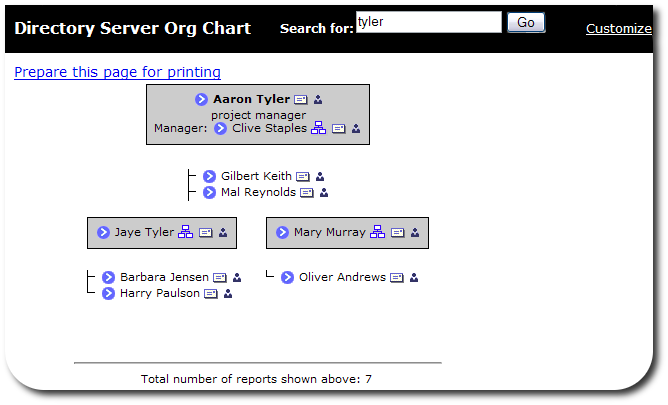
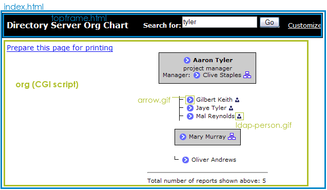
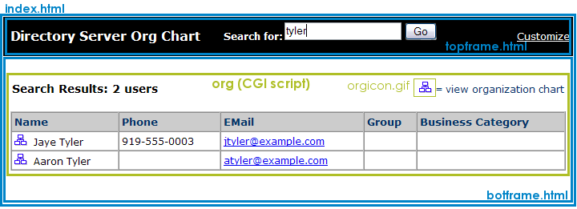
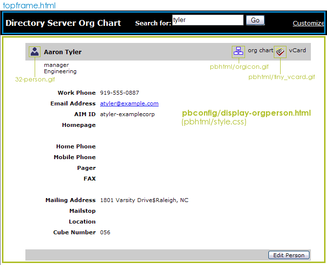
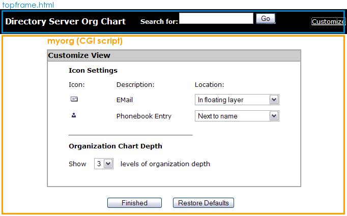
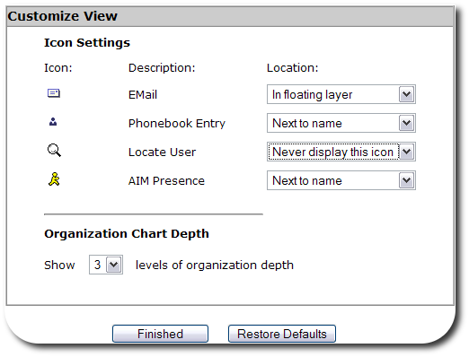

# OrgChart
----------



Using Org Chart
---------------

Org Chart, one of the web applications which can be used with Fedora Directory Server, gives a clear, simple view of your company or division hierarchy, showing relationships between managers and subordinates. Org Chart also quickly and easily shows user details, such as a person's title and their contact information.
Org Chart performs a simple user search based on the person's name or username. When an entry is selected, then Org Chart shows their manager and information, plus the organization (other employees) beneath that person. Depending on the directory data, Org Chart can use data from other applications, such as instant messenger online status and locator maps, and work with other Directory Server web applications.

    NOTE
    For a Directory Server entry to be drawn into an Org Chart diagram, the entry must have a manager attribute.

 Org Chart uses the Administration Server as its web server; to access Org Chart, open the URL `http://`*adminHost:adminPort*`/org/index.html`. *adminHost* is the fully-qualified hostname of the *Directory* Server, while *adminPort* is the port number for the *Administration* Server.
Every user entry should have a manager attribute associated with it for the organizational hierarchy to be properly rendered. If the manager attribute is not present for an entry, the entry can be searched for and viewed in Org Chart, but the user entry will not be included in any organizational hierarchy.

Org Chart Directory Locations
-----------------------------

The configuration files, both HTML templates and CGI scripts, used by Org Chart are located in the directories listed in "Table: Org Chart Configuration File Locations."

|**File or Directory**|**Description** |
|---------------------|----------------|
|/etc/dirsrv/dsgw|Contains the `orgchart.conf` file, which controls the Org Chart behavior, like the associated Directory Server instance information and display properties. |
|/usr/share/dirsrv/dsgw/orghtml|Contains the HTML files, stylesheets, and graphics used for the Org Chart appearance. |
|/usr/lib[64]/dirsrv/dsgw-cgi-bin|Contains the Org Chart CGI files, `myorg` and `org`. |
|/usr/share/dirsrv/dsgw/pbhtml|Contains the HTML files, stylesheets, and graphics used for displaying entry pages. These files belong to the Directory Express instance. |
|/usr/share/dirsrv/dsgw/pbconfig|Contains the HTML templates to display entries, specifically the `display-orgperson.html` file, which displays user entries. These files belong to the Directory Express instance. |

Files for Changing Org Chart Appearance
---------------------------------------

All of the HTML files for Org Chart interface pages are stored in `/usr/share/dirsrv/dsgw/orghtml`; the configuration file which controls Org Chart functionality, `orgchart.conf`, is in the `/etc/dirsrv/dsgw` directory. Additionally, the files which display entries are part of Directory Express and are located in the `/usr/share/dirsrv/dsgw/pbhtml` and `/usr/share/dirsrv/dsgw/pbconfig` directories.
Org Chart has a simple interface, falling into four major areas: the welcome page, the results page, and the entry description page, plus the customization page, which edits the behavior of Org Chart.
The welcome page uses four configuration files, all located in the `/usr/share/dirsrv/dsgw/orghtml/` directory:

-   The frameset (`index.html`)
-   The search field (`topframe.html`)
-   The main body (`botframe.html`)
-   The standard stylesheet file (`styles.css`)

When a search is conducted, the results are displayed with three pages:

-   The frameset (`index.html`)
-   The search field (`topframe.html`)
-   The main body (`/usr/lib[64]/dirsrv/dsgw-cgi-bin/org`), which sets both the functionality and formatting

If multiple entries are found, the `org` CGI script displays a table.

The table formatting is set at line 1411 in the `org` CGI script file. For example (the quotes are escaped within the CGI file):

    <table cellspacing=\"-1\" cellpadding=\"2\" border=\"0\" width=\"100%\">
    <tr>
    <td align=\"left\" class=\"pageHeader\">Search Results: $anothertempnum users</td>
    <td align=\"right\" class=\"searchHelp\">= view organization chart</td>
    </tr>
    <tr><td>& nbsp;</td></tr>
    </table>
    <table bgcolor=\"#FFFFFF\" cellspacing=\"-1\" cellpadding=\"3\" border=\"1\" width=\"100%\">
    <tr>
     <th align=\"left\" class=\"resultsHeader\">Name</th>
     <th align=\"left\" class=\"resultsHeader\">Phone</th>
     <th align=\"left\" class=\"resultsHeader\">EMail</th>
     <th align=\"left\" class=\"resultsHeader\">Group</th>
     <th align=\"left\" class=\"resultsHeader\">Business Category</th>
    </tr>

    <tr>
     <td align=\"left\" nowrap>$results[$num][0]</a>& nbsp;& nbsp;$results[$num][1]</td>
     <td align=\"left\" nowrap>$results[$num][2]</td>
     <td align=\"left\">$results[$num][3]</td>
     <td align=\"left\">$results[$num][4]</td>
     <td align=\"left\">$results[$num][5]</td>
    </tr>
    </table> 

If only a single entry is returned or an entry is selected from the results table, then the `org` CGI script opens the organization chart for the user.

The org chart formatting begins at line 1475. For example (this is not the complete section):

    print "<table border=1 CELLSPACING=1 > \n";
    print "<tr>\n";
    print "<td ALIGN=CENTER BGCOLOR=\"#000000\" NOWRAP>\n";
    print "<table border=0 CELLSPACING=0 CELLPADDING=6 >\n";
    print "<tr>\n";
    print "<td BGCOLOR=\"#CCCCCC\" ALIGN=CENTER VALIGN=MIDDLE NOWRAP>\n";
    print "<table cellspacing=0 border=0><tr><td NOWRAP>";

    print " \n";
    print "$title \n";

`TIP!
The background color for the entire page is set in line 2078, and the colors for the entry table are set in lines 1503 (table body) and 1500 (table border), and the colors for the floating layer are set in line 840 in the org CGI script.`

If an entry is displayed (by clicking the person icon), Org Chart uses the entry files for Directory Express to show the entry, along with the standard Org Chart search bar and frameset:

-   The frameset (`index.html`)
-   The search field (`topframe.html`)
-   The entry file (`/usr/share/dirsrv/dsgw/pbconfig/display-orgperson.html`) for both viewing and editing the entry
-   The stylesheet (`/usr/share/dirsrv/dsgw/pbconfig/style.css`)

Even the images and stylesheets used belong to Directory Express.
The past page is the customization page, which changes the *behavior* of Org Chart by setting how many entries are shown in an organizational hierarchy and what kind of contact information is displayed. Like the search results and chart pages, the appearance of the customization page is set in the body of the CGI script file, `myorg`. `myorg` also uses the default Org Chart stylesheet, `/usr/share/dirsrv/dsgw/orghtml/styles.css`, for formatting, along with inline styles.

-   The frameset (`index.html`)
-   The search field (`topframe.html`)
-   The main body (`/usr/lib[64]/dirsrv/dsgw-cgi-bin/myorg`), which sets both the functionality and formatting
-   The stylesheet (`/usr/share/dirsrv/dsgw/orghtml/styles.css`)

### Changing Org Chart Behavior
---------------------------

All of the Org Chart application behavior is set in its configuration file, `/etc/dirsrv/dsgw/orgchart.conf`. A backup file, `orgchart.tmpl`, is in the `/usr/share/dirsrv/dsgw/orghtml` directory.

### Displaying Contact Icons

There are four icons which can be displayed for each user entry in an Org Chart drawing, for the LDAP entry (`phonebook`), email (`email`), instant messaging client (`aim`), and location (`locator`). To leave the icons (and the information associated with them) out of the Org Chart display entirely, set the `icon-`*type*`-visible` parameter to `disabled`. Each icon can be displayed either next to the user's name (`forefront`) or in a floating layer which appears when the mouse hovers over the arrow icon. A third option, `no`, means that the icon is not displayed by default, but is still listed as an option in the **Customize** window.

    icons-aim-visible               no<
    icons-email-visible             layer
    icons-phonebook-visible         forefront
    icons-locator-visible           disabled

    NOTE
    The aim and locator contact methods only work if a local instant messaging presence or a mapping application has been made; otherwise, this information cannot be returned, even if the contact methods are listed in the Org Chart configuration.

### Changing the Directory Server Information

The Org Chart application is automatically associated with a local instance of Directory Server when Org Chart is installed. There are two attributes which the Directory Server instance, `ldap-url` for host and port information and `ldap-search-base` for the directory suffix to search for entries. If the Directory Server information changes or you want to use a different instance of Directory Server, then edit the LDAP URL with the new information. To restrict where searches can be run, such as limiting it to the `ou=People` subtree, edit the `ldap-search-base` parameter.

    ldap-url          ldap://ldap.example.com:389/dc=example,dc=com
    ldap-search-base  dc=example, dc=com

By default, Org Chart binds anonymously to the Directory Server instance. If the Directory Server does not allow anonymous access or if you want to put access restrictions in place for Org Chart searches, then you can specify a bind DN and password for Org Chart to use to bind.

    ldap-bind-dn
    ldap-bind-pass

Org Chart uses the default Directory Express instance to display and edit entries; to use a different web application instance (such as the Directory Server Gateway) for entry information, edit the `url-phonebook-base` parameter.

    url-phonebook-base      http://ldap.example.com:9830/dsgwcmd/dosearch?context=pb&;dn=

### Changing the User Display

The attribute shown below the username in an Org Chart drawing is the <em class="parameter">`title`</em> attribute by default, but this can be set to almost any LDAP attribute, depending on what information you want included. For example, it can be useful to use a telephone number or description.

Two parameters set the text in the display:
`attrib-job-title    title 
attrib-manager      manager`
The **Manager:** text is set in the `org` CGI script.

    IMPORTANT
    The attrib-manager parameter MUST be set to manager for the organizational hierarchy to be drawn.

### Changing the Chart Hierarchy Levels

The *number of levels drawn* is how many steps down the chart subordinates are listed for an entry. For example, if the number of levels is `3`, then it shows the user entry, its immediate subordinates, and then the subordinates for those users.

The number of levels shown is set in the `max-levels-drawn` parameter.
`max-levels-drawn        3`

### Changing the Search Rules

The search string does not have to be exact, but there are rules for how long the search string must be, set in the `min-chars-searchstring` parameter. Org Chart can also set restrictions on what characters can be entered, set in the `allowed-filter-chars` parameter.

    min-chars-searchstring          4
    allowed-filter-chars abcdefghijklmnopqrstuvwxyzABCDEFGHIJKLMNOPQRSTUVWXYZ0123456789 _-

### Changing the Configuration through the Customize Page

The **Customize** link opens a form which allows simple edits to the Org Chart set up without having to edit the configuration files directly.

-   How many levels down to show entries in the Org Chart
-   Where to display contact icons, such as the entry details page, email, instant messaging online status, and location

The only contact icon options available are the ones set to `forefront`, `layer`, or `no` in the `/etc/dirsrv/dsgw/orgchart.conf` file; if an icon is set to `disabled` in its `icons-`*type*`-visible` attribute, then it's not listed in the **Customize** at all.

Org Chart Configuration Parameters
----------------------------------

The Org Chart configuration file, `/etc/dirsrv/dsgw/orgchart.html`, contains the parameters and attributes that determine the Org Chart functionality.
  
`allowed-filter-chars` sets the characters allowed in search filters. The default values include all lower- and upper-case alphabetic characters, numerals, and a limited punctuation (underscore, hyphen, and space). This inhibits wild-card searches. For example:

    allowed-filter-chars abcDEF123 _-

`attrib-job-title`
This sets the description under the user's name in the Org Chart drawing. The default value is `title`.

    attrib-job-title title

`attrib-manager`
This gives the attribute to use to draw the Org Chart hierarchy. This must be the <em class="parameter">`manager`</em> attribute for the Org Chart diagrams to be drawn.

    attrib-manager manager

`attrib-farleft-dn` 
This attribute defines which the attribute handles the left-most DN user entries.

    attrib-farleft-dn uid

`icons-aim-visible`
The `aim` option connects the Org Chart entry with an instant messaging service through a custom application which identifies whether users are online. This can be used with almost any instant messaging service, such as AOL Instant Messaging or local Jabber clients. The presence plug-in is not included with Directory Server, so this must be supplied.

    TIP!
    A schema file, 10presence.ldif, has default Directory Server schema to use for entries to supply user information for common instant messaging programs, which can be used in presence plug-ins.

This attribute sets whether the instant messaging presence icon is visible in Org Chart and where it is placed. For example:

    icons-aim-visible forefront

The display options are:

-   `forefront` places the icon next to the user's name.
-   `layer` put the icon in the floating layer.
-   `no` doesn't display the icon, but leaves it available as an option.
-   `disabled` disables the icon completely.

`icons-email-visible`
This attribute sets whether the email icon is visible in Org Chart and where it is placed. For example:

    icons-email-visible layer

The display options are:

-   `forefront` places the icon next to the user's name.
-   `layer` put the icon in the floating layer.
-   `no` doesn't display the icon, but leaves it available as an option.
-   `disabled` disables the icon completely.

`icons-locator-visible`
The locator option connects the Org Chart entry with a mapping application, which can identify the physical location of the person or entry returned. No mapping application is included with Org Chart, so for this to return information, a third-party application must be used.

This attribute sets the base URL for the external person locator application and links to the particular application from the Org Chart drawing. For example:

    icons-locator-visible forefront

The display options are:

-   `forefront` places the icon next to the user's name.
-   `layer` put the icon in the floating layer.
-   `no` doesn't display the icon, but leaves it available as an option.
-   `disabled` disables the icon completely.

`icons-phonebook-visible`
This attribute sets whether the phonebook icon is visible in Org Chart and where it is placed. The phonebook option shows the user's LDAP entry, usually associated with the way the entry is displayed in Directory Express (the directory phonebook). For example:

    icons-phonebook-visible forefront

The display options are:

-   `forefront` places the icon next to the user's name.
-   `layer` put the icon in the floating layer.
-   `no` doesn't display the icon, but leaves it available as an option.
-   `disabled` disables the icon completely.

`ldap-bind-dn`
This attribute sets the bind DN to use to log into the Directory Server. If there is no bind DN, then Org Chart binds to the Directory Server anonymously. Using a bind DN allows you to set access controls on Org Chart searches, and a bind DN may be required if the Directory Server doesn't allow anonymous access.

    ldap-bind-dn "cn=orgChartUser,dc=example,dc=com"

'ldap-bind-pass'
This attribute gives the password for the specified bind DN.

    ldap-bind-pass "OrgChartUserPwd"

`ldap-url`
This attribute gives the LDAP URL for the Directory Server instance, which includes the Directory Server hostname, port, and base suffix.

    ldap-url        ldap://ldap.example.com:389/dc=example,dc=com

'ldap-search-base'
This attribute defines the suffix that Directory Server uses as the base for searches. By default, the search base is set to the root suffix.

    ldap-search-base dc=example,dc=com

`manager-DN-location`
This attribute sets the search type to retrieve an attribute's DN values. Depending on how the directory tree is set up, managers may be in different subsuffixes than their subordinates; for example, there may be an org unit for managers called `ou=Project Managers,dc=example,dc=com` and another for engineers called `ou=Engineers,dc=example,dc=com`. If managers could be in a different suffix than their subordinates, than the `manager-DN-location` can be given a value of `search`, so that the server will search through more directory suffixes to create an Org Chart. Essentially, this search filter is `uid=jsmith,*`. By default, this value is `same`, which means that it searches within the same suffix.

    manager-DN-location same|search

Setting `manager-DN-location` to `search` can be time and resource intensive. To speed up that kind of search, create a substring index for the <em class="parameter">`manager`</em> attribute.

`max-levels-drawn`
This sets how many layers are drawn in an Org Chart hierarchy; levels represent a manager (level 1) and their direct reports (level 2), then their direct reports (level 3), and so on. If this attribute is not set, then every entry with a <em class="parameter">`manager`</em> attribute is included in the chart. The minimum value possible is `1`, which is the person searched for.

    max-levels-drawn 6

`min-chars-searchstring`
This attribute sets Org Chart's minimum number of characters to include for a search string. If the search string entered doesn't have the minimum number of characters, then the request won't be processed.

    min-chars-searchstring 4

`url-locator-base`
This attribute sets the base URL for an external person locator application. This links to the particular application from the Org Chart drawing.

    url-locator-base http://maps.example.com/submit2.cgi?r_loc=

The user entry's common name (<em class="parameter">`cn`</em>) will be appended to the end of the URL supplied in the `url-locator-base`.

`url-phonebook-base`
This attribute gives the base URL for the Directory Express (phonebook). Directory Express is used to view and edit entries which are searched for and selected from the Org Chart drawing. This attribute can point to any gateway URL, such as the Directory Server Gateway or a different instance of Directory Express. By default, this parameter uses the local Administration Server hostname and port and points to the default Directory Express instance.

url-phonebook-base http://ldap.example.com:9830/dsgwcmd/dosearch?context=pb&;dn=

The user entry's DN will be appended to the end of the URL supplied in the `url-phonebook-base`.

CGI Scripts
-----------

Two CGI scripts, located in the `/usr/lib[64]/dirsrv/dsgw-cgi-bin` directory, are used by Org Chart to process results and customize the interface.

`myorg`

This script configures the **Customize View** box. Some of this configuration is through standard HTML formatting, like providing links to the stylesheet and setting page text. For example, this formats the page and the table heading in the **Customize View** page:

    <body bgcolor=\"#FFFFFF\" style=\"leftmargin:0; topmargin:0; marginwidth:0; marginheight:0\" onLoad=\"initValues()\"> 
    <FORM name=\"customize\"> 
    <table width=\"500\" border=\"0\" cellpadding=\"0\" cellspacing=\"0\" align=\"center\"> 
      <tr> 
      <td height=\"20\">& nbsp;</td></tr> 
    </table> 
    <table width=\"500\" border=\"1\" cellpadding=\"0\" cellspacing=\"0\" align=\"center\"> 
    <tr> 
      <td width=\"500\" height=\"22\" valign=\"top\" bgcolor=\"#cccccc\" class=\"pageHeader\">Customize View</td> 
    </tr> 

The quotation marks are escaped in the script.
This script also provides default settings. For example, this sets the default to use for common parameters if they aren't set in the `/etc/dirsrv/dsgw/orgchart.conf` file:

  
    %config_tokens= ( 
        "icons-aim-visible","disabled", 
        "icons-email-visible","disabled", 
        "icons-phonebook-visible","disabled", 
        "icons-locator-visible","disabled", 
        "max-levels-drawn", "3", 
    ); 

This script is called in the `/usr/share/dirsrv/dsgw/orghtml/topframe.html` file, through the **Customize** link.
  
    <a href="/dsgwcmd/myorg" target="output_window" class="searchlinknorm">Customize</a>

`org`
This configures the results page for an Org Chart search; this controls the output if no entries are found, multiple matching entries are found, or one entry is found (and a chart is drawn). For example, this sets the HTML formatting and the results data for multiple matching entries (beginning about line 1400):

    &output_html_header("no-javascript"); 
    print " 
      
    <table cellspacing=\"-1\" cellpadding=\"2\" border=\"0\" width=\"100%\"> 
    <tr> 
    <td align=\"left\" class=\"pageHeader\">Search Results: $anothertempnum users</td> 
    <td align=\"right\" class=\"searchHelp\">= view organization chart</td> 
    </tr> 
    <tr><td> </td></tr> 
    </table> 
    <table bgcolor=\"#FFFFFF\" cellspacing=\"-1\" cellpadding=\"3\" border=\"1\" width=\"100%\"> 
    <tr> 
      <th align=\"left\" class=\"resultsHeader\">Name</th> 
      <th align=\"left\" class=\"resultsHeader\">Phone</th> 
      <th align=\"left\" class=\"resultsHeader\">EMail</th> 
      <th align=\"left\" class=\"resultsHeader\">Group</th> 
      <th align=\"left\" class=\"resultsHeader\">Business Category</th> 
    </tr> 
    "; 
    for ( $num= 0 ; $num < $anothertempnum ; $num++ ) 
    { 
    print " 
    <tr> 
      <td align=\"left\" nowrap>$results[$num][0]</a>& nbsp;& nbsp;$results[$num][1]</td> 
      <td align=\"left\" nowrap>$results[$num][2]</td> 
      <td align=\"left\">$results[$num][3]</td> 
      <td align=\"left\">$results[$num][4]</td> 
      <td align=\"left\">$results[$num][5]</td> 
    </tr> 
    "; 
    } 
    print "</table>"; 

This script is called in the `/usr/share/dirsrv/dsgw/orghtml/topframe.html` file. When a search it performed, this script formats the results and generates the Org Chart drawing.

  
    <FORM name="form2" Method=POST action="/dsgwcmd/org" target="output_window" onsubmit="return doSearch(document.form2.data.value)">

See Also
========

-   Back to the [overview](webapps-overview.html)
-   How to [install and setup](webapps-install.html) the web apps
-   [ Directory Server Gateway](dsgw.html)
-   [ Admin Express](adminexpress.html)
-   [ Directory Express](dsexpress.html)
-   Help with [ basic HTML editing](htmlediting.html)
-   [DSML gateway](dsml.html)

