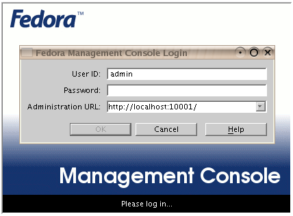
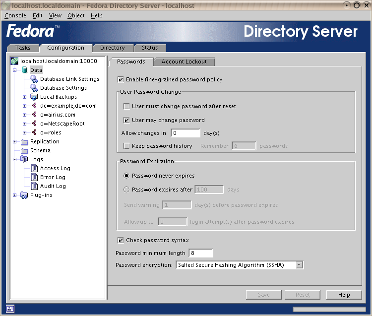
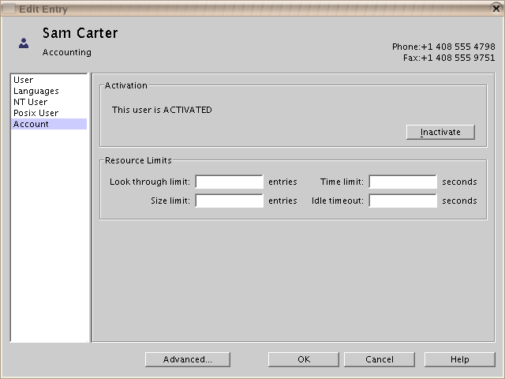

# Screenshots
-------------

- [Console](#console)

- [Directory Express](#express)

- [Directory Gateway](#gateway)

- [Org Chart](#orgchart)

 

## Console
-----------------------------

 

 

 

 

") 

 

 

 

 

 

 

 

 

 

 

 

 

 

 

 

 

## Directory Express
---------------------------------------

 

 

 

## Directory Gateway
---------------------------------------

 

 

 

 

## Org Chart
--------------------------------

 

 

 

