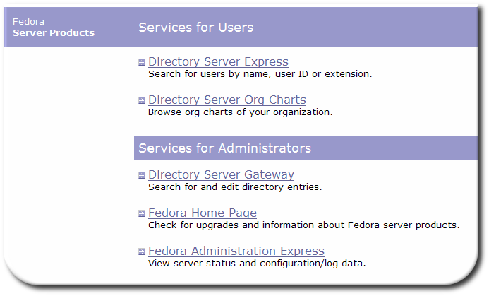

# Overview of Directory Server Web Apps
---------------------------------------

A *gateway* for Fedora Directory Server is an HTTP-to-LDAP client that lives on an HTTP server. Using special directives embedded in HTML files, the Directory Server web applications provide access to user directory data through any web browser. Having the Directory Server Gateway and other web applications allows users to access directory data and do basic server management without having to log into the Directory Server Console.
There can be multiple Directory Server gateways on one HTTP server, providing access to any number of Directory Server instances. Every web application instance has the following:

-   A `.conf` file which defines the context for gateway instance. For example, the `dsgw.conf` file in the `/etc/dirsrv/dsgw` directory defines the default Directory Server Gateway instance.
-   An HTML directory for object class templates and other files containing gateway directives used to communicate with Directory Server. For example, the Directory Server Gateway HTML directory is `/usr/share/dirsrv/dsgw/html`.
-   A configuration directory for directory search, directory authentication, language files, and other HTML template files. For example, the Directory Server Gateway configuration directory is `/usr/share/dirsrv/dsgw/config`.

The Directory Server has four default web app instances:

-   [ Directory Express](dsexpress.html), a phonebook
-   [ Org Chart](orgchart.html), which shows the organizational hierarchy for managers and employees, with contact information
-   [ The Directory Server Gateway](dsgw.html), which has advanced searching and entry management tools
-   [ Admin Express](adminexpress.html), which has basic Directory Server and Administration Server management

The web apps are available by connecting to the Admin Server URL (such as `<nowiki>http://ldap.example.com:9830/</nowiki>`) and selecting the application from the menu. Each app also has its own specific URL.

All of these default web apps use the suffix (such as `dc=example,dc=com`) which was set when the web apps were configured (using the `setup-ds-dsgw` command). They can use the SSL port (`636`) to communicate with the Directory Server, if the Directory Server is configured to use SSL.

Getting Started
---------------

The web apps are not included with the basic FDS packages, so first [install and setup](webapps-install.html) the web app services.
 For basic help to edit the HTML pages used for the web apps UI, check out the [ basic HTML editing](htmlediting.html) section.
