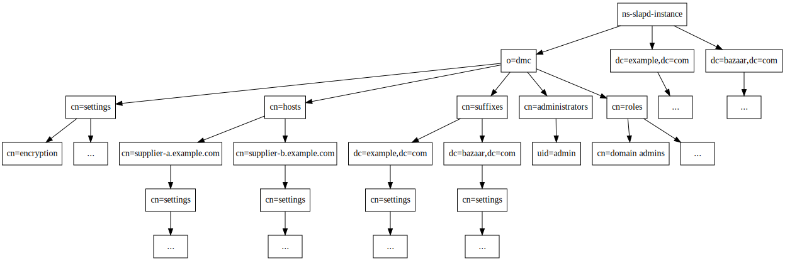

# 389 Directory Server Management Web Console
----------------------------------------------

 

## Naming Candidates

-   389 Directory Management Console

-----------------------

## 389 Java Console Shortcomings

-   Rigid Configuration
-   Difficult to extend
-   “o=netscaperoot”/console layout not robust, too hostname centric, replication is only good for backup purposes – single point of console failure
-   Not network management friendly
-   Requires installing a client package (e.g. 389-console)
-   User experience is generally poor, features are not in sync with actual main 389-ds features.

---------------------------

## New Design Concepts

### Terminology

- Directory Server Instance: A single, operating instance of the ns-slapd binary. A server may only host a single instance of ns-slapd.
- Suffix: A naming backend, such as dc=example,dc=com. In the context of o=dmc, a suffix is a named backend which make exist on one or more instances.
- Domain: The o=dmc which contains all registered Directory Server instances and suffixes.

### “Floating” Configuration

-   Directory Management Configuration suffix “o=dmc” replaces “o=netscaperoot”
-   Seperation of host, domain and suffix specific configurations.
-   Can be replicated, and still fully functional on every system
-   Allows the DMC to administer all servers in the registered deployment simultaneously
-   Allows the DS server to be "brought into line" with the contents of o=dmc (Fast system repair, deployment and validation)
-   Local Admin/HTTP server will use config file to know which Configuration DS to use (see below): // wibrown may not be needed ...

### Configuration Synchronization

-   Synchronze key configuration settings
-   Enforce consistency throughout a domain
-   Customizable
    -   Select individual attributes(or all attrs) from particular cn=config entries
    -   Indexing
    -   Plugins
    -   Database settings
    -   etc...

### Administration Delegation

Grant "users" rights to manage part, or all, of o=dmc
    - Add aci's to the proper branches of o=dmc
    - Users will exist within o=dmc, allowing seperation of administrative accounts.
    - Users from within a suffix in the domain may be added to be able to administer the o=dmc domain.
    - Default roles for acis?

------------------------------

## Installation of DMC

-   Admin Server (http, rest389)
-   Directory Server instance with a single (initial) suffix of o=dmc. Backend should be very targeted in tunining, indcies for o=dmc functionality.
-   Every physical machine must have one, and only one, "Admin Server + Configuration Directory Server"

### New Tools

#### setup-ds-dmc.py

-   Based on setup-ds-rest
-   Creates the http server(Admin Server), and ...
-   Creates the DS instance
-   Creates a separate Configuration Directory Server for (o=dmc)
-   May create named suffixes for the domain.

#### register-ds-dmc.py

-   Registers an existing instance and suffixes with the local Configuration Server
-   Sanity checking of the suffix to validate if it exists already in the domain ...

#### slapd-master.py

-   dbus triggered backend to start / stop / restart instances when required.

#### o=dmc paintbrush

-   Well, if we are applying config, we need to use a tool to apply it broadly
-   paintbrush will check for o=dmc updates and apply them
-   Enforce local node consistentcy in cn=config

------------------------------

## New configuration suffix:  “o=dmc” (Directory Management Configuration)

Lets consider a topology with two hosts:

-   master-a.example.com
-   master-b.example.com

And two suffixes:

-   dc=example,dc=com
-   dc=bazaar,dc=com

The final state of the installed system master-a would be:

The key element of this tree is the distinction between domain wide settings (cn=settings,o=dmc), per host (cn=settings,cn=HOSTNAME,cn=hosts,o=dmc) and per suffix (cn=settings,dc=example,dc=com,cn=suffixes,o=dmc).

Consider TLS or SSL settings. We want to enforce that all hosts in a domain have the same TLS and cipher policies. We may also want to enforce a global password policy over the domain and all suffixes.

Consider a single host. We may wish to configure it's backups or tasks individually from all other nodes. We also want to determine it's port, hostname, etc from all other nodes. Database cache values may also be tuned here.

Finally, the suffix. For example indcies should be consistent through all servers that serve the suffix, so we should configure them at the suffix level. Replication would be configured at the suffix level.

Remember, in a domain, that not all hosts in the domain need to serve a suffix in the domain. In our example, we may add a third suffix, dc=foo,dc=com, that is only served by master-a. This would be valid in this configuration.

### Configuration Servers (cn=Configuration Servers, o=dmc)

There is only one config server per server host. Hosts can have per host configuration defined for relevant attributes.

    cn=settings, cn=master-a.example.com, cn=hosts, o=dmc
    cn: master-a.example.com
    port: 3890
    securePort: 6360
    SecurityDir: /etc/dirsrv/slapd-configuration/

Some settings are domain wide. For example, encryption policy, or password policy.

    cn=settings, o=dmc

    security: on
    SSLVersionMin: TLS1.1
    SSLVersionMax: TLS1.2
    AuthMethod: SIMPLE, SASL
    AuthProtocol: LDAP, STARTTLS, etc
    AuthURLFarm:  <LDAP URL> <LDAP URL> ...   (used for console logins)
    ...

Suffixes can have settings that apply to them, such as indicies, some plugins and replication.

    dc=example,dc=com,cn=suffixes,o=dmc

    // Maybe there should be a cn=hosts container in the suffix to keep it neat?

    cn=master-a.example.com, dc=example,dc=com,cn=suffixes,o=dmc
    replicatesTo: master-b.example.com

    cn=master-b.example.com, dc=example,dc=com,cn=suffixes,o=dmc
    replicatesTo: master-a.example.com

    cn=settings, dc=example,dc=com, cn=suffixes, o=dmc
    backendType: ldbm
    ...

    cn=ATTR,cn=index,cn=settings, dc=example,dc=com, cn=suffixes, o=dmc
    nsIndexType: eq
    ...

Administrative users are placed into:

    cn=administrators,o=dmc

Permissions are granted through aci's, which refer to role groups in cn=roles,o=dmc. An example of this is cn=domain admin,cn=roles,o=dmc which would be equivalent to cn=Directory Manager for the purpose of o=dmc.

When we create a suffix in cn=suffixes,o=dmc, paintbrust would detect this change, and apply the new backend to the hosts that have been nominated to serve it. It would also apply the replication configuration to these hosts.

---------------------------

## HTTP/REST Server

// If we only allow one ns-slapd instance per server, then we don't need this. Because we only have one instance, lib389 auto discover will find it, and we know the backend will always be o=dmc.

Each Admin/HTTP Server will have a config file that it will use to know how to talk to the Configuration DS.

**dmc-adm.conf**

    port: 9830
    security: on
    SecurityDir: /etc/dirsrv/slapd-inst1/
    SSLVersionMin: TLS1.1
    SSLVersionMax: TLS1.2
    AuthMethods: SIMPLE, kerberos, ....
    AuthProtocol:  LDAP, STARTTLS (no LDAPS)
    LocalConfgServer: ldaps://host1.domain1.com:6360
    FailoverConfigServers: ???  ???  ???
    ...

*LocalConfigServer* is what the Admin Server uses to know which “Configuration Server” config to use.

-----------------------------

## UI Layout

The UI should be laid out with a treeview on the left panel, and a menu bar across the top.

A rough ascii example:

    *389 DS Admin* | Monitoring  | Performance | Tasks | Replication | Suffix | Roles
    ---------------|-----------------------------------------------------------------
    domain         |
    |- suffixes    |       Awesome 389-ds admin stuff goes here!
    \- hosts       |

The treeview will contain:

    domain
    |- suffixes
    \- hosts

These can then expand to:

    domain
    |- suffixes
    |  |- dc=example,dc=com
    |  \- dc=bazaar,dc=com
    |
    \- hosts
       |- master-a.example.com
       \- master-b.example.com

The menu across the top will list various "actions" or components for configuration.

This list will include (at a basic estimation)

    | Monitoring  | Performance | Tasks | Replication | Suffix | Roles

Now, the most important aspect of how the ui will function is on the set of these.

If we select 'domain' in the tree, and 'Monitoring' on the menu, we should see the monitoring status of all hosts and suffixes in the domain.

If we select 'suffixes' and 'Monitoring', we should see only suffix Monitoring information.

If we select a single host we should see only that host's 'Monitoring' information.

Certain actions however only make sense in the tree. For example, right clicking domain or suffixes, should yield a context menu to "add a suffix". Right clicking a specific suffix should give the option to remove it. These actions should also exist in the suffix tab.

Another example, the performance tab, will behave differently for a host compared to a suffix. A suffix may show indices, where as the host will display cachesizing.

If we swap between tree view items, such as between the two hosts master-a and master-b, and presume we are on the page "replication", then we should just update the page with the replication details of the now selected system.

Certain tree and menu combinations may not make sense however. In this case, we can either:

* Move the tree pointer to "domain"
* While we have certain tree elements selected, de-activate menu options.
* Present a blank menu that states "select a valid resource type X"

I think that number 2 likely makes the most sense, and means the "tree view" really drives the interaction and scoping. However, 3 would be an acceptable solution too.

Roles would manage the roles for administrators in the o=dmc domain.

This layout would also largely affect, and influence the design of the rest api and the dsadm tool.

--------------------

## Config application

The most important part of this system is how we get config *out* from o=dmc and into each DS instance.

       +----------+      +----------+
       | master-a | <--> | master-b |
       +----------+      +----------+
            ^                  ^
            |                  |
    +--------------+    +--------------+
    | paintbrush-a |    | paintbrush-b |
    +--------------+    +--------------+

When a change is made to o=dmc on master-a *or* master-b, that change will be replicated via o=dmc throughout the ds topology.

The paintbrush daemon will use a syncrepl (or persistent search) connection to the DS to monitor changes to o=dmc. When it detects a change, it interprets the changed value in o=dmc into a value for application in the local instances cn=config

Additionally, paintbrush can also re-parse the entire o=dmc to refresh and "force" the contents of cn=config on a host to be updated in line with what the o=dmc domain expects. This should always be done on server startup and shutdown. That's why paintbrush really becomes the "controller" of the local ns-slapd instance.

We should give objects in o=dmc an "application status" field of some kind ...

For example, when a suffix is created, we would create this in cn=suffixes,o=dmc. It would have the status field:

    status: master-a.example.com:pending
    host: master-a.example.com

Then paintbrush would detect this change: paintbrush-b would see the change, and seeing the suffix host is not "master-b.example.com". It would do nothing.

paintbrush-a however would see the change, and would see: host: master-a.example.com. It would then write back "status: master-a.example.com:creating"

Finally, once the suffix is created, paintbrush-a would write "status: master-a.example.com:complete"

This way if the ui polls the suffix status, we can see the exact status that each master is in with regard to the action.

For example, if we were to modify an index:

* First check that status: *:complete. We don't want there to be pending actions on the resources we want to change. // Does this matter? if we make a change we are forcing all nodes to synchronise to this point anyway ...
* Then we set status: HOST:pending for each master the index is going to be applied to. In our case, master-a and master-b.
* In the same modification we set the changes to the index.
* ...wait ....
* We in the ui can poll the index item, and see the status line for each master as it applies the change.
* We know the change is complete when status: *:complete.

If we had a master than was offline at the time. Because this is all async based, the next time that server starts, it would see the change and apply the update, and would set it's status: host:complete value. Then the ui would reflect this has been applied.

This way we don't need aggressive time outs on actions, and we can see the current status of all configuration applications in the whole domain.

// Syncrepl might be a good choice, as we can fractionally exclude "status", which means paintbrush doesn't zealously check changes when other paintbrushes are working.

## Integration

This would use rest389, which heavily relies on lib389. Any python code that interacts with the ds would use lib389. We will need to write a number of tranforms from o=dmc configurations into cn=config for paintbrush to work, as well as extending it for the usage of rest389.

Most important, we need *lots* of testing across lib389, rest389, paintbrush, and o=dmc.

