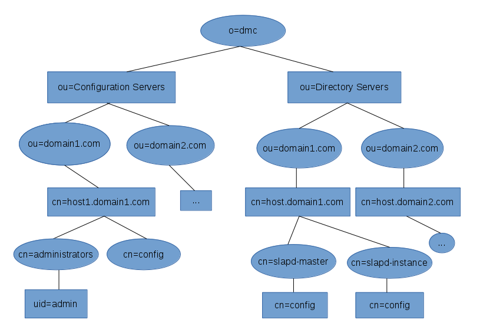

# 389 Directory Server Management Web Console
----------------------------------------------

 

## Naming Candidates

-   389 Directory Management Console
-   389 Directory Server Management Web Console
-   389 Directory Management Server
-   ???

-----------------------

## 389 Java Console Shortcomings

-   Rigid Configuration
-   Difficult to extend
-   “o=netscaperoot”/console layout not robust, too hostname centric, replication is only good for backup purposes – single point of console failure
-   Not network management friendly
-   Requires installing a client package (e.g. 389-console)

---------------------------

## New Design Concepts

### “Floating” Configuration

-   Directory Management Configuration suffix “o=dmc” replaces “o=netscaperoot”
-   Not machine/host specific
-   Can be replicated, and still fully functional on every system
-   Allows the DMC to administer all servers in the registered deployment
-   Local Admin/HTTP server will use config file to know which Configuration DS to use (see below)

### Dynamic UI/Configuration

-   UI configuration forms/pages dynamically creating based off of templates(or querying cn=config, or o=dmc).
-   Add a new config setting, just update a template file/entry.
-   Templates could be files (text, XML, JSON, etc), and/or ldap entries under “cn=config,cn=localhost.localdomain,ou=domain1,ou=Configuration Servers, o=dmc”. 
-   Template file/entry can provide attribute name mapping:

        nsslapd-errorlog-level  ->   "Error Log Level"   

### Configuration Synchronization

-   Synchronze key configuration settings
-   Compare configurations between servers
-   Customizable
    -   Select individual attributes(or all attrs) from particular cn=config entries
    -   Indexing
    -   Plugins
    -   Database settings
    -   etc...

### Administration Delegation

Grant "users" rights to manage part, or all, of o=dmc
    - Add aci's to the proper branches of o=dmc

------------------------------

## Installation of DMC

-   Admin Server (http)
-   Configuration Directory Server (o=dmc) – bare bones instance (plugins disabled, low cache settings, etc) – only used to store the configuration suffix.
-   Every physical machine must have one, and only one, "Admin Server + Configuration Directory Server"

### New Tools

#### setup-dmc.py

-   Creates the http server(Admin Server), and ...
-   Creates a separate Configuration Directory Server for (o=dmc)

#### register-ds-dmc.py

-   Registers an instance with the local Configuration Server

#### ds-config-sync.py

-   Sync's the configuration between two server instances

------------------------------

## New configuration suffix:  “o=dmc” (Directory Management Configuration)

### Configuration Servers (cn=Configuration Servers, o=dmc)

There is only one config server per machine/host

    cn=host1.domain1.com, ou=domain1.com, ou=Configuration Servers, o=dmc
    host: host1.domain1.com
    port: 3890
    securePort: 6360
    security: on
    SecurityDir: /etc/dirsrv/slapd-configuration/
    SSLVersionMin: TLS1.1
    SSLVersionMax: TLS1.2
    AuthMethod: SIMPLE, SASL
    AuthProtocol: LDAP, STARTTLS, etc
    AuthURLFarm:  <LDAP URL> <LDAP URL> ...   (used for console logins)
    ...

    cn=administrators, cn=host1.domain1.com, ou=domain1.com, ou=Configuration Servers, o=dmc

    uid=admin, cn=administrators, cn=host1.domain1.com, ou=domain1.com, ou=Configuration Servers, o=dmc

    cn=config, cn=host1.domain1.com, ou=domain1.com, ou=Configuration Servers, o=dmc
    <All the UI configuration and preferences>
    ...

### Directory Servers (cn=Directory Servers, o=dmc)

    cn=slapd-instance, cn=host1.domain1.com, ou=domain1.com, ou=Directory Servers, o=dmc
    host: host1.domain1.com
    port: 389
    securePort: 636
    security: on
    SSLVersionMin: TLS1.1
    SSLVersionMax: TLS1.2
    AuthMethod:  SIMPLE, GSSAPI(kerberos)
    AuthProtocol:  LDAP, STARTTLS (no LDAPS)
    ConfigServer: cn=host1.domain1.com,ou=domain1.com,ou=Configuration Servers,o=dmc
    SecurityDir: /etc/dirsrv/slapd-inst1/
    ...

    cn=config, cn=slapd-instance, cn=host1.domain1.com, ou=domain1.com, ou=Directory Servers, o=dmc
    <Configuration templates, UI preferences, etc>
    

---------------------------

## HTTP Server

Each Admin/HTTP Server will have a config file that it will use to know how to talk to the Configuration DS.

**dmc-adm.conf**

    port: 9830
    security: on
    SecurityDir: /etc/dirsrv/slapd-inst1/
    SSLVersionMin: TLS1.1
    SSLVersionMax: TLS1.2
    AuthMethods: SIMPLE, kerberos, ....
    AuthProtocol:  LDAP, STARTTLS (no LDAPS)
    LocalConfgServer: ldaps://host1.domain1.com:6360
    FailoverConfigServers: ???  ???  ???
    ...

*LocalConfigServer* is what the Admin Server uses to know which “Configuration Server” config to use.

-----------------------------

## UI Layout

-   Tasks
-   Configuration Servers
-   Directory Servers
-   Replication

### Tasks page
-   Start, Stop, Restart HTTP server
-   Security Management

### Configuration Servers Page

-   “Tree” listing the network structure (just like the existing console), but only listing the configuration servers
-   Might group this into the Directory Servers page/topology, but I'd like to somehow keep it separate.
-   Register to/with Remote Config Servers
-   Authentication LDAP URLS – ordered list of servers to search for console authentication
-   Administrators (cn=administrators, o=dmc)
    -   uid=admin, cn=administrators, cn=host1.domain1.com, ou=domain1.com, ou=Configuration Servers, o=dmc
    -   uid=admin-new york, cn=administrators, cn=host.domain2.com, ou=domain1.com, ou=Configuration Servers, o=dmc

### Directory Servers Page

-   “Tree” listing the network structure (domains/hosts) (just like the existing console)
    -   Create a new instances
    -   Synchronize Server Config?
        -   Indexing, limits, cache, etc
   
-   DS Instance Actions 
    - "Unopened" Instance:
        - Start/Stop/Restart
        - Backup/Restore
        - Unregister instance
        - Monitor/Stats?
        - Delete instance
        - Synch Configuration with another instance (to and from)
    - “Opened” Instance:
        - Server Configuration  
            - Global settings
            - Schema
            - Security
            - Password Policy
            - Disk Monitoring
            - Password Admins
            - Limits (size, time, idletimeout, etc)
            - etc.  
        - Plugins   
            - Add, delete, enable/disable, and configure plugins
        - Backend    
            - DB config/perf tuning
            - Suffix Management
            - Backup/Restore
            - Import/export
        - Replication 
            - Configure replication
            - Changelog
        - Logging & Monitoring 
            - Configure logging settings
            - Manage logs (force rotation, removal, etc)
            - View Logs
                - Reports
                - Integrate logconv.pl ?  

### Replication Page

-   Replication overview 
-   Configure/deploy replication across all registered servers in a single proceedure
    -   Select "instances"
    -   Specify instance role (supplier, hub, consumer)
    -   Specify suffix
    -   Define other configurations(fractional, attributes to strip/ignore, protocol timeouts, etc)
    -   Define Authentication(method + protocol)
    -   Initialize All (one click)
    -   Done!

--------------------

## Lib389 Integration

Use lib389 as the framework for DS operations, and tools like ds-config-sync.py, etc.

