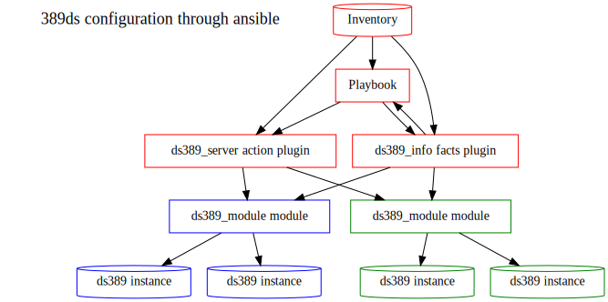
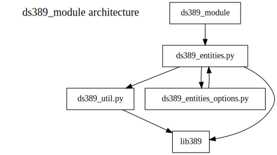

# ansible-ds Design

-------------------



# General considerations

------------------------

Note: I do not describe the ansible variable in this document because they are precisely  described in the ansible collection Readme

## Existing works about 389ds over ansible

Other ansible work over 389ds

- RH QE team role for installing the packages according to the os and version

- [https://github.com/freeipa/ansible-freeipa.git](https://github.com/freeipa/ansible-freeipa.git)

- [https://galaxy.ansible.com/lvps/389ds\_server](https://galaxy.ansible.com/lvps/389ds_server)

- [https://galaxy.ansible.com/cscfi/389-ds](https://galaxy.ansible.com/cscfi/389-ds)

## Considered alternatives:

- System Roles versus Product roles
  After discussion with system roles people and product manager, the decision was to focus on Product role.

- Merge with IPA ansible roles
  After discussion with system roles people, product manager and IPA ansible people the decision was to not try to integrate with IPA roles

- Having a specific package versus including thing in 389-ds-base

- As the controller node may not have 389-ds-base installed, having a specific ansible packakage is mandatory

- Having a single module that handles directory server configuration on an host or having multiple modules that handles part of the configuration.
  Having several part (i.e instance/backend/index/agreements) has the advantage of having simpler plugin and playbook variable structure
  But the drawback is that it is harder to manage for the sysadmin user because the configuration will then be split among lots of playbooks and it will be harder to
  deploy (because a set of playbooks will need to be run to deploy the service)
  Having a single module complexify the ansible option scheme but the configuration is handled in a single playbook.

  And when written in yaml the configuration does not seems so complex
  but when writting playbook a special care must be done about the "state" option because it appears on several nested levels.

- Using set of dict versus dict of dict in ansible options
  a dict of dict: (ie. { 'name1' : { 'optionA': 'valueA' }, 'name2' : { ... } ) is easier to access than a set of dict (i.e: [ { 'name': 'name1', 'optionA': 'valueA' },{'name': 'name2', ...} ]
  But it is not compatible with Ansible option specification nor the way used by Ansible to document the option (Dict keys are supposed to be consrant))
  So although internally the module handles a dict of dict, it loads and presents data as a set of dict

# Test strategy

---

Automated tests are based on pytest framework that run:

- python testcases for the plugins

- yaml test case for the playbooks

- inventory test cases

# General architecture

---

The ansible is delivered as a galaxy ansible collection

named ds/ansible-ds (TBC as I need to rbe able to register the "DS" name )

The collection consist in a set of:

- playbooks (i.e yaml script that are intented be customized by the system administator that uses ansible).

- roles (i.e: yaml script that should not be modified)

- python plugins (i.e a python CLI)

- python utilities modules (i.e python library)

- Documentation files

- Data files (like variable)

The typical workflow is a playbook that use roles that interfaces plugins that import utilities modules.

# plugins and module architecture

---

Plugins and modules are written in python.

- Plugins stand on ansible controller host (referred as 'localhost' in playbooks)

- Module stands on remote hosts (where the 389ds instances are)

("red" nodes are on the ansible controlling host, while "blue" and "green" are on two remote hosts)

## Module

### Goal

 The module is an executable standing on remote machine and in charge of interacting with 389ds.

### Architecture

The module is a python main executable that interacts with a few python libraries

## ds389_module file

### Goal

This executable allows to:

- update ds configuration. It allows to:

  - create instances
  - delete instance
  - update configuration instance

- gather facts about ds configuration:

  - list existing instances
  - determine their started/stopped state
  - get the parameters with non default values

#### Architecture

This module is derivated from Ansible module example and perform the following:

- Decode json parameter provided in stdin by the calling plugin

- Perform action according on the presence of a dict in these parameters:

| dict              | action                                                                                                                                                                           |
| ----------------- | -------------------------------------------------------------------------------------------------------------------------------------------------------------------------------- |
| ds389_server      | using dsentities_options as parameter spec to parse the ansible parameters creates a dsentities.YAMLRoot instance from these parameters calls the YAMLRoot.update method |
| ds389_server_fact | Collect the fact                                                                                                                                                                 |

- format the result as json written to stdout

# Utilities modules

An utility module is a python library used by the ds389_module module..

### ds389_util

#### Goal

Provides some common tools:

- NormalizedDict which implements a dict whose keys are normalized

- LdapOp which represents an ldap operation in yaml/json

- Entry which helps to handle an ldap entry

- DiffResult  which is class used to store dse.ldif differences

- DSE which is a class allowing to compare dse.ldif files

### dsentities

#### Goal

Provides the code needed to:

- generates the entities instances according to the ansible variable dict

- discover the entities from existing directory server instances

- update the configuration

#### Architecture

- Root entity
  Contains the:

  - instances list

  - the installlation prefix

- Instance entities
  Represents a directory server instance
  Contains the:

  - instance parameters (including: cn=config , global database parameters, )

  - backend list

  - plugin list

  - sasl mapping entries list

  - modifier list (a list of change to apply the dse.ldif, typically to add entries/attribute not handled by the various the entities (like the replication manager entry)

- backends entities
  Contains the:

  - backend parameters (i.e mapping tree, backend parameters, database per backend parameter, replication parameters)

  - index list

  - replication agreement list

- index entities
  Contains the:

  - index parameters (for standard or vlv index)

- Plugin entities

- Replication Agreeement entities

- Sasl mapping entry entities

### ds389_entities\_options

#### Goal

This module provides the specification of ansible parameter associated with the entities

#### Architecture

This module is generated from the dsentities module by:
 `python utils/gendoc.py spec` command.

It generates a CONTENT\_OPTIONS variable containing the argument specification for the entities module using the format specified in

[Ansible module architecture — Ansible Documentation](https://docs.ansible.com/ansible/latest/dev\_guide/developing\_program\_flow\_modules.html#argument-spec)

This variable is then used by ds\_server module to parse the ansible variables.

## plugins

### ds\_server action plugin

#### Goal

update ds configuration. It allows to:

- create instances

- delete instance

- update configuration instance

#### Architecture

This module is derivated from Ansible action plugin  example and:

- Get needed variables from the plugin parameters and ansible inventory.

- Perform some computation on theses variables:

  - Evaluate Jinja2 expressions (mostly to evaluate vault variable)
  - Merge values according to the ds389_merge_xxx variables

- Call the ds389_module with proper parameters:

  - in ds389_server dict for the 389ds related variables
  - in ds389_ansible dict for ansible variables:

- Format the result (adding some data when debbugin option are set_

### ds_info fact plugin

#### Goal

Collect data about 389ds instances installed on host

#### Architecture

This module is derivated from Ansible fact plugin example and:

Get the ansible_hostname from Ansible environbment

- Call the ds389_module with proper parameters:

  - in ds389_info dict for the host and prefix variables
  - in ds389_ansible dict for ansible variables:
