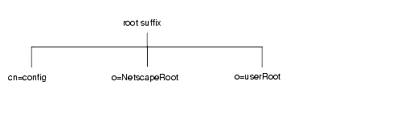
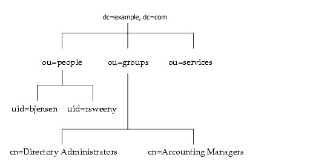

# Overview of Directory Server Architecture
-----------------------------------------

At installation, Directory Server contains the following:

-   A server front-end responsible for network communications
-   Plug-ins for server functions, such as access control and replication
-   A basic directory tree containing server-related data.
-   A database back-end plug-in responsible for managing the actual storage and retrieval of server data.

The following sections describe each component of the directory in more detail.

### Overview of the Server Front-End

The server front-end of Directory Server manages communications with directory client programs. Directory Server functions as a daemon on UNIX systems and as a service on Windows. Multiple client programs can speak to the server using LDAP. They can communicate using LDAP over TCP/IP. The connection can also be protected with SSL/TLS, depending on whether the client negotiates the use of Transport Layer Security (TLS) for the connection.

When communication takes place with TLS, the communication is usually encrypted. In the future, when DNS security is present, TLS used in conjunction with secured DNS will provide confirmation to client applications that they are binding to the correct server. If clients have been issued certificates, TLS can be used by Directory Server to confirm that the client has the right to access the server. TLS and its predecessor SSL are used to perform other security activities such as message integrity checks, digital signatures, and mutual authentication between servers.

Multiple clients can bind to the server at the same time over the same network because the Directory Server is a multi-threaded application. As directory services grow to include larger numbers of entries or larger numbers of clients spread out geographically, they also include multiple Directory Servers placed in strategic places around the network.

### Server Plug-ins Overview

Directory Server relies on plug-ins. A plug-in is a way to add functionality to the server without having to change the code in the core server. This is important because it allows the server to perform new functions without having to destabilize the codebase. It also facilitates concurrent development - two or more developers can work on different functional areas of the server without interfering with each other.

A plug-in may be registered to be called only for certain types of operations. For example, a plug-in that wants to ensure that certain attributes meet certain criteria (e.g. checking for 8 bit characters in passwords) would only want to be called during ADD or MODIFY operations.

See [Plugins](plugins.html) for more details.

### Overview of the Basic Directory Tree

The directory tree, also known as a directory information tree or DIT, mirrors the tree model used by most file systems, with the tree's root, or first entry, appearing at the top of the hierarchy. At installation, Directory Server creates a default directory tree.

The default directory tree appears as follows:

The root of the tree is called the root suffix. For information about naming the root suffix, refer to "Choosing a Suffix".

At installation, the directory contains up to four subtrees under your root suffix:

-   cn=config

This subtree contains information about the server's internal configuration.

-   o=NetscapeRoot

This subtree contains the configuration information of other Netscape servers, such as Administration Server. The Administration Server takes care of authentication and all actions that cannot be performed through LDAP (such as starting or stopping).

-   o=userRoot

During installation, a user database is created using the suffix provided. The default suffix is usually something like dc=subdomain,dc=domain,dc=tld e.g. (dc=eng,dc=example,dc=com). You can choose to populate it at installation time, or populate later.

You can build on the default directory tree to add any data relevant to your directory installation. An example of a directory tree for example.com Corporation follows:

### Overview of the Database Back End

The Database Back End plugin manages all the server's persistent storage (except for basic configuration data and schema definitions which are stored in flat text files in LDIF format). The Database Back End implements an indexed, transacted store specifically designed for the requirements of a Directory Server. It is implemented as a layer above the BerkeleyDB storage manager. BerkeleyDB takes care of lower level functions such as maintaining the Btrees, transaction logging, page pool management, recovery and page-level locking. The Back End handles higher level functions such as indexing, query optimization, query execution, bulk load, archive and restore, entry caching and record-level locking. More details can be found in the [Database Architecture](database-architecture.html) page.

Architecture and Design of Server Features
------------------------------------------

### Access Control

#### Introduction

By default, the directory server denies access to everything. The administrator must allow certain types of access to certain resources for users to be able to use the directory server. The operational attribute *aci* is used for access control. This attribute can be applied to any entry in the DIT, and has subtree scope - it applies to the entry that contains it and any children and descendants of that entry. An ACI consists of 3 parts: a target, a subject, and the type of access.

The target is the What - which entry or resource is being protected. By default it applies to all entries in subtree scope of the entry containing the aci attribute. The target specification may contain filters (which are just like LDAP search filters) to narrow the target to certain entries or attributes within those entries, and may also even specify certain values of specified attributes (e.g. only allow users to change their telephone number to something that doesn't begin with 900).

The subject is the Who - what bind entity is granted (or denied) access to the target. The subject may be the DN of a user, group, or role, or special keywords such as self (the user who is bound), anyone (anonymous binds), or all (any authenticated user). The subject can also be defined by comparing attributes in the bind entity with attributes in the target entries by the user of the *userattr* keyword.

The type of access is any combination of the following keywords: *read, search, compare, write, add, delete, selfwrite, proxy*. The special keyword *all* means all types of access except proxy (which is a special case used by chaining and some connection pool clients). The type of access is modified by using *allow* or *deny* to allow or deny that type of access. If there are conflicts between what is allowed and what is denied, the deny wins. That is, in ambiguous cases, the server just denies access.

Modifiers can be used to allow or deny access based on the client IP address or hostname (e.g. only allow access from 192.168.1.1), access time (e.g. allow access only from 8am to 5pm Monday through Friday), or connection type (e.g. only allow access by clients who are using SSL).

The directory server also supports Macro ACIs which allows a small number of ACIs to apply to a large number of entries. The usual example is a DIT with several organizations. Each organization has an Administrator group which must have administrative privileges to the subtree for its organization. Rather than creating several acis in each subtree, you can create 1 macro aci in the parent. In this example, (\$dn) is the macro that expands to the matching part of the administrator's bind DN.

    aci: (target="ldap:///($dn),dc=example,dc=com") (targetattr = "*")
         (version 3.0; acl "Administrator access"; allow (all)
         groupdn="ldap:///cn=Administrator,ou=Groups),($dn),dc=example,dc=com";)

So, for example, if the bind DN was a member of cn=Administrator,ou=Groups,o=foo,dc=example,dc=com, that bind DN would be granted full access to o=foo,dc=example,dc=com *and only* o=foo,dc=example,dc=com - not dc=example,dc=com or o=bar,dc=example,dc=com. In this case, the macro (\$dn) expands to "o=foo".

The directory server supports the Get Effective Rights (GER) operation which allows administrators to test access control. For example, "If I bind as user X, what types of access will I have for entry Y?". This is very handy to use when designing the access control policies for an organization.

#### Design

Access Control is implemented as a plug-in of type *accesscontrol*. The plug-in employs a sophisticated caching mechanism which stores information in the connection and operation extensions to avoid having to re-evaluate the subject, target, or result for each operation.

### Replication

#### Introduction

First, some terminology.

-   Replica - a server participating in replication. A replica may be a master, a hub, or a consumer. Only masters are writable by regular LDAP clients. The current version of the server supports 4 masters. Hubs and consumers may only be updated by another replica. The only difference between a hub and a consumer is that a hub is both a consumer (from masters or other hubs) and a supplier (to other hubs or consumers). Hubs are typically used for load balancing and fail-over.
-   Replica ID - Each master in the replication topology is assigned a 16 bit number called the Replica ID. This number uniquely identifies each master. Read-only replicas generally use the number 65535 as their replica ID.
-   Universal Unique Identifier (UUID) - As each entry is created, it is assigned a UUID, the value of which is held in the nsUniqueID operational attribute in each entry. This allows the entry to be uniquely identified throughout a multiple server replication topology. The DN is unreliable for this purpose since it can change with a ModDN operation.
-   Change State Number (CSN) - As each update is made to the entry, the update is assigned a CSN. There several different types of CSNs, depending on the type of operation - value update (vu), value delete (vd), attribute delete (ad), and name change (md). The CSN is broken into 4 parts. The first part is a timestamp which has 1 second resolution (e.g. unix time\_t). The second part is a sequence number that is guaranteed to be unique (to ensure uniqueness when there are more than 1 update in a second). The third part is the Replica ID, a 16 bit number that uniquely identifies each master in the replication topology. This allows you to find out the originating server for any update. The fourth part is a sub-sequence number and is currently unused.
-   Replica Update Vector (RUV) - The RUV is used to keep track of the min and max CSN sent to each replica. It is stored in a special "hidden" entry at the base of each suffix that is configured for replication.
-   Tombstones - When an entry is the target of an LDAP Delete operation, it is not physically removed from the database right away. Instead, it is converted into a tombstone entry. Tombstone entries do not show up in regular search operations unless the filter (objectclass=nsTombstone) is added to the search filter in the search request. Tombstone entries are renamed and use their nsUniqueID as the RDN.
    -   Notes: When searching Tombstone entries, you may see a symptom such as (objectclass=nsTombstone) returns Tombstone entries; but if you try to get one of them with a filter using one of the uids: (&(uid=<uid_value>)(objectclass=nsTombstone)), it returns none. This is because when the entry is deleted, the entry is converted to a Tombstone entry, but the associated indexes are removed from the index files. If the attribute is indexed, and the indexed value is not found in the index file, the FDS considers there is no entry matching the filter in the backend. Looking at this example, uid is indexed with the equality index type, by default. If you run the search with (&(uid=<uid_value>)(objectclass=nsTombstone)), it returns nothing since there is no <uid_value> in the uid equality index. Instead, running with (&(uid=<uid_value><b>\*</b>)(objectclass=nsTombstone)), the Tombstone entry is returned since '<b>\*</b>' triggers the substring search. And uid is not indexed with the substring type. Therefore, this search is run as a non-indexed search, that is, it would be slower than the indexed case, but it returns what is expected. Or if you give unindexed attribute to the filter, e.g., (&(description=<description_value>)(objectclass=nsTombstone)), the Tombstone entry will be returned. The last and most strict way to find out the entry: if you have the nsUniqueID value for the entry, you can search the entry with this filter (&(nsUniqueID=<nsUniqueID_value>)(objectclass=nsTombstone)).
-   Changelog - Changes are stored in a special database called a changelog. This is different from the Retro or DS 4.x style changelog (usually exposed in a special suffix like cn=changelog) in that it is hidden and not available to normal LDAP operations and clients. Every change is written to the changelog, indexed by its CSN.

Replication can be configured to replicate whenever there is a change to send, or on a schedule. The default is to replicate as soon as there are changes to replicate.

Replication is supplier initiated. Each replication agreement is run in a separate thread in the supplier. The thread sleeps, waiting for changes to send. When a change is received (i.e. the changelog is written), the thread wakes up, connects to the consumer, gets the RUV from the consumer, sees if it needs to send any changes, and sends them.

The unit of replication is a suffix. The server does not currently allow the replication of a subset of the entries in a suffix. If you want to replicate a subtree, you must define a suffix or sub-suffix of an existing suffix and replicate that suffix. For example, if you have a suffix dc=domain, dc=com and you have a container called ou=People under that, and you want to replicate only that container, you must create a sub-suffix for ou=People,dc=domain,dc=com and replicate that.

##### Replica Initialization

Before replication can occur, the consumer must be initialized. This means that it must have a copy of the supplier's data for the replicated suffix. There are 3 ways to do this.

1.  Have the supplier initiate the process. There is a special attribute in the replica entry called nsds5BeginReplicaRefresh. Setting the value of this attribute to "start" will cause the supplier to initialize the consumer. The attribute will be deleted when the task is complete, so management apps can poll for it. The status of the operation is found in the nsds5ReplicaLastInitStatus attribute. This is a very similar operation to an import. The existing data (if any) in the suffix on the consumer will be erased and replaced with the data from the supplier. This uses a special bulk import extended operation, which is essentially like doing a database import over the network. It is extremely fast, as fast as the network can handle (and much faster than the old 4.x style of online replica creation). In 7.1 this has been optimized for use on WANs and other unreliable and/or high latency networks by using batches and back-offs.
2.  Export the supplier database to LDIF and import on the consumer. When doing the export, tell the export that you want the LDIF file to contain replication state information. The GUI has an option for this, and the db2ldif command uses the -r flag for this. Then just import that LDIF file into the consumer.
3.  New for 7.1 - Use a database backup. Just backup the supplier, then restore that backup on the consumer.

The first method is recommended except with large databases (more than a couple of hundred thousand entries) and low speed networks (where it may be faster to create a file, compress it, and copy it to the remote machine).

##### Update and Conflict Resolution

If a change is made to the same entry on two different masters at the same time, the changes are automatically merged. If the changes do not conflict, then both updates go into the merged entry. If there are conflicts, generally the "last change wins" i.e. the change with the greater CSN is the one that will be applied and visible to client applications. There are many "corner" cases that are not so simple to deal with. For example, if you delete an entry on one master, and add a child to that same entry on another master at the same time. In this case, depending on the timing, the deleted entry may be "resurrected" (converted from a tombstone into a "glue" entry) so that the child entry has a parent. There are several cases like this. The file ldap/servers/plugins/replication/urp.c contains all of the details about the resolution process.

##### State Information

Each entry contains the CSNs of the updates applied to that entry. Deleted entries are kept around as tombstones. Old state information is periodically trimmed. For tombstones, there is a housekeeping thread which is run periodically to delete tombstones older than 1 week (the default value). This thread is run every hour (the default value). Both of these values are configured in the replica configuration. State information in entries is checked for aging every update operation on the entry. It uses the same aging value as used by the tombstone thread. The changelog is also trimmed and has it's own trimming parameters in the changelog configuration. There is a special operational attribute which holds all of the state information - nscpEntryWSI (With State Information).

### Active Directory Sync

The server can synchronize users, groups and user passwords bidirectionally with Microsoft Active Directory and Windows NT4 Domain Controllers. For clarity we call changes made from the DS to Active Directory 'outbound' and changes propagated from Active Directory to the DS 'inbound'. All communication between the server and its Active Directory peer is via LDAP.

#### How Active Directory Sync Works

Active Directory Sync makes heavy use of the server's replication infrastructure. It uses the changelog for outbound changes in much the same way as regular multi-master replication does. However the process for inbound change propagation is different. Here the special Active Directory 'dirsync' feature is used to request the entries that have changed since the previous sync pass was completed.

#### Inbound Password Sync

There is no documented mechanism that allows retrieval of plain text passwords from Active Directory. Plain text password values are required because Active Directory and Directory Server use different incompatible one-way password hashing mechanisms. Therefore special steps must be taken to 'catch' password changes as they occur on the Active Directory machine, by means of a 'password hook' dll. This dll, along with its associated Win32 service, comprise the 'Password Sync Service'. The Password Sync Service is responsible for propagating password changes caught with the hook dll back to the peer Directory Server (via an SSL protected LDAP connection).

#### How NT4 Sync Works

Legacy NT4 deployments are also supported by the 'Active Directory Sync' feature. In the case of NT4, in contrast to Active Directory there is no native support for LDAP. For NT4, a special 'LDAP Service' was written that aims to present an LDAP server with similar schema and characteristics to Active Directory. The Directory Server's sync code has a small number of special cases to accommodate the differences between the two. For example NT4 has no 'surname' field for users, and so it is necessary to generate a fake value for 'surname' in newly created sync'ed users (because the IETF inetOrgPerson object class requires that 'surname' be present). The NT4 LDAP Service is based on Apache DS, with a special 'jnetman' back-end that calls the NT4 NetApi functions.

### Network I/O and Connections

The server is multi-threaded and has been designed to efficiently handle many simultaneous requests. The server uses poll() on platforms where it is available (which is most all of them at this point) so it is able to handle large numbers of connections. The OS imposes a limit on the number of file descriptors available in the whole system and per process - see your OS documentation (or run the dsktune utility) for information about how to increase this limit. The server keeps some file descriptors in reserve for file I/O (e.g. log files), outgoing network connections, and other purposes. The number of connections the server can handle at once is set by the maximum number of descriptors minus the reserve descriptors. These are both configured by using the corresponding attributes in cn=config - nsslapd-maxdescriptors and nsslapd-reservedescriptors.

Upon startup, the server creates a pool of operation threads. The number of threads is set by the attribute nsslapd-threadnumber in cn=config. The default number strikes a pretty good balance between being network I/O bound and CPU bound. The number can be multiplied by the number of CPUs in the system. The server polls to see what file descriptors have activity. Each active connection has a Connection object associated with it. If there is a new connection, a new Connection object is created. The server then loops through the active connections. For each one, it creates a new operation, puts it in a queue, and notifies the operation thread pool. The connection management code also looks for possible DoS attempts, idle connections, and things of that nature. Each thread in the operation thread pool will dequeue and perform operations until there are no more operations in the queue. The first thing the operation thread does is determine what type of LDAP operation is being requested, by reading just enough of the LDAP PDU to determine that information. It then calls a function whose name corresponds to the LDAP operation e.g. the function do\_add() is called for LDAP ADD operations. The do\_OP function reads the rest of the PDU including any request controls, processes the operation, and sends the response. The server code uses the Mozilla LDAP C SDK ber library to do the reading and the writing. The SDK allows us to replace the actual calls it uses to read and write. For non-SSL connections the functions read\_function() and write\_function() are used to actually read and write to the network connection. secure\_read\_function() and secure\_write\_function() are used for SSL connections.

### Server Tasks

Several server administration tasks can be performed using LDAP operations. There are some special entries called Task entries found under cn=tasks,cn=config, one for each type of task that can be performed. The server currently supports backup, export, import, index, restore, and upgradedb, each represented by an entry (e.g. cn=backup,cn=tasks,cn=config). To perform a task, just add a new entry under the task entry for the type of task you want to perform. For example, create the entry cn=myimporttask,cn=import,cn=tasks,cn=config to perform a database import task. Each type of task entry has different attributes. For the import task, there is an attribute where you specify the suffix or database name to import into, the LDIF file to import, etc. Each task entry also has attributes that are updated with the process of the operation, so the client can poll the entry and get the progress and status of the task. The attributes are described below:

-   nsTaskLog - the log output of the task
-   nsTaskStatus - the current status of the task
-   nsTaskExitCode - the exit code - use this attribute to tell when the task has completed and if the completion was successful
-   nsTaskCurrentItem, nsTaskTotalItems - use these attributes to get a rough idea of the amount of progress (i.e. for a progress meter in a GUI application). The meaning changes depending on the task. For an import task, these may refer to size in bytes. For an export task, these may refer to the entry.

Once the task is completed the task entry will be removed. Each task entry has a time to live (ttl) attribute which tells how long to keep the entry around, to allow management applications to get the task status and log information.

#### How Tasks Work

The task type parent entries have ADD callbacks registered with the DSE code (dse.c, task.c). When a new entry is added under the parent, the callback code grabs the attributes and values from the new entry and passes them as parameters to the database code, where the database operations are exposed just as they are to perform those same operations from db2ldif, etc. The back-ldbm code knows about tasks and updates the progress and status information using the slapi\_task APIs, which in turn do internal modify operations on the task entries. Clients can query the task entries to get status information. Once each task is finished, the task code uses the event queue API to create an event to delete the task entry after *ttl* seconds have passed.

### Chaining

The chain in chaining refers to connecting two or more directory servers together using LDAP. That is, LDAP requests are "chained" from one directory server to another. Chaining is implemented as a database plug-in. Not all of the database interface is implemented e.g. things like backup, restore, import, export were not implemented. Chaining is essentially just another LDAP client, and uses the Mozilla LDAP C SDK. The way chaining works is that it gets the LDAP operation and just passes it to another LDAP server, gets the result, and passes it back to the client as if the response came from the local database. The implementation is a bit more sophisticated than that, and relies on some features described below.

-   Failover - chaining can be configured with multiple LDAP servers. They are listed in order of preference. Chaining does a heartbeat check periodically, and fails over to the next one in the list if necessary. It will loop back to the beginning if it gets to the end of the list.
-   Pooling - chaining creates a pool of connections to the remote LDAP server(s). This allows it to efficiently handle simultaneous requests.
-   Proxy - In conjunction with pooling, the connections in the pool are open and bound as a proxy user. This saves a lot of time since bind can be an expensive operation. The proxy user must have the proxy ACI right (described in the Access Control documentation) over the suffix/subtree in the remote LDAP server(s).

There are two additional features that make use of chaining. Entry Distribution is a feature of the mapping tree that gives the user the ability to specify more than one database for a suffix. The user must provide a plug-in function that, given the operation, tells which database to send the operation to. This allows operations on a suffix to be distributed among several databases. If those databases are chaining databases, this provides the ability to distribute the entries in a suffix among many LDAP servers. For example, if you wanted to support a suffix with tens of millions of user entries, and wanted to spread them out among several servers, you point a chaining database at each server and write an entry distribution function to distribute entries. For example, the distribution could use something like a hash of the user ID modulo the number of databases (assuming a uniform random distribution of user ID values). Or perhaps a range e.g. user IDs beginning with a through b go to server 1, c through d to server 2, etc. Or just about any function that uses values from the operations (bind DN, target DN, search filters).

Another use for chaining is with replication. Only masters are writable, so if a client wants to write to the directory, it must either write to the replica, get a referral back, and follow that referral to a master. Or the client must be explicitly configured to send read and write operations to different servers. With chaining, another alternative is *chain on update*. This allows the read only replica to chain the write request back to the master (even through one or more hubs). This can be very useful in situations where the master is protected by one or more layers of firewalls and it is not possible or desirable to open many holes for client update operations. In this case, the firewall can be configured to permit incoming operations only from the replicas.

### Virtual Attributes

The Class of Service (CoS) and Roles features both use the virtual attribute service provider interface (vattr\_spi). Plug-ins can register to be virtual attribute service providers - CoS and Roles are both implemented as plug-ins. There are two main points where the server needs to handle virtual attributes - during the search result processing and during search filter processing. After reading the "real" entry and attribute data from the database, the server adds any virtual attributes to the entries in the search response by asking the vattr service providers if there are any vattrs for the given entry, and adds them to the entry data in the outgoing search response. The other entry point is in the filter processing code. The server looks up any vattrs mentioned in the filter. vattr service providers can "index" vattrs to make filter comparisons fast.

### Roles

Roles are a lot like groups. There are 3 types of roles: Managed Roles, Filtered Roles, and Nested Roles. Managed Roles are similar to static groups - you have to explicitly enumerate and manage Role membership. Filtered Roles are similar to dynamic groups - membership is based on some property of the entry, like it's container or an attribute. Nested Roles provide a way to define a role to include members of other roles (including other Nested Roles). Roles, however, are unlike groups (in the traditional implementations) in that they have much better performance and much easier administration with more than a couple of hundred members, plus they work much better with replication because of their explicit scoping.

A role is defined using a special type of entry which is a subclass of ldapSubentry. These entries are special because they do not show up in regular LDAP search requests (only with the special search filter (objectclass=ldapSubentry) added to the other search filters in the request). They are also special in that they apply to the subtree scope of their parent (but do not include the parent). For example, if I want to create a role for users under ou=People,dc=example,dc=com like uid=scarter,ou=People,dc=example,dc=com, I can create a role called cn=Administrators,ou=People,dc=example,dc=com with objectclass nsManagedRoleDefinition (a subclass of ldapSubentry). This role would only apply to entries under ou=People and not ou=People itself.

Roles is implemented as a post-operation plug-in which is also a virtual attribute service provider. The attribute it provides the value for is the operational attribute nsRole. All of the roles to which an entry belongs are listed in its nsRole attribute e.g.

    nsRole: cn=myManagedRole,ou=People,dc=example,dc=com
    nsRole: cn=myFilteredRole,ou=People,dc=example,dc=com
    nsRole: cn=myNestedRole,ou=People,dc=example,dc=com

This makes it very easy to perform certain queries such as: To which roles does this entry belong? Just do a search and include the nsRole attribute in the search request. Since it is an operational attribute, it must be listed explicitly in the search request attribute list.

    ldapsearch ... -s sub -b "ou=People,dc=example,dc=com" "(uid=scarter)" "*" nsRole

This would list all regular attributes of scarter's entry and any roles scarter belongs to. To find out if an entry is a member of a particular role, use a search like the following:

    ldapsearch ... -s base -b "uid=scarter,ou=People,dc=example,dc=com" "(nsRole=cn=myManagedRole,ou=People,dc=example,dc=com)"

To find all members of a particular role,

    ldapsearch ... -s sub -b "ou=People,dc=example,dc=com" "(nsRole=cn=myManagedRole,ou=People,dc=example,dc=com)" dn

The role plug-in maintains a cache which is updated after every operation that modifies the database. It looks for new/modified/deleted role definitions and new/modified/deleted entries within the scope of defined roles. This allows it to quickly fulfill requests for nsRole attribute values in filter and result code.

Adding entries to roles depends on what type of role it is. A Managed Role is defined by first creating an entry of objectclass nsManagedRoleDefinition under the container to which the role will apply. A special operational attribute *nsRoleDN* is added to each entry you want to be a role member. The value of the nsRoleDN attribute is the full DN of the role definition entry e.g.

    nsRoleDN: cn=myRole,ou=People,dc=example,dc=com

A Filtered Role definition contains an LDAP search filter. The entries matching the search filter are automatically added to the role. For example, if you wanted to create a role called SunnyvalePeople, you could create a Filtered Role which has the search filter (l=Sunnyvale). Then the following two searches would return the same results:

    ldapsearch ... -s sub -b "ou=People,dc=example,dc=com" "(l=Sunnyvale)" dn

and

    ldapsearch ... -s sub -b "ou=People,dc=example,dc=com" "(nsRole=cn=SunnyvalePeople,ou=People,dc=example,dc=com)" dn

Both searches enumerate role membership.

Nested Roles are defined by listing the DNs of other roles in the Nested Role definition.

