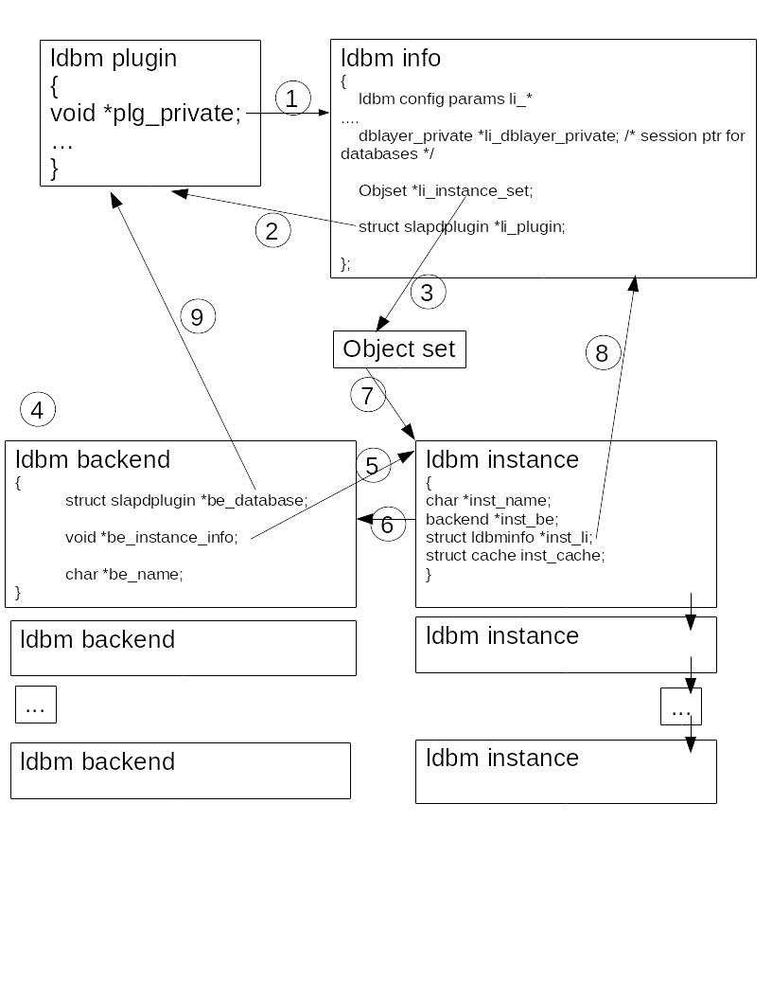

# Database Backend Redesign
------------------



Motivation
==========

The current implementation of 389-ds uses the BerkeleyDB libdb database for storage of data. There
are two reasons to think about using an alternative database library

- Oracle channged the licence model for the recent versions so that they are no longer compatible with 389-ds and we would have to stay at 5.x
- There have been many issues with the transaction model in BDB leading to blocking read access during writes or leading to deadlocks. It is time
to offer the choice of an implementation which uses copy on write and where readers are not blocked by writes

High level summary
==================

It is not possible to immediately replace the BDB backend completely by an other database lib (eg LMDB), we need to support BDB as is and in parallel can provide an other option.
But allowing the coexistence of different database implementation requires several changes which affect configuration and upgrade - even if the functionality is not changed.

The main changes are:

- The configuration of the ldbm database is split into a generic database configuration and an implpementation specific subdatabase
- The MMR replication changelog has to be integrated into the main database
- The usage of exec modes of ns-slapd and database related tasks can be affected
- The install and upgrade has to handle the new configuration

Current solution
==================

## Configuration

### Backends and suffixes

The configuration of DS lists all the suffixes this DS will service, it is specified in

    cn=<suffix>,cn=mapping tree,cn=config

Each suffix has a multivalued attribute which determines where the data for this suffix are stored:

    nsslapd-backend: <backendname>

It can have multiple backends only if a distribution function is defined and the suffix is distributed over multiple backends.

But no two suffixes can point to the same backend and a backend can only contain data for one suffix. So, in the usual case without distribution, there is a 1:1 relationship between a suffix and a backend

There are several types of backends:

     internal (dse, schema, config)
     chaining
     database

This document will only deal with database backends

### Database Configuration Entries

A database backend is implemented as a plugin and the configuration is at two levels:

    cn=ldbm database,cn=plugins,cn=config

which defines the plugin library and plugin initilaization function, and a configuration for the specific implementation:

    cn=config,cn=ldbm database,cn=plugins,cn=config

Each backend implemented by this plugin is listed as a child of the plugin definition:

    cn=<backend_1>,cn=ldbm database,cn=plugins,cn=config

### Database Configuration Parameters

The database paramter are maintained in a config array, where each paramter has a default value, a function to set and get its value.
It is setup at startup in two phases:

1. The array is initialized with the default values

2. The "cn=config,cn=ldbm database" entry from the dse.ldif is read and for each paramter present the default value is overwritten,

The Config Array, excerpt:

     static config_info ldbm_config[] = {
        {CONFIG_LOOKTHROUGHLIMIT, INT, "5000", &, &, ALWAYS_SHOW | ALLOW_RUNNING_CHANGE},
        {CONFIG_MODE, INT_OCTAL, "0600", &, &, ALWAYS_SHOW | ALLOW_RUNNING_CHANGE},
        {CONFIG_IDLISTSCANLIMIT, INT, "4000", &, &, ALWAYS_SHOW | ALLOW_RUNNING_CHANGE},
        ....

        {CONFIG_RANGELOOKTHROUGHLIMIT, INT, "5000", &, &, ALWAYS_SHOW | ALLOW_RUNNING_CHANGE},
        {CONFIG_BACKEND_OPT_LEVEL, INT, "1", &, &, ALWAYS_SHOW},
        {CONFIG_DB_DEADLOCK_POLICY, INT, STRINGIFYDEFINE(DB_LOCK_YOUNGEST), &, &, ALWAYS_SHOW | ALLOW_RUNNING_CHANGE},
        {NULL, 0, NULL, NULL, NULL, 0}};

## Database Plugin

All functionality to access and manage the database are implemented as pluging functions, this includes import/export, backup/restore, search and modify access for data in the database and some more
 
### Defined plugin entrypoints

The plugin functionality is exposed by registerd functions which are published to the plugin substructutre of the pblock, more precisely the database sub struct.

These plugin entry points can be classified into several groups and will be discussed next.

#### Plugin management

These functions will be callesd when the plugin subsystem starts or closes

    SLAPI_PLUGIN_START_FN, (void *)ldbm_back_start);
    SLAPI_PLUGIN_CLOSE_FN, (void *)ldbm_back_close);
    SLAPI_PLUGIN_CLEANUP_FN, (void *)ldbm_back_cleanup);

#### Functions called by ldap operations.

The processing of any ldap operation will at some point need access to the database and call a backend function, for each
LDAP operation there is one or more backend entry point:

    SLAPI_PLUGIN_DB_BIND_FN, (void *)ldbm_back_bind);
    SLAPI_PLUGIN_DB_UNBIND_FN, (void *)ldbm_back_unbind);
    SLAPI_PLUGIN_DB_SEARCH_FN, (void *)ldbm_back_search);
    SLAPI_PLUGIN_DB_NEXT_SEARCH_ENTRY_FN, (void *)ldbm_back_next_search_entry);
    SLAPI_PLUGIN_DB_NEXT_SEARCH_ENTRY_EXT_FN, (void *)ldbm_back_next_search_entry_ext);
    SLAPI_PLUGIN_DB_COMPARE_FN, (void *)ldbm_back_compare);
    SLAPI_PLUGIN_DB_MODIFY_FN, (void *)ldbm_back_modify);
    SLAPI_PLUGIN_DB_MODRDN_FN, (void *)ldbm_back_modrdn);
    SLAPI_PLUGIN_DB_ADD_FN, (void *)ldbm_back_add);
    SLAPI_PLUGIN_DB_DELETE_FN, (void *)ldbm_back_delete);
    SLAPI_PLUGIN_DB_ABANDON_FN, (void *)ldbm_back_abandon);

Specific for paged result searches:

    SLAPI_PLUGIN_DB_SEARCH_RESULTS_RELEASE_FN, (void *)ldbm_back_search_results_release);
    SLAPI_PLUGIN_DB_PREV_SEARCH_RESULTS_FN, (void *)ldbm_back_prev_search_results);

Specific functions for offline exec modes

    SLAPI_PLUGIN_DB_LDIF2DB_FN, (void *)ldbm_back_ldif2ldbm);
    SLAPI_PLUGIN_DB_DB2LDIF_FN, (void *)ldbm_back_ldbm2ldif);
    SLAPI_PLUGIN_DB_DB2INDEX_FN, (void *)ldbm_back_ldbm2index);
    SLAPI_PLUGIN_DB_ARCHIVE2DB_FN, (void *)ldbm_back_archive2ldbm);
    SLAPI_PLUGIN_DB_DB2ARCHIVE_FN, (void *)ldbm_back_ldbm2archive);
    SLAPI_PLUGIN_DB_UPGRADEDB_FN, (void *)ldbm_back_upgradedb);
    SLAPI_PLUGIN_DB_UPGRADEDNFORMAT_FN, (void *)ldbm_back_upgradednformat);
    SLAPI_PLUGIN_DB_DBVERIFY_FN, (void *)ldbm_back_dbverify);
    SLAPI_PLUGIN_DB_WIRE_IMPORT_FN, (void *)ldbm_back_wire_import);

Specific functions for transaction handling

    SLAPI_PLUGIN_DB_BEGIN_FN, (void *)dblayer_plugin_begin);
    SLAPI_PLUGIN_DB_COMMIT_FN, (void *)dblayer_plugin_commit);
    SLAPI_PLUGIN_DB_ABORT_FN, (void *)dblayer_plugin_abort);

Specific functions for more direct db control

    SLAPI_PLUGIN_DB_SEQ_FN, (void *)ldbm_back_seq);
    SLAPI_PLUGIN_DB_SIZE_FN, (void *)ldbm_db_size);
    SLAPI_PLUGIN_DB_GET_INFO_FN, (void *)ldbm_back_get_info);
    SLAPI_PLUGIN_DB_SET_INFO_FN, (void *)ldbm_back_set_info);
    SLAPI_PLUGIN_DB_CTRL_INFO_FN, (void *)ldbm_back_ctrl_info);

Not used, should be removed

    SLAPI_PLUGIN_DB_INIT_INSTANCE_FN, (void *)ldbm_back_init);
    registering the init function for second instance ????

    SLAPI_PLUGIN_DB_ENTRY_RELEASE_FN, (void *)ldbm_back_entry_release);

    SLAPI_PLUGIN_DB_RMDB_FN, (void *)ldbm_back_rmdb);
    was only used by V4 changelog

Used, but only called directly in init

    SLAPI_PLUGIN_DB_ADD_SCHEMA_FN, (void *)ldbm_back_add_schema);
    

### Plugin usage

Usually a plugin registers functions for specific entry points and then an application 
can retrieve the function for that entry point or plugin_call_plugins calls all plugin functions
for an entry point.

For the ldbm plugin this is not the normal case, the pblock is mainly used to set the functions and to get
references from backend to plugin or vice versa. Functions are the directly called with the function pointers in the backend structure.
I think the only reason to use the plugin mechanism is that different plugins can register their backend functions without 
knowing the backend structure, but then rely on the calls directly from the backend.

Here are a few examples of usage of the backend functions

transaction related functions

These are the only functions using the "classic" call method

    slapi_back_transaction_begin(Slapi_PBlock *pb)
    {
        IFP txn_begin;
        if (slapi_pblock_get(pb, SLAPI_PLUGIN_DB_BEGIN_FN, (void *)&txn_begin) ||
            !txn_begin) {
            return SLAPI_BACK_TRANSACTION_NOT_SUPPORTED;
        } else {
            return txn_begin(pb);
        }

functions implementing a task

    in task.c

    /* lookup the backend */
    be = slapi_be_select_by_instance_name((const char *)*inp);

    rv = (be->be_database->plg_db2ldif)(pb);

functions implementing ldap operations

    op_shared_add(Slapi_PBlock *pb)
    {
    ...

    if ((err = slapi_mapping_tree_select(pb, &be, &referral, errorbuf, sizeof(errorbuf))) != LDAP_SUCCESS) {
        send_ldap_result(pb, err, NULL, errorbuf, 0, NULL);
        be = NULL;
        goto done;
    }
    ...
    slapi_pblock_set(pb, SLAPI_BACKEND, be);
    ...
        if (be->be_add != NULL) {
            rc = (*be->be_add)(pb);

functions implementing specific database access (1)

    static int
    seq_internal_callback_pb(Slapi_PBlock *pb, void *callback_data, plugin_result_callback prc, plugin_search_entry_callback psec, plugin_referral_entry_callback prec)
    {
        ...
        be = slapi_be_select(sdn);
        ...
        slapi_pblock_set(pb, SLAPI_BACKEND, be);
        slapi_pblock_set(pb, SLAPI_PLUGIN, be->be_database);
        ...
        if (be->be_seq != NULL) {
            rc = (*be->be_seq)(pb);

functions implementing specific database access (2)

    SLAPI_PLUGIN_DB_CTRL_INFO_FN

    int
    slapi_back_ctrl_info(Slapi_Backend *be, int cmd, void *info)
    {
        int rc = -1;
        if (!be || !be->be_ctrl_info || !info) {
            return rc;
        }
        rc = (*be->be_ctrl_info)(be, cmd, info);
        return rc;

### Internal representation and setup

#### Data structures

Slapi plugin data structure, ldbm instance:

    struct slapdplugin
    {
        void *plg_private;                      /* data private to plugin */
        char *plg_initfunc;                     /* init symbol */
        ....

        union
        { /* backend database plugin structure */
            struct plg_un_database_backend
            {
                IFP plg_un_db_bind;              /* bind */
                IFP plg_un_db_unbind;            /* unbind */
                ....
                IFP plg_un_db_ldif2db;              /* ldif 2 database */
                IFP plg_un_db_db2ldif;              /* database 2 ldif */
                IFP plg_un_db_db2index;             /* database 2 index */
                IFP plg_un_db_archive2db;           /* ldif 2 database */
                IFP plg_un_db_db2archive;           /* database 2 ldif */
                ....
                IFP plg_un_db_ctrl_info;            /* ctrl info */
                } plg_un_db;
        ....
        } plg_un;
    };

Generic ldbm config

    struct ldbminfo
    {
        /* ldbm config params li_* */
        int li_mode;
        int li_lookthroughlimit;
        int li_allidsthreshold;
        ....
        dblayer_private *li_dblayer_private; /* session ptr for databases */

        Objset *li_instance_set;    /* A set containing the ldbm instances. */

        struct slapdplugin *li_plugin;

    };

Backend config

    typedef struct backend
    {
        struct suffixlist *be_suffixlist; /* linked list of DN suffixes in this backend */

        struct slapdplugin *be_database; /* single plugin */
        void *be_instance_info; /* If the database plugin pointed to by multiple instances. */

        char *be_name; /* The mapping tree and command line utils refer to backends by name. */
        /* backend params, eg: */
        int be_readonly;                         /* 1 => db is in "read only" mode       */
        int be_sizelimit;                        /* size limit for this backend          */
        int be_timelimit;                        /* time limit for this backend              */
        ...

    } backend;

Instance config

    typedef struct ldbm_instance
    {
        char *inst_name;          /* Name given for this instance. */
        backend *inst_be;         /* pointer back to the backend */
        struct ldbminfo *inst_li; /* pointer back to global info */

        struct cache inst_cache; /* The entry cache for this instance. */

        dblayer_private_env *import_env; /* use a different DB_ENV for imports */
    } ldbm_instance;

#### Init functions

At server startup plugins are loaded and the provided init function is called. When later the plugin is started the 
registered plugin start function is called. Here is what they do:

ldbm_back_init

    1. allocate ldbminfo struct, set some init vals and reference to the plugin

    2. call dblayer_init
        2.1 allocate dblayer private data
        2.2 setup some db locks
        2.3 log db version

    3. load default config array

    4. extend schema

    5. initialize locks

    6. set plugin functions to PBlock

ldbm_back_start

    1. read config from dse.ldif

    2. register resource limits

    3. autotune caches

    4. check DBVERSION

    5. call dblayer_start
        5.1 check access to db/files
        5.2 check cache and memory
        5.3 create dbenv
        5.4 init txn struct
        5.5 open dbenv and start db threads

    6. start instances

    7. write version

    8. init ldbm compute functions

    9. init USN (why here ?)

 

#### Data structure and init build up

The following graph shows the references of the relevant data structures

The numbered references in the graph are detailled below:

1] initialize ldbminfo and set it to the plugin
     
     ldbm_back_init()
     {
         /* allocate backend-specific stuff */
         li = (struct ldbminfo *)slapi_ch_calloc(1, sizeof(struct ldbminfo));
     ....
         /* set plugin private pointer and initialize locks, etc. */
         rc = slapi_pblock_set(pb, SLAPI_PLUGIN_PRIVATE, (void *)li);
     ....
     }
     
2] set the plugin reference into the ldbminfo
     
     ldbm_back_init()
     {
         slapi_pblock_get(pb, SLAPI_PLUGIN, &p);
         /* keep a pointer back to the plugin */
         li->li_plugin = p;
     ....
     }
     
3] initialize the backend instance set
     
     ldbm_back_init()
     {
     ....
         /* Initialize the set of instances */
         li->li_instance_set = objset_new(&ldbm_back_instance_set_destructor);
     ....
     }
     
4] create a single backend
     
     ldbm_instance_generate()
     {
     ....
         Slapi_Backend *new_be = NULL;
         new_be = slapi_be_new(LDBM_DATABASE_TYPE_NAME, instance_name, ..);
     ....            
         rc = ldbm_instance_create(new_be, instance_name);
     ....
     }
     
5+6] create instance and set references
     
     ldbm_instance_create()
     {
     ....
          inst = (ldbm_instance *)slapi_ch_calloc(1, sizeof(ldbm_instance));
     ....
         /* backend reference to instance */
         be->be_instance_info = inst;
     ....
        /* instance reference to backend */
         inst->inst_be = be;
     ....
     }   
     
7] add instance to set in ldbm info
     
     ldbm_instance_create()
     {
     ....
         instance_obj = object_new((void *)inst, &ldbm_instance_destructor);
         objset_add_obj(li->li_instance_set, instance_obj);
     ....
     }
     
8] set reference to ldbm in instance
     
     ldbm_instance_create()
     {
     ....
         inst->inst_li = li;
     ....
     }
     
     
9] set a reference from the backend to the database plugin
     
     ldbm_instance_generate()
     {
     ....
          new_be->be_database = li->li_plugin;
     ....
     }

Required Changes
================

## configuration changes

### database subtype

The specific backend implementation will be defined in a new ldbm database parameter

     dn: cn=config,cn=ldbm database,cn=plugins,cn=config
     ...
     nsslapd-backend-implement: <specific implementation>

The default value is bdb

The configuration of the specific implementation is in a new config entry: 

     cn=<specific implementation>,cn=config,cn=ldbm database,cn=plugins,cn=config

Example: 

     dn: cn=bdb,cn=config,cn=ldbm database,cn=plugins,cn=config
     objectClass: extensibleobject
     objectClass: top
     cn: bdb
     creatorsName: cn=ldbm database,cn=plugins,cn=config
     modifiersName: cn=ldbm database,cn=plugins,cn=config
     ...
     nsslapd-dbcachesize: 328593980
     nsslapd-db-durable-transaction: on
     nsslapd-db-transaction-wait: off
     nsslapd-db-checkpoint-interval: 60
     nsslapd-db-compactdb-interval: 2592000
     ...

### move existing ldbm config to subtypes

### ldbm config params

This chapter will list which of the existing ldbm config  parameters will
remain a generic config parameter

## implement database subtypes

## define methods for database access

### environment

### transactions

### database operation

### database cursor and cursor operation

## define methods for higher level functions

### backup/restore

### import/export

### reindex

## Integrate MMR changelog

=======
* Ticket [\#49476](https://pagure.io/389-ds-base/issue/49476) refactor ldbm backend to allow replacement of BDB

Related tickets: 
* Ticket [\#49469](https://pagure.io/389-ds-base/issue/49469)  cleanup backend code (1)
* Ticket [\#49481](https://pagure.io/389-ds-base/issue/49481) remove unused or unnecessary database plugin functions
* Ticket [\#49483](https://pagure.io/389-ds-base/issue/49483) investigate if backend get|set entrypoint is needed
* Ticket [\#49487](https://pagure.io/389-ds-base/issue/49487)  remove ldbm_back_entry_release
* Ticket [\#49488](https://pagure.io/389-ds-base/issue/49488)  remove old idl format
* Ticket [\#49489](https://pagure.io/389-ds-base/issue/49489)  is upgrade dn format still needed ?
* Ticket [\#49490](https://pagure.io/389-ds-base/issue/49490)  stop support for old entrydn index
