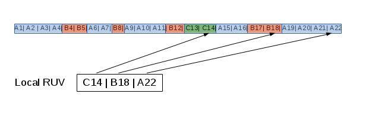

# Processing the replication changelog when sending updates
------------------



Overview
========

In a replication session the supplier contacts a consumer and determines if updates have to be sent and processes the local
replication changelog, determins which updates to send and sends the update to the consumer.

This document will detail the process in determining if and which chnages have to be sent and how the changelog is processed using a 
changelog buffer cache.

This document is written long time after implementation, so the basic algorithm is given already. The purpose of this document is to
investigate all potential scenarios and problems, so that the implementation can be verified against this design.

Basic Decisions in sending changes
==================================

## Are there changes to be sent

The first decision is if there are any changes to be sent at all.
The changelog is ordered by CSNs (change sequence numbers) and the database maintains information about known changes in a database RUV (replication update vector).
In a replication session the consumer presents the RUV of its own database and the changelog deals with two RUVs further called consumerRUV and localRUV.

The supplier compares the localRUV and the consumerRUV to determine if its changelog contains changes not yet seen by the consumer. There are several senarios which will
be detailled below.

## Where to start sending changes
In the process to determin if changes have to be sent it is also calculated which is the oldest CSN which is common between supplier and consumer, this determins the staring point for sending changes.

## Where to stop sending changes
The channeglog is ordered by csns and the replication protocol guarantees that for a specific replica ID only chnages newer than th ecsn in the localRUV will be received and inserted into the changelog.
So, principally, after determining the starting point all chnages could be sent until the end of the changelog is reached.
But the chnagelog contains all csns for all RID in one sorted order, although chnages for one RID only will be inserted after the localRUV-csn, they might be inserted behind the ruvCSN of another rid, and
could be missed in sending updates.

Therefor a "safe" stop csn is used for each RID beyond sending chnages will not be sent, they will be processed after the next iteration to determin the starting point.

## Which changes should be sent
Due to the fact that the starting point is determined by the RID with the oldest csn in common iterating thru the changelog from this starting point will also process chnages the consumer has aready seen. These changes can be skipped. Details on how to decide if a change can be skipped below

Are there changes to be sent
==============================

The following chapter examines all possible scenarios to compare localRUV and consumeRUV and the decision if changes have to be sent.

A typical situation for a localRUV is illustrated in fig.1

Each RUV contains a set of CSNs, each csn corresponds to a replicaID, so for each RUV a set of RIDs is defined: cRIDs,sRIDs, In Fig.1 the sRID is {A,B,C}

### The set of RIDs is identical on supplier and consumer

If the set of RIDS are identical, for each RID the localRUV-csn is compared to the consumerRUV-csn, and the following cases are distinguished.

1] for each RID the consumerCSN(rid) >= supplierCSN(rid) ==> nothing to send

2] there exists one (ore more) RID, where consumerCSN(rid) < supplierCSN(rid) ==> changes have to be sent

### The consumer RUV contains a RID the supplier doesn't know

If the supplier doesn't konw the RID it has no changes in its changelog for this RID and nothing to send. The deciosion if changes have to be sent is based only on the other RIDS.
The RID has to be ignored in calculating the starting point.

### The supplier RUV contains a RID the consumer doesn't know
The supplier has changes for this RID, changes have to be sent. The potential starting point for this RID is the smallest csn(RID) contained in the chnagelog.

### Mixed case

In a situation combining the above scenarios, the decision process is:

- ignore RID only containe in consumer
- if supplier containes RID not in consumerRUV ==> send changes
- apply procedure for the common set of RIDs

### Special case: RID of the consumer in the current replication session

If the consumer in the replication session is also a master its RID will be contained at least in the consumerRUV. If it is also in the supplier RUV the question is if it should be considered in the decision if updates should be sent. Normally a master has the latest changes applied to itself, so there would be no need to check and send updates for its RID. But there can be scenarios where this is not the case: if the consumer has been restored from an older backup the latest csn for its own RID might be older than changes available on other servers. 

    NOTE: The current implementation ignores anchorCSNs based on the consumer RID. If, by chance, the anchor csn used is older than this csn, the changes will be sent, but they also ca nbe lost.

 
Determining the starting point
==============================

In addition to the localRUV, which contains the maximum CSN known for each replica the minimum CSNs for each replica available in the changelog are maintained in a local 
minRUV. This is required to determine a starting point for RIDs the consumer has not yet seen.

During comparison of the loaclRUV and supplierRUV we calculate two sets of csns:

    csnMax := {consumerCSN(i): consumerCSN(i) < supplierCSN(i)}
    csnMin := {localMinCSN(i): i not in consumerRID }

    anchor1 = min(csnMax)
    anchor2 = min(csnMin)
    if anchor2 < anchor1 
       anchorCSN = anchor2
   else
       anchorCSN = NEXT(anchor1) # anchor1 is already known by the consumed

Where to stop sending updates
=============================

After determining the anchorCSN a changelog cache buffer (clcache) is loaded with records from the changelog starting at the anchorCSN. How many changes are loaded is dependent on
the size of the buffer and the size of the changes. 
While the changes in the buffer are processed the content of the changelog and the localRUV can change. For each rid it has to be avoided to send changes which could be ahead of changes inserted to the changelog. Therfore the current maxCSN in the localRUV is used to stop sending updates for this RID.

    NOTE 1: This should not happen, new changes should be only inserted after the local maxCSN for each RID, but the initial phase of loading a buffer consists of three steps:
     - calculate anchorcsn
     - save localRUV
     - load buffer
    These three steps are not atomic. While calculating the anchorcsn, storing the localRUV and positioning at the anchorcsn new changes can have been inserted into the cangelog. 

    NOTE 2: The current implementation recalculates anchorcsn and localRUV at each load_buffer iteration, and so the new anchor csn is calculated after the update of the localRUV copy. Only in the first iteration
    the original anchor csn is used and copy of localRUV is done afterwards. And there als can be a race condition.

Which changes should be sent or skipped
=======================================

## Changes already seen by the client

The staring point is determined by the smallest csn for a RID that the consumer has not yet seen, but it may be more advanced for other RIDS. Skip changes for csn with csn(i) <= consumerRUV(i)

## Changes greater stop csn

This was already discussed above, skip changes not covered by the localRUV copy 

## Changes for RIDs not in localRUV

At the point of sending chnages, the clcache could contain chnages for RIDs which weren not yet present in the initial phase of buffer loading. Do not sen these changes

What happens at buffer reload ?
===============================

When the buffer is loaded the basic calculations have been done based on the consumerRUV and the localRUV. The processing of the buffer takes care of deciding which updates had to be sent.
Once the buffer is processed and a new buffer is loaded potential changes have to be taken into account which require recalculation of the starting CSN.

The following condition holds:

the consumer is locked by the current replication session, it cannot be updated by any other master at the time so the current consumer state is determined by the original consumerRUV and the changes sent to the consumer, an updated coonsumerRUV can be maintained.

    NOTE: there is one exception: the consumer can receive direct updates so changes for the consumerRID are not known locally.

The localRUV might have changed by direct updates or by incoming rplication from other masters. The localRUV can have advanced for one or more RID it containe before the buffer processing and it can contain changes for RID(s) not known before.

There are many scenarios which need to be handled to properly determine the next anchorcsn.

    NOTE: QUESTION: wouldn't it be easier just to do the inital calculation again based on the new localRUV and updated consumerRUV than to handle the many cases of changes ??

What has to be done depends on the new localRUV compared to the localRUV before buffer processing, the updated consumerRUV and the current end of the buffer, the latest change sent: currentCSN.

### case 1: localRUV has not changed 

Continue with currentCSN as new anchorCSN

### case 2: localRUV has new RID with minCSN < currentCSN

Include minCSN in calculation of new anchorCSN

### case 3: localRUV has changed 

Distinguish cases depending on relative loaction of localRUV, prevLocalRUV, currentCSN, consumerRUV

