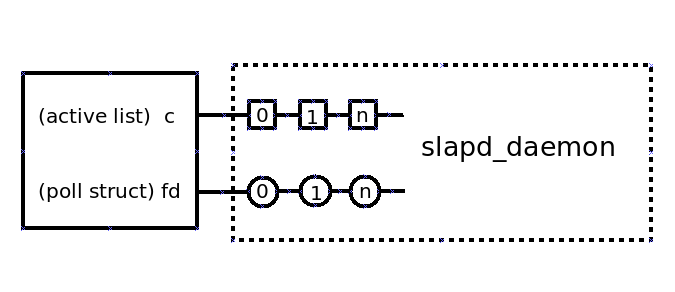
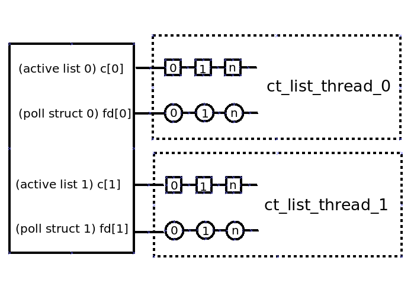

# Connection Table multi active list
------------------------------------



#Overview
---------

The connection table (CT) is fundamental to 389 DS connection management, it is used to prevent memory allocation latencies by pre-allocating memory for connections and also enables monitoring to gather statistics on active connections. Currently the slapd_daemon process spends a lot of cycles iterating over the CT, once to determine how many file descriptors are read ready and should be polled and then again to find connections that require processing. This becomes a bottleneck when the number of established connections is high. This work is an attempt to address this.

#Current implementation
-----------------------

	struct connection_table
	{
		int size; 
		Connection *c;
		Connection **c_freelist;
		size_t conn_next_offset;
		size_t conn_free_offset;
		struct POLL_STRUCT *fd;
		PRLock *table_mutex;
	};

- size - Number of connection slots in the CT.
- c - Double linked list of pre-allocated connections, slot 0 is always used as head of the linked list.
- c_freelist - Array of free connections references, awaiting allocation, 
- fd - Array of file descriptors, one for each active connection. Used when polling for conection activity. The first slot of the file descriptor array is used as a signal pipe. 

## A day in the life of a connection
To provide a better overview of how a connection is managed, here is a summary of a connection lifecycle and the interacting entities.

slapd_daemon
> 	Initialises the CT.
	Creates signal pipes for CT <-> thread signaling.
	Creates a number of connection operation threads, the op threads wait for a conditional variable which signals there is connection work that needs handling.
	Map the signal pipe to CT->fd[0].
	Creates a single accept thread, which polls listening ports for connection requests.
	Drops into an event loop.

accept_thread
>	On a successful connection request, the accept thread gets a free connection from the CT freelist and moves it to the CT active list, signals the daemon to bump it out of its select loop.

operation_thread
>	On startup, the op threads wait for a conditional variable which signals there is connection work that needs handling.

slapd_daemon
> Upon receiving a signal from the accept_thread, it iterates through the CT active list, checking for activity. On detection of activity, the daemon extracts the connection operation and adds it to  a work q, signalling the op threads of new work.

operation_thread
> When a signal is received from the daemon, informing the op thread of connection work that needs handling. It reads connection PDU, extracts the requested operation and dispatches it. When there is no more data to read, it terminates the connection.

## Connection processing
Logical view of connection management, note the slapd_daemon is responsible for managing all connections.

## Problem statement
Currently the connection table (CT) contains an array of established connections that are monitored for activity by a single process. As the number of established connections increase, so too does the overhead of monitoring these connections. The single process that monitors established connections for activity becomes a bottleneck, limiting the ability of the server to handle new connections. 

# Proposed implementation
-------------------------
A solution to this problem is to segment the CT into smaller portions, with each portion having a dedicated thread to monitor its connections. Rather than divide the CT into multiple smaller CT's, the approach taken was to add multiple active lists to the CT, where each active list would have its own dedicated thread.

Here is the updated CT struct, showing only modified or new members.

	struct connection_table
	{
		...
		int list_size;
		int list_num;
		int list_select; 
		Connection **c;
		...
		...
		...
		struct POLL_STRUCT **fd;
		....
	};

- list_size - number of elements in each CT list
- list_num - number of CT lists
- list_select - used to evenly share the connection load between lists.
- c - 2d array of connection references. Slot 0 of each list is used as head of the linked list.
- fd - 2d array of file descriptors, one for each active connection. Used when polling for conection activity. The first slot of each file descriptor array is used as a signal pipe, for ct_list_thread <-> accept_thread signaling.  

## Connection processing
Here is a logical view of connection management, note the slapd_daemon is responsible for managing all connections.

## Considerations
### Load balancing
With multiple CT lists, the connection load needs to be spread equally balanced lists. A simple counter (list_select) is used for this, as a connection is moved from the freelist to an active list, the CT is queried to determine which CT list will be used.

### Signaling
A signal pipe is used for thread <-> CT communications, with this change each CT list/thread pair will need a signal pipe for communications.

### Number of CT threads
With this change, each CT list will have its own dedicated thread. As the number of CT lists/threads increase so too does the systemic overhead of handling such. Multiple numbers of CT lists were tested, with two CT lists being the optimum. This value is hardcoded and used during CT creation.

## Opens
### slapd_daemon loop
Currently the daemon is responsible for managing the single CT list connections. With multiple CT lists and a dedicated thread managing each CT list, this work has been moved from the daemon to the CT list threads. Resulting in a daemon select loop that doesnt do anything.

## Benefit
- With a single thread monitoring each CT active list, connections can be monitored in parallel, reducing the bottleneck mentioned above.
- Instead of a single CT list containing all established connections, there will be two lists that share the total number of established connections between them, reducing the size of each CT active list.
- Initial testing show an increase of ~20% when using the number of connections per second the server can handle as a metric.

Configuration options
---------------------

There are no configuration options for this change.

Replication
-----------

There will be no impact to replication functionality.

External Impact
---------------

There will be no impact to other components.

Origin
------

https://github.com/389ds/389-ds-base/issues/4812

Author
------

<jachapma@redhat.com>

Acknowledgments
---------------
<tbordaz@redhat.com>  
<progier@redhat.com>  
<firstyear@redhat.com>  
