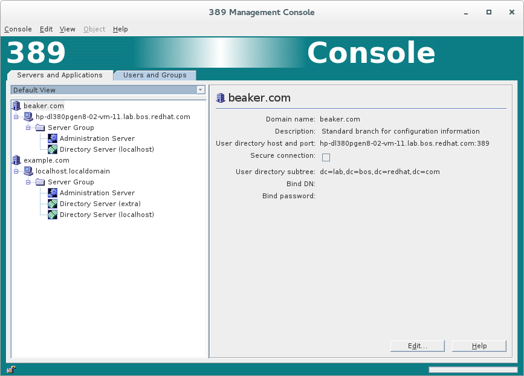

# register-ds-admin.pl and Remote Servers
----------------



Overview
--------

Previous versions of *register-ds-admin.pl* only allowed you to register local Directory Servers with an Admin Server/Configuration Server.  New to 389-admin-1.1.36, you can now register with remote servers.  In order to register with, or to, a remote server, both systems need to have an Admin Server installed that is registered with its local Directory Server configuration instance.  The configuration instance is the one that contains the "*o=netscaperoot*" suffix.

Additionally the "silent" install/mode for those script was not fully implemented.  The new script can now be run completely without being prompted for data using an "**.inf**" file.

Use Cases
---------

Allowing remote servers to be registered with the Configuration Server will allow a single Admin Server/Console to manage all the Directory/Admin Servers in your network.  There is no longer a need to login into a separate Admin Server/Console for individual systems.  This makes managing a large deployment much easier, and centralized.

Design
------

### Remote Registration

Remote 389 deployments can now be registered with a local configuration server, or a local server can be registered on a remote configuration server.  It is important to note, all the systems involved must have an Admin Server installed, along with a configuration Directory Server instance.  If running the script on a system where an Admin Server is not yet installed, the script will create the admin server, and register it with a local Directory Server instance.  However, the script can not remotely install an Admin Server - so any remote system must always have a Admin Server installed.

Here is a image showing two separate systems being managed under one Admin Server

### Silent Mode

The script can now be run in "*silent*" mode using an "**.inf**" file.  There are two types of registration processes to consider.  One, registering a local Directory Server instance with a local Admin Server.  Two, registering with, or to, a remote server.  If you are just doing a local registration, you only need the "**General**" and "**admin**" directive sections.  If just registering with, or to, a remote server, you only need the "**register**" directive section (this option assumes there is already a local Admin Server installed).  Here is an example of an "**.inf**" file:

*register.inf*

    [General]
    FullMachineName= localhost.localdomain
    SuiteSpotUserID= nobody
    SuiteSpotGroup= nobody
    AdminDomain= example.com
    ConfigDirectoryAdminID= admin
    ConfigDirectoryAdminPwd= password
    ConfigDirectoryLdapURL= ldap://localhost.localdomain:389/o=NetscapeRoot

    [admin]
    Port= 9830
    ServerIpAddress= 127.0.0.1
    ServerAdminID= admin
    ServerAdminPwd= password

    [register]
    configinst= slapd-localhost::cn=directory manager::password
    instance= slapd-extra::cn=directory manager::password
    remotehost= hp-dl380pgen8-02-vm-11.lab.bos.redhat.com
    remoteport= 636
    localcertdir= /etc/dirsrv/slapd-localhost
    remotebinddn= cn=directory manager
    remotebindpw= password
    admindomain= beaker.com
    admindn= uid=admin,ou=Administrators,ou=TopologyManagement,o=NetscapeRoot
    adminpw= password
    destination= remote

Here is a detailed explanation of the parameters in the "**register**" directive section:

-   **configinst** = The local configuration server instance, or the instance you want to become the local configuration instance.  The value is always in the form "slapd-*INSTANCE*", as found in the **/etc/dirsrv/** directory.
-   **instance** = Optional parameter.  Specifies additional Directory Server instances to register with the configuration instance.  This paramrter is multivalued, so you can register as many local instances as you like.
-   **remotehost** = The remote host to which we are registering to, or with.
-   **remoteport** = The remote host's port/secure port.
-   **remotebinddn** = The bind DN used to authenticate to the remote server.  The root DN, or "*cn=directory manager*", is the preferred account.
-   **remotebindpw** = The password for the remotebinddn.
-   **localcertdir** = Optional parameter.  Specifies the the certificate database directory.  This is the directory where the cert8.db and key3.db files exist.  This is usually the Directory Server configuration directory:  **/etc/dirsrv/slapd-INSTANCE**
-   **admindomain** = This is the Admin Domain for the server that is being registered.  If registering the local server to the remote server, it would be the domain from the local server.  If registering a remote server to the local configuration server, it would be the Admin Domain from the remote server.
-   **admindn** = This is the local configuration Administrator's entry.
-   **adminpw** = The local configuration Administrators password.
-   **destination** = This is either set to "**local**" or "**remote**".  If "*local*", we registering the remote server with the local server.  If "*remote*", we are registering the local server with the remote configuration server.

Implementation
--------------

The Admin Server must be installed on all the systems involved.

Major configuration options and enablement
------------------------------------------

None

Replication
-----------

None

Updates and Upgrades
--------------------

None

Dependencies
------------

None

External Impact
---------------

None

Author
------

<mreynolds@redhat.com>

