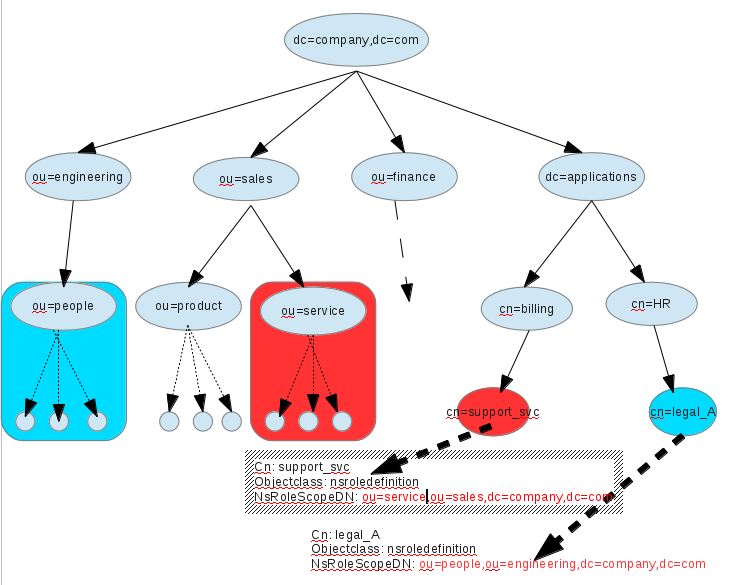

# Creation of an explicit scoping for the roles (ticket 208)
----------------------------------------------------



Overview
--------

Roles are used as an alternate of static groups. A role is a multivalued virtual attribute (named "nsrole"), generated in each entry. The values are the DN of the roles that the entry is member of. A limitation of the application using the role mechanism is that the scope of a role is the subtree where the role is defined. For example, a role *cn=role\_rhds\_dev,ou=engineering,dc=redhat,dc=com*, will apply on all entries under *ou=engineering,dc=redhat,dc=com*. It exists three types of roles (managed, filtered and nested) and all of them have this limitation.

The purpose of this RFE is to provide an optional role definition attribute 'nsRoleScopeDN' that allows a role to apply to a specified subtree of the DIT.

The following limitations applies for this RFE

-   Role definition and role scope must be in the same suffix. The reason of this limitation is that role cache is organized per suffix. To suppress this limitation, it would require important changes and likely performance hit.
-   'nsRoleScopeDN' is singled valued attribute. Meaning that a role applies only to one subtree (like it is now). It would be not so complex to support multi values but may have performance hit and the interest of being multivalued is not clear.

Uses cases
----------

Quite often, applications and their configurations are deployed in a DIT subtree separated from DIT subtree where are stored the entries. For applications using roles, this is not possible. Usually role definitions are stored at the top of the tree of the entries, but if a role needs to apply to a specific subtree in the tree of the entries then roles definitions are mixed with the entries.

The use case is to allow role definitions to be stored in a subtree not holding the entries. In the following figure, the role *cn=support\_svc* is defined under *cn=billing,cn=application,dc=company,dc=com*, the attribute 'nsRoleScopeDN' makes this role definition to apply on the entries in the subtree *ou=service,ou=sales,dc=company,dc=com* instead of *cn=billing,cn=application,dc=company,dc=com*.

Design
------

A role is a multi valued virtual attribute that is evaluated

-   during aci evaluation, when the bind rule contains *roledn* (with 'role\_check' callback)
-   search operation, when the filter contains *roledn* virtual attribute
-   search operation, when the virtual attribute *roledn* is requested

The roles definitions are uploaded in memory (in a so called *role cache* [roles\_list]) and organized per suffix. In order to determine the roles that an entry belongs to

1.  The role cache of the suffix (where the entry is) is selected
2.  Each roles (from that cache) being in the same subtree of the entry is selected
3.  The subset of roles is evaluated (filter, nsroledn, nested) against the entry

In order to trigger the role scoping, administrator needs to add **nsRoleScopeDN** attribute in the role definition. The following changes are required:

-   A role definition contains a new field (Slapi\_DN \*)**rolescopedn**.
-   During building of the role cache, if a role definition contains 'nsRoleScopeDN' and the role\_DN/nsRoleScopeDN are in the same suffix. The field **rolescopeDN** of the role definition is set.
-   During role selection (step 2), if **rolescopedn** field is defined, uses its value to determine if the entry is in the subtree. Else uses the value of 'dn' field (role DN).
-   For step 3, the rolescopedn/dn are not used for the evaluation =\> no change
-   Add the attribute 'nsRoleScopeDN' in the schema

    ( 2.16.840.1.113730.3.2.93 NAME 'nsRoleDefinition' DESC 'Netscape defined objectclass' SUP ldapSubEntry MAY ( description $ nsRoleScopeDN ) X-ORIGIN 'Netscape Directory Server' )
    ( 2.16.840.1.113730.3.1.1101 NAME 'nsRoleScopeDN' DESC 'Scope of a role' SYNTAX 1.3.6.1.4.1.1466.115.121.1.12 SINGLE-VALUE X-ORIGIN '389 Directory Server' )

Implementation
--------------

N/A

Major configuration options and enablement
------------------------------------------

There is not impact at the configuration level as the new attribute is stored directly in the entries (roles definition).

There is a change of schema in 02common.ldif, where the others roles related attributes (nsrole, nsroledn and nsrolefilter) are defined (see Design)

In order to enable role scope, the role definition contains the 'nsRoleScopeDN' (optional) attribute like:

    dn: cn=managed_scope,ou=scope_roles,dc=com
    objectClass: top
    objectClass: LDAPsubentry
    objectClass: nsRoleDefinition
    objectClass: nsSimpleRoleDefinition
    objectClass: nsManagedRoleDefinition
    cn: managed_scope
    nsRoleScopeDN: ou=entries,dc=com
    description: managed role on scope ou=entries,dc=com

    dn: cn=filtered_role_scope,ou=scope_roles,dc=com
    objectClass: top
    objectClass: LDAPsubentry
    objectClass: nsRoleDefinition
    objectClass: nscomplexroledefinition
    objectClass: nsfilteredroledefinition
    cn: filtered_role_scope
    nsRoleFilter: (telephonenumber=222)
    nsRoleScopeDN: ou=entries,dc=com
    description: filtered role on scope ou=entries,dc=com
    dn: cn=nested,ou=scope_roles,dc=com
    objectClass: top
    objectClass: LDAPsubentry
    objectClass: nsRoleDefinition
    objectClass: nscomplexroledefinition
    objectClass: nsNestedRoleDefinition
    cn: nested
    nsRoleScopeDN: ou=entries,dc=com
    nsRoleDN: cn=filtered_role_scope,ou=scope_roles,dc=com
    nsRoleDN: cn=managed_scope,ou=scope_roles,dc=com
    description: nested role on scope ou=entries,dc=com

Replication
-----------

A replication session starts with schema replication. So the definition of the attribute 'nsRoleScopeDN' will be propagated on consumers schema.

A role definition entry containing 'nsRoleScopeDN' attribute, will be replicated as any others entries. Once schema and role definition have been replicated, they can be updated on the replica because the entry conforms the schema.

The role scoping mechanism will not been enforced on replicas installed with older version. When parsing the role definition, old version of directory will keep this attribute but it will not be used to trigger any scoping. If a customer wants to use role scoping on a full replication topology, all replicas must be installed with a version that support [RFE Role scoping](https://fedorahosted.org/389/ticket/208)

Updates and Upgrades
--------------------

Update or upgrade will push the schema change, adding these definitions in 02common.ldif

    ( 2.16.840.1.113730.3.2.93 NAME 'nsRoleDefinition' DESC 'Netscape defined objectclass' SUP ldapSubEntry MAY ( description $ nsRoleScopeDN ) X-ORIGIN 'Netscape Directory Server' )
    ( 2.16.840.1.113730.3.1.1101 NAME 'nsRoleScopeDN' DESC 'Scope of a role' SYNTAX 1.3.6.1.4.1.1466.115.121.1.12 SINGLE-VALUE X-ORIGIN '389 Directory Server' )

Note: this schema update also occurs with a replication session

When a Directory Server not supporting [RFE Role scoping](https://fedorahosted.org/389/ticket/208) is updated/upgraded to a version implementing that RFE

-   If it contains role definitions with the new attribute *nsRoleScopeDN* (and the related schema update), then the role scoping will be enabled immediately after the restart. So the behavior of that Server regarding existing roles will change after update/upgrade.
-   If it does not contain role definition with *nsRoleScopeDN*, then the behavior of that Server regarding existing roles will not change after update/upgrade

Dependencies
------------

N/A

External Impact
---------------

The attribute name **nsRoleScopeDN** is defined in the Sun Microsystems patent (http://www.google.com/patents/US7194472). Can it be used in that RFE ?
