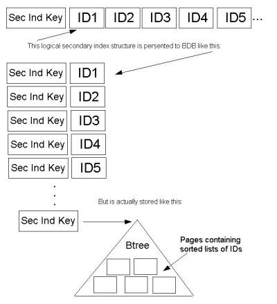

# Database Architecture
-----------------------



#### Overview

Fedora Directory Server is implemented on top of the popular, open source database software, Sleepycat Berkeley DB. From the various access methods Berkeley DB provides, Fedora Directory Server uses Btree for the primary and the secondary index files as well as for the replication change log. Recno access method is used for the virtual list view (VLV) index. By creating VLV index, users can retrieve ranged search results with the efficient manner.

## Indexing
--------

### Index Structure

Primary index file stores the entry ID and the entry as a key - value pair in the Btree. Secondary index file does the attribute value and a set of entry IDs associated with the attribute value as a key - value pair. The entry ID set is called ID List (IDL). Internally, the list is stored in the nested Btree using the Berkeley DB feature 'sorted duplicated keys'. This implementation allows the Directory Server to have the fast search and the fast update at the same time. Before this functionality was available in the Berkeley DB, IDL was stored as an array of sorted IDL. When the list got longer, the cost to recreate the list became very expensive. Also, we had to set the limit to the length of the array for the performance reason. The limit was called allids threshold. Choosing the right value for allids threshold was a very difficult problem for tuning the Directory Server. But the Directory Server is now free from the problem. The Following diagram illustrates how IDL is stored in the secondary index file.

### Support for Virtual List View

VLV is also called "browsing index." On the Directory Console, choose Directory Tab and display entries in a suffix. If you have thousands of entries, scroll might take a while. On the suffix, by clicking right button, you could choose "Create Browsing index". After creating the browsing index, scroll should be much faster. To configure VLV index, filters and sort keys are required. When created, the VLV index stores the filtered attribute values in the sorted order. Mozilla LDAPSDK ldapsearch command provides options to use VLV index on the Directory Server.

Using command line tool dbscan in the Directory Server, you can explore the inside of the index files. Here are some examples.

This command line shows ID List for the substring key "\*tch" in the secondary index file mail.db4, which stores the index of the attribute mail.

` dbscan -k *tch -r -f mail.db4`
`   *tch`
`     177 383 402 419 421 483 782 953`

Following command line shows the entry which ID is 177. You can see the attribute value of mail contains the substring "tch".

` dbscan -K 177 -f id2entry.db4`
` id 177`
`   dn: uid=DJindal170, ou=Human Resources, dc=example,dc=com`
`   objectClass: top`
`   objectClass: person`
`   objectClass: organizationalPerson`
`   objectClass: inetOrgPerson`
`   cn: Dutch Jindal`
`   sn: Jindal`
`   uid: DJindal170`
`   givenName: Dutch`
`   mail: Dutch_Jindal@example.com`
`   userPassword: {SSHA}8O95ySFViTnpdYo+7nEjFFiZo9UOPlEAaxO+0Q==`

Following command line shows the first two data in the VLV index file.

` dbscan -r -f vlv#bymccouproductdevelopmentdcredhatdccom.db4`
` aaron%20hunsucker%00aaron%FFproduct%20developmenthunsucker%FD%0E%00`
`   1`
` abby%20stampfl%00abby%FFproduct%20developmentstampfl%A0%11%00`
`   2`
`   [...]`

### Bulk Load

To import data into the Directory Server, both a standalone command line tool ldif2db and a task based interface are available. The task based interface could be accessed via Directory Console and LDAPSDK command line tool ldapmodify (see the perl script ldif2db.pl in slapd-<ID> for the usage). Using the task based interface method, the Directory Server is not necessary to be shutdown. Just the backend instance being imported is disabled to the users. When import is finished, it is automatically enabled back. Internally, it launches a producer thread to read in the input LDIF files and worker threads for each index, which generate index files simultaneously. There is another performance improvement built in in import. The rate of the index generation is monitored by the monitor thread. When the import takes long and the progress rate drops suddenly and/or the cache hit ratio becomes low, worker threads go to the next pass and generate another set of index files. At the end of the import, the index files are merged into one for each indexed attribute.

### Replica Initialization

When starting replication, replica initialization is required to synchronize the consumers with the supplier. There are multiple choices to complete the replica initialization. One way is generating a ldif file of the supplier server's instance, then import it to the consumers. Another way is doing it on-line: using the above bulk load mechanism except passing the entries from the supplier over the wire. The third one is called supplier-Replica Cloning. This method utilizes the Berkeley DB's backup/restore functionality. First, the supplier Directory Server is backed up with the db2bak(.pl) command line tool or with the back up task on the Directory Console, then the backed up files are restored using the bak2db command line utility with specifying the replicated, backend instance name [ -n backendname ]. This operation allows to clone just the replicated backend without disturbing the rest of the backends on the consumer, if any.

