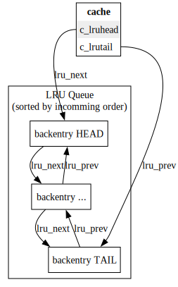
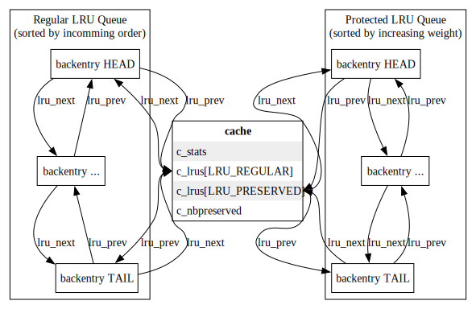

# Improving the entry cache eviction

## Why changing things ?

Computing the acl involving large groups is costly. So we had better keep them in the acl cache. Some of the reason are:

- creating acl cache for large group is costly a group is evicted out of the acl if its entry pointer changed. (i.e that the group was removed from the entry cache then reloaded)

- If values are not already sorted, the time spent to sort the membership values is significant.

A way to improvie thing is to try to keep the large group entries in the entry cache as long as possible.

## Original LRU algorithm

The LRU is handled through a single doubly linked list (null terminated) anchored in the cache struct

- Newly added entries are added at the head of the list
- Entries get evicted, startingfrom the tail of the queue until the queue resources respect the configured number of entries and/or memory size

## New LRU algorithm

Because neither simply skipping the entry to preserve nor using a temporary array provided reliable results,
the implemented version finally implements 2 queues (doubly linked circular list with an immutable anchor element in the cache struct:

`struct backcommon c\_lrus[LRU\_REGULAR]
 struct backcommon c\_lrus[LRU\_PRESERVED]`

The regular queue is handled similarly to the orinal one:

- Newly added entries are added at the head of the list
- Entries get evicted from the tail of the queue until the queue resources respect the configured number of entries and/or memory size
- The preserved queue is ordered by increasing entry weight and the weight of its head element is higher of equal than any elements of the regular queue

The LRU eviction algorithm is:

- Remove extra entries in preserved list (occur the number of preserved configurable limit decreased) and put them back at head of the regular list.
- Walk the Regular list to evict entries as it was origionally done
- while cache is still full, evict first entry from preserved list and merge it to the evicted entries list
- detach the evicted entries list (and transform it to a NULL terminated list)

Code is a bit more complex than what I hoped because we have to determine in which queue an entry must be added and removed and we must also propagate the cache type when addind/removing the entries (because we cannot access the weight in the backdn)

- entry is added in PRESERVED queue (at the right position so that the list is sorted by increasing weight):

  - if there is an avaliable slot and the entry has a non zero weight

  - its weight is higher than the first entry in the preserved list (in this case the first entry in preserved list is put back in the head or the regular queue)
    else entry is added in REGULAR queue

- Entry is removed from PRESERVED queue

  - if the number of preserved entries is > 0 and the entry weight is higher than first preserved entry

  - if the weight are the same then the preserved list is walked to determine if the entry to remove belong to that list or not

## Other remarks

Should we propagate the time from old entry to new entry in cache\_replace ?
It is a bit inaccurate (especillay if lots of values are added/removed) but it still better than nothing. Usually only a fezw members are added/deleted from a large group and propagating its weight would avoid to have to recompute it twice

## New config parameters

New parameters in the backend config entry

| Parameter                       | Type         | Default value | Description                                                                                                               |
|:------------------------------- |:------------ |:------------- |:------------------------------------------------------------------------------------------------------------------------- |
| nsslapd-cache-preserved-entries | Integer >= 0 | 10            | Number of entries that are preserved from eviction                                                                        |
| nsslapd-cache-debug-pattern     | String       | NULL          | Debug feature allowing to log INFO message when an entry whose dn matches the value is added/removed from the entry cache |

## Internal Data changes

| Struct         | field name                | Description                                                                                                                                                             |
|:-------------- |:------------------------- |:----------------------------------------------------------------------------------------------------------------------------------------------------------------------- |
| backentry      | ep\_weight                | Entry weight (load time in microseconds)                                                                                                                                |
| cache          | c\_stats(\*)              | cache\_stats statistics                                                                                                                                                 |
| cache          | c\_lrus[2]                | LRU queues anchor                                                                                                                                                       |
| cache          | c\_inst                   | ldbm\_instance struct (to access the config parameters)                                                                                                                 |
| ldbm\_instance | cache\_preserved\_entries | number of entries to preserve                                                                                                                                           |
| ldbm\_instance | cache\_debug\_pattern     | nsslapd-cache-debug-pattern  value (may be NULL): Regular expression used to log INFO messages in error log when adding/removing entries in cache (if their dn matches) |
| ldbm\_instance | cache\_debug\_re          | Compiled version of cache\_debug\_pattern                                                                                                                               |

(\*) All statistics fields of struct cache are moved in new cache\_stats struct

(\*\*) Using the generic word **weight** instead of loadingtime because its meaning may change

#### Entry Cache statistics

 struct cache_stats

| Field               | Description                               |
| ------------------- | ----------------------------------------- |
| uint64\_t hits      | for analysis of hits/misses               |
| uint64\_t tries     | for analysis of hits/misses               |
| uint64\_t nentries  | current \# entries in cache               |
| int64\_t maxentries | max entries allowed (-1: no limit)        |
| uint64\_t size      | current size in bytes                     |
| uint64\_t maxsize   | max size in bytes                         |
| uint64\_t weight    | Total weight of all entries               |
| uint64\_t nehw      | current \# entries having weight in cache |

## Impacted functions

Time is get using: clock\_gettime(CLOCK\_MONOTONIC, struct timespec \*tp)

| Function                                                                 | Impact                                                                                                                                                                                                                                                                                                                                                                                               |
|:------------------------------------------------------------------------ |:---------------------------------------------------------------------------------------------------------------------------------------------------------------------------------------------------------------------------------------------------------------------------------------------------------------------------------------------------------------------------------------------------- |
| id2entry                                                                 | compute time difference from start of function until the CACHE\_ADD callend of function and store it in the returned back-entry                                                                                                                                                                                                                                                                      |
| uint64\_t get\_time\_delta(struct timespec \* starttime, int multiplier) |                                                                                                                                                                                                                                                                                                                                                                                                      |
| entrycache\_add\_int                                                     | Add entry weight to cache total weight                                                                                                                                                                                                                                                                                                                                                               |
| entrycache\_replace                                                      | Propagate old entry weight to new entry                                                                                                                                                                                                                                                                                                                                                              |
| entrycache\_remove\_int                                                  | Remove entry weight to cache total weight                                                                                                                                                                                                                                                                                                                                                            |
| entrycache\_flush                                                        | Although the algorithm principle is the same, the function must be rewritten because the queue handling is different. Entries whose weight is above the limit are not removed so the invariant that all entries after the current one are removed from the cache is no longer true. Removed entries are now unlink from the lru queue and added in a freelist queue (that is returned to the caller) |
| cache\_init                                                              | should store the ldbminfo in the cache to retrieve the config parameter                                                                                                                                                                                                                                                                                                                              |

Note: much more functions are imapcted in third version to beable to handle the two queues typically lru_delete/lru_add and the functions that call them

## Other impacts

Should improve the debug log and monitored data.

### debug log

* Adding the entry weight and cache average weight in existing debug messages
* On the other hand enabling these logs tends to defeat the feature because the time to log the messages is accounted for in the entry weight (so it flatten the result … ).
  But we definitely need some logs to test the feature.
  Will see if we can add a new parameters to log less data.
  Typically a regular expression to log the entry whose dn match when adding/removing them from the entry cache so we can know when group whose dn follow some pattern are loaded/unloaded from the cache

### monitoring

* Adding average load time (in microseconds) in cn=monitor,...
* Group cache monitored statistics in a struct

### Using a compsite weight

The test showed that when testing with 6K members groups the noise created by the CPU context switch was high enough so that some large group still got evicted.
I finanly ends up with a composite weight:
weight = elapsed_time * mulpiplier
multipler = log²(elapsed_time) if is greater than 9 else it is 1

With such weight, the test is now passing systematically.

## Alternatives

### Alternatives rejected after testing them

These alternatives have been implemented and rejected because of the tests results:

#### LRU eviction algorithm version 1

##### Implementation

Entry weight is the elapsed time (in microseconds) while loading the entry in the cache.
Have a configurable factor
While evicting the entries from the cache keep all entry whose loading time is higher than the configurable factor multiplied by the average loading time. (The idea behind that is that if the entry is long to load we want to try to keep it)
We can store (in the backentry) the time needed to compute an entry when reading it if not in the cache (and probably also when adding it in the cache too)
(Simply by getting current time when getting the original backentry then just before replacing it.) and compute statistics like the average time (by keeping the number of entry (which is already done) and the total time of all the entries that are in the cache) and determine a threshold (tunable ?) about when we keep an entry in the cache
IMHO a 100 or 1000 factor will do .
Comparing average time to entry time has an advantage: big group entries get naturally evicted if too many of them are in the cache (because in such case, the average building time will then increase until some of the protected entry are no more protected from eviction)

##### Rejection cause:

But after the first tests I discovered that it is pretty hard to determine the right value for the threshold to get reliable results. The value is between 1.2 and 1.5

#### LRU eviction algorithm version 2

##### Implementation

While evicting the entries:

- build an array of preserved entries.

  - Taking the first n entries in LRU queue walking the LRU queue from its head.
  - Sorting them

- while walking the entry to evict (stating from the queue tail):

  - insert the costly entry in the array if neeeded.
    At the end put back the remainding entries in the head of LRU (which tend to sort the LRU queue by putting the hight weight around the head (and avoid trying to evict them)

    ##### Rejection reason

    Behavior is more predictable than first version but moving the entries has some drawback:

- some entries that should be eveicted are no more evicted (i.e in practice more than n entries get preserved

  #### Weight computation version 1

  ##### Implementation

  My first trials were done using the elapsed time while loading the entry in micro seconds as weight

  ##### Rejection reason

  Noise caused by the cpu context switch makes too many regular entry having higher load time than the large groups

  ### Alternatives considered but rejected

  Some other alternatives has been rejected without being impmlemented

  ##### Use a flag instead of a weight

  ##### Implementation

  Having a flag for large groups in the backentry and simply skip them.

  ##### Rejection reason

  Cannot prioritize which group will be preserved (between two large groups) and could get in trouble if there are two many large groups. (no more spaces for regular entries)

  #### Using getrusage instead of clock_gettime

  ##### Implementation

  Using getrusage(RUSAGE\_THREAD, \&usage) instead of clock\_gettime

  ##### Rejection reason

  Although it provides more accurate data and limit the cpu context switch noise, getrusage is 10 times more costly than clock\_gettime.

  #### Using weight variance to decide if evicting the entry

  ##### Implementation

  checking if w \> a+y\*v would allow to preserve x% of the entries

  ##### Rejection reason

  it seems an overhead especially since we need to compute a square root to do that. maybe checking w2 \> a2\+y\*v2 will do something but I am not convinced

  #### Using number of members as weight

  ##### Implementation

  Use the number of members as weight instead of the loading time.

  ##### Rejection reason

  We may perhaps also preserve some other complex entries
