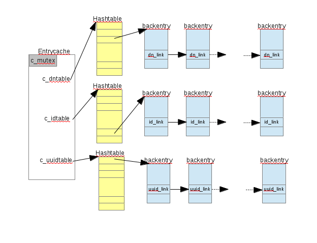
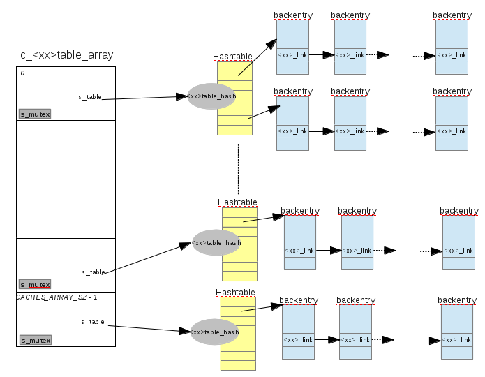
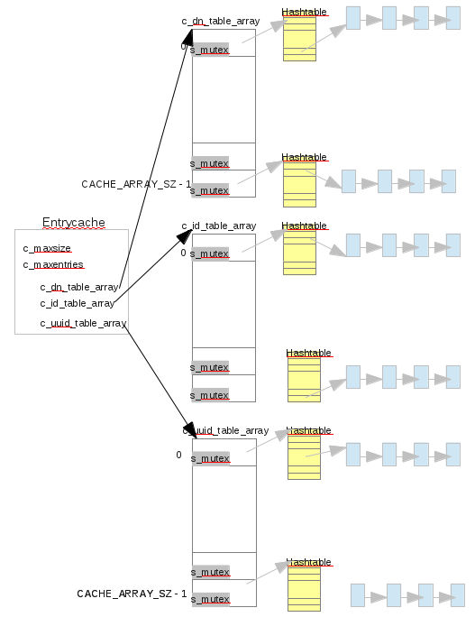

# High contention on entry cache lock
------------------------------------------------

Being tracked via Ticket 614
 
This ticket is not a RFE, but to address the contention the amount of investigated changes would benefit of a short design



## Overview
--------

Directory Server is holding entries and allows ldap clients to access them in read and write. The entries are stored permanently in database files, but to manipulate a given entry DS creates an in memory data structure storing that entry. The set of in memory entries are known as **'entry cache**'. The entry cache keeps entries currently being read/write but also those that were previously accessed. To limit the memory footprint of the entry cache, some entries no longer accessed are removed from the entry cache.

**Current implementation of the entrycache**

           The entry cache is composed of 3 hash tables: DNtable, IDtable and UUIDtable.    
           An entry added into the entry cache is added in those 3 tables. If we need to retrieve the entry    
                   - from its DN => DNtable    
                   - from its entryID (BDB id) => IDtable    
                   - from its uuid => UUIDtable    
           When an entry is to be used (find from one of the tables), its refcnt > 0.    
           When an entry is no longer used (returned), it remains in tables but its refcnt==0.     
           In that case it is added  into a LRU linked list.    
           If an entry that was no long used, is used again, its refcnt>0 and it is removed from LRU linked list.    
           So we have: refcnt==0 <=> in LRU.    

           When an entry becomes invalid (deleted, replace), it is removed from all these tables (DNtable, IDtable, UUIDtable).    
           Its refcnt==0 so it is in LRU list.    

           The entry cache has a configuration maxsize/maxentries attribute.    
           To limit the memory consumption of the entry cache, DS detects if the threshold is reached.    
           DS checks the threshold when    
                   - adding an entry in the cache     
                   - adding an entry in the LRU    
           When threshold is reached the thread adding the entry builds a list of entry to free.    

           The tables (DNtable, IDtable, UUIDtable) and LRU are protected by a global lock (c_mutex) at the entry cache level.    
           Each thread wanting to add/delete/return an entry could be in contention with an other thread doing the same task.    
           The thread that detects maxsize/maxentries is reached has a penalty of building the list of entry to free. This is    
           done while it holds the entry cache lock and could increase the contention.    

**Proposed implementation**

           The contention comes from the uniq lock (c_mutex) that the threads are all trying to acquire.    
           This is because if you need to add/delete/replace the tables (DN,ID,UUID) are protected by that specific lock.    
           To reduce contention, those tables will be split in several pieces. Each of them protected by its specific lock.    
           The number of pieces (sub table) is fixed at startup.    
           The advantage is that it reduces the probability that two threads wanting to access the same table.    
           The drawback is that instead of acquiring a single lock to do all the job, the thread will need to acquire several    
           of them (1 or 3 or 6).    

           In addition to contention, the thread adding an entry in the cache/LRU may become responsible of creating a list    
           of entry to free. It slowdown the thread from it own operation processing and increase the risk of contention (as it    
           holds the lock).    
           To reduce this, threads will not be responsible of checking the cache size.    
           A dedicated cleaning thread will run periodically to enforce this size limit.    
           The advantage is that worker threads will be faster and reduce the amount of time it holds the lock.    
           The disadvantage is that the configured limit will not be strictly enforce.    

Use cases
---------

Any kind of ldap operations trigger the use of the Entry cache. Indexed search use IDtable, replication UUIDTable, search/mod DNtable. Add/Delete/modDN/modrdn will use all the tables. changing maxentries/maxsize, should trigger LRU activity.
The best benefit of this feature should be obtained if all entries are cached in the entry cache.

Design
------

### Split existing tables

The following figures show the transformation of the existing entry cache into the new one. The first figure shows the current entry cache implementation. It has a unique lock 'c\_mutex' that controls the access to all the 3 tables. Each table refers to a single hash table where all the backentry are linked. They are linked in the backentry structure with a dedicated field related to the table itself (e.g. ep\_dn\_link for DNtable, ep\_id\_link for IDtable..)

The following figure shows a fixed size array. Each slot of the array refers to its own hash table. This is the same hash table used in the current implementation. Note that the lock mechanism is now at the slot level rather than at the full table level. So if a backentry has to go into the hash table of the slot **2**, only slot **2** is acquired.

The full picture of the new entry cache is the following. The array described above replace what was the hash table. This extra level of indirection allows to have several (slots number) locks for each table. The maxentries/maxsize are managed at the entrycache level. The hits/tries are managed at the slot level (in an array). The cursize and curentries are managed differently. They are defined at the slot level but are only managed in one table, actually **DNtable**. In fact a same entry is referenced in the 3 tables (in likely different slots), but its accounting (\#entry and amount of memory it consumes) should be accounted only once.

### Locking consideration

The new implementation, splits the tables and the locks. This makes the locking scheme more complex and expensive for a single thread, with the hope that it will reduce contention for the complete set of threads.
To guarantee the coherency of those tables, we replace a global lock by

-   holding all the slots locks involved in an operation
-   acquiring the slots locks in a strict order to prevent deadlocks

Locking scheme per cache action and cost of this scheme:

-   For a find (cache\_find\_id, cache\_find\_dn or cache\_find\_uuid), we need to compute the slot (of the specified table) where the entry is, then lock the slot and retrieve it.
    -   If the entry is not in the cache, we are done and it cost 1 lock
    -   If the entry is in the cache, then we need to acquire all the slots (in DNtable, IDtable,UUIDtable) to update the refcnt and LRU. Then it costs 3 locks
-   For a CACHE\_REMOVE, CACHE\_RETURN, CACHE\_ADD and cache\_lock\_entry we need to acquire all the slots (in DNtable, IDtable and UUIDtable) to update the entry. In case of CACHE\_RETURN it is also required to update the LRU. So in those cases it costs 3 locks
-   For CACHE\_REPLACE we need to acquire all the slots (in DNtable, IDtable and UUIDtable) of the source entry **AND** all the slots of the target entry. So in case of MODRDN and DEL (because of tombstone) it costs 6 locks.

 When only a source entry is involved locking strategy is to lock in the following order (and unlock in the opposite order)

-   DNtable slot
-   IDtable slot
-   UUIDtable slot

When there is a source and target entries involved, the locking strategy is to lock in the following order (and unlock in the opposite order)

-   DNtable smallest slot (of source and target) then largest slot
-   IDtable smallest slot (of source and target) then largest slot
-   UUIDtable smallest slot (of source and target) then largest slot

### LRU considerations

LRU list contains entries that have refcnt=0. It exists two kinds of such entries.

-   entries that are not referenced in the hash tables (not findable). Here again there are two kinds
    -   the entry was not found in the entrycache, uploaded from the disk or from an operation, then added into the entrycache. If when adding the entry in the entrycache, the entry is already present (because an other operation uploaded it), the new created entry becomes useless. Its refcnt=0 and it is flagged ENTRY\_STATE\_NOTINCACHE. The entry is added to the LRU to be freed.
    -   the entry was deleted for various reason (DEL, replaced after a MOD, MODRDN, aborted ADD...). Its refcnt=0 and it is flagged ENTRY\_STATE\_DELETED
-   entries that are referenced in the hash tables (findable). This kind of entries have been uploaded in the entry cache for the purpose of an operation. Then when the operation completes its refcount=0. If an other operation needs that entry, it is findable (refcnt++) and removed from the LRU until the refcnt return to zero. Most of the entries in the entrycache are in that case.

To avoid having a single lock for the LRU, the idea is to implement the LRU into the slots of the tables. In fact when an entry needs to go into the LRU we already acquire the lock of the slots of the the table. The LRU is managed only in the **DNtable**. When an entry needs to go on LRU, it adds the entry at the head of the lru (s\_lru\_head/s\_lru\_tail) in the DNtable slot where the entry is referenced.

### LRU algorithm

The LRU flush is implemented as a separated thread. Worker threads that detects that an entry needs to go in the LRU, just add the entry in the LRU (they already acquired the slot lock in the DN table). The LRU thread runs periodically until it enforces the constraint of maxentries/maxsize.

1.  compute the number/size of entry to flush
2.  lock the next DNtable slot to flush (in a round-robin method).
3.  It finds in the LRU an entry to free. In priority it takes an entry (ENTRY\_STATE\_NOTINCACHE | ENTRY\_STATE\_DELETED), if none is found it takes the first entry from the LRU\_tail.
4.  it iterates step 2 and 3 until the number computed in step 1 is reached.

### Monitoring

It uses the entry "cn=monitor,cn=<backend>,cn=ldbm database,cn=plugins,cn=config" to report statistics about the entry cache. The following statistics are read directly from the main entrycache structure:

-   maxentrycachesize
-   maxentrycachecount

The following statistics are computed with a complete iterations of each slot of each table (DNtable, IDtable and UUIDtable)

-   entrycachehits
-   entrycachetries
-   entrycachehitratio
-   currententrycachesize
-   currententrycachecount

In additions to those statistics a debug/tuning reporting will display for each slots of each table:

-   1.  entries
-   maximum entries in one hashtable slot
-   the number of hashtable slot with 1..N entries (N \< 50)

Implementation
--------------

     struct entrycache {    
       size_t c_maxsize;       /* max size in bytes */    
       long c_maxentries;      /* max entries allowed (-1: no limit) */    
             
     #define DNTABLE_NAME "dntable"    
       struct hashtable_slot *c_dntable_array;    
           
     #define IDTABLE_NAME "idtable"    
       struct hashtable_slot *c_idtable_array;    
           
     #ifdef UUIDCACHE_ON     
     #define UUIDTABLE_NAME "uuidtable"    
       struct hashtable_slot *c_uuidtable_array;    
         
     #endif       
     };    

In the former entry cache structure, 2 news fields are introduced: **c\_type** and **c\_entrycache**. These two fields are the only one used when dealing with the new entrycache.

     struct cache {    
       size_t c_maxsize;       /* max size in bytes */    
       Slapi_Counter *c_cursize;       /* size in bytes */    
       long c_maxentries;      /* max entries allowed (-1: no limit) */    
       long c_curentries;      /* current # entries in cache */    
       Hashtable *c_dntable;    
       Hashtable *c_idtable;    
     #ifdef UUIDCACHE_ON     
       Hashtable *c_uuidtable;    
     #endif    
       Slapi_Counter *c_hits;      /* for analysis of hits/misses */    
       Slapi_Counter *c_tries;    
       struct backcommon *c_lruhead;   /* add entries here */    
       struct backcommon *c_lrutail;   /* remove entries here */    

       int c_type;                       /* CACHE_TYPE_ENTRY or CACHE_TYPE_DN */    
       struct entrycache *c_entrycache;    /* used only with type CACHE_TYPE_ENTRY */    

       PRLock *c_mutex;            /* lock for cache operations */    
       PRLock *c_emutexalloc_mutex;    
     };    

The hashtable arrays (DNtable, IDtable, UUIDtable) have the following definition:

     #define CACHES_ARRAY_SZ  87    
     struct hashtable_slot {    
           /* The following components are specific to     
            * this slot hashtable    
            */    
           Slapi_Counter *s_hits;      /* for analysis of hits/misses */    
           Slapi_Counter *s_tries;    
           Hashtable *s_table;    
                 
           /* The following components are related to entries    
            * So they are NOT specific to that slot but to    
            * all the slots (in DNtable/IPtable/UUIDtable) referencing a given entry.    
            * Those fields are only managed in the DNtable    
            */    
           Slapi_Counter *s_cursize;       
           long s_curentries;      /* current # entries in that table */    
           struct backcommon *s_lruhead;    
           struct backcommon *s_lrutail;    
                 
           /* locking that slot. It could be a RW lock */    
           PRLock *s_mutex;    
         
     };    

In order to keep the changes isolated from the rest of the code, any interfaces will look like (interfaces like: cache\_add, cache\_return, cache\_remove, cache\_replace, cache\_find\_(dn|id|uuid), cache\_lock\_entry, cache\_set\_max\_entries cache\_get\_stats...) :

     void interface_xx(struct cache *cache...)    
     {    
         if (cache->c_type == CACHE_TYPE_ENTRY) {    
               entrycache_interface_xx(cache, ...);    
               return;                      
         }    
         ...    
     }    
         
     void entrycache_interface_xx(struct cache *cache,...)    
     {    
         struct entrycache *newcache;    
          
         ASSERT(cache->c_type == CACHE_TYPE_ENTRY);    
          
         newcache = cache->c_entrycache;    
         ...    
      }    

Major configuration options and enablement
------------------------------------------

TBD

Replication
-----------

Lookup from the UUID table is the only impact related to this change of cache.

Updates and Upgrades
--------------------

No impact

Dependencies
------------

N/A

Future related enhancement
--------------------------

The LRU being a separated thread, it can do more job that it is doing right now. In particular, I think the LRU should evaluate if an unused entry, should or not stay in the entry cache. I propose to introduce an external mechanism that manage a set of filters. If a given entry on the LRU match one of those filters, the entry is kept in the entry cache. The use case is to force to **keep in the entry cache expensive entries**, like big static groups.

