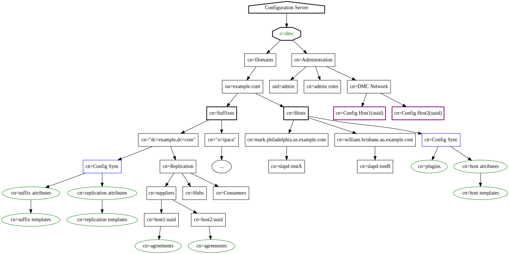

# 389 Directory Server Management Web Console
----------------------------------------------

 

## Naming Candidates

- 389 Directory Management Console
- "o=dmc" - **D**irectory **M**anagement **C**onfiguration

-----------------------

## 389 Java Console Shortcomings

- Rigid Configuration
- Difficult to extend
- “o=netscaperoot”/console layout not robust, too hostname centric, replication is only good for backup purposes – single point of console failure
- Not network management friendly
- Requires installing a client package (e.g. 389-console)
- User experience is generally poor, features are not in sync with actual main 389-ds features.

---------------------------

## New Design Features

The folowing are new features of the UI (that the old consle did not have)

### “Floating” Configuration

- Directory Management Configuration suffix “o=dmc” replaces “o=netscaperoot”
- Seperation of host, domain, replication, and suffix specific configurations.
- "o=dmc" can be replicated, and still fully functional on every system
- Allows the DMC to administer all servers in the registered deployment simultaneously
- Allows the DS server to be "brought into line" with the contents of o=dmc (Fast system repair, deployment and validation)
- Local Admin/HTTP server will use config file to know which Configuration DS to use.
    - Is this needed?  Can we just get the localhost name and find the Config DS that way?
    - Do we need to store other information in a config file before we reach out to the config DS?
    - Authentication info?

### Configuration Synchronization

- Synchronze key configuration settings
- Enforce consistency throughout a single domain
- Customizable
    - Select individual attributes(or all attrs) from particular cn=config entries
    - Indexing
    - Plugins
    - Database settings
    - etc...

### Global Replication Configuration & Deployment

- Be able to configure/deploy instances into an existing replication farm with minimal effort(one-click)
- Be able to drag and drop instances into and out of replication farms, or replication roles (promotion/demotion)

### Global Monitoring

Be able to see an overview of all the registered servers for fvarious monitoring stats
    
- Server Instance Status (online/offline)
- Replication status
    - Identify instances that are out of sync
- Performance - identify hosts that are experiencing low cache hit ratios?
    - Sort hosts by cache hit ratio, or other criteria.

### Administration Delegation

Grant "users" rights to manage part, or all, of o=dmc
    - Add aci's to the proper branches of o=dmc
    - Users will exist within o=dmc, allowing seperation of administrative accounts.
    - Users from within a suffix in the domain may be added to be able to administer the o=dmc domain.
    - Default roles for acis?

------------------------------

## Installation of DMC

- Admin Server (http, rest389)
- Directory Server instance with a single (initial) suffix of o=dmc. Backend tuning needs to be optimized for o=dmc functionality.
    - This instance only stores o=dmc - nothing else.  You need to create a new separate instance for entry data.
- Every physical machine must have one, and only one, "Admin Server + Configuration Directory Server"

### New Tools

#### setup-ds-dmc.py

- Based on setup-ds-rest
- Creates the http server(Admin Server), and ...
- Creates the DS instance
- Creates a separate Configuration Directory Server for (o=dmc)
- May create named suffixes for the domain.

#### register-ds-dmc.py

- Registers/Unregisters an existing instance and suffixes with the local Configuration Server
- Sanity checking of the suffix to validate if it exists already in the domain ...

#### slapd-agent.py

- dbus triggered backend to start / stop / restart instances when required.

#### o=dmc paintbrush

- Well, if we are applying config, we need to use a tool to apply it broadly
- paintbrush will check for o=dmc updates and apply them
- Enforce local node consistentcy in cn=config

------------------------------

## Configuration Synchronization - Part 2

### Overview
  
Hosts, Suffixes, and Replication configurations for each domain will have its own "Config Sync" templates that be used to synchronize instances that subscribe to "Configuration Synchronization".

- Host Template - used for setting general configuration settings(typically from cn=config), as well as plugins(only enabling/disabling).  Only one template per "*domain*"
- Suffix Template - used to set suffix/backend configuration settings like: replication, indexes, cache settings, db settings, etc.  One template per suffix

Each template can only set attributes that are set as "*allowed*" in a special configuration entry in **o=dmc**.

#### Example

    ---------------------------------------------------------------------------
    Hosts
    ---------------------------------------------------------------------------

    dn: cn=Config Sync, cn=Hosts, ou=example.com,cn=domains, o=dmc
    objectclass: top
    objectclass: DMCConfigSync
    cn: Config Sync
    configSyncVersion: 1
    configSyncEnabled: on

    dn: cn=plugins, cn=Config Sync, cn=Hosts, ou=example.com. cn=domains, o=dmc
    objectclass: top
    objectclass: extensibleObject
    cn: plugins
    configSyncPlugin: MemberOf Plugin: on
    configSyncPlugin: Referential Integrity Plugin: on
    configSyncPlugin: Root DN Access Control: off

    dn: cn=host attributes, cn=Config Sync, cn=Hosts, ou=example.com, cn=domains, o=dmc
    objectclass: top
    objectclass: DMCConfigSync
    cn: host attributes
    description: Configuration attributes typically found in, but not limited to, cn=config
    configSyncAllowedAttr: nsslapd-sizelimit
    configSyncAllowedAttr: nsslapd-errorlog-level
    configSyncAllowedAttr: nsslapd-dynamic-plugins
    configSyncAllowedAttr: nsslapd-idletimeout
    configSyncAllowedAttr: sslVersionMin
    configSyncAllowedAttr: sslVersionMax
    ...
    ...
    ...

    dn: cn=host template, cn=host attributes, cn=Config Sync, cn=Hosts, ou=example.com, cn=domains, o=dmc
    objectclass: top
    objectclass: extensibleObject
    cn: host template
    nsslapd-sizelimit: 1000
    nsslapd-idletimeout: 60
    sslVersionMin: TLS1.1

    ---------------------------------------------------------------------------
    Suffixes
    ---------------------------------------------------------------------------

    dn: cn=Config Sync, "cn=\"dc=example, dc=com\", cn=Suffixes, ou=example.com,cn=domains, o=dmc
    objectclass: top
    objectclass: DMCConfigSync
    cn: Config Sync
    configSyncVersion: 1
    configSyncEnabled: on

    dn: cn=suffix attributes, cn=Config Sync, "cn=\"dc=example, dc=com\",  cn=Suffix, ou=example.com, cn=domains, o=dmc
    objectclass: top
    objectclass: DMCConfigSync
    cn: suffix attributes
    configSyncAllowedAttr: nsslapd-state
    configSyncAllowedAttr: nsslapd-backend
    configSyncAllowedAttr: nsslapd-cachesize
    configSyncAllowedAttr: nsslapd-cachememsize
    configSyncAllowedAttr: nsslapd-dbcachesize
    configSyncAllowedAttr: nsslapd-import-cachesize
    configSyncAllowedAttr: nsslapd-readonly
    configSyncAllowedAttr: nsslapd-require-index
    configSyncAllowedAttr: nsslapd-lookthroughlimit
    configSyncAllowedAttr: nsslapd-rangelookthroughlimit
    configSyncAllowedAttr: nsslapd-mode
    configSyncAllowedAttr: nsslapd-idlistscanlimit
    configSyncAllowedAttr: nsslapd-db-durable-transaction
    configSyncAllowedAttr: nsslapd-db-checkpoint-interval
    configSyncAllowedAttr: nsslapd-db-compactdb-interval
    configSyncAllowedAttr: nsslapd-db-transaction-batch-val
    configSyncAllowedAttr: nsslapd-db-transaction-batch-min-wait
    configSyncAllowedAttr: nsslapd-db-transaction-batch-max-wait
    configSyncAllowedAttr: nsslapd-db-logbuf-size
    configSyncAllowedAttr: nsslapd-db-locks
    configSyncAllowedAttr: nsslapd-db-private-import-mem
    configSyncAllowedAttr: nsslapd-db-deadlock-policy
    configSyncAllowedAttr: nsslapd-import-cache-autosize
    configSyncAllowedAttr: nsslapd-idl-switch
    configSyncAllowedAttr: nsslapd-search-bypass-filter-test
    configSyncAllowedAttr: nsslapd-search-use-vlv-index
    configSyncAllowedAttr: nsslapd-exclude-from-export
    configSyncAllowedAttr: nsslapd-serial-lock
    configSyncAllowedAttr: nsslapd-subtree-rename-switch
    configSyncAllowedAttr: nsslapd-pagedlookthroughlimit
    configSyncAllowedAttr: nsslapd-pagedidlistscanlimit
    configSyncAllowedAttr: nsslapd-backend-opt-level

    dn: cn=suffix template, cn=suffix attributes, cn=Config Sync, "cn=\"dc=example, dc=com\",  cn=Suffix, ou=example.com. cn=domains, o=dmc
    objectclass: top
    objectclass: extensibleObject
    cn: suffix template
    nsslapd-backend: userroot
    configSyncIndex: telephonenumber:pres,eq,sub
    configSyncIndex: uid:pres,eq:limit=0 type=eq flags=AND values=inetOrgPerson
    configSyncIndex: cn:pres,eq
    configSyncIndex: sn:pres,eq
    nsslapd-dbcachesize: 1000000000

    dn: cn=replication attributes, cn=Config Sync, "cn=\"dc=example, dc=com\", cn=Suffix, ou=example.com. cn=domains, o=dmc
    objectclass: top
    objectclass: DMCConfigSync
    cn: replication attributes
    configSyncAllowedAttr: nsDS5ReplicaPurgeDelay
    configSyncAllowedAttr: nsDS5ReplicaBindDN
    configSyncAllowedAttr: nsDS5ReplicaTransportInfo
    configSyncAllowedAttr: nsDS5ReplicaBindMethod
    configSyncAllowedAttr: nsDS5ReplicaCredentials
    configSyncAllowedAttr: nsslapd-changelogMaxEntries
    configSyncAllowedAttr: nsslapd-changelogMaxAge
    ...

    dn: cn=replication template, cn=replication attributes, cn=Config Sync, "cn=\"dc=example, dc=com\",  cn=Suffix, ou=example.com. cn=domains, o=dmc
    objectclass: top
    objectclass: extensibleObject
    cn: replication template
    nsslapd-changelogMaxAge: 7d
    nsDS5ReplicaPurgeDelay: 604800

There should be options to "*sync now*" or "*force sync*" for each config area.

###  Applying config

Once a "config-sync" server instance has the configuration applied, we update that config version:

    dn: cn=slapd-instA, cn=host1.example.com, ou=host, ou=example.com, cn=domains, o=dmc
    configHostVersion: <version>
    configSuffixVersion: <version>
    configReplVersion: <version>

So when we notice an instance is behind(becuase it was off line), we know its needs to be updated.

Then "**paintbrush**" just needs to look at config versions for each area in each server instance config entry to know if it needs it's config area reset.

## o=dmc Tree

## UI Layout

The UI should be laid out with a Navigation Tree on the left panel, and a menu bar across the top.

The treeview will contain:

    - example.com (domain)
        - Hosts
            - Config Sync
            - host1.example.com
                - slapd-host1
                - slapd-DMC_CONFIG
            - host2.example.com 
                - slapd-host2
                - slapd-DMC_CONFIG
            - host3.example.com
                - slapd-host3
                - slapd-DMC_CONFIG

        - Suffixes
            - dc=example,dc=com
                - Config Sync
                - Replication
                    - Masters
                        - host1.example.com:389
                            - agmt1
                            - agmt2
                    - Hubs
                        - host2.example.com:389
                            - agmt1
                            - agmt2
                    - Consumers
                        - host3.example.com:389

            - o=ipaca
                - Config Sync
                - Replication
                    - Masters
                    - Hubs
                    - Consumers

             

Each Node in thge tree will geneate unique "tabs" in the main body of the page

Now, the most important aspect of how the ui will function is on the set of these.

- If we select a 'domain' in the tree, and 'Monitoring' on the menu, we should see the monitoring status of all hosts and suffixes in the domain.

- If we select 'suffixes' and 'Monitoring', we should see only suffix Monitoring information.

- If we select a single host we should see only that host's 'Monitoring' information.

Certain actions however only make sense in the tree. For example, right clicking domain or suffixes, should yield a context menu to "add a suffix". Right clicking a specific suffix should give the option to remove it. These actions should also exist in the suffix tab.

Another example, the performance tab, will behave differently for a host compared to a suffix. A suffix may show indices, where as the host will display cachesizing.

If we swap between tree view items, such as between the two hosts master-a and master-b, and presume we are on the page "replication", then we should just update the page with the replication details of the now selected system.

Certain tree and menu combinations may not make sense however. In this case, we can either:

* Move the tree pointer to "domain"
* While we have certain tree elements selected, de-activate menu options.
* Present a blank menu that states "select a valid resource type X"

I think that number 2 likely makes the most sense, and means the "tree view" really drives the interaction and scoping. However, 3 would be an acceptable solution too.

Roles would manage the roles for administrators in the o=dmc domain.

