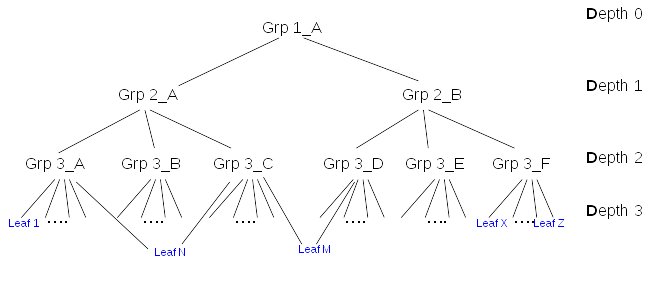
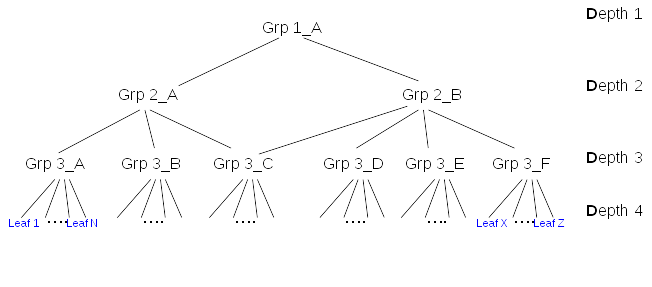
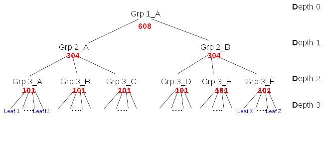
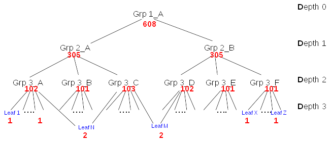
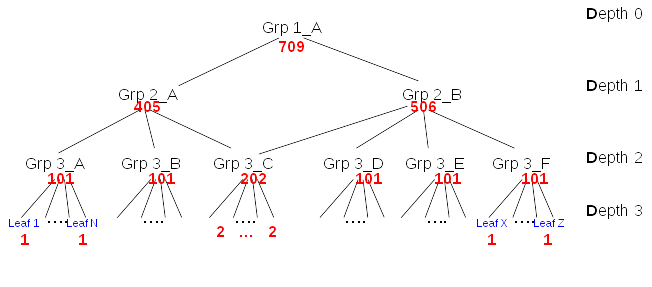

# MemberOf Scalability
-----------------------------------------



## Overview

Membership attributes creates an acyclic tree of LDAP entries/nodes. MemberOf plugin manages the values of LDAP attribute **memberOf** into that tree. When updating a group, it does two actions:

-   Lookup **down** in membership tree to determine the list of entries (leafs or intermediate nodes) impacted by the operation
-   For each impacted entry (nodes or leafs), lookups **up** in the tree to determine which groups the entry belongs to, and eventually update the entry (**fixup**)

Those two actions are necessary but can be expensive in terms of:

-   response time of each single operation
-   scalability as during those operations others write operations are on hold (memberof is a betxn)
-   cpu consumption
-   significant replacement of entries being cached in the entry cache

This document presents some possible improvements.

## Use Case

An administrator needs to provision many entries (leafs or groups) within a fixed period of time(typically over a week end). He can use CLI or batch commands or even importing entries from a ldif file. The rate of the provisioning is critical to be sure to complete the task in an acceptable delay.

## Design

### Simplifications

The graph of membership can be very complex. For simplification, this document will evaluate the impact of membership update on limited types of trees with same leaf depth:

- **Type 1** : Tree with one uniq path root to each leaf

- **Type 2** Tree with multiple paths root to some of the leafs

- **Type 3** Tree with multiple paths to intermediate nodes

### Cost of memberof update

Tests done with [Nested groups provisioning](http://www.freeipa.org/page/V4/Performance_Improvements#Memberof_plugin) shown that **by far the main contributor** was the [Number](http://www.freeipa.org/page/V4/Performance_Improvements#Small_DB_.2810K_entries.29) of internal searches.

The initial thought that the update of the entry (fixup) was the main responsible of preformance hit, **was not completely right**. Update of the member entry (to update ***memberof***) has IO cost but IO is not that main contributor. For example, in the same test case, disabling retroCL, that divides IO by factor 2 had no significant impact on provisioning duration.

So in the rest of the document the **cost** will be expressed in terms of **internal searches**.

The figure above shows a membership tree. At the bottom of the tree **leafs** are typically **users**. Those users are directly member of a *leaf groups* of **Depth 3** (i.e. *Grp3_A*), for example *Grp 3_A* is *'Devel Kernel Group'*. Then this group is member of **Depth 2** group (i.e. *Grp 2_A*) like *'Framework Devel Group'*. This group is member of **Depth 1** group (i.e. *Grp 1_A*) like *'Engineering'*. 

- Let **tree(L)** the number of leafs in the tree(Depth 4)
- Let **tree(L)** the number of leafs in the tree(Depth 4)
- Let **tree(N)** the number of intermediare nodes in the tree(Depth 1,2,3)
- Let **A** the total number of entries in a membership tree (all *Engineering*)
- Let **D** the depth of a given node in the membership tree
- Let **P** the number of paths from root to nodes and leafs
- Let **G** the number of groups a given entry is direct member
- Let **P_down(x)** the number of paths from root to nodes at the depth x (i.e. **paths with length = x**)
- Let **P_up(x)** the sum of lengths + 1 of paths from nodes at the depth x back to root. For a node at depth x, all its lenghts back to root >= x.
- Let **L** the maximum lenght of all paths from root to nodes and leafs (i.e. Max Depth + 1)
- Let **plg** is the number of plugins that triggers one internal search when a entry is updated (e.g. mep). It is >= 1.
- Let *leaf groups* be the Depth node 3
- Let *root* be the Grp_1_A

#### Look down the impacted members

When a group is updated, the txn postop callback searches for all entries being direct and indirect members of that group. This is done by a **single** internal search of each node (leaf or intermediate node) **each** time the entry is found in the membership tree. The purpose of this look down is to build a list of impacted members that later will be fixup.

    SRCH base="<node_dn>" scope=0 filter="(|(objectclass=*)(objectclass=ldapsubentry))" attrs="attr_1 ... attr_N"
    attr_1,...,attr_N: are membership attributes (defined in "cn=MemberOf Plugin,cn=plugins,cn=config")

This internal base search is very rapid at the condition <node_dn> **remains in the entry cache**.

The cost of the look down is C = sum from l=1 to l=L of P_down(l). For example with *leaf groups* (node of Depth 3) having **100** leafs:

- tree [type 1](#Type 1): **608** - 600 paths root to each leafs + 8 paths root to intermediate nodes
- tree [type 2](#Type 2): **608** - 600 paths root to each leafs + 8 paths root to intermediate nodes
- tree [type 3](#Type 3): **709** - the 101 additional paths are due to Grp_3_C (and its leafs) that is found twice

The lookup is quite efficient (it retrieves/process all the membership attributes in a single search) but it can be improved:

An entry (node or leaf) may appears several times in the tree (and triggers several int_search). The possibilities for finding entries several times are:

- several paths conduct to the same entry (node or leaf)
- being listed in several membership attribute

The ticket [48861](https://fedorahosted.org/389/ticket/48861) was opened for this improvement. It should make sure that an entry is **search once** during *Look down* (preferably) or **Fixed once** during *Look up*. This improvement has no impact if entries appears only once in the tree.

The expected cost of look down with a fix for [48861](https://fedorahosted.org/389/ticket/48861), for example with *leaf groups* (node of Depth 3) having **100** leafs

- tree [type 1](#Type 1): **C = 608**: all the paths root to nodes/leafs are uniq
- tree [type 2](#Type 2): **C - 2 = 606**: there are two paths root to LeafN and root to LeafM
- tree [type 3](#Type 3): **C - 101 = 608**: there are two paths root to Grp_3_C and root to Grp_3_C s leafs

#### Look up group membership of impacted members

When a group is updated, for each **impacted members** it computes all the groups containing (direct or indirect) the impacted members. So for each node (leafs and intermediate nodes) it does an internal search 

    SRCH base="<suffix>" scope=2 filter="(|(attr_1=<node_dn>)..(attr_N=<node_dn))" attrs=ALL
    attr_1,...,attr_N: are membership attributes (defined in "cn=MemberOf Plugin,cn=plugins,cn=config")
    They are supposed to be indexed in equality

If this search is indexed and fast but item that can influence the cost are

- the more there are membership attributes the more expensive it is
- the search will retrieves *groups* that are possibly big entries. It is more expensive if the *groups* are not in the **entry cache**

It is quite difficult to express in mathematical way the cost of the look down. Here is an attempt to describe it:
Having a *list of impacted nodes* (possibly containing *duplicates*), for each of them it goes thru **all** paths from this node back to the root. Starting from a given node, the lenght of the paths can be different although they end to the root. It triggers an internal search for each nodes on each paths. So the cost (for a given node) is the sum of the number of nodes on all paths from *given node to root*. A mechanism to detect cycle can reduce the cost so that common parts of the paths are accounted once. Finally, there are **plg** internal searches per fixup node. 
For example with *leaf groups* (node of Depth 3) having **100** leafs:

- tree [type 1](#Type 1):  **3030** internal searches
- tree [type 2](#Type 2): **3036** internal searches
- tree [type 3](#Type 3): **3736** internal searches

Making sure that the *list of impacted nodes* does not contain duplicate ([48861](https://fedorahosted.org/389/ticket/48861)) has a significant impact during *look up*. In [type 3 tree](#Type 3), each member of Grp_3_C have 2 paths back to root so the look up cost of each of them will be divided by 2. **The more paths it exists to a node, the more expensive is the node**.

### Improvements

#### Prevent duplicate 48861

When updating membership attributes of a group, a direct or indirect impacted member of that group can be found several time. The ticket [48861](https://fedorahosted.org/389/ticket/48861) will prevent that an impacted member is listed/fixed several time. A first fix, caching in an hash table the already fixed nodes, divides by **2** the duration of provisioning of a tree. The tree being creates with [create_test_data.py](https://github.com/freeipa/freeipa-tools/blob/master/create-test-data.py)

#### caching of groups

The vast majority of the *Look up* internal searches is to retrieve the *groups owning a given node*.

    SRCH base="<suffix>" scope=2 filter="(|(attr_1=<node_dn>)..(attr_N=<node_dn))" attrs=ALL
    attr_1,...,attr_N: are membership attributes (defined in "cn=MemberOf Plugin,cn=plugins,cn=config")

But looking at internal searches filters we can see an increasing number of them as the *<node_dn>* moves to the root. It also fluctuates  highly as soon as there are nested groups and nodes/leafs belong to several groups. 

In the three following figures, the number in red (close to *<node_dn>*) is the number of searches:

    SRCH base="<suffix>" scope=2 filter="(|(attr_1=<node_dn>)..(attr_N=<node_dn))" attrs=ALL

Type 1 

Type 2 

Type 3

In conclusion:

- The number of *filter="(|(attr_1=<leaf_n>).(attr_N=<leaf_n))"* remains low (1 or 2) in all types of trees 
- The number of *filter="(|(attr_1=<group_n>).(attr_N=<group_n))"* is very high compare to the leaf
- The number of *filter="(|(attr_1=<group_n>).(attr_N=<group_n))"* increase as moving up in the three

So if we can satisfy *filter="(|(attr_1=<group_n>).(attr_N=<group_n))"* without doing internal searches and basically have only 1 internal search per nodes (leafs or groups) it will reduce the cost of *look up* by

- Type 1: From ~3000 to ~600
- Type 2: From ~3000 to ~600
- Type 3: From ~3700 to ~600

##### case 1 - impacted members appear once in the tree

Assuming that **G=1** (an entry appears only once in the membership tree), the cost of update *each* node is **(I+1) + P**.

For example using the above membership tree, assuming that each *leaf group* has *L=100* members, the update of this tree will be: **3638 internal searches**

- Depth 4: 6 *leaf groups* => **6 * L * ((I+1) + P)** =  600 * (4 + 2) = **3600 internal searches**
- Depth 3: **6 * ((I+1) + P)** = 6 * (3 + 2) = **30 internal searches**
- Depth 2: **2 * ((I+1) + P)** = 2 * (2 + 2) = **8 internal searches**

The way this lookup is done can be improved. In fact, there are several lookup of the same **internal nodes** in the tree

In the figure above, we can see the *look up* for Leaf_A triggers internal searches for Leaf_A, Grp_3_A, Grp_2_A and Grp_1_A. Then
*look up* for Leaf_B triggers triggers internal searches for Leaf_A, Grp_3_C, Grp_2_A and Grp_1_A. So 2 internal searches out of 8 are useless.

Taking the same cost of **3638 internal searches** in the previous example, we can measure that the half (**~1800**) are useless

- Grp_1_A is look up **609 times** 
  - 600 times for each Depth4 leafs
  - 6 times for Depth3 nodes
  - 2 times for Depth2 nodes
  - 1 for Depth1 node
- Grp_2_A and Grp_2_B are look up **304 times each**
- Grp_3_A..Grp_3_F are look up **101 times each**

##### case 2 - impacted members appear several time in the tree

Assuming that **G > 1** (an entry is direct member of N *leaf group*). the cost of update *each* node is **(I + 1) + P**.

For example using the above membership tree, Assuming:

- *G=6* : each leaf is member of all *leaf groups*
- *L=100* : *leaf groups* have 100 direct members, the update of this tree will be: **7238 internal searches**

- Depth 4: 6 *leaf groups* => **6 * L * ((I + 1) + P)** =  600 * ((9 + 1) + 2) = **7200 internal searches**
- Depth 3: **6 * ((I + 1) + P)** = 6 * (3 + 2) = **30 internal searches**
- Depth 2: **2 * ((I + 1) + P)** = 2 * (2 + 2) = **8 internal searches**

In the figure above, we can see the *look up* for Leaf_A triggers internal searches for Leaf_A, Grp_3_A, Grp_2_A and Grp_1_A but also Grp_3_C, Grp_2_A and Grp_1_A. So 2 internal searches out of 7 are useless. In addition Leaf_A is found twice by [look down](http://www.port389.org/docs/389ds/design/memberof-scalability.html#look-down-the-impacted-members) so it triggers two lookup up, the second one being useless because the Leaf_A was already fixup. That is 9 (2+7) internal searches out of 14 that are useless.

For example for the following membership tree with **L=100**, then **A=(6*L)+9=609**
The problem is that updating 

The cost of update of any node is: **(G*D) + P** internal searches

- **D** is the depth of the node in the tree, so each time a layer is added it increases by *1* the cost to update **each** node in the tree.
- **G** is the number of groups that a given member is member of
- **P** is the number of DS plugins that will catch the update and will issue internal searches on the updated entry. Typically this number is at least **>=2** because of *memberof* and *mep* plugins. Note that it is very likely that others plugins may be triggers like *referint* or *schema compat*.

####Example of entries belonging to **only one** group
####Example of entries belonging to **3** group
For example, assuming that each Depth 3 group has *100* members (*L*) and each member belong to **1** group, the update of this tree will be: **3642 internal searches**

- Depth 4: 6 Depth 3 groups => **6* L * ((G*D) + P)** =  600 * ((6*4) + 2) = **3600 internal searches**
- Depth 3: **6 * (D + P)** = 6 * ((3*3) + 2) = **30 internal searches**
- Depth 2: **2 * (D + P)** = 2 * ((1*2) + 2) = **8 internal searches**
- Depth 1: **1 * (D + P)** = 1 * ((1*1) + 3) = **4 internal searches**

The fact that a **Leaf** entry could be present in several groups does not change the cost of the update. However it is an issue as each time the entry is found in the tree, each time it is fixed with a **D + P** cost.

The formula to compute the number of internal searches is
 N: Number of members to update (nested or not)
    In a ADD/DEL/MOD_REPL N = all members in the operation are updated
    In a MOD_ADD/MOD_DEL N = members added/removed are updated
 P: Number of plugins that lookup each members
    (for example *mep* plugin lookup the member during the update)
 
 Total_internal_search = N * (G + P + 1)
 
 for example with groups of **1000** members and each member being member of **5** groups. Assuming P=3 (memberof, mep,...), (G + P + 1) = 9:
  - adding a group => 9000 internal_searches
  - add/del 10 members to a group => 90 internal searches

What increase the number of internal searches

-   Fixup several times the same entry [48861](https://fedorahosted.org/389/ticket/48861)
   - With **nested groups**, a same entry can be found serveral times as impacted
   - If an entry member of a group
-   If an entry is present only once in a single group (for a given membership attribute)When building the list of impacted entries, **Nested groups** means that (an entry can be fixup several times)
-   multiple membership attributes
   -   The task to 
   -   If an entry is present

- keep group in cache
group size

It is preferred to keep the plug-in configuration backwards compatible to prevent breaking existing deployments during upgrade. This is easily done by simply allowing the **memberOfGroupAttr** attribute to have multiple values. Here is an example:

    dn: cn=MemberOf Plugin,cn=plugins,cn=config
    ...
    memberofgroupattr: member
    memberofgroupattr: uniqueMember
    memberofattr: memberOf

It is important to note that an attribute used as a **memberOfGroupAttr** must be defined with either the **Distinguished Name** or **Name and Optional UID** syntaxes. An attempt to use an attribute defined with any other syntax will be rejected.

