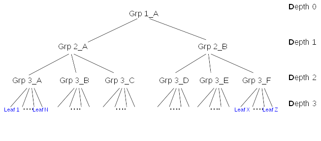
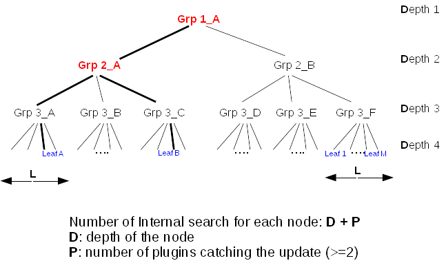

# MemberOf Scalability
-----------------------------------------



## Overview

MemberOf plugin manages the values of LDAP attribute **memberOf**. When updating a group, it does two actions:

-   Lookup **down** in the groups tree to determine the list of entries (leaf or groups) impacted by the operation
-   For each impacted entry, lookups **up** in the groups tree to determine which groups the entry belongs to, and finally update the entry (**fixup**)

Those two actions are necessary but can be very expensive in terms of:

-   response time of each single operation
-   scalability as during those operations others write operations are on hold (memberof is a betxn)
-   cpu consumption
-   significant replacement of entries being cached in the entry cache

This document presents some possible improvements.

## Use Case

An administrator needs to provision many entries (leaf or groups) within a fixed period (typically over a week end). He can use CLI or batch commands or even importing entries from a ldif file. The rate of the provisioning is critical to be sure to complete the task in an acceptable period.

## Design

### Cost of memberof update

Tests done with [Nested groups provisioning](http://www.freeipa.org/page/V4/Performance_Improvements#Memberof_plugin) shown that **by far the main contributor** was the [Number](http://www.freeipa.org/page/V4/Performance_Improvements#Small_DB_.2810K_entries.29) of internal searches.

The initial thought that the update of the entry (fixup) was the main responsible of preformance hit, **was not completely right**. Update of the member entry (to update ***memberof***) has IO cost but IO is not that main contributor. For example, in the same test case, disabling retroCL, that divides IO by factor 2 had no significant impact on provisioning duration.

So in the rest of the document the **cost** will be expressed in terms of **internal searches**.

The figure above shows a membership tree. At the bottom of the tree **leafs** are typically **users**. Those users are directly member of a *leaf groups* of **Depth 3** (i.e. *Grp3_A*), for example *Grp 3_A* is *'Devel Kernel Group'*. Then this group is member of **Depth 2** group (i.e. *Grp 2_A*) like *'Framework Devel Group'*. This group is member of **Depth 1** group (i.e. *Grp 1_A*) like *'Engineering'*. 

- Let **L** the average size of *leaf groups* (Depth 3)
- Let **A** the total number of entries in a membership tree (all *Engineering*)
- Let **D** the depth of a given node in the membership tree
- Let **P** the number of plugins that catch group updates
- Let **G** the number of time each entry appears in a membership tree (groups it is memberof)

#### Look down the impacted members

When a group is updated, the txn postop callback searches for all entries being direct and indirect member of that group. This is done by a **single** internal search of each entry found in the membership tree. The lookup is quite optimal (it retrieves/process all the membership attributes in a single earch) but we can think to an improvement:

An entry that appears in the tree is lookup using an internal search. An entry may appears several time in the tree (an create several int_search)

- being member of several sub groups
- being listed in several membership attribute

The ticket [48861](https://fedorahosted.org/389/ticket/48861) was opened for this improvement. We can imagine to make sure that an entry is **listed once** during *Look down* (preferably) or **Fixed once** during *Look up*. This improvement has no impact if entries appears only once in the tree.

The cost of Look down **(A - A/G)**. For example with A=600 and G=3 the cost is ~400. 

The look down produces a list of **impacted members**

#### Look up group membership of impacted members

When a group is updated, for each **impacted members** it computes all the groups containing (direct or indirect) the member.

##### case 1 - entries appears once in the tree

Assuming that **G=1** (an entry appears only once in the membership tree), the cost of update is for *each* node is **D + P**.

For example using the above membership, assuming that each *leaf group* has *L=100* members, the update of this tree will be: **3642 internal searches**

- Depth 4: 6 *leaf groups => **6 * L * (D + P)** =  600 * (4 + 2) = **3600 internal searches**
- Depth 3: **6 * (D + P)** = 6 * (3 + 2) = **30 internal searches**
- Depth 2: **2 * (D + P)** = 2 * (2 + 2) = **8 internal searches**
- Depth 1: **1 * (D + P)** = 1 * (1 + 3) = **4 internal searches**

This lookup can be improved because there are several lookup of the same **internal nodes** in the tree

In the figure above, we can see the *look up* for Leaf_A triggers internal searches for Leaf_A, Grp_3_A, Grp_2_A and Grp_1_A. Then
*look up* for Leaf_B triggers triggers internal searches for Leaf_A, Grp_3_C, Grp_2_A and Grp_1_A. So 2 internal searches out of 8 are useless.

Taking the same cost of **3642 internal searches** in the previous example, we can measure that the half (**~1800**) are useless

- Grp_1_A is look up **609 times** (600 for Depth4, 6 for Depth3 and 2 for Depth2, 1 for Depth1)
- Grp_2_A and Grp_2_B are look up **304 times each**
- Grp_3_A..Grp_3_F are look up **101 times each**

For example for the following membership tree with **L=100**, then **A=(6*L)+9=609**
The problem is that updating 

The cost of update of any node is: **(G*D) + P** internal searches

- **D** is the depth of the node in the tree, so each time a layer is added it increases by *1* the cost to update **each** node in the tree.
- **G** is the number of groups that a given member is member of
- **P** is the number of DS plugins that will catch the update and will issue internal searches on the updated entry. Typically this number is at least **>=2** because of *memberof* and *mep* plugins. Note that it is very likely that others plugins may be triggers like *referint* or *schema compat*.

####Example of entries belonging to **only one** group
####Example of entries belonging to **3** group
For example, assuming that each Depth 3 group has *100* members (*L*) and each member belong to **1** group, the update of this tree will be: **3642 internal searches**

- Depth 4: 6 Depth 3 groups => **6* L * ((G*D) + P)** =  600 * ((6*4) + 2) = **3600 internal searches**
- Depth 3: **6 * (D + P)** = 6 * ((3*3) + 2) = **30 internal searches**
- Depth 2: **2 * (D + P)** = 2 * ((1*2) + 2) = **8 internal searches**
- Depth 1: **1 * (D + P)** = 1 * ((1*1) + 3) = **4 internal searches**

The fact that a **Leaf** entry could be present in several groups does not change the cost of the update. However it is an issue as each time the entry is found in the tree, each time it is fixed with a **D + P** cost.

The formula to compute the number of internal searches is
 N: Number of members to update (nested or not)
    In a ADD/DEL/MOD_REPL N = all members in the operation are updated
    In a MOD_ADD/MOD_DEL N = members added/removed are updated
 P: Number of plugins that lookup each members
    (for example *mep* plugin lookup the member during the update)
 
 Total_internal_search = N * (G + P + 1)
 
 for example with groups of **1000** members and each member being member of **5** groups. Assuming P=3 (memberof, mep,...), (G + P + 1) = 9:
  - adding a group => 9000 internal_searches
  - add/del 10 members to a group => 90 internal searches

What increase the number of internal searches

-   Fixup several times the same entry [48861](https://fedorahosted.org/389/ticket/48861)
   - With **nested groups**, a same entry can be found serveral times as impacted
   - If an entry member of a group
-   If an entry is present only once in a single group (for a given membership attribute)When building the list of impacted entries, **Nested groups** means that (an entry can be fixup several times)
-   multiple membership attributes
   -   The task to 
   -   If an entry is present

- keep group in cache
group size

It is preferred to keep the plug-in configuration backwards compatible to prevent breaking existing deployments during upgrade. This is easily done by simply allowing the **memberOfGroupAttr** attribute to have multiple values. Here is an example:

    dn: cn=MemberOf Plugin,cn=plugins,cn=config
    ...
    memberofgroupattr: member
    memberofgroupattr: uniqueMember
    memberofattr: memberOf

It is important to note that an attribute used as a **memberOfGroupAttr** must be defined with either the **Distinguished Name** or **Name and Optional UID** syntaxes. An attempt to use an attribute defined with any other syntax will be rejected.

