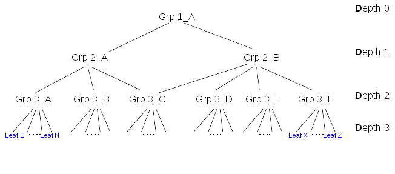



# Overview

Membership attributes in LDAP entries create a directed graph of entries that can contain cycles. Having cycles in membership makes almost no sense and add complexity. This is the reason why memberof plugin assums that the directed graph is actually an **acyclic directed graph** and enforce during evaluation of the graph that there is no cycle.

The nodes of the graph are directed by membership attributes (member, uniquemember, memberuser...) that are represented by blue arrows in the figure below. MemberOf plugin manages the values of LDAP attribute **memberOf** into the graph. This attribute creates an other graph with direct edges from a node to all the nodes it is member of, represented by red arrows. 

When updating a group, MemberOf plugin needs to update the *memberof* attribute of several nodes. To do so, it does two actions:

-   Lookup **down** in membership graph to determine the list of nodes (leafs or groups) impacted by the operation
-   For each impacted nodes, lookups **up** in the graph to determine which groups the entry belongs to, and eventually update the entry (**fixup**)

Those two actions are necessary but can be expensive in terms of:

-   response time of each single operation
-   scalability as during those operations others write operations are on hold (memberof is a betxn)
-   cpu consumption
-   significant replacement of entries being cached in the entry cache

This document presents some possible improvements.

# Use Case

An administrator needs to provision many entries (leafs or groups) within a fixed period of time(typically over a week end). He can use CLI or batch commands or even importing entries from a ldif file. The rate of the provisioning is critical to be sure to complete the task in an acceptable delay.

# Design

## Simplifications

The graph of membership can be very complex. For simplification, this document will evaluate the impact of membership update on limited types of graphs with same leaf depth:

- **Type 1** : Graph with one root and uniq path root to each leaf

- **Type 2** : Graph with one root and multiple paths root to some of the leafs

- **Type 3** : Graph with one root and with multiple paths to intermediate nodes (groups)

## Cost of memberof update

<a name="Cost of memberof update">

Tests done with [Nested groups provisioning](http://www.freeipa.org/page/V4/Performance_Improvements#Memberof_plugin) shown that **by far the main contributor** was the [Number](http://www.freeipa.org/page/V4/Performance_Improvements#Small_DB_.2810K_entries.29) of internal searches. For example with a total of 10000 leafs creating 400 nested groups tiggered **14M internal searches**.

The initial thought that the update of the entry (fixup) was the main responsible of preformance hit, **was not completely right**. Update of the member entry (to update ***memberof***) has IO cost but IO is not that main contributor. For example, in the same test case, disabling retroCL, that divides IO by factor 2 had no significant impact on provisioning duration.

So in the rest of the document the **cost** will be expressed in terms of **internal searches**.

The figure above shows a membership graph. At the bottom of the graph **leafs** are typically **users**. Those users are directly member of a *group* of **Depth 3** (i.e. *Grp3_A*), for example *Grp 3_A* is *'Devel Kernel Group'*. Then this group is member of **Depth 2** group (i.e. *Grp 2_A*) like *'Framework Devel Group'*. This group is member of **Depth 1** group (i.e. *Grp 1_A*) like *'Engineering'*. 

- Let the graph composed of **nodes**. 
- The **parents** of a node are the nodes with a membership link to the node. 
- The set of nodes that are **parents** are called **groups or intermediate nodes**
- A **leaf** is a node that is not a parent
- Let **D** the depth of a given node in the membership graph
- Let **P_down(x)** the number of paths from root to nodes at the depth x (i.e. **paths with length = x**)
- Let **N_up(x)** the number of different nodes existing on all possible paths from node *x* to root.
- Let **L** the maximum lenght of all paths from root to nodes and leafs (i.e. Max Depth + 1)
- Let **update plg** is the number of plugins that triggers one internal search when a entry is *updated* (e.g. mep). It is >= 1.

### Algorythm

When a group is updated, to add/del/moddn members, Memberof plugin updates the attribute **memberof** of all entries that are impacted by the update of the group. The graphs is **look down** from the target group down to the leafs to retrieve the impacted nodes. During the **look down**, each impacted node is *fixup*. The fixup of node consist of

- **look up** that retrieves all the groups that have a direct or inderect membership relation with that node (i.e. all the groups that the node is member of)
- **update** of the *memberof* values of the node.

#### look down

The **look down** uses the following search for **all impacted nodes \(leaf or intermediate node\)**
<a name="look down search">

    SRCH base="<node_dn>" scope=0 filter="(|(objectclass=*)(objectclass=ldapsubentry))" attrs="attr_1 ... attr_N"
    attr_1,...,attr_N: are membership attributes (defined in "cn=MemberOf Plugin,cn=plugins,cn=config")

This internal base search is very rapid at the condition *node_dn* **remains in the entry cache**. If the entry is a group (i.e. *attr_x* exists), it recurses for all the members. When the entry is a leaf it *fixup* the entry ( **look up** + update of memberof ). When the entry is a group and all its members have been *fixup*, then the group itself is *fixup* ( **look up** + update of memberof ).

Note that during **look down**, a same entry can be found several times. This happens when it exists multiples paths from the original updated group to a node belonging to its membership graph. 

During a updating (MOD) the members of a group, the **look down** contains searches:
<a name="look down MOD search">

    # retrieve the targeted group
    SRCH base="<group_dn>" scope=0 filter="(|(objectclass=*)(objectclass=ldapsubentry))" attrs=ALL
    SRCH base="<group_dn>" scope=0 filter="(|(objectclass=*)(objectclass=ldapsubentry))" attrs=ALL
    
    # then for each impacted node
    SRCH base="<impacted_node_dn>" scope=0 filter="(|(objectclass=*)(objectclass=ldapsubentry))" attrs=ALL

#### look up

When a group is updated, for each **impacted members** it computes all the groups containing (direct or indirect) the impacted members. So for each given impacted member (leafs and intermediate nodes) it does an internal search for each node from the impacted member up to the root.
<a name="look up search">

    SRCH base="<suffix>" scope=2 filter="(|(attr_1=<node_dn>)..(attr_N=<node_dn>))" attrs=ALL
    attr_1,...,attr_N: are membership attributes (defined in "cn=MemberOf Plugin,cn=plugins,cn=config")
    They are supposed to be indexed in equality
    
    For example with a path: Grp_1_A -> Grp_2_A -> Grp_3_C -> Leaf_N. The access log will contain
    SRCH base="<suffix>" scope=2 filter="(|(attr_1=<Leaf_N>)..(attr_N=<Leaf_N>))" attrs=ALL
    SRCH base="<suffix>" scope=2 filter="(|(attr_1=<Grp_3_C>)..(attr_N=<Grp_3_C>))" attrs=ALL
    SRCH base="<suffix>" scope=2 filter="(|(attr_1=<Grp_2_A>)..(attr_N=<Grp_2_A>))" attrs=ALL
    SRCH base="<suffix>" scope=2 filter="(|(attr_1=<Grp_1_A>)..(attr_N=<Grp_1_A>))" attrs=ALL

Assuming that attr_1,..,attr_N are indexed in equality, the searches are fast but items that can influence the cost are

- the more there are membership attributes the more expensive it is
- the search will retrieves *groups* that are possibly big entries. It is more expensive if the *groups* are not in the **entry cache**

#### update

The update of the impacted node is done with an internal MOD. It can be caught by other plugins that can search the entry. For example **mep** plugin triggers for each update:
<a name="update">

    SRCH base="<impacted_node_dn>" scope=0 filter="(|(objectclass=*)(objectclass=ldapsubentry))" attrs=ALL

### Methodology

A typical update (update a Level Grp_3 group, to add 5 leafs) produces the those set of operations

        #
        # Modify cn=group_0 to add 5 leafs user_601...user_605
        #
    conn=2 op=5 MOD dn="cn=group_0,ou=groups,dc=example,dc=com"
        conn=Internal  SRCH base="cn=group_0,ou=groups,dc=example,dc=com" scope=0 filter="(|(objectclass=*)(objectclass=ldapsubentry))" attrs=ALL
        conn=Internal  RESULT err=0 tag=48 nentries=1 etime=0
        conn=Internal  SRCH base="cn=group_0,ou=groups,dc=example,dc=com" scope=0 filter="(|(objectclass=*)(objectclass=ldapsubentry))" attrs=ALL
        conn=Internal  RESULT err=0 tag=48 nentries=1 etime=0
    
        # Look down for user_601
        conn=Internal  SRCH base="uid=user_601,ou=people,dc=example,dc=com" scope=0 filter="(|(objectclass=*)(objectclass=ldapsubentry))" attrs="member uniquemember"
        conn=Internal  RESULT err=0 tag=48 nentries=1 etime=0
    
        # fixup: Look up for user_601
        conn=Internal  SRCH base="dc=example,dc=com" scope=2 
            filter="(|(member=uid=user_601,ou=People,dc=example,dc=com)
                    (uniquemember=uid=user_601,ou=People,dc=example,dc=com))" attrs=ALL
        conn=Internal  SRCH base="dc=example,dc=com" scope=2 
            filter="(|(member=cn=group_0,ou=Groups,dc=example,dc=com)
                    (uniquemember=cn=group_0,ou=Groups,dc=example,dc=com))" attrs=ALL
        conn=Internal  SRCH base="dc=example,dc=com" scope=2 
            filter="(|(member=cn=group_10,ou=Groups,dc=example,dc=com)
                    (uniquemember=cn=group_10,ou=Groups,dc=example,dc=com))" attrs=ALL
        conn=Internal  SRCH base="dc=example,dc=com" scope=2 
            filter="(|(member=cn=group_30,ou=Groups,dc=example,dc=com)
                    (uniquemember=cn=group_30,ou=Groups,dc=example,dc=com))" attrs=ALL
        conn=Internal  RESULT err=0 tag=48 nentries=0 etime=0
        conn=Internal  RESULT err=0 tag=48 nentries=1 etime=0
        conn=Internal  RESULT err=0 tag=48 nentries=1 etime=0
        conn=Internal  RESULT err=0 tag=48 nentries=1 etime=0
    
        # Fixup: update for user_601
        conn=Internal  MOD dn="uid=user_601,ou=People,dc=example,dc=com"
        conn=Internal  SRCH base="uid=user_601,ou=People,dc=example,dc=com" scope=0 filter="(|(objectclass=*)(objectclass=ldapsubentry))" attrs=ALL
        conn=Internal  RESULT err=0 tag=48 nentries=1 etime=0
        conn=Internal  RESULT err=0 tag=48 nentries=0 etime=0
    
        # Look down for user_602
        conn=Internal  SRCH base="uid=user_602,ou=people,dc=example,dc=com" scope=0 filter="(|(objectclass=*)(objectclass=ldapsubentry))" attrs="member uniquemember"
        conn=Internal  RESULT err=0 tag=48 nentries=1 etime=0
    
        # fixup: Look up for user_602
        conn=Internal  SRCH base="dc=example,dc=com" scope=2 
            filter="(|(member=uid=user_602,ou=People,dc=example,dc=com)
                    (uniquemember=uid=user_602,ou=People,dc=example,dc=com))" attrs=ALL
        conn=Internal  SRCH base="dc=example,dc=com" scope=2 
            filter="(|(member=cn=group_0,ou=Groups,dc=example,dc=com)
                    (uniquemember=cn=group_0,ou=Groups,dc=example,dc=com))" attrs=ALL
        conn=Internal  SRCH base="dc=example,dc=com" scope=2 
            filter="(|(member=cn=group_10,ou=Groups,dc=example,dc=com)
                    (uniquemember=cn=group_10,ou=Groups,dc=example,dc=com))" attrs=ALL
        conn=Internal  SRCH base="dc=example,dc=com" scope=2 
            filter="(|(member=cn=group_30,ou=Groups,dc=example,dc=com)
                    (uniquemember=cn=group_30,ou=Groups,dc=example,dc=com))" attrs=ALL
        conn=Internal  RESULT err=0 tag=48 nentries=0 etime=0
        conn=Internal  RESULT err=0 tag=48 nentries=1 etime=0
        conn=Internal  RESULT err=0 tag=48 nentries=1 etime=0
        conn=Internal  RESULT err=0 tag=48 nentries=1 etime=0
    
        # Fixup: update for user_602
        conn=Internal  MOD dn="uid=user_602,ou=People,dc=example,dc=com"
        conn=Internal  SRCH base="uid=user_602,ou=People,dc=example,dc=com" scope=0 filter="(|(objectclass=*)(objectclass=ldapsubentry))" attrs=ALL
    
        ...
    
    
        # fixup: Look up for user_605
        conn=Internal  SRCH base="dc=example,dc=com" scope=2 
            filter="(|(member=uid=user_605,ou=People,dc=example,dc=com)
                    (uniquemember=uid=user_605,ou=People,dc=example,dc=com))" attrs=ALL
        conn=Internal  SRCH base="dc=example,dc=com" scope=2 
            filter="(|(member=cn=group_0,ou=Groups,dc=example,dc=com)
                    (uniquemember=cn=group_0,ou=Groups,dc=example,dc=com))" attrs=ALL
        conn=Internal  SRCH base="dc=example,dc=com" scope=2 
            filter="(|(member=cn=group_10,ou=Groups,dc=example,dc=com)
                    (uniquemember=cn=group_10,ou=Groups,dc=example,dc=com))" attrs=ALL
        conn=Internal  SRCH base="dc=example,dc=com" scope=2 
            filter="(|(member=cn=group_30,ou=Groups,dc=example,dc=com)
                    (uniquemember=cn=group_30,ou=Groups,dc=example,dc=com))" attrs=ALL
        conn=Internal  RESULT err=0 tag=48 nentries=0 etime=0
        conn=Internal  RESULT err=0 tag=48 nentries=1 etime=0
        conn=Internal  RESULT err=0 tag=48 nentries=1 etime=0
        conn=Internal  RESULT err=0 tag=48 nentries=1 etime=0
    
        # Fixup: update for user_602
        conn=Internal  MOD dn="uid=user_605,ou=People,dc=example,dc=com"
        conn=Internal  SRCH base="uid=user_605,ou=People,dc=example,dc=com" scope=0 filter="(|(objectclass=*)(objectclass=ldapsubentry))" attrs=ALL
        conn=Internal  RESULT err=0 tag=48 nentries=1 etime=0
        conn=Internal  RESULT err=0 tag=48 nentries=0 etime=0
    
        # end of the MOD add of the 5 leafs user_601..user_605
    conn=2 op=5 RESULT err=0 tag=103 nentries=0 etime=0

In this example, we can see [look down searches](#look down search), as well as [look up searches](#look up search) and [update search](#update). Also we can see that some [look up searches](#look up search) are **identical** searches. For example, the following search appears **5 times** in the example (one time for each added leaf).

        conn=Internal  SRCH base="dc=example,dc=com" scope=2 
            filter="(|(member=cn=group_30,ou=Groups,dc=example,dc=com)
                    (uniquemember=cn=group_30,ou=Groups,dc=example,dc=com))" attrs=ALL

In each of the following paragraphs, we will present various kind of updates (MOD add/del/replace leafs/groups, ADD groups and DEL groups). For each kind of update the evaluation will follow the template:

- description of the use case
- evaluation of the cost of *look down*
- evaluation of the cost of *fixup* (i.e. lookup and update)
- evaluation of the *identical* searches
- expected benefit if we can avoid *identical* searches

### MODIFY Adding ONE leaf as member of a group

The use case is a *modify\(group_DN, [\(ldap.MOD_ADD, 'member', leaf_DN\)]\)*. 

The look down costs (with those [searches](#look down search)) in that case are

- graph [type 1](#Type 1): **3** - [2](#look down MOD search) for the updated group and [1](#look down search) for the leaf (no clear reason why it triggers *2* identical searches for the updated group)
- graph [type 2](#Type 2): idem
- graph [type 3](#Type 3): idem

The fixup cost is the cumul of costs of *look up* ([searches](#look up search)) and *update*([searches](#update)). 

- graph [type 1](#Type 1): **5** - 4 for the path to the root + 1 for *update plg*
- graph [type 2](#Type 2): **7** - 6 for the path to the root + 1 for *update plg*
- graph [type 3](#Type 3): **6** - 5 for the path to the root + 1 for *update plg*

The fixup cost contains **NO** *identical search*. 

- graph [type 1](#Type 1): no identical search
- graph [type 2](#Type 2): no identical search
- graph [type 3](#Type 3): no identical search

Without *identical searches*, there is no optimization to do for that use case:

- graph [type 1](#Type 1): no improvement
- graph [type 2](#Type 2): no improvement
- graph [type 3](#Type 3): no improvement

In conclusion: 

- The cost increases in proportion of the number of paths *updated group --> root*
- The cost increases in proportion of the *depth* (number of nodes on the path) of the *updated group --> root*
- **The cost of adding a leaf is inexpensive and almost optimal**. *look up* cost can fluctuate depending of number of paths and how the paths can share some parts. It could be improved in the *look down* phase where there are two identical internal searches of the updated group entry.

### MODIFY Deleting ONE leaf from being member of a group

The use case is a *modify\(group_DN, [\(ldap.MOD_DELETE, 'member', leaf_DN\)]\)*. 

The look down costs (with those [searches](#look down search)) in that case are

- graph [type 1](#Type 1): **3** - [2](#look down MOD search) for the updated group and [1](#look down search) for the leaf (no clear reason why it triggers *2* identical searches for the updated group)
- graph [type 2](#Type 2): idem
- graph [type 3](#Type 3): idem

The fixup cost is the cumul of costs of *look up* ([searches](#look up search)) and *update*([searches](#update)). 

- graph [type 1](#Type 1): **2** - 1 for the path(s) (0) of impacted leaf to the root  + 1 for *update plg*
- graph [type 2](#Type 2): **5** - 4 for the path(s) (1) of impacted leaf to the root  + 1 for *update plg*
- graph [type 3](#Type 3): **2** - 1 for the path(s) (0) of impacted leaf to the root of the leaf + 1 for *update plg*

The fixup cost contains **NO** *identical search*. 

- graph [type 1](#Type 1): no identical search
- graph [type 2](#Type 2): no identical search
- graph [type 3](#Type 3): no identical search

Without *identical searches*, there is no optimization to do for that use case:

- graph [type 1](#Type 1): no improvement
- graph [type 2](#Type 2): no improvement
- graph [type 3](#Type 3): no improvement

In conclusion:

- The cost increases in proportion of the number of paths *updated group --> root*
- The cost increases in proportion of the *depth* (number of nodes on the path) of the *updated group --> root*
- **The cost of deleting a leaf is inexpensive and almost optimal**. *look up* cost can fluctuate depending of number of paths and how the paths can share some parts. It could be improved in the *look down* phase where there are two identical internal searches of the updated group entry.

### MODIFY Replacing ONE leaf with an other leaf as member of a group

The operation on the updated group is

- Let leaf_A being member of the targeted group
- Let leaf_B being member of any group
- *new_members* = G0.members - leaf_A + leaf_B
- *modify\(group_DN, [\(ldap.MOD_REPLACE, 'member', new_members\)]\)*. 

The look down costs (with those [searches](#look down search)) in that case are

- graph [type 1](#Type 1): **4** - [2](#look down MOD search) for the updated group and [2](#look down search) for the leafs leaf_A and learf_B (no clear reason why it triggers *2* identical searches for the updated group)
- graph [type 2](#Type 2): idem
- graph [type 3](#Type 3): idem

The fixup cost is the cumul of costs of *look up* ([searches](#look up search)) and *update*([searches](#update)). 

- graph [type 1](#Type 1): **7** - 5 for the path(s) (leaf_A, Leaf_B) of impacted leaf to the root  + 1 for *update plg*
- graph [type 2](#Type 2): **10** - 8 for the paths of impacted leafs to the root + 2 for *update plg*
- graph [type 3](#Type 3): **8** - 6 for the paths of impacted leafs to the root  + 2 for *update plg*

The fixup cost contains **NO** *identical search*. 

- graph [type 1](#Type 1): no identical search
- graph [type 2](#Type 2): no identical search
- graph [type 3](#Type 3): no identical search

Without *identical searches*, there is no optimization to do for that use case:

- graph [type 1](#Type 1): no improvement
- graph [type 2](#Type 2): no improvement
- graph [type 3](#Type 3): no improvement

In conclusion: 

- The cost increases in proportion of the number of paths *updated group --> root*
- The cost increases in proportion of the *depth* (number of nodes on the path) of the *updated group --> root*
- The MOD_REPLACE recomputes/update the *memberof* only on the impacted nodes. If a node was member and remains member, its *memberof* is not recomputed/updated.
- **The cost of replacing one leaf is inexpensive and almost optimal**. *look up* cost can fluctuate depending of number of paths and how the paths can share some parts. It could be improved in the *look down* phase where there are two identical internal searches of the updated group entry.

### MODIFY Adding N leafs as members of a group

The use case is a *modify\(group_DN, [\(ldap.MOD_ADD, 'member', [leaf_1_dn,...,leaf_N_dn\)]\)*. 

The look down costs (with those [searches](#look down search)) in that case are

- graph [type 1](#Type 1): **2 + N** - [2](#look down MOD search) for the updated group and [N](#look down search) for each leaf (no clear reason why it triggers *2* identical searches for the updated group)
- graph [type 2](#Type 2): idem
- graph [type 3](#Type 3): idem

The fixup cost is the cumul of costs of *look up* ([searches](#look up search)) and *update*([searches](#update)). 

- graph [type 1](#Type 1): **5 \* N** - 4\*N for the paths to the root + N for *update plg*
    - Note: the factor *4* is related to the N_up(x). If N_up(x) would have been *100* for each added member, then the cost would have been * 100 \* N *
- graph [type 2](#Type 2): **7 \* N** - 6\*N for the 2 paths to the root + N for *update plg*
    - Note: the factor *6* is related to the N_up(x). If N_up(x) would have been *100* for each added member, then the cost would have been * 100 \* N *
- graph [type 3](#Type 3): **6 \* N** - 5\*N for the 2 paths to the root + N for *update plg*
    - Note: the factor *5* is related to the N_up(x). If N_up(x) would have been *100* for each added member, then the cost would have been * 100 \* N *

The fixup cost contains several *identical searches*. 

- graph [type 1](#Type 1): 

For example adding the N leafs to *Grp_3_A*, the update of the group triggers

    # N times the search
    SRCH base="<suffix>" scope=2 filter="(|(attr_1=Grp_3_A)..(attr_N=Grp_3_A))" attrs=ALL
    
    # N times the search
    SRCH base="<suffix>" scope=2 filter="(|(attr_1=Grp_2_A)..(attr_N=Grp_2_A))" attrs=ALL
    
    # N times the search
    SRCH base="<suffix>" scope=2 filter="(|(attr_1=Grp_1_A)..(attr_N=Grp_1_A))" attrs=ALL

- graph [type 2](#Type 2):

For example N leafs being member of *Grp_3_C*, add them to *Grp_3_D*

    # N times the search for path Grp_3_C->Grp_2_A->Grp_1_A
    SRCH base="<suffix>" scope=2 filter="(|(attr_1=Grp_3_C)..(attr_N=Grp_3_C))" attrs=ALL
    
    # N times the search for path Grp_3_C->Grp_2_A->Grp_1_A
    SRCH base="<suffix>" scope=2 filter="(|(attr_1=Grp_2_A)..(attr_N=Grp_2_A))" attrs=ALL
    
    # N times the search for path Grp_3_C->Grp_2_A->Grp_1_A
    SRCH base="<suffix>" scope=2 filter="(|(attr_1=Grp_1_A)..(attr_N=Grp_1_A))" attrs=ALL
    
    # N times the search for path Grp_3_D->Grp_2_B->Grp_1_A
    SRCH base="<suffix>" scope=2 filter="(|(attr_1=Grp_3_D)..(attr_N=Grp_3_D))" attrs=ALL
    
    # N times the search for path Grp_3_D->Grp_2_B->Grp_1_A
    SRCH base="<suffix>" scope=2 filter="(|(attr_1=Grp_Grp_2_B)..(attr_N=Grp_2_B))" attrs=ALL
    
    # For path Grp_3_D->Grp_2_B->Grp_1_A, there is no search for Grp_1_A because it is common
    # node with previous path Grp_3_C->Grp_2_A->Grp_1_A

- graph [type 3](#Type 3):

For example N leafs being added to *Grp_3_C*

    # N times the search for path Grp_3_C->Grp_2_A->Grp_1_A
    SRCH base="<suffix>" scope=2 filter="(|(attr_1=Grp_3_C)..(attr_N=Grp_3_C))" attrs=ALL
    
    # N times the search for path Grp_3_C->Grp_2_A->Grp_1_A
    SRCH base="<suffix>" scope=2 filter="(|(attr_1=Grp_2_A)..(attr_N=Grp_2_A))" attrs=ALL
    
    # N times the search for path Grp_3_C->Grp_2_A->Grp_1_A
    SRCH base="<suffix>" scope=2 filter="(|(attr_1=Grp_1_A)..(attr_N=Grp_1_A))" attrs=ALL
    
    # N times the search for path Grp_3_C->Grp_2_B->Grp_1_A
    SRCH base="<suffix>" scope=2 filter="(|(attr_1=Grp_Grp_2_B)..(attr_N=Grp_2_B))" attrs=ALL
    
    # For path Grp_3_C->Grp_2_B->Grp_1_A, there is no search for Grp_1_A because it is common
    # node with previous path Grp_3_C->Grp_2_A->Grp_1_A

If we can prevent *identical searches*, doing a single search of the *intermediates nodes*, the cost would be reduced by:

- graph [type 1](#Type 1) **33%**
    - from look_down+fixup = (2+N) + (5*N) = 6*N + 2 (for example N=5 ==> *32* searches)
    - to look_down+fixup = (2+N) + ((2*N) + D) = 3*N + D + 2 (for example N=5 ==> *21* searches)
- graph [type 2](#Type 2):  **50%**
    - from look_down+fixup = (2+N) + (7*N) = 8*N + 2 (for example N=5 ==> *42* searches)
    - to look_down+fixup = (2+N) + ((2*N) + D) = 3*N + D + 2 (for example N=5 ==> *21* searches)
- graph [type 3](#Type 3): **40%**
    - from look_down+fixup = (2+N) + (6*N) = 7*N + 2 (for example N=5 ==> *37* searches)
    - to look_down+fixup = (2+N) + ((2*N) + D) = 3*N + D + 2 (for example N=5 ==> *21* searches)

In conclusion: 

- The cost increases in proportion of the number of paths *updated group --> root*
- The cost increases in proportion of the *depth* (number of nodes on the path) of the *updated group --> root*
- When adding several leafs to a group, the *fixup* (more specifically the *look up*) can be improved. In fact, all (intermediate nodes*, on the path updated group back to root, are searched several times. **The cost fluctuate depending of number of paths and the number of nodes on those paths**. If we can prevent reduces those * identical searches * to a single one per intermediate node, it can roughtly reduce by more than **50%** this cost. 

### MODIFY Delete N leafs as members of a group

The use case is a *modify\(group_DN, [\(ldap.MOD_DELETE, 'member', [leaf_1_dn,...,leaf_N_dn\)]\)*. 

The look down costs (with those [searches](#look down search)) in that case are

- graph [type 1](#Type 1): **2 + N** - [2](#look down MOD search) for the updated group and [N](#look down search) for each leaf (no clear reason why it triggers *2* identical searches for the updated group)
- graph [type 2](#Type 2): idem
- graph [type 3](#Type 3): idem

The fixup cost is the cumul of costs of *look up* ([searches](#look up search)) and *update*([searches](#update)). 

- graph [type 1](#Type 1): **2 \* N** - N the leaf belonging to no other group look up stops at the leaf level + N for *update plg*
- graph [type 2](#Type 2): **5 \* N** - 4\*N for the remaining path to the root + N for *update plg*.
    - Note: the factor *4* is related to the N_up(x). If N_up(x) would have been *100* for each added member, then the cost would have been * 100 \* N *
- graph [type 3](#Type 3): **2 \* N** - N the leaf belonging to no other group look up stops at the leaf level + N for *update plg*

The fixup cost contains several *identical searches*. 

- graph [type 1](#Type 1): no identical searches during fixup
- graph [type 2](#Type 2):

For example, assuming N leafs members of Grp_3_A and Grp_3_C, if those N leafs are suppressed from Grp_3_A

    # N times the search for path Grp_3_C->Grp_2_A->Grp_1_A
    SRCH base="<suffix>" scope=2 filter="(|(attr_1=Grp_3_C)..(attr_N=Grp_3_C))" attrs=ALL
    
    # N times the search for path Grp_3_C->Grp_2_A->Grp_1_A
    SRCH base="<suffix>" scope=2 filter="(|(attr_1=Grp_2_A)..(attr_N=Grp_2_A))" attrs=ALL
    
    # N times the search for path Grp_3_C->Grp_2_A->Grp_1_A
    SRCH base="<suffix>" scope=2 filter="(|(attr_1=Grp_1_A)..(attr_N=Grp_1_A))" attrs=ALL
    

- graph [type 3](#Type 3): no identical searches during fixup

If we can prevent * identical searches *, doing a single search of the *intermediates nodes*, the cost would be reduced:

- graph [type 1](#Type 1): no gain - remains 3*N + 2
- graph [type 2](#Type 2): **33%**
    - from look_down+fixup = (2+N) + (5\*N) = 6\*N + 2 (for example N=5 ==> *32* searches)
    - to look_down+fixup = (2+N) + ((2\*N) + D) = 3\*N + D + 2 (for example N=5 ==> *21* searches)
- graph [type 3](#Type 3): no gain - remains 3\*N + 2

In conclusion: 

- The cost increases in proportion of the number of paths *updated group --> root*
- The cost increases in proportion of the *depth* (number of nodes on the path) of the *updated group --> root*
- *duplicated searches* (or *identical searches*) during a MOD_DEL, occur if the removed leaf has *several parents*
- When leafs, **with multiple parents**, are deleted from a group, the *fixup* (more specifically the *look up*) can be improved. In fact, all (*intermediate nodes*), on the path updated group back to root, are searched several times. **The cost fluctuate depending of number of paths and the number of nodes on those paths**. If we can prevent reduces those *identical searches* to a single one per intermediate node, it can roughtly reduce by more than **50%** this cost. 

### MODIFY Replace N leafs with N others as members of a group

The operation on the updated group is

- *new_members* = G0.members - [leaf_A1-leaf_AN] + [leaf_B1-leaf_BN]

- *modify\(group_DN, [\(ldap.MOD_REPLACE, 'member', new_members\)]\)*. 

The look down costs (with those [searches](#look down search)) in that case are

- graph [type 1](#Type 1): **2 + 2\*N** - [2](#look down MOD search) for the updated group and [2\*N](#look down search) for each leaf removed/added (no clear reason why it triggers *2* identical searches for the updated group)
- graph [type 2](#Type 2): idem
- graph [type 3](#Type 3): idem

The fixup cost is the cumul of costs of *look up* ([searches](#look up search)) and *update*([searches](#update)). 

- graph [type 1](#Type 1): **7 \* N** 
    - Let leaf_A1-leaf_AN being member of the targeted group
    - Let leaf_B1-leaf_BN being member of any group
    - For the N removed leafs: **2** \* N : N the leaf belonging to no other group look up stops at the leaf level + N for *update plg*
    - For the N added leafs: **5** \* N : 4 \* N for the path to the root + N for the *update plg*
    - Note: the factor *4* is related to the N_up(x). If N_up(x) would have been *100* for each added member, then the cost would have been *100\*N*
- graph [type 2](#Type 2): **12 \* N**
    - Target group is Grp_3_D
    - Let leaf_A1-leaf_AN being member of Grp_3_C and also the targeted group Grp_3_D
    - Let leaf_B1-leaf_BN being member of Grp_3_C
    - For the N removed leafs: **5** \* N : 4 \* N for the remaining path to the root + N for *update plg*
    - For the N added leafs: **7** \* N : 6 \* N for the 2 paths to the root + N for the *update plg*
    - Note: the factor *4* and *6* are related to the N_up(x). If N_up(x) would have been *100*, then the cost would have been *100\*N*. 
- graph [type 3](#Type 3): **8 \* N**
    - Target group is Grp_3_C
    - Let leaf_A1-leaf_AN being member of Grp_3_C
    - Let leaf_B1-leaf_BN being member of any group
    - For the N removed leafs: **2** \* N : N the leaf belonging to no other group look up stops at the leaf level + N for *update plg*
    - For the N added leafs: **6** \* N : 5 \* N for the 2 paths to the root + N for the *update plg*
    - Note: the factor *5* is related to the N_up(x). If N_up(x) would have been *100* for each added member, then the cost would have been *100\*N*

The fixup cost contains several *identical searches*:

- graph [type 1](#Type 1):

For example, assuming N leafs are new members of Grp_3_A

    # N times the search for path Grp_3_A->Grp_2_A->Grp_1_A
    SRCH base="<suffix>" scope=2 filter="(|(attr_1=Grp_3_A)..(attr_N=Grp_3_A))" attrs=ALL
    
    # N times the search for path Grp_3_A->Grp_2_A->Grp_1_A
    SRCH base="<suffix>" scope=2 filter="(|(attr_1=Grp_2_A)..(attr_N=Grp_2_A))" attrs=ALL
    
    # N times the search for path Grp_3_A->Grp_2_A->Grp_1_A
    SRCH base="<suffix>" scope=2 filter="(|(attr_1=Grp_1_A)..(attr_N=Grp_1_A))" attrs=ALL
    

- graph [type 2](#Type 2):

For example, assuming N leafs remain member of Grp_3_C and N leafs are new members of Grp_3_C and Grp_3_D

    # For N removed leafs that are now only member of Grp_3_C
       # N times the search for the path Grp_3_C->Grp_2_A->Grp_1_A
       SRCH base="<suffix>" scope=2 filter="(|(attr_1=Grp_3_C)..(attr_N=Grp_3_C))" attrs=ALL
    
       # N times the search for path Grp_3_C->Grp_2_A->Grp_1_A
       SRCH base="<suffix>" scope=2 filter="(|(attr_1=Grp_2_A)..(attr_N=Grp_2_A))" attrs=ALL
    
       # N times the search for path Grp_3_C->Grp_2_A->Grp_1_A
       SRCH base="<suffix>" scope=2 filter="(|(attr_1=Grp_1_A)..(attr_N=Grp_1_A))" attrs=ALL
    
    # For N added leafs that are now member of Grp_3_C and Grp_3_D
       # N times the search for the path Grp_3_C->Grp_2_A->Grp_1_A
       SRCH base="<suffix>" scope=2 filter="(|(attr_1=Grp_3_C)..(attr_N=Grp_3_C))" attrs=ALL
    
       # N times the search for path Grp_3_C->Grp_2_A->Grp_1_A
       SRCH base="<suffix>" scope=2 filter="(|(attr_1=Grp_2_A)..(attr_N=Grp_2_A))" attrs=ALL
    
       # N times the search for path Grp_3_C->Grp_2_A->Grp_1_A
       SRCH base="<suffix>" scope=2 filter="(|(attr_1=Grp_1_A)..(attr_N=Grp_1_A))" attrs=ALL
    
       # N times the search for the path Grp_3_D->Grp_2_B->Grp_1_A
       SRCH base="<suffix>" scope=2 filter="(|(attr_1=Grp_3_D)..(attr_N=Grp_3_D))" attrs=ALL
    
       # N times the search for path Grp_3_D->Grp_2_B->Grp_1_A
       SRCH base="<suffix>" scope=2 filter="(|(attr_1=Grp_2_B)..(attr_N=Grp_2_B))" attrs=ALL
    
    # For path Grp_3_D->Grp_2_B->Grp_1_A, there is no search for Grp_1_A because it is common
    # node with previous path Grp_3_C->Grp_2_A->Grp_1_A

- graph [type 3](#Type 3):

For example assuming N leafs are new member of Grp_3_C

       # N times the search for the path Grp_3_C->Grp_2_A->Grp_1_A
       SRCH base="<suffix>" scope=2 filter="(|(attr_1=Grp_3_C)..(attr_N=Grp_3_C))" attrs=ALL
    
    # Grp_3_C being member of Grp_2_A, it evaluates this path
       # N times the search for the path Grp_3_C->Grp_2_A->Grp_1_A
       SRCH base="<suffix>" scope=2 filter="(|(attr_1=Grp_2_A)..(attr_N=Grp_2_A))" attrs=ALL
    
       # N times the search for the path Grp_3_C->Grp_2_A->Grp_1_A
       SRCH base="<suffix>" scope=2 filter="(|(attr_1=Grp_1_A)..(attr_N=Grp_1_A))" attrs=ALL
    
    # Grp_3_C is also member of Grp_2_B, it evaluates this path
       # N times the search for the path Grp_3_C->Grp_2_B->Grp_1_A
       SRCH base="<suffix>" scope=2 filter="(|(attr_1=Grp_2_B)..(attr_N=Grp_2_B))" attrs=ALL
    
    # For path Grp_3_C->Grp_2_B->Grp_1_A, there is no search for Grp_1_A because it is common
    # node with previous path Grp_3_C->Grp_2_A->Grp_1_A

If we can prevent *identical searches* , doing a single search of the *intermediates nodes*, the cost would be reduced by:

- graph [type 1](#Type 1): **20%**
    - from look_down+fixup = (2+2\*N) + 7\*N = 9N + 2 (for example, N=5 ==> *47* searches)
    - to look_down+ fixup = (2+2\*N) + (4\*N + D) = 6N + D + 2 (for example, N=5 ==> *36* searches)
- graph [type 2](#Type 2): **50%**
    - from look_down+fixup = (2+2\*N) + 12\*N = 14N + 2 (for example, N=5 ==> *72* searches)
    - to look_down+fixup = (2+2\*N) + (4\*N + D) = 6N + D + 2 ((for example, N=5 ==> *36* searches)
- graph [type 3](#Type 3):**30%**
    - from look_down+fixup = (2+2\*N) + 8\*N = 10N + 2 (for example, N=5 ==> *52* searches)
    - to look_down+fixup = (2+2\*N) + (4\*N + D) = 6N + D + 2 ((for example, N=5 ==> *36* searches)

In conclusion: 

- The cost increases in proportion of the number of paths *updated group --> root*
- The cost increases in proportion of the *depth* (number of nodes on the path) of the *updated group --> root*
- The MOD_REPLACE algo is efficient as it recomputes the membership only on the impacted members (added or removed)
- When MOD_REPLACE add several leafs to a group, the *fixup* (more specifically the *look up*) can be improved. In fact, all (intermediate nodes*, on all the paths updated group back to root, are searched several times. **The cost fluctuate depending of number of paths and the number of nodes on those paths**. If we can reduces those * identical searches * to a single one per intermediate node, it can roughtly reduce by more than **50%** this cost. 

### MODIFY Adding N groups to a group

The use case is 

- *modify\(group_DN, [\(ldap.MOD_ADD, 'member', [group_1_dn,...,grou_N_dn\)]\), adding **N** groups*
- each group (group_1.. groupN) has **M** leafs
- graph [type 1](#Type 1): Assuming Grp_2_A has only one member (Grp_3_A), the use case is to add Grp_3_B and Grp_3_C to Grp_2_A
- graph [type 2](#Type 2): Assuming Grp_2_B has only one member (Grp_3_F), the groups Grp_3_C, Grp_3_D and Grp_3_E have the same **M** leafs, the use case is to add Grp_3_D and Grp_3_E as member of Grp_2_B.
- graph [type 3](#Type 3): Assuming Grp_3_C and Grp_3_D are members of Grp_2_A but not member of Grp_2_B. The use case is to add Grp_3_C and Grp_3_D to Grp_2_B.

The look down costs (with those [searches](#look down search)) in that case are

- graph [type 1](#Type 1): **2 + N\*(M+1)** - [2](#look down MOD search) for the updated group and [N\*(M+1)](#look down search) for each group and each leafs in that group 
- graph [type 2](#Type 2): idem
- graph [type 3](#Type 3): idem

The fixup cost is the cumul of costs of *look up* ([searches](#look up search)) and *update*([searches](#update)). 

- graph [type 1](#Type 1): **5NM + 4N** 
    - For the N\*M leafs: N \* **5** \* M : 4 \*NM the path of the leaf to the root+ NM for *update plg*
    - For the N groups: **4** \* N : 3 \* N for the path of the group to the root + N for the *update plg*
    - Note: the factor *3*(N) and *4*(M) are related to the N_up(x). If N_up(x) would have been *100* for each added member, then the cost for each member would have been *100*
- graph [type 2](#Type 2):  **8\*NM + 4\*N**
    - For the N\*M leafs: N \* **8** \* M : 7 \*NM the paths of the leaf to the root+ NM for *update plg*. They are paths Leaf->Grp_3_C->Grp_2_A, Grp_1_A, then Grp_3_D->Grp_2_B, then Grp_3_F.
    - For the N groups: **4** \* N : 3 \* N for the path of the group to the root + N for the *update plg*
- graph [type 3](#Type 3): **6\*NM + 5\*N**
    - For the N\*M leafs: N \* **6** \* M : 5 \*NM the paths of the leaf to the root+ NM for *update plg*. 
    - For the N groups: **5** \* N : 4 \* N for the path of the group to the root + N for the *update plg*

The fixup cost contains several *identical searches*:

- graph [type 1](#Type 1): **2 \* (M + 1) \* (N + 1)**

For example, adding Grp_3_B and Grp_3_C as members of Grp_2_A then N=2.

    # M+1 times the search for path Grp_3_B->Grp_2_A->Grp_1_A
    SRCH base="<suffix>" scope=2 filter="(|(attr_1=Grp_3_B)..(attr_N=Grp_3_B))" attrs=ALL
    
    # N(M+1) times the search for path Grp_3_C->Grp_2_A->Grp_1_A
    SRCH base="<suffix>" scope=2 filter="(|(attr_1=Grp_2_A)..(attr_N=Grp_2_A))" attrs=ALL
    
    # M+1 times the search for path Grp_3_C->Grp_2_A->Grp_1_A
    SRCH base="<suffix>" scope=2 filter="(|(attr_1=Grp_3_C)..(attr_N=Grp_3_C))" attrs=ALL
    
    # N(M+1) times the search for path Grp_3_C->Grp_2_A->Grp_1_A
    SRCH base="<suffix>" scope=2 filter="(|(attr_1=Grp_1_A)..(attr_N=Grp_1_A))" attrs=ALL
    

- graph [type 2](#Type 2): **6\*NM + 2N + 2**

For example, Grp_3_D and Grp_3_E have the exact same set of leafs than Grp_3_C, Grp_2_B has one member that is Grp_3_F. use case is add Grp_3_D and Grp_3_E as members of Grp_2_B (so N=2)

    # N*M times the search for path Grp_3_C->Grp_2_A->Grp_1_A
    SRCH base="<suffix>" scope=2 filter="(|(attr_1=Grp_3_C)..(attr_N=Grp_3_C))" attrs=ALL
    
    # N*M times the search for path Grp_3_C->Grp_2_A->Grp_1_A
    SRCH base="<suffix>" scope=2 filter="(|(attr_1=Grp_2_A)..(attr_N=Grp_2_A))" attrs=ALL
    
    # N*M + 1 times the search for path Grp_3_D->Grp_2_B->Grp_1_A
    SRCH base="<suffix>" scope=2 filter="(|(attr_1=Grp_3_D)..(attr_N=Grp_3_D))" attrs=ALL
    
    # N*M + 1 times the search for path Grp_3_E->Grp_2_B->Grp_1_A
    SRCH base="<suffix>" scope=2 filter="(|(attr_1=Grp_3_E)..(attr_N=Grp_3_E))" attrs=ALL
    
    # N(M + 1) times the search for path Grp_3_E->Grp_2_B->Grp_1_A
    SRCH base="<suffix>" scope=2 filter="(|(attr_1=Grp_2_B)..(attr_N=Grp_2_B))" attrs=ALL
    
    # N(M + 1) times the search for path Grp_3_E->Grp_2_B->Grp_1_A
    SRCH base="<suffix>" scope=2 filter="(|(attr_1=Grp_1_A)..(attr_N=Grp_1_A))" attrs=ALL
    
- graph [type 3](#Type 3): **5NM + 3N + 2**

For example, Grp_3_C and Grp_3_D are members of Grp_2_A but not member of Grp_2_B. The use case is to add Grp_3_C and Grp_3_D to Grp_2_B.

    # N*M + 1 times the search for path Grp_3_C->Grp_2_A->Grp_1_A
    SRCH base="<suffix>" scope=2 filter="(|(attr_1=Grp_3_C)..(attr_N=Grp_3_C))" attrs=ALL
    
    # N*(M + 1)times the search for path Grp_3_C->Grp_2_A->Grp_1_A
    SRCH base="<suffix>" scope=2 filter="(|(attr_1=Grp_2_A)..(attr_N=Grp_2_A))" attrs=ALL
    
    # N*(M + 1) times the search for path Grp_3_C->Grp_2_A->Grp_1_A
    SRCH base="<suffix>" scope=2 filter="(|(attr_1=Grp_1_A)..(attr_N=Grp_1_A))" attrs=ALL
    
    # N*M + 1 times the search for path Grp_3_D->Grp_2_A->Grp_1_A
    SRCH base="<suffix>" scope=2 filter="(|(attr_1=Grp_3_D)..(attr_N=Grp_3_D))" attrs=ALL
    
    # N*(M + 1) times the search for path Grp_3_D->Grp_2_B->Grp_1_A
    SRCH base="<suffix>" scope=2 filter="(|(attr_1=Grp_2_B)..(attr_N=Grp_2_B))" attrs=ALL
    
If we can prevent *identical searches* , doing a single search of the *intermediates nodes*, the cost would be reduced by:

- graph [type 1](#Type 1): **50%**
    - from look_down+fixup = (2+NM+N) + (5NM + 4N) = 6NM +5N +2 (for example, N=2, M=100 ==> *1212* searches)
    - to look_down+ fixup = (2+NM+N) + (3NM + 2N - 2M - 2 + D) = 4NM + 3N - 2M  + D (for example N=2, M=100, D=4 ==> *610* searches)
- graph [type 2](#Type 2): **66%**
    - from look_down+fixup = (2+NM+N) + (8NM + 4N) = 9NM + 5N + 2 (for example, N=2, M=100 ==> *1812* searches)
    - to look_down+fixup = (2+NM+N) + (2NM + 2N -2 + 2D) = 3NM + 3N + 2D (for example, N=2, M=100, D=4 ==> *614* searches)
- graph [type 3](#Type 3): **70%**
    - from look_down+fixup = (2+NM+N) + (6NM +5N) = 7NM + 6N +2 (for example, N=2, M=100 ==> *1414* searches)
    - to look_down+fixup = (2+NM+N) + (NM + 2N + D - 2) = 2NM + 3N + D (for example, N=2, M=100, D=4 ==> *410* searches) 

### MODIFY Deleting N groups to a group

The use case is 

- *modify\(group_DN, [\(ldap.MOD_DELETE, 'member', [group_1_dn,...,grou_N_dn\)]\), deleting **N** groups*
- each group (group_1.. groupN) has **M** leafs
- graph [type 1](#Type 1): The use case is to remove Grp_3_B and Grp_3_C from Grp_2_A
- graph [type 2](#Type 2): Assuming Grp_3_C, Grp_3_D and Grp_3_E have the same **M** leafs, the use case is to remove Grp_3_D and Grp_3_E as member of Grp_2_B.
- graph [type 3](#Type 3): Assuming Grp_3_C and Grp_3_D are members of Grp_2_A *and* also member of Grp_2_B. The use case is to remove Grp_3_C and Grp_3_D from Grp_2_B.

The look down costs (with those [searches](#look down search)) in that case are

- graph [type 1](#Type 1): **2 + N\*(M+1)** - [2](#look down MOD search) for the updated group and [N\*(M+1)](#look down search) for each group and each leafs in that group 
- graph [type 2](#Type 2): idem
- graph [type 3](#Type 3): idem

The fixup cost is the cumul of costs of *look up* ([searches](#look up search)) and *update*([searches](#update)). 

- graph [type 1](#Type 1): **3NM + 2N** 
    - For the N\*M leafs: N \* **3** \* M : 2NM the removed group belonging to no other group look up stops at the group level + NM for *update plg*
    - For the N groups: **2** \* N : N the removed group belonging to no other group look up stops at the group level + N for the *update plg*
    - Note: the factor *2*(of NM leafs) is related to the N_up(x). If N_up(x) would have been *100* for each added member, then the cost for each member would have been *100*
- graph [type 2](#Type 2):  **7\*NM + 2\*N**
    - For the N\*M leafs: N \* **7** \* M : 6 \*NM the paths of the leaf to the root(via Grp_3_C)/Grp_3_D/Grp_3_E + NM for *update plg*.
    - For the N groups: **2** \* N : N the removed group belonging to no other group look up stops at the group level + N for the *update plg*
    - Note: the factor *6*(of NM leafs) is related to the N_up(x). If N_up(x) would have been *100* for each added member, then the cost for each member would have been *100*
- graph [type 3](#Type 3): **5\*NM + 4\*N**
    - For the N\*M leafs: N \* **5** \* M : 4 \*NM the paths of the leaf to the root+ NM for *update plg*. 
    - For the N groups: **4** \* N : 3 \* N for the path of the group to the root + N for the *update plg*
    - Note: the factor *4*(of NM leafs) or *3* (of N groups) are related to the N_up(x). If N_up(x) would have been *100* for each added member, then the cost for each member would have been *100*

The fixup cost contains several *identical searches*:

- graph [type 1](#Type 1): **2 \* (M + 1)**

For example, removing Grp_3_B and Grp_3_C from Grp_2_A

    # M+1 times the search for path Grp_3_B
    SRCH base="<suffix>" scope=2 filter="(|(attr_1=Grp_3_B)..(attr_N=Grp_3_B))" attrs=ALL
    
    # M+1 times the search for path Grp_3_C
    SRCH base="<suffix>" scope=2 filter="(|(attr_1=Grp_3_C)..(attr_N=Grp_3_C))" attrs=ALL
    

- graph [type 2](#Type 2): **5NM + 2**

For example, Grp_3_D and Grp_3_E have the exact same set of leafs than Grp_3_C, Grp_3_D and Grp_3_E are members of Grp_2_B. The use case is remove Grp_3_D and Grp_3_E as members of Grp_2_B (so N=2)

    # N*M times the search for path Grp_3_C->Grp_2_A->Grp_1_A
    SRCH base="<suffix>" scope=2 filter="(|(attr_1=Grp_3_C)..(attr_N=Grp_3_C))" attrs=ALL
    
    # N*M times the search for path Grp_3_C->Grp_2_A->Grp_1_A
    SRCH base="<suffix>" scope=2 filter="(|(attr_1=Grp_2_A)..(attr_N=Grp_2_A))" attrs=ALL
    
    # N*M times the search for path Grp_3_C->Grp_2_A->Grp_1_A
    SRCH base="<suffix>" scope=2 filter="(|(attr_1=Grp_1_A)..(attr_N=Grp_1_A))" attrs=ALL
    
    # N*M + 1 times the search for path Grp_3_D
    SRCH base="<suffix>" scope=2 filter="(|(attr_1=Grp_3_D)..(attr_N=Grp_3_D))" attrs=ALL
    
    # N*M + 1 times the search for path Grp_3_E
    SRCH base="<suffix>" scope=2 filter="(|(attr_1=Grp_3_E)..(attr_N=Grp_3_E))" attrs=ALL
    
- graph [type 3](#Type 3): **2NM + 2N + 2M + 2**

For example, Grp_3_C and Grp_3_D are members of Grp_2_A *and* also members of Grp_2_B. The use case is to remove Grp_3_C and Grp_3_D from Grp_2_B.

    # M + 1 times the search for path Grp_3_C->Grp_2_A->Grp_1_A
    SRCH base="<suffix>" scope=2 filter="(|(attr_1=Grp_3_C)..(attr_N=Grp_3_C))" attrs=ALL
    
    # M + 1 times the search for path Grp_3_D->Grp_2_A->Grp_1_A
    SRCH base="<suffix>" scope=2 filter="(|(attr_1=Grp_3_D)..(attr_N=Grp_3_D))" attrs=ALL
    
    # N(M + 1) times the search for path Grp_3_C/Grp_3_D->Grp_2_A->Grp_1_A
    SRCH base="<suffix>" scope=2 filter="(|(attr_1=Grp_2_A)..(attr_N=Grp_2_A))" attrs=ALL
    
    # N(M + 1) times the search for path Grp_3_C/Grp_3_D->Grp_2_A->Grp_1_A
    SRCH base="<suffix>" scope=2 filter="(|(attr_1=Grp_1_A)..(attr_N=Grp_1_A))" attrs=ALL
    
If we can prevent *identical searches* , doing a single search of the *intermediates nodes*, the cost would be reduced by:

- graph [type 1](#Type 1): **25%**
    - from look_down+fixup = (2+NM+N) + (3NM + 2N) = 4NM +3N +2 (for example, N=2, M=100 ==> *808* searches)
    - to look_down+ fixup = (2+NM+N) + (3NM + 2N - 2M - 2 + D) = 4NM + 3N - 2M  + D (for example N=2, M=100, D=4 ==> *610* searches)
- graph [type 2](#Type 2): **40%**
    - from look_down+fixup = (2+NM+N) + (7NM + 2N) = 8NM + 3N + 2 (for example, N=2, M=100 ==> *1608* searches)
    - to look_down+fixup = (2+NM+N) + (2NM + 2N -2 + 2D) = 3NM + 3N + 2D (for example, N=2, M=100, D=4 ==> *614* searches)
- graph [type 3](#Type 3): **50%**
    - from look_down+fixup = (2+NM+N) + (5NM +4N) = 6NM + 5N +2 (for example, N=2, M=100 ==> *1212* searches)
    - to look_down+fixup = (2+NM+N) + (3NM + 2N - 2M + 2D - 2) = 4NM + 3N - 2M + 2D (for example, N=2, M=100, D=4 ==> *614* searches) 

### MODIFY Replace N groups with N others as members of a group

The use case is 

- group members are G0.members
- group_A1..group_AN are N groups members of G0
- group_B1..group_BN are N groups *not* members of G0
- *new_members* = G0.members - [group_A1-group_AN] + [group_B1-group_BN]
- *modify\(group_DN, [\(ldap.MOD_REPLACE, 'member', new_members]\), replacing **N** groups with **N** others groups*
- each group (group_1.. groupN) has **M** leafs
- graph [type 1](#Type 1): Assuming Grp_3_G, Grp_3_H groups with **M** separated leafs. Grp_3_G, Grp_3_H being member of no other group. The use case is to replace in Grp_2_A the groups Grp_3_B and Grp_3_C by the groups Grp_3_G, Grp_3_H.
- graph [type 2](#Type 2): 
    - Assuming Grp_3_A and Grp_3_E have the same **M** leafs. 
    - Assuming Grp_3_B and Grp_3_F have the same **M** leafs. 
    - Assuming Grp_3_C and Grp_3_G have the same **M** leafs. 
    - Assuming Grp_3_D and Grp_3_H have the same **M** leafs. 
    - Assuming members of Grp_2_A are Grp_3_A..Grp_3_D
    - Assuming members of Grp_2_B are Grp_3_E and Grp_3_F
    - The use case is to replace Grp_3_E and Grp_3_F from Grp_2_B with Grp_3_G and Grp_3_H
- graph [type 3](#Type 3): the use case is to replace in Grp_2_B, Grp_3_D and Grp_3_E with Grp_3_B and Grp_3_C

The look down costs (with those [searches](#look down search)) in that case are

- graph [type 1](#Type 1): **2 + 2N(M+1)** : [2](#look down MOD search) for the updated group and [N\*(M+1)](#look down search) for each group and each leafs in that group 
- graph [type 2](#Type 2): idem
- graph [type 3](#Type 3): idem

The fixup cost is the cumul of costs of *look up* ([searches](#look up search)) and *update*([searches](#update)). 

- graph [type 1](#Type 1): **8NM + 6N** 
    - Let group_A1..group_AN member of the targeted group
    - Let group_B1..group_BN being member of any group
    - Let each group having **M** leafs. Each leaf belong to only one group.
    - For the N*M leafs of the removed groups: **N \* 3 \* M** : 2M the leafs belonging only to the removed group, look up stops at the group level + M for *update plg*
    - For the N the removed groups: **2 \* N** : N the group belonging to no other group, look up stops at the group level + N for *update plg*
    - For the N*M leafs of the added groups: **N \* 5 \* M**: 4M for the leaf path to the root + M for the *update plg*
    - For the N added groups: **4N** : 3N for the added group path to the root + N for the *update plg*
    - Note: the factor *4* and *3* are related to the N_up(x). If N_up(x) would have been *100* for each added member, then the cost would have been *100\*N*
- graph [type 2](#Type 2): **13NM + 6N**
    - For the N*M leafs of the removed groups: **N \* 6 \* M** : 5M the leafs still belong to the same groups, look up stops at the group level + M for *update plg*
    - For the N the removed groups: **2 \* N** : N the group belonging to no other group, look up stops at the group level + N for *update plg*
    - For the N*M leafs of the added groups: **N \* 7 \* M**: 6M for the leaf paths to the root + M for the *update plg*
    - For the N added groups: **4N** : 3N for the added group path to the root + N for the *update plg*
- graph [type 3](#Type 3): **9\*NM + 7\*N**
    - Let group_A1..group_AN member of the targeted group
    - Let group_B1..group_BN being already member of another group
    - Let each group having **M** leafs. Each leaf belong to only one group.
    - For the N*M leafs of the removed groups: **N \* 3 \* M** : 2M the leafs belonging only to the removed group, look up stops at the group level + M for *update plg*
    - For the N the removed groups: **2 \* N** : N the group belonging to no other group, look up stops at the group level + N for *update plg*
    - For the N*M leafs of the added groups: **N \* 6 \* M**: 5M for the leaf paths to the root + M for the *update plg*
    - For the N added groups: **5N** : 4N for the added group paths to the root + N for the *update plg*
    - Note: the factor *5* and *4* are related to the N_up(x). If N_up(x) would have been *100* for each added member, then the cost would have been *100\*N*

The fixup cost contains several *identical searches*:

- graph [type 1](#Type 1): **2NM + 4M + 2N + 4**

For example, in Grp_2_A replacing Grp_3_B and Grp_3_C with Grp_3_G and Grp_3_H

    # M+1 times the search for path Grp_3_B
    SRCH base="<suffix>" scope=2 filter="(|(attr_1=Grp_3_B)..(attr_N=Grp_3_B))" attrs=ALL
    
    # M+1 times the search for path Grp_3_C
    SRCH base="<suffix>" scope=2 filter="(|(attr_1=Grp_3_C)..(attr_N=Grp_3_C))" attrs=ALL
    
    # M+1 times the search for path Grp_3_G
    SRCH base="<suffix>" scope=2 filter="(|(attr_1=Grp_3_G)..(attr_N=Grp_3_G))" attrs=ALL
    
    # M+1 times the search for path Grp_3_H
    SRCH base="<suffix>" scope=2 filter="(|(attr_1=Grp_3_H)..(attr_N=Grp_3_H))" attrs=ALL
    
    # N*(M+1) times the search for path Grp_3_G->Grp_2_A->Grp_1_A
    SRCH base="<suffix>" scope=2 filter="(|(attr_1=Grp_2_A)..(attr_N=Grp_2_A))" attrs=ALL
    
    # N*(M+1) times the search for path Grp_3_H->Grp_2_A->Grp_1_A
    SRCH base="<suffix>" scope=2 filter="(|(attr_1=Grp_1_A)..(attr_N=Grp_1_A))" attrs=ALL
    

- graph [type 2](#Type 2): **9NM + 4N**
    # 2NM times the search (assuming N values are deleted and N added during the MOD)
    #    M times Grp_3_A
    #    M times Grp_3_B
    #    M times Grp_3_C
    #    M times Grp_3_D
    SRCH base="<suffix>" scope=2 filter="(|(attr_1=Grp_3_A)..(attr_N=Grp_3_A))" attrs=ALL
    SRCH base="<suffix>" scope=2 filter="(|(attr_1=Grp_3_B)..(attr_N=Grp_3_B))" attrs=ALL
    SRCH base="<suffix>" scope=2 filter="(|(attr_1=Grp_3_C)..(attr_N=Grp_3_C))" attrs=ALL
    SRCH base="<suffix>" scope=2 filter="(|(attr_1=Grp_3_D)..(attr_N=Grp_3_D))" attrs=ALL
    
    # 2N(M+1) times the search  (assuming N values are deleted and N added during the MOD)
    #    M+1 times Grp_3_E
    #    M+1 times Grp_3_F
    #    M+1 times Grp_3_G
    #    M+1 times Grp_3_H
    SRCH base="<suffix>" scope=2 filter="(|(attr_1=Grp_3_E)..(attr_N=Grp_3_E))" attrs=ALL
    SRCH base="<suffix>" scope=2 filter="(|(attr_1=Grp_3_F)..(attr_N=Grp_3_F))" attrs=ALL
    SRCH base="<suffix>" scope=2 filter="(|(attr_1=Grp_3_G)..(attr_N=Grp_3_G))" attrs=ALL
    SRCH base="<suffix>" scope=2 filter="(|(attr_1=Grp_3_H)..(attr_N=Grp_3_H))" attrs=ALL
    
    # 2NM times the search for path Grp_3_[A..D]->Grp_2_A->Grp_1_A
    SRCH base="<suffix>" scope=2 filter="(|(attr_1=Grp_2_A)..(attr_N=Grp_2_A))" attrs=ALL
    
    # N*(M+1) times the search for path Grp_3_G/Grp_3_H->Grp_2_B->Grp_1_A
    SRCH base="<suffix>" scope=2 filter="(|(attr_1=Grp_2_B)..(attr_N=Grp_2_B))" attrs=ALL
    
    # 2NM+N times the search
    SRCH base="<suffix>" scope=2 filter="(|(attr_1=Grp_1_A)..(attr_N=Grp_2_A))" attrs=ALL
    
- graph [type 3](#Type 3): **3NM + 3N + 4M + 4**

For example, replace in Grp_2_B, Grp_3_D and Grp_3_E with Grp_3_B and Grp_3_C (so N=2)

    # M+1 times the search for path Grp_3_B
    SRCH base="<suffix>" scope=2 filter="(|(attr_1=Grp_3_B)..(attr_N=Grp_3_B))" attrs=ALL
    
    # M+1 times the search for path Grp_3_C
    SRCH base="<suffix>" scope=2 filter="(|(attr_1=Grp_3_C)..(attr_N=Grp_3_C))" attrs=ALL
    
    # M+1 times the search for path Grp_3_D
    SRCH base="<suffix>" scope=2 filter="(|(attr_1=Grp_3_D)..(attr_N=Grp_3_D))" attrs=ALL
    
    # M+1 times the search for path Grp_3_H
    SRCH base="<suffix>" scope=2 filter="(|(attr_1=Grp_3_E)..(attr_N=Grp_3_E))" attrs=ALL
    
    # N*(M+1) times the search for path Grp_3_B/Grp_3_C->Grp_2_A->Grp_1_A
    SRCH base="<suffix>" scope=2 filter="(|(attr_1=Grp_2_A)..(attr_N=Grp_2_A))" attrs=ALL
    
    # N*(M+1) times the search for path Grp_3_B/Grp_3_C->Grp_2_A->Grp_1_A
    SRCH base="<suffix>" scope=2 filter="(|(attr_1=Grp_1_A)..(attr_N=Grp_1_A))" attrs=ALL
    
    # N*(M+1) times the search for path Grp_3_B/Grp_3_C->Grp_2_B->Grp_1_A
    SRCH base="<suffix>" scope=2 filter="(|(attr_1=Grp_2_B)..(attr_N=Grp_2_B))" attrs=ALL
    

    
If we can prevent *identical searches* , doing a single search of the *intermediates nodes*, the cost would be reduced by:

- graph [type 1](#Type 1): **40%**
    - from look_down+fixup = (2+2NM+2N) + (8NM + 6N) = 10NM +8N +2 (for example, N=2, M=100 ==> *2018* searches)
    - to look_down+ fixup = (2+2NM+2N) + (6NM + 4N - 4M - 4 + 2D) = 8NM + 6N - 4M + 2D - 2 (for example N=2, M=100, D=4 ==> *1218* searches)
- graph [type 2](#Type 2): **60%**
    - from look_down+fixup = (2+2NM+2N) + (13NM + 6N) = 15NM + 8N + 2 (for example, N=3, M=100 ==> *4526* searches)
    - to look_down+ fixup = (2+2NM+2N) + (4NM + 2N + 2D) = 6NM + 4N + 2D +2 (for example, N=3, M=100, D=4 ==> *1822* searches
- graph [type 3](#Type 3): **45%**
    - from look_down+fixup = (2+2NM+2N) + (9NM + 7N) = 11NM + 9N + 2 (for example, N=2, M=100 ==> *2220* searches)
    - to look_down+fixup = (2+2NM+2N) + (6NM + 4N -4M -4 + 2D) = 8NM + 6N -4M + 2D - 2(for example, N=2, M=100, D=4 ==> *1218* searches)

### ADD group entry

The use case is 

- *ADD \(group_DN, [\('member', [E_1,...,E_N\)]\)*, add a group with N members
- *look down* will find all members (direct/indirect) of the newly added group. *fixup* will add '*memberof: group_DN*' to of them.
- The use case would be similar for [type 1](#Type 1), [type 2](#Type 2) or [type 3](#Type 3): ADD a Grp_0_A that has only one member *Grp_1_A*.
- Let each Grp_[123]_\* group having **M** leafs. 

The look down costs (with those [searches](#look down search)) in that case are

- graph [type 1](#Type 1): [6M + 9](#look down search) for all of the direct/indirect members of the added group
- graph [type 2](#Type 2): [6M + 9](#look down search) for all of the direct/indirect members of the added group. Assuming that only Grp_3_C and Grp_3_D share M common leafs.
- graph [type 3](#Type 3): [7M + 10](#look down search) for all of the direct/indirect members of the added group. Grp_3_C (and its leafs) are searched twice, one on the path Grp_0_A->Grp_1_A->Grp_2_A->Grp_3_C and a second time on the path Grp_Grp_0_A->Grp_1_A->Grp_2_B->Grp_3_C. So this is like Grp_2_A has 3 Grp_3_\* groups and Grp_2_B has 4 Grp_3_\*, that explains the factor *7M* although there is *6M* leafs.

The fixup cost is the cumul of costs of *look up* ([searches](#look up search)) and *update*([searches](#update)). 

- graph [type 1](#Type 1): **36*M + 41** 
    - For the 6*M leafs: **6 \* 6M** : 5 for the path of each leaf to root + 1 for *update plg*
    - For the 6 Grp_3\* intermediates nodes : **5 \* 6**:  4 for the Grp_3\* path to the root + 1 for the *update plg*
    - For the 2 Grp_2\* intermediates nodes : **4 \* 2**:  3 for the Grp_2\* path to the root + 1 for the *update plg*
    - For Grp_1_A intermediate node : **3 \* 1**:  2 for the path Grp_1_A->Grp_0_A + 1 for the *update plg*
    - Note: the factors *2..5* are related to the N_up(x). If N_up(x) would have been *100* for each added member, then the cost would have been *100\*N*
- graph [type 2](#Type 2): **40M + 41**
    - For the 6\*M leafs: **40M**
        - from Grp_3_C: *8M* : 7 for the paths of each leaf to root + 1 for *update plg*.
        - from Grp_3_D: *8M* : idem
        - from Grp_3_[ABEF]: *4 \* 6 \* M* : 5 for the path of each leaf to root + 1 for *update plg*
    - For the 6 Grp_3_*: **6 \* 5**:  4 for the Grp_3\* path to the root + 1 for the *update plg*
    - For the 2 Grp_2\* intermediates nodes : **4 \* 2**:  3 for the Grp_2\* path to the root + 1 for the *update plg*
    - For Grp_1_A intermediate node : **3 \* 1**:  2 for the path Grp_1_A->Grp_0_A + 1 for the *update plg*
- graph [type 3](#Type 3): **44M + 48**
    - For the 6\*M leafs: **44M**
        - from Grp_3_C: *2 \* 7 \* M* : 6 for the paths of each leaf to root + 1 for *update plg*. Leafs unders Grp_3_C are *look down* twice and so *fixup* twice* They also have two paths to root
        - from 5 others Grp_3_\*: *5 \* 6 \* M* : 5 for the path of each leaf to root + 1 for *update plg*
    - For Grp_3_C:  **2 \* 5**:  4 for the Grp_3_C path to the root + 1 for the *update plg*. Grp_3_C is *look down* twice and so *fixup* twice.
    - For 5 others Grp_3_\*: **5 \* 5**:  4 for the Grp_3\* path to the root + 1 for the *update plg*
    - For the 2 Grp_2\* intermediates nodes : **4 \* 2**:  3 for the Grp_2\* path to the root + 1 for the *update plg*
    - For Grp_1_A intermediate node : **3 \* 1**:  2 for the path Grp_1_A->Grp_0_A + 1 for the *update plg*
    - For Grp_0_A intermediate node : **2**:  1 for the path Grp_0_A to root + 1 for the *update plg*
    - Note: the factors *2..5* are related to the N_up(x). If N_up(x) would have been *100* for each added member, then the cost would have been *100\*N*

The fixup cost contains several *identical searches*:

- graph [type 1](#Type 1): **24(M+1) + 31** 

For example, ADD a Grp_0_A group that has only one member *Grp_1_A*

    # 6*(M+1) times the search for path Grp_3*-->Grp_0_A, for the intermediates node <x> in A,B,C,D,E,F
    SRCH base="<suffix>" scope=2 filter="(|(attr_1=Grp_3_<x>)..(attr_N=Grp_3_<x>))" attrs=ALL
    
    # 2*3*(M+1) + 1 times the search for path Grp_2_*-->Grp_0_A, for the intermediates node <x> in A,B
    SRCH base="<suffix>" scope=2 filter="(|(attr_1=Grp_2_<x>)..(attr_N=Grp_2_<x>))" attrs=ALL
    
    # 1*6*(M+1) + 3 times the search for path Grp_1_A-->Grp_0_A
    SRCH base="<suffix>" scope=2 filter="(|(attr_1=Grp_1_A)..(attr_N=Grp_1_A))" attrs=ALL
    
    # 1*6*(M+1) + 3 times the search for path Grp_0_A->Grp_0_A
    SRCH base="<suffix>" scope=2 filter="(|(attr_1=Grp_0_A)..(attr_N=Grp_0_A))" attrs=ALL
    
- graph [type 2](#Type 2): **28M + 32**
    
For example, ADD a Grp_0_A group that has only one member *Grp_1_A*

    # 2 * (2M + 1) time the search for Grp_3_C->root and Grp_3_D->root
    SRCH base="<suffix>" scope=2 filter="(|(attr_1=Grp_3_C)..(attr_N=Grp_3_C))" attrs=ALL
    SRCH base="<suffix>" scope=2 filter="(|(attr_1=Grp_3_D)..(attr_N=Grp_3_D))" attrs=ALL
    
    # 4 * (M + 1) time the search for Grp_3_<x>->root with <x> in [ABEF]
    SRCH base="<suffix>" scope=2 filter="(|(attr_1=Grp_3_<x>)..(attr_N=Grp_3_<x>))" attrs=ALL
    SRCH base="<suffix>" scope=2 filter="(|(attr_1=Grp_3_<x>)..(attr_N=Grp_3_<x>))" attrs=ALL

    # 2 * (4M + 4) time the search for Grp_2_A->root and Grp_2_B->root
    SRCH base="<suffix>" scope=2 filter="(|(attr_1=Grp_2_A)..(attr_N=Grp_2_A))" attrs=ALL
    SRCH base="<suffix>" scope=2 filter="(|(attr_1=Grp_2_B)..(attr_N=Grp_2_B))" attrs=ALL
    
    # 2 * (6M + 9) time the search for Grp_1_A->root and Grp_0_B->root
    SRCH base="<suffix>" scope=2 filter="(|(attr_1=Grp_1_A)..(attr_N=Grp_1_A))" attrs=ALL
    SRCH base="<suffix>" scope=2 filter="(|(attr_1=Grp_0_B)..(attr_N=Grp_0_B))" attrs=ALL

- graph [type 3](#Type 3): **30(M+1) + 8**

For example, ADD a Grp_0_A group that has only one member *Grp_1_A*

    # 2*(M+1) times the search for path Grp_3_C->root
    SRCH base="<suffix>" scope=2 filter="(|(attr_1=Grp_3_C)..(attr_N=Grp_3_C))" attrs=ALL
    
    # 5*(M+1) times the search for path Grp_3_* (except Grp_3_C) ->root
    SRCH base="<suffix>" scope=2 filter="(|(attr_1=Grp_3_*)..(attr_N=Grp_3_*))" attrs=ALL
    
    # 4*(M+1) + 1 times the search for path Grp_2_A ->root
    SRCH base="<suffix>" scope=2 filter="(|(attr_1=Grp_2_A)..(attr_N=Grp_2_A))" attrs=ALL
    
    # 5*(M+1) + 1 times the search for path Grp_2_B ->root
    SRCH base="<suffix>" scope=2 filter="(|(attr_1=Grp_2_B)..(attr_N=Grp_2_B))" attrs=ALL
    
    # 7*(M+1) + 3 times the search for path Grp_1_A ->root
    SRCH base="<suffix>" scope=2 filter="(|(attr_1=Grp_1_A)..(attr_N=Grp_1_A))" attrs=ALL
    
    # 7*(M+1) + 3 times the search for path Grp_0_A ->root
    SRCH base="<suffix>" scope=2 filter="(|(attr_1=Grp_0_A)..(attr_N=Grp_0_A))" attrs=ALL
    

    
If we can prevent *identical searches* , doing a single search of the *intermediates nodes*, the cost would be reduced by:

- graph [type 1](#Type 1): **60%**
    - from look_down+fixup = (6M + 9) + (36M + 41) = 42M + 50 (for example, M=100 ==> *4250* searches)
24(M+1) + 7
    - to look_down+ fixup = (6M + 9) + (12M + 10 + 2D) = 18M + 40 + 2D (for example M=100, D=4 ==> *1848* searches)
- graph [type 2](#Type 2): **60%**
    - from look_down+fixup = (6M + 9) + (40M + 41) = 46M + 50 (for example, M=100 ==> *4651* searches)
    - to look_down+ fixup = (6M + 9) + (12M + 9 + 2D) = 18M + 18 + 2D (for example M=100, D=4 ==> *1826* searches)
- graph [type 3](#Type 3): **60%**
    - from look_down+fixup = (7M + 10) + (44M + 48) = 51M +58 (for example, M=100 ==> *5158* searches)
30(M+1) + 8
    - to look_down+fixup = (7M + 10) + (14M + 10 + 2D) = 21M +20 +2D (for example M=100, D=4 ==> *2128* searches)

### DEL group entry

The use case is 

- *DEL \(group_DN\)*, del a group
- *look down* will find all members (direct/indirect) of the deleted group. *fixup* will update if necessary '*memberof*' of all members.
- The use case will be similar for [type 1](#Type 1), [type 2](#Type 2) or [type 3](#Type 3): **DEL Grp_2_A**

The look down costs (with those [searches](#look down search)) in that case are

- graph [type 1](#Type 1): [3M + 3](#look down search) for all of the direct/indirect members of the added group
- graph [type 2](#Type 2): idem
- graph [type 3](#Type 3): idem

The fixup cost is the cumul of costs of *look up* ([searches](#look up search)) and *update*([searches](#update)). 

- graph [type 1](#Type 1): **9M + 6** 
    - For the 3 groups Grp_3_A, Grp_3_B and Grp_3_C, there are 3\*M leafs: **3 \* 3M** : 2 for the path of each leaf to root + 1 for *update plg*
    - For the groups Grp_3_A, Grp_3_B and Grp_3_C : **3 \* 2**:  1 for the path to the root + 1 for the *update plg*
    - Note: the factors *1..2* are related to the N_up(x). If N_up(x) would have been *100* for each added member, then the cost would have been *100\*N*
- graph [type 2](#Type 2): **12M + 6**
    - For the groups Grp_3_A, Grp_3_B , there are 2\*M leafs: **2 \* 3M** : 2 for the path of each leaf to root + 1 for *update plg*
    - For the groups Grp_3_C , there are M leafs: **6M** : 5 for the paths of each leaf to roots (root being Grp_3_C and Grp_1_A)+ 1 for *update plg*
    - For the groups Grp_3_A, Grp_3_B and Grp_3_C : **3 \* 2**:  1 for the path to the root + 1 for the *update plg*
- graph [type 3](#Type 3): **11M + 8**
    - For the groups Grp_3_A, Grp_3_B , there are 2\*M leafs: **2 \* 3M** : 2 for the path of each leaf to root + 1 for *update plg*
    - For the groups Grp_3_C , there are M leafs: **5M** : 4 for the paths of each leaf to roots (root being Grp_3_C and Grp_1_A)+ 1 for *update plg*
    - For the groups Grp_3_A, Grp_3_B : **2 \* 2**:  1 for the path to the root + 1 for the *update plg*
    - For the group Grp_3_C : **4**:  3 for the path to the root + 1 for the *update plg*
    - Note: the factor *4* are related to the N_up(x). If N_up(x) would have been *100* for each added member, then the cost would have been *100\*N*

The fixup cost contains several *identical searches*:

- graph [type 1](#Type 1): **3M + 3** 

For example, DEL Grp_2_A 

    # 3*(M+1) times the search for path leafs-->Grp_2_A for <x> in [A, B, C]
    SRCH base="<suffix>" scope=2 filter="(|(attr_1=Grp_3_<x>)..(attr_N=Grp_3_<x>))" attrs=ALL
    
- graph [type 2](#Type 2): **6M + 3**
    
For example, DEL Grp_2_A

    # 3*(M+1) times the search for path leafs-->Grp_2_A for <x> in [A, B, C]
    SRCH base="<suffix>" scope=2 filter="(|(attr_1=Grp_3_<x>)..(attr_N=Grp_3_<x>))" attrs=ALL
    
    # 3*M times the search for path leafs-->Grp_3_D->Grp_2_B->Grp_1_A
    SRCH base="<suffix>" scope=2 filter="(|(attr_1=Grp_3_D)..(attr_N=Grp_3_D))" attrs=ALL
    SRCH base="<suffix>" scope=2 filter="(|(attr_1=Grp_2_B)..(attr_N=Grp_2_B))" attrs=ALL
    SRCH base="<suffix>" scope=2 filter="(|(attr_1=Grp_1_A)..(attr_N=Grp_1_A))" attrs=ALL
    
- graph [type 3](#Type 3): **5M + 5**

For example, DEL Grp_2_A

    # 3*(M+1) times the search for path leafs-->Grp_2_A for <x> in [A, B, C]
    SRCH base="<suffix>" scope=2 filter="(|(attr_1=Grp_3_<x>)..(attr_N=Grp_3_<x>))" attrs=ALL
    
    # 2*(M+1) times the search for path leaf Grp_3_C -->Grp_3_C->Grp_2_B->Grp_1_A
    SRCH base="<suffix>" scope=2 filter="(|(attr_1=Grp_2_B)..(attr_N=Grp_2_B))" attrs=ALL
    SRCH base="<suffix>" scope=2 filter="(|(attr_1=Grp_1_A)..(attr_N=Grp_1_A))" attrs=ALL

    
If we can prevent *identical searches* , doing a single search of the *intermediates nodes*, the cost would be reduced by:

- graph [type 1](#Type 1): **25%**
    - from look_down+fixup = (3M + 3) + (9M + 6) = 12M + 9 (for example, M=100 ==> *1209* searches)
    - to look_down+ fixup = (3M + 3) (6M + 3 + D) = 9M + 6 + D (for example, M=100 , D=4 ==> *910* searches)
- graph [type 2](#Type 2): **40%**
    - from look_down+fixup = (3M + 3) + (12M + 6) = 15M + 9 (for example, M=100 ==> *1509* searches)
    - to look_down+ fixup = (3M + 3) + (6M + 3 + 2D) = 9M + 6 + 2D (for example M=100, D=4 ==> *914* searches)
- graph [type 3](#Type 3): **35%**
    - from look_down+fixup = (3M + 3) + (11M + 8) = 14M + 11 (for example, M=100 ==> *1411* searches)
    - to look_down+fixup = (3M + 3) + (6M + 3 + 2D) = 9M + 6 + 2D (for example M=100, D=4 ==> *914* searches)

### Conclusions
For all kind of operations on groups (ADD, DEL, MOD_ADD, MOD_DEL, MOD_REPLACE), wether the updated value(s) is/are leaf(s) or group(s),

#### Look down

Look down cost is the less significant part (~20%)of the overall cost, the pourcentage of the *look down* cost over the total cost is

|        |     |        |         MODIFY                |||
|        |     |        |:-----------------------------:|||
|        | ADD |   DEL  |   ADD   | DELETE  |   REPLACE   |
|--------|:---:|:------:|:-------:|:-------:|:-----------:|
| Leafs  |  -  |   -    | 12-15%  | 15-30%  |   15-18%    |
| Groups | 13% | 20-25% | 10-15%  | 12-25%  |   13-20%    |
|        |     |        |         |         |             |

Look down cost is optimal regarding the following criteria:

- For MOD_REPLACE, *look down* of impacted nodes only consider the set of replaced (add/remove) nodes.
- It does  **a single base search with simple filter and requesting only memberships attributes**

Look down cost is not optimal when it exists *several paths from the target node to some impacted nodes*. For examples adding Grp_0_A with [type 2](#Type 2), *look down* will find two times *Leaf_N* or with [type 3](#Type 3) it will find two times all leafs of Grp_3_C. If we imagine a graph like [type 3](#Type 3) with children of Grp_3_C being a full sub-graph all the nodes of that sub-graph will be find twice.

The ticket [48861](https://fedorahosted.org/389/ticket/48861) will prevent this duplicated effort of identifying several times the same impacted nodes. Currently, all found impacted nodes are *fixup*. So indentifying several times the same impacted nodes triggers several *fixup* of the same nodes with a useless high cost (fixup is more expensive than *look down*).

#### Fixup

*fixup* of a given node is split in *look up* of the impacted nodes and their *update*. The *update* cost is related to *plugins* [SRCHs](#update).  In [cost diagnostic](#Cost of memberof update), *update* cost was 1 SRCH per impacted entry. The *look up* cost is the major cost and it fluctuates depending on the graph itself. In short **the more paths to the root and the longer are those paths, the more expensive it is**. A approximate range is that **look up is accounting for ~80% of the total cost**.

The *lookup* is not optimal:

- It triggers several identical searches to retrieve *parents of the intermediates nodes*
- Those searches are subtree searches 
- filter is costly
    - it is a *OR* with equality components
    - attributes are normalized (DN) values, so when entries are retrieved the evaluation of the filter is not that rapid
- Search retrieves *all* attribute that it is useless because only parent DN are used
- Retrieved entries are *groups*, so the number of attribute values can be large
- Retrieved entries are *groups*, so it can be expensive to reload them if for some reason the group get out of the entry cache
- It is possible to improve *lookup*. So that **only one search** is done for all **intermediate nodes** between impacted leafs back to root.

Reducing the in *lookup* cost to the the number of SRCHs strictly necessary, it would reduce *lookup* by:

|--------|-----|--------|-------------------------------|||
|        |     |        |         MODIFY                |||
|        |     |        |:-----------------------------:|||
|        | ADD |   DEL  |   ADD   | DELETE  |   REPLACE   |
|--------|:---:|:------:|:-------:|:-------:|:-----------:|
| Leafs  | -   |   -    | 33-50%  | 0-33%   |   20-50%    |
| Groups | 60% | 25-40% | 50-70%  | 25-50%  |   40-60%    |
|        |     |        |         |         |             |

## Improvements

### Prevent duplicate 48861

When updating membership attributes of a group, the [look down](#look-down) phase retrieves all direct and indirect impacted members of that update. 

A constraint is that the graph of membership can contain several paths to a same node. For example with [type 3](#Type 3), from Grp_1_A, all leafs of Grp_3_C will be found Twice (through Grp_1_A->Grp_2_A->Grp_3_C and Grp_1_A->Grp_2_B->Grp_3_C). The problem are:

- the second search (through Grp_2_B) is useless as the nodes (Grp_3_C and its leafs) have alread been retrieved (with internal search)
- Once retrieved as impacted node, each node is then fixed up ([look up](#look up) and [updated](#update)). This phase accounts for ~80% of the cost. Each time a node is retrieved it is also fixed up. If it is fixed up several times it is a kind of *duplicate* effort and a waste of processing as the result will be identical at each fixup.

The ticket [48861](https://fedorahosted.org/389/ticket/48861) will prevent that an impacted member is listed/fixed several times. A first [patch](https://fedorahosted.org/389/attachment/ticket/48861/0001-Ticket-48861-Memberof-plugins-can-update-several-tim.patch), caching in an hash table the already fixed nodes, divides by **2** the duration of provisioning of a graph. The graph being creates with [create_test_data.py](https://github.com/freeipa/freeipa-tools/blob/master/create-test-data.py). This patch is not the final one. In fact it checks *duplicate effort* during fixup but miss the *duplicate effort* during the look down.

The right patch should be done during [look down](#look down) because [fixup](#fixup) will benefit of it: a impacted node being found only one time will be fixup only one time.

In addition, managing *duplicate* at the [fixup](#fixup) level is useless in case of memberof fixup task where nodes are found only one time by an internal search (*memberof_fix_memberof*).

[look down](#look down) occurs during a **betxn** callback. The backend lock is held and in addition a memberof plugin lock (actually monitor *memberof_operation_lock*) is also held during *look down*. So only **one thread** (whatever the updated backend) can run *look down* at a given time. So we can use a **single hash table** to store **DN of look down entries**.

### 48856

The vast majority of the [Look up](#Look up group membership of impacted members) internal searches is to retrieve the *parent groups of a given node*.

    SRCH base="<suffix>" scope=2 filter="(|(attr_1=<node_dn>)..(attr_N=<node_dn>))" attrs=ALL
    attr_1,...,attr_N: are membership attributes (defined in "cn=MemberOf Plugin,cn=plugins,cn=config")

#### Option 1 - Rely on parents MO values

During an update the impacted entries are updated with values based on the **memberof** attribute values of their parents entries. The algorithm is different depending on the type of operations.

##### ADD, MOD_ADD or MOD_REPLACE adding values

 Assuming that the parents entries have valid **memberof** attribute values, the impacted entries are updated based on the **memberof** attribute values the  the [Look up](#Look up group membership of impacted members) could stop at the direct parents. Doing the **union** of the **memberof** values of all the parents of an entry

The graphic below present the update of entry Grp_1_A to add a member Grp_2_A. Because of the requirement that parent entries have valid **memberof** means that the graph is processed breadth first, from the target entry. Each found node during this processing is immediately fixup. So the way the graph is look down and look up is **breadth first**. 

In case of ADD lookup (internal search) can be skipped as at each level the algo to update memberof value of a child is to do union (for example in graphic fixup #2)
- current child memberof values -> Grp_3_A.Mo = [ Grp_2_A ]
- parent memberof values  -> Grp_2_A.Mo = [ Grp_0_A, Grp_1_A ] in bold
- parent DN -> Grp_2_A

For add, detection of already fixup entry [48861](https://fedorahosted.org/389/ticket/48861) is possible.

#### Option 2 - Cache the parent s DN of the groups

But looking at internal searches filters we can see an increasing number of them as the *node_dn* moves toward the root. It also fluctuates  highly as soon as there are nested groups and nodes/leafs belong to several groups. 

In the three following figures, the number in red (close to *node_dn*) is the number of this type of searche:

    SRCH base="<suffix>" scope=2 filter="(|(attr_1=<node_dn>)..(attr_N=<node_dn))" attrs=ALL

Type 1 

Type 2 

Type 3

In conclusion:

- The number of searches with *filter="(\|(attr_1=leaf_n)(attr_N=leaf_n))"* remains low (1 or 2) in all types of graph 
- The number of searches with *filter="(\|(attr_1=group_n)(attr_N=group_n))"* is very high compare to the leaf
- The number of searches with *filter="(\|(attr_1=group_n)(attr_N=group_n))"* increases rapidly if members (direct and indirect) belong to several groups
- The number of searches with *filter="(\|(attr_1=group_n)(attr_N=group_n))"* increases as moving up in the three

**A scalability issue exists because of the number of times the plugin searches the parents of the groups**.

Let *group_n* be the ancestor (parent or grand parent...) of **N** descendants, it will trigger **at least N** searches (*filter="(\|(attr_1=group_n)(attr_N=group_n))"*). If during *look up* of a group, we can do a single search and cache the result, the next **N-1** *look up* of that group will be satisfy without additional cost. It will reduce the cost of * look up * by **80% up to 85%**

- Type 1: From ~3000 to ~600 internal searches
- Type 2: From ~3000 to ~600 internal searches
- Type 3: From ~3700 to ~600 internal searches

### keeping groups in the entry cache

During internal searches, the candidates entries are retrieved from the entry cache and possibly reloaded from Database in case of cache miss. The lookup of [parent groups](#caching of groups) requires to find/reload many groups into the entry cache. A typical group is a large entry with quite few attributes having a large set of values. Loading those entries is expensive (read of several overflow pages, allocation/sort of many member values).

When an entry gets to the lru it can get out of the entry cache. It would be benefical to delay a bit a group to get out of the entry cache. For example, we can imagine a counter on each entry in the lru. If the next entry to free, from the lru, is a group then increment the counter and move the entry to the begining of the lru. When the counter reaches a limit (e.g. 3) then the group is freed. When an entry goes entry_cache->lru, the counter is reset.

# Implementation

## 48856 caching of groups parents

The proposal for the ticket [48856](https://fedorahosted.org/389/ticket/48856) is to create a cache that will keep, for a given group, the parents (direct) DNs  of that group. Parents of non-group entries (leafs) are **not** stored in that cache.

### cache life cycle

The cache is hash table using the normalized group DN as a key.

The hash table is created at plugin startup and deleted at plugin stop.

The cache is emptied at the entrance of the plugin callback and also at the exit. So that each operation starts with a cleared cache.

plugin callbacks are *post-betxn* so the membership attributes are not updated during its execution and cached values remain valid.

### limitation

The cache is not valid for remote backend or sub suffixes, because membership can be updated while processing the graph.
(TBC)

### cache memory footprint

The cache will contains DNs. Those DNs are parents of a entry that is a group.

An entry is a group if *slapi_filter_test_simple(entry, config->group_filter)*

We can expect that membership graph will look somehow like a tree, especially with much more leafs than intermediate nodes and more nodes at Depth D than at Depth D-1. The cache will be loaded **only** with intermediate nodes (i.e. groups) DNs. In addition only part of the groups DNs will be in the cache. In fact groups that only contain leafs are not loaded, they are *parents of leafs* not *parents of groups*.

For example, assuming that each DN is 100 bytes long, 

- graph [type 1](#Type 1): **1700 bytes**
- graph [type 2](#Type 2):  idem 
    - 9 keys (Grp_*): 900 bytes
    - Grp_3* contain 6 values (3 times Grp_2_1 and 3 times Grp_2_2): 600 bytes
    - Grp_2* contain 2 values (2 times Grp_1_A): 200 bytes
    - Grp_1 contains 0 value : 0 bytes
- graph [type 3](#Type 3): **1800 bytes**
    - 9 keys (Grp_*): 900 bytes
    - Grp_3* contain 7 values (3 times Grp_2_1 and 4 times Grp_2_2): 700 bytes
    - Grp_2* contain 2 values (2 times Grp_1_A): 200 bytes
    - Grp_1 contains 0 value : 0 bytes

### cache priming

The cache starts empty (see cache [life cycle](#cache life cycle)). Once *lookdown* has built the list of impacted nodes (leaf or groups), for each of them it will trigger a *look up* calling *memberof_fix_memberof_callback*.

The function that actually implements the *look up* is *memberof_get_groups_r* and *memberof_call_foreach_dn*. Their interfaces must be changed with a new PRBool attribute that says is the provided *member_sdn* is a *group*.

If this is a group

try to retrieve the member_DN from the cache to get an array of for the *parents of the member_DN*.

If it is not a group or in the cache, do an internal search to retrieve them and use a new callback function to build the array of *parents of the member_DN*. Then, at the condition it is a group add the member_DN/array to the cache (using member_DN as key).

Finally for each parents in the array of *parents of the member_DN*, call *memberof_get_groups_callback*.
This function needs to change a bit, because it will no longer be a search callback but a normal function taking the parent_DN in place of the Slapi_entry. This does not change the algo because this function is currently only using the entry DN.

### scoping

If the node is in excluded scopes or not in scopes (if scopes are defined), *memberof_call_foreach_dn* should not lookup the cache or do an internal search to retrieve its parent.

# Major Configuration options

# Replication

The proposed changes have no impact in the way replication is managing *memberof* updates. Each update of *memberof* attribute, will go into the changelog. Replication agreement will replicate those updates unless they are skipped.

## updates and Upgrades

None

## Dependencies

None
