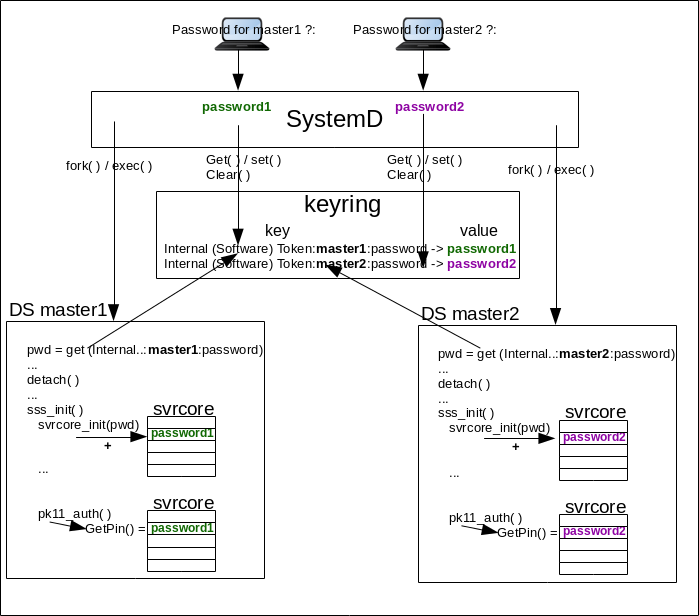
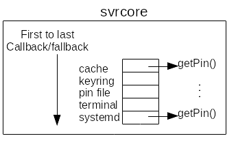

    
# protection of NSS DB content
----------------



This document describes how Directory Server will protect NSS database access. Using Keyring or Clevis/Tang we can prevent NSS sensitive files (passwords, extracted keys and certificates) to be compromised.

Overview
--------

Directory servers installation contains some sensitive files. Relying on the rights of the files looks as a weak protection in case of an attack. The idea is either to remove those files or to make the content of those files useless if compromised. This document details two different approaches <b>Keyring</b> and <b>Clevis/Tang</b>.

Use Cases
---------

DS is configured with secure port. The administrator wants DS be start without being prompted for NSS password.
To do So he creates a pin file (pin.txt) that is used to initialize the NSS database and extract key/certs.
Someone connected on the Directory server host, with the appropriate rights, can use the pin.txt file to read/write NSS database.

# Design
------

Directory server is a service of systemd, so if it terminates abrutly (a crash) systemd may restart it automatically. In such case the administrator does not want to be prompted for a NSS password and so registers the NSS password in <b>pin.txt</b> file. In order to protect the file we evaluate two options:

- storing the password  into an in memory repository, in <u>replacement</u> of <b>pin.txt</b> file, where it can be retrieved. This is the purpose of <b>Keyring</b>.
- <u>keeping</u> a pin file (possibly renamed into <b>encrypted_pin.txt</b> ) but encrypting its content so that its content is useless: this is the purpose of <b>Clevis/Tang</b>

Several components are impacted with this change:

- Svrcore
- keyring
- Clevis and Tang
- SystemD
- DS core server
- Selinux

The following figure shows the global architecture of systemd/DS using keyring. Clevis and Tang is not the [chosen option](#Clevis/Tang not used)

## Svrcore

### principle

Directory servers retrieves NSS password using <i>svrcore</i> framework. This framework call a retrieving method and if the method fails then it calls a fallback. The fallback also registers a method/fallback etc.. Svrcore basically contains a <u>ordered list of retrieval method and fallback</u>. Each method/fallback is registered in a so called <i>plugin</i>. Each DS instance has its own <i>svrcore list method/fallback</i>. The ordered list of retrieval method is:

- retrieval from <b>svcore cache</b> using the NNS default slot token (see below) as a key for cache lookup.
- retrieval from <b>pin.txt</b>
- retrieval from systemd <b>'/run/systemd/ask-password'</b> framework
- retrieval from terminal

### New plugin

DS retrieves NSS password using <i>svrcore</i>. In order to take into account a new retrieval method (<b>keyring</b> or <b>Clevis/Tang</b>) we need to create a new svrcore plugin (keyring or clevisTang). The plugin defines the retrieval method (using standard callback <b>getPin</b>) and insert it at the appropriate place in the retrieval method/fallback ordered list.
With <b>keyring</b> the plugin method is in <b>keyring-ask-password.c</b> and the insertion in <b>std-keyring.c</b>.
With <b>ClevisTang</b> the plugin method is in <b>clevistang-ask-password.c</b> and the insertion in <b>std-clevistang.c</b>.

Using <b>keyring</b> or alternatively <b>ClevisTang</b> the resulting ordered list is

- retrieval from <b>svcore cache</b> using the NNS default slot token (see below) as a key for cache lookup.
- retrieval from <b>keyring</b> or alternatively <b>ClevisTang</b>
- retrieval from <b>pin.txt</b>
- retrieval from systemd <b>'/run/systemd/ask-password'</b> framework
- retrieval from terminal

### setup / getPin

Because the password is stored while being <b>root</b> and needed while being <b>&lt;nsslapd-localuser&gt;</b> (aka as <b>dirsrv</b>) it requires an intermediate step.
The password is stored once prompted by <b>systemd</b>. Before the DS deamon calls setuid (<b>detach</b>), DS running as root retrieves the password using <b>keyctl_search/keyctl_read</b> and stores it in a <i>local variable</i>. Then DS starts running as <b>dirsrv</b> and copy the password from the <b>local variable</b> to <b>svrcore keyring plugin</b> during <b>svrcore_setup</b>.
Finally when DS needs the password, for NSS/SSL initialization, it calls <b>svrcore getPin</b> (during <b>slapd_ssl_init/slapd_pk11_authenticate</b>.

DS retrieves the password from keyring at the condition security is enabled (<i>nsslapd-security</i>). If <i>nsslapd-security: off</i> NSS password is NULL and during svrcore_setup the svrcore keyring plugin does <b>not</b> register the keyring getPin callback.

## Keyring

### provisioning

After a <i>reboot</i> of a box hosting the directory server, the <u>keyring does not contain any data</u>. To be provisioned, the first time the directory instance is started (via <i>systemd</i>), the system administrator is prompted (<b>systemd-ask-password</b>) for the NSS password. Then the password is stored (in <u>clear text</u>) in <i>keyring</i>.

At this time the administrator is logged as <i>root</i> and stores the password in <b>'@u'</b> <i>keyring</i> with <b>'user'</b> <i>keytype</i>.

### retrieval

Later the password is retrieved by directory server (using svrcore and <b>keyring</b> plugin). 

An important point is that <b>keyring provisioning</b> is done by <b>systemd</b> so by <b>root</b> user. The retrieval is done by <b>directory server</b>, that is launched as <b>root</b> but later setuid to <b>&lt;nsslapd-localuser&gt;</b> (aka as <b>dirsrv</b>).

### key name
Keyring is a shared repository, so it will contains <u>all</u> the NSS passwords of all instances running on the box.
The <i>keyname</i> must differentiate each individual instance. So the <i>keyname</i> has the format: &lt;<i>fixed name</i>&gt;&lt;<i>instance_serverid</i>&gt;&lt;<i>info_type</i>&gt;, where 

- <i>fixed name</i> is <u>Internal (Software) Token</u> that is the <b>token_name</b> of the NSS default slot. The <b>token_name</b>(dbTokenDescription) used during <b>slapd_nss_init/slapd_pk11_configurePKCS11</b>.
- <i>instance_serverid</i> is <u>serverID</u>  (e.g. 'master1')
- <i>info_type</i> is <u>password</u> meaning this key retrieves a password related to instance_serverid

## Core server

### using keyring

It exists <u>two</u> phases that register and later retrieve the password:

- <i>systemd</i>: <i>systemd</i> (in systemd template <b>ExecStartPre</b>) prompts the password and registers it into <i>keyring</i>. Later <i>core server</i> retrieves the password from <i>keyring</i> to be used for NSS/SSL initialization. Note, before prompting the password <i>systemd</i> check if it is already registered. If it is already registered it does nothing. That means the if the registered password is invalid, the administrator needs to <b>clear</b> the all <i>keyring</i> <b>@u</b> or simply <b>purge</b> the specific <i>keyname</i>.
- <i>svrcore</i>: <i>core server</i> registers the password in the <b>svrcore keyring plugin</b> (<b>svrcore_setup</b>), later <i>core server</i> retrieves the password from <b>svrcore keyring plugin</b> (<b>getPin</b>) and uses it for NSS/SSL initialization.

If the core server (<b>main.c</b>) uses <b>keyring</b> then it requires the link option <b>-lkeyutils</b> and define build option <b>-DWITH_KEYRING</b>. Indeed core server calls <b>keyctl_search/keyctl_read</b> to retrieve the password from <b>keyring</b>. It does this while the DS deamon is running as root (before <b>detach</b>).
When retrieved, it provides the password to NSS/SSL setup rountine (<b>slapd_do_all_nss_ssl_init</b>). This routine first registers (<b>svrcore_setup</b>) the password into the svrcore plugin that handle <i>keyring</i> (<b>std-keyring.c</b>) then later retrieved from <i>svrcore</i> (<b>getPin</b>) during <b>slapd_ssl_init/slapd_pk11_authenticate</b>.

In the first phase, when DS started by <i>systemd</i> retrieves password from <i>keyring</i>, it calls keyctl_read that triggers a <i>Selinux AVC</i>. A new policy is required TBD.

### using Clevis/Tang

The idea would be to let a <i>systemd</i> script (in systemd template <b>ExecStartPre</b>) to test if it exists <b>encrypted_pin.txt</b> JSON file. If it does not exist either prompt or read the <b>pin.txt</b> file, encode the password, store it into <b>encrypted_pin.txt</b> and remove <b>pin.txt</b> file.

#### Tang server

We need a tang server to encrypt and decrypt. If each host has its local own <i>Tang server</i> it is a bit generous. The advantage is it simplifes the process of key rotation and only local instance are impacted in case of problem on the <i>Tang server</i>.
If we have a centralized <i>Tang server</i>, it becomes a SPOF and its key rotation will impact all instance using it.
It requires to 

- install the <b>tang</b> rpm
- generate signature (<b>jose jwk gen -i '{"alg":"ES512"}' -o /var/db/tang/new_sig.jwk</b>) and exchange (<b>jose jwk gen -i '{"alg":"ECMR"}' -o /var/db/tang/new_exc.jwk</b>)
- start the <b>tangd.socket</b> server (<b>systemctl enable tangd.socket --now</b>)
- a change of <b>ListenStream</b> (in <i>/usr/lib/systemd/system/tangd.socket</i>) require firewall+selinux setup to allow the port.

#### Clevis client

The <i>Clevis</i> client is used to translate a clear text password file <b>pin.txt</b> into an encrypted one: <b>clevis encrypt tang '{"url", "http://&lt;tang_server_hostname&gt;[:&lt;tang_server_ListenStream&gt;]"}' &lt; pin.txt &gt; encrypted_pin.txt</b>.

#### Clevis/Tang not used
<a name="Clevis/Tang not used">

Once encrypted into <b>encrypted_pin.txt</b>, the clear text password can be retrieve using <b>clevis descripte</b> command. It requires the rights to access the <b>encrypted_pin.txt</b> file and the access to the <b>tang server</b>. So an attacker logged on the host and having the appropriate access, can decrypt the password and read the NSS database. It adds an additional step (vs <b>pin.txt</b>) but the original concern is the same: It exists a file that gives access to NSS database.

For this reason, Clevis/Tang is not used.

## systemd

With keyring a <i>ExecStartPre</i> script must fetch (<b>keyctl search @u user &lt;key_name&gt;</b>) the NSS instance password. If it does not exist (and is required <i>nsslapd-security: on</i>), the script prompts (<b>systemd-ask-password</b>) the administrator and store the password in keyring (<b>keyctl padd user &lt;key_name&gt; @u</b>).

The script (currently <i>ds-keyring.pl</i>) should be integrated into <b>dsctl</b> with new command (<b>dsctl &lt;instance&gt; keyring ...</b>)

To allow DS to read the keyring password (<b>keyctl_read</b>), the systemd template must define <b>KeyringMode=shared</b> 

Once stored into keyring the password is available until next reboot. That means that if the instance is restarted, it will fetch the password directly from keyring. If it is required to prompt the password at each restart, it is possible to add a <i>ExecStopPost</i> directive to <b>clear</b>/<b>unlink</b> the password.

## Selinux

When the core server, running as root, reads keyring (<b>keyctl_read</b>) it triggers an <i>Selinux AVC</i>. 
The bugzilla [\#1782896](https://bugzilla.redhat.com/show_bug.cgi?id=1782896) track the required selinux policy.

## container consideration

Keyring is not namespaced and containers are sharing the kernel keyring of the same user.
As a consequence the <i>description</i> of the stored key (<i> Internal (Software) Token:inst_name:password</i>) can be identical on several containers. 
For containers the <i>description</i> should be enhanced to something like <i> Internal (Software) Token:inst_name:containerId:password</i>.

A workaround, to run DS with security in containers, is that <b>all</b> instances on a box (in a container or not) are defining <b>pin.txt</b> file.

    The proposed solution. This may include but is not limited to:

    -   new schema
    -   syntax of commands
    -   logic flow
    -   access control considerations

    Implementation
    --------------

    Any additional requirements or changes discovered during the implementation phase.

    Major configuration options and enablement
    ------------------------------------------

    Any configuration options? Any commands to enable/disable the feature or turn on/off its parts?

    Replication
    -----------

    Any impact on replication?

    Updates and Upgrades
    --------------------

    Any impact on updates and upgrades?

    Dependencies
    ------------

    Any new package and library dependencies.

    External Impact
    ---------------

    Impact on other development teams and components

    Origin
    -------------

    A link to the trac ticket or bugzilla

    Author
    ------

    <you@redhat.com>

