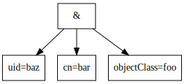

# Query Optimisation for LDAP search filters
--------------------------------------------

## Introduction
---------------

One of the key components of the directory server is the searching interface. It is arguably the most important function of a directory server to satisfy search in an efficient and correct manner.

Directory searches are based on "filters". The operation of a search is to take a candidate set of results, and reduce the contents of the set based on these filters, until all filters have been applied. At this stage we have the result set which is transmitted to the client.

These filters take a variety of forms, and the filter specification is it's own simple domain specific language.

In order to improve search performance, a number of solutions have been implemented in the directory, from caching of entries in faster random access locations, to indexing of search terms to improve the efficiency of the candidate set filtering.

There are many efficiency improvements to be realised. This design document will detail the current operation of filter processing and indexed searches, as well as proposing a new index type and search strategy based on basic decision trees and filter tree abstraction.

## Current filter implementation
--------------------------------

### Description
---------------

The majority of work currently done in the seas is the ldbm backends ldbm_search.c, in the function ldbm_back_search(). Depending on the search type, this calls filter_candidates in the case of subtree and onelevel searches (A base search will only ever have one result, so is already considered as optimised.)

In the absence of indexed attributes, the searching backend builds a filtering regex, compiles and applies it to the entries in the candidate list. We are not interested in this behaviour as we are unable to improve the performance of this behaviour in a fully unindexed search.

If we have a filter which has 1 or more indexed attributes, the indexed attributes are searched first by index_subsys_evaluate_filter() and the result set returned once it is complete.

In index_subsystem.c, (which is decoupled from the ldbm code) applies the available indexes left to right, by:

There is a simple optimisation available here where the components of an AND filter are rearranged to make the indexed components to the left of the filter in index_subsys_group_decoders() . However, no regard is made to the order of the indexed components.

The current application of the filter is for intents and purposes "left to right, indexed first within an AND statement".

Therefore, in the filter where all of objectClass, cn and uid are indexed:

    '(&(objectClass=foo)(cn=bar)(uid=baz))'

The filter for objectClass=foo will be applied first before the filter for cn=bar, followed by uid=baz.

### Filter application
----------------------

As a result, there are cases, especially within an AND clause where the re-arranging of the filter components can yield a performance increase.

Consider a database of 40 entries. We will declare the set of all entries as E. 30 of these have objectClass=foo, 20 with cn=bar and 10 with uid=baz.

Let us also assume that:
* 25 have objectClass=foo and cn=bar.
* 15 have objectClass=foo and uid=baz.
* 5 have cn=bar and uid=baz.
* a single entry contains all of objectClass=foo, cn=bar, uid=baz.

The application of the filter:

    '(&(objectClass=foo)(cn=bar)(uid=baz))'

Should yield a single result.

However, the interesting discussion is in the way this is applied and the size of the candidate sets through out the steps.

If we take the initial load of E, when we apply the filter objectClass=foo, we reduce E to E' (E prime) consisting 30 entries. Let us presume this takes 40 operations to complete.

If we now apply cn=bar to E', to create E'' we must conduct 30 operations to reduce the set to 25 entries.

Finally, we apply uid=baz to E'', and must apply 25 operations to reduce the result set to the single entry that contains objectClass=foo, cn=bar, uid=baz.

In total, we have expended 95 operations to achieve this.

We rearrange this filter to:

    '(&(uid=baz)(cn=bar)(objectClass=foo))'

Now we apply it to the same set E.

First, we apply uid=baz to the set E, to create E'. We must apply 40 operations to reduce to 10 entries.

Now we apply cn=bar to the set E'. We apply 10 operations to reduce the set to E'' consisting of 5 entries.

Finally, we apply objectClass=foo. We apply 5 operations to reduce the set to the single result entry.

By rearranging this filter we have reduced our theoretical number of operations from 95 to 55. This represents nearly a 50% reduction in steps. If we consider the memory usage of the search, this will decrease, as will our requirements to access the cache, and perform operations on the indices for comparison.

There are a number of real world examples that support this style of re-arrangement having significant effects on search time reduction. However, we cannot rely on administrators or applications to optimise their searches to take advantage of this pattern.

## Query optimisation and application using statistical analysis and abstract syntax trees.
-------------------------------------------------------------------------------------------

This design document will describe a number of proposals which will build into a new method of filter application and usage within the directory server.

### Proposal 1: Index type "popularity"
--------------------------------------

A new index type called "popularity" should be added. This index will track two important statistics.

First, it will track the number of objects each subtree that posses an attribute X. The index for objectClass if it contained the type "popularity" would track the number of objects in that subtree that held an instance of the attribute X with some value.

By tracking the subtree, if we have:

    dc=example,dc=com
    |-  ou=people
    \-  ou=groups

We will know the number of attributes in each subtree, and the popularity of attributes in them. We may have say:

dc=example,dc=com

* objectClass = 50
* cn = 50
* uid = 20

ou=people,dc=example,dc=com

* objectClass = 20
* cn = 20
* uid = 20

ou=group,dc=example,dc=com

* objectClass = 30
* cn = 30
* uid = 0

Second, if the attribute contains both popularity and equality, the number of unique equality index values will be tracked per subtree. Consider:

* uid=a
* uid=b
* uid=c

We would track this as "3" since in a directory with an unknown number of objects, only three unique values of uid exist.

It would be recommended that all values that contain an index of some nature, also implement the popularity index type.

As a property of this index, the value of the number of objectClass entries in a directory is also a count of the number of objects in the directory. This property is important and we will use it later.

### Proposal 2: Parse filters into abstract syntax trees
-------------------------------------------------------

Ldap filtering is a small domain specific language, and semantically can be broken down into a tree of operations that must be performed. Consider our filter:

    '(&(uid=baz)(cn=bar)(objectClass=foo))'

This would be represented in an AST as:

A more complex filter such as:

    '(&(|(uid=a)(uid=b)(uid=c))(!(cn=bar))(sn=*)(objectClass=foo))'

Would be represented as:

Once the filter has been converted to one of these trees, we would be able to analyse and optimise certain operations.

### Proposal 3: Automatic query optimisation using popularity and filter ASTs
----------------------------------------------------------------------------

#### Rules
----------

Once both the popularity index, and the filter to AST infrastructure is in place, we are able to apply the two to form decisions and optimise queries in a more powerful and automated manner.

We can now use these values to determine "filter gain" through the application of these. For our case, the greatest "gain" is being able to statistically conclude the greatest reduction in working candidate set E' as we progress in the application of the filter.

This value is a statistical approximation of the reduction in the entries by percentage of how many entries that might exist with that attribute potentially containing the value X. Obviously we cannot know the exact number until we have completed the search.

We want to calculate a value that will return us the smallest percentage of objects from the subtree which contain the value we seek. We calculate the likelihood of 'filter gain', henceforth fg as:

    (('total' / 'unique') / 'number subtree objects')

A lower value represents a smaller resulting set. We are therefore aiming to optimise our query to apply lower values first to prune as much of the set E as possible through each step. This algorithm will reward values with high sets of unique values, and smaller set sizes over those will less unique values and bigger sizes.

We will determine the fg of a presence index is:

    ('total' / 'number subtree objects')

The reason for this, is that a presence index gains us very little compared to equality indices with regard to the reduction of the candidate set. We want to validate it "last" when we have a small candidate set as a final sanity check of the entries we have collected. Yet, if the presence attribute was rare within the directory, consider:

rareAttr:

* total: 2
* unique: 2

This would yield an fg within our example set of entries of '0.05' as we would significantly reduce the candidate set size in a single operation.

We determine the fg of an OR filter as the sum of all fg values in the children of the OR, up to the maximum value 1. The total of an OR value is the sum of total of child filters total for the purpose of query ordering in the case of duplicate fg.

We determine the fg of an AND filter as the the smallest fg value in the set of AND child fg values. The total value of an AND filter is the largest total of the child filters for the purpose of query ordering in the case of duplicate fg.

We determine the fg of a NOT filter as:

    fg = 1 - 'child fg'
    if fg == 0: fg = 1

For the purpose of query ordering, the total of a not query is the total number of objects in the subtree.

Consider an example, (!(cn=bar)). We are for all intents and purposes requesting "All entries minus the targeted one". As a result, if we consider 1 to be "all entries", we are requesting the inverse fg. As a result, we likely want to process this last when our candidate set is small due to the potentially high number of results.

Additionally, if we have (!(sn=*)), then this actually prioritises the check if SN is a "common" value as it represents as a rapid reduction in the candidate set.

We must include the clause where by if the result of 1 - 1 = 0, this would mean an inefficient query may take priority over all others. There is a an explanation of this later.

If two values have the same fg value, the entry with a smaller 'total' should be considered first.

#### Simple query optimisation
------------------------------

Let us consider the first example once more. As a refresh:

A database backend, the set of all entries is E. Contains:

* 30 entries have objectClass=foo.
* 20 with cn=bar.
* 10 with uid=baz.

In addition:

* 25 have objectClass=foo and cn=bar.
* 15 have objectClass=foo and uid=baz.
* 5 have cn=bar and uid=baz.
* a single entry contains all of objectClass=foo, cn=bar, uid=baz.

We assume that we have a system that has implemented and enabled the equality and popularity index on all three attributes. We also assume that the query is rooted at the base of the directory, so the subtree values are equivalent to the directory backend values.

We are now able to use this popularity data to help us reason about the tree data.

Lets assume that for objectClass the contents of the popularity index are:

* total: 40
* unique: 15

Remember, that objectClass total also represents the total number of objects in the subtree.

The contents of the popularity index for cn are:

* total: 30
* unique: 8

The contents of the popularity index for uid are:

* total: 20
* unique: 15

Using these values we can now convert the query to an AST and populate these values. 'u' is unique, 't' is total:

We now apply the functions to the values of the attributes in the AST:

We would then rearrange the filter to be:

    '(&(uid=baz)(objectClass=foo)(cn=bar))'

This is a different result than our first manual calculation. Why? The low uniqueness of cn is what has altered the outcome, as objectclass has a more broad spread, and a greater likely hood to have more "uniqueness" in the indexes, promoting a faster lookup. However, we still have gained significantly over our first filter invocation.

If the value of cn was more broad, consider:

The contents of the popularity index for cn are:

* total: 30
* unique: 20

Note: Remember, although many objects have cn=bar, it can be multivalued.

Now the fg for cn would be '0.037'. This would give us the filter value:

    '(&(uid=baz)(cn=bar)(objectClass=foo))'

Given that most directories have very low overlap of values, and high entry uniqueness, this will result in very well optimised queries.

#### Complex query optimisation
------------------------------

Let us consider the more complex query:

    '(&(|(uid=a)(uid=b)(uid=c))(!(cn=bar))(sn=*)(objectClass=foo))'

Here we must not just consider the information gain at the attributes within the and term, but also how to apply OR and NOT with our tree. Additionally, how do we consider the presence search.

We assume that we have a system that has implemented and enabled the equality and popularity index on all four attributes. We also assume that the query is rooted at the base of the directory, so the subtree values are equivalent to the directory backend values.

Let us assume the following values in the popularity index:

objectClass:

* total: 40
* unique: 20

Remember, that objectClass total also represents the total number of objects in the subtree.

cn:

* total: 30
* unique: 30

uid:

* total: 30
* unique: 30

sn:

* total: 30
* unique: 20

If we use these to calculate the fg values in the AST:

As a result, the optimised application of this query is:

    '(&(objectClass=foo)(|(uid=a)(uid=b)(uid=c))(sn=*)(!(cn=bar)))'

If we calculate the number of operations for each query, the unoptimised version would perform many more reductions in the initial set of '(\|(uid=a)(uid=b)(uid=c))' operations, where the optimised one delays this until later in the filter application. By delaying this, there are less entries to consider in the evaluation.

#### Ridiculous complex query
-----------------------------

TBW

#### Remaining cases
--------------------

Two major filter cases remain: Substring search, and unindexed values.

The ability to determine fg from a substring query is quite hard, as there are many more possibilities. If we applied the equality fg formula, we would have so many unique "substring index" values, that we would always prefer the substring index first potentially. There is no easy to way to represent the gain in a substring search, so I propose that they are assigned an fg value of 0.75 and their total entry numbers determine the ordering. This way, we tend to apply the faster indexed types first, and we leave substring execution until later in evaluation when there are fewer candidates. 

We may revisit this later as there may be ways to determine an appropriate formula for this.

Handling of unindexed values. Because we know if the value is unindexed or not, we can use this information during the parse of the tree to flag to the admin exactly which value is unindexed and the exact nature of the search that is in question. This will help administrators determine more efficient indexes to apply to their system. Unindexed terms will be given the fg of 1 (as below). Essentially, an unindexed component will "taint" components of a filter, and cause them to be de-preffered until later in execution.

Any term that is unindexed or does not possess a popularity index, should be treated as though they have a total number of objects equal to the total number of objects in the subtree. They should be treated as though they have a unique value of 1. This will cause the calculation of fg to determine their value to be 1, meaning these terms cannot be analysed, so we have no choice but to deprefer them in our calculation.

By forcing unindexed values to be considered near the end of the query, we should have already reduced the candidate set which will mean the unindexed operations should be significantly faster.

### Future Proposal 4: Filter execution from the AST structure
-------------------------------------------------------

Rather than building this AST to conduct a query rearrangement, we can execute the query in the order by traversing the AST once the optimised form is found. We can build the candidate sets and descend through the tree, and pass the candidate set between steps of the filter evaluation. This could significantly improve performance of fully unindexed queries, and could reduce memory usage of the directory server during query execution. It may also simplify the query execution code. There are a number of questions around the behaviour of the index backends and how these are queried before this proposal can be fully realised. It is noted here as a future idea.

## Benefits
------------

Directory server and it's search code has remained rather the same for many years. Yet we have applications that now demand more, are using bigger data-sets, and have greater demands on response times and latency. We must address this to future proof our system.

* Faster execution of queries, especially complex queries such as found in FreeIPA. FreeIPA has many unoptimised and complex multivalue queries. Any improvement in their execution will greatly aid the operation of directory server.
* Reduction in pressure on caches of the directory server. Cache tuning is a large issue, and any pressure we can take of the cache, means we are able to utilise it more effectively.
* Reduction in CPU load. This will allow us to service more queries, faster.
* Improved diagnostics and feedback to system administrators about which attributes in a filter may require indexing, as well as type of index to apply.
* Improved metrics on performance of application of sub-components of a filter. If we apply proposal 4, we will be able to time the evaluation of specific filter components to determine areas of code improvement.

Queries with only a single term will not benefit from this optimiser. Only queries with two terms (and indices), or three terms for fully unindexed queries will see a performance improvement with this optimiser.

## Configuration
-----------------

A set of new parameters would be added.

This value on an attribute index will enable popularity tracking.

    dn: cn=attr,cn=backend,cn=ldbm plugin,cn=config
    nsIndexType: popularity

A value should be added to the system or to the ldbm backend (see considerations) that will determine if the ast optimiser is used.

    nsslapd-enable-query-optimisation: true|false

Initially, this would default to false. It would become true in a later version.

## Considerations
------------------

This scheme relies on objectClass having a present popularity index. Without this, the entire system is not possible.

If we were willing to, we could track the actual number of values rather than using a 'fuzzy' number from "unique / total". This may allow us far more specific and correct optimisation on a variety of data-sets, but will require more overhead in management of the popularity and equality indices.

Optimised query cache. We could use a hash map or something else efficient to cache pre-computed AST's of known filters. This would prevent us needing to re-parse them with each execution. Risks with this would be needing to invalidate the cache when a value of total / unique changed for an attribute used by the AST in question. I do not believe the ast cache in necessary.

Once we have the AST mechanisms in place, we can automatically normalise queries such as:

    (&(&(x=1)(y=2))(z=3)) -> (&(x=1)(y=2)(z=3))

    (|(|(x=1)(y=2))(z=3)) -> (|(x=1)(y=2)(z=3))

    (!(!(x=1))) -> (x=1)

We use floating point extensively in this due to the fractions involved. In the actual implementation, we should avoid this, and determine a way to represent this more efficiently with integers, or to cache calculated fg values in the indices.

Updating of the total and unique values will happen during the execution of an equality index update and should trigger the popularity index updates.

Given the nature of the popularity index to retrieve the values from the subtree, this means that queries executed at the root of the DS compared to based in a subtree may gain different optimisation profiles. In both cases, this will benefit the user as queries will be optimised to use the most relevant indices.

The optimiser and execution code needs to either be placed into the main ns-slapd library so that backends are un-aware of the planning, and act as "dumb" forwarders of data when requested.

Alternately, the optimised searching code can be placed into the backend to gain access to more lower level data.

This decision will affect where the configuration items are placed in cn=config.

This is a large, serious change proposal. It is not to be entered into lightly, but there are many benefits in the long term for the project if we implement a proper query optimiser.

## Author
---------

William Brown:  wibrown at redhat dot com

