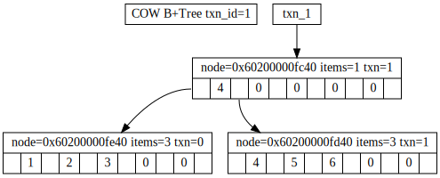
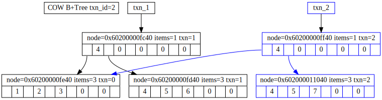
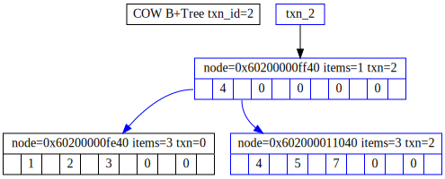



# Transactional operations in Directory Server
----------------------------------------------

## Overview
-----------

This design really aims to target a number of issues that have arisen in the server over time.

* Ability to adopt new technologies. LMDB requires a different processing model to take advantage of it.
* Safety. Historically we have been very poor at multi thread safety.
* Performance. To combat our safety issues, we have seen an explosion of "fine grained" locks, that create serialisation points everywhere.
* Plugins aren't really plugins. They can't just "work on an operation" safely, they are having to worry about multithread issues: Our API doesn't make guarantees that we should!
* plugin api is showing it's age. It evolved rather than being designed, which now shows in the pblock code.

## Current Architecture
-----------------------

The current design of the server has operations proceed in a semi-parallel and semi-serialised fashion. Lets consider an "add" operation:

    Operation Begins
            |
            V
    Run PRE_ADD plugins
            |
            V
    Begin backend transaction
            |
            V
    Check Access Controls
            |
            V
    Run BETXN_PRE_ADD plugins
            |
            V
    Tentative add to DB
            |
            V
    Run BETXN_POST_ADD plugins
            |
            V
    Commit TXN to DB
            |
            V
    Run POST_ADD plugins
            |
            V
    Result returned to client

Now, we have to consider that these can be running in parallel, and now we have to add many interactions into this process.

* Plugin list. This can change due to another operation adding/modifying plugins, so we need a way to keep this consistent. This means there is a lock there.
* Backend transaction. Only one operation can be in a transaction at a time.
** If in PRE_ADD, outside of the transaction we do a search this creates and IMPLIED transaction, and calls plugins. Now we have the backend transaction and plugin locks out of order (causes lots of deadlocks in the past)
* Access Controls. Another thread could change these, so these are locked too.
* Cache in the backend. This is a hashmap, so has to be locked, which means we block searches. Only one thread in BETXN at a time!
* Plugins themself may contain a lock, because another thread could change their config (which does NOT happen under a backend lock), so as a result, we have to lock inside a plugin.
* Schema needs a lock, as another thread might change it part way through the operation.
* The server config is able to be changed outside of a transaction, so that needs a lock if we ever access it.
* Writing a message to the logs needs a lock.

So below is the same chart with only *some* of the locks added in:

    (locks denoted by x)

    Operation Begins
            |
            V
    Run PRE_ADD plugins X
            |
            V
    Begin backend transaction X
            |
            V
    Check Access Controls X
            |
            V
    Run BETXN_PRE_ADD plugins X
            |
            V
    Tentative add to DB
            |
            V
    Run BETXN_POST_ADD plugins X
            |
            V
    Commit TXN to DB
            |
            V
    Run POST_ADD plugins X
            |
            V
    Result returned to client

Now imagine we are runnig 30 threads or more. Every single log message, plugin call, acl check, backend operation, all need locks. We are serialised for both reads and writes effectively at many points of our operation!

### Current server conditions
-----------------------------

As a result, we have the following server environment:

* Only one thread may be working in the database at a time (read or write)
* Plugins must internally lock to prevent thread sync issues
* Only one thread may be sending a log message at a time -- (note, sometimes writing to the log means you flush and write ALL buffers causing more latency!)
* Only one thread may be accessing ACL's at a time
* Only one thread may be accessing Schema at a time
* Only one thread may access system configuration values at a time
* Transactions aborts may leave the server inconsistent (known bug in some cases)
* Plugin list for an operation is guaranteed at the start of the operation (this is good!)
* many undefined cases with dynamic plugins and changing configurations midway during operations (asan picks these up regularly)

### What do we want?
-------------------

We need a way for many of these subsystems to be able to operate either in a lockless, or protected manner, without impacting other threads. The final goal is:

* Many reads may be operating at a single point in time (without blocking a write)
* Only one write may occur at a time (without blocking reads)
* Faster access to logging messages (async buffer flush)
* Multiple reads to schema, acl, configuration at a time.
* Unblocked write to schema, acl, configuration at a time. (ie writes do not block reads, nor reads writes)
* Change to acl, schema, configuration or database, should not alter contents of an existing read (isolation between threads)
* Abort of a transaction can correctly rollback all changes of the operation
* Plugin list for an operation is guaranteed at the start of the operation
* Plugins can be disabled or enabled during an operation without affecting current operations.

## Proposed design
------------------

I propose that we use copy on write datastructures to achieve this design. A copy on write datastructure is one that allows a stable version of the tree to exist, while modifications are made on the copy. When the modifications are complete, the root node pointer of the tree is pivoted. Once the previously versions reference count drop to 0, elements for the previous tree are freed.

In the first image we see the original state of the tree. We have can take a read only transaction to txn_id 1 here.

In this image, we can see that we have a read only transaction to txn_id 1, and a write occuring in txn_id 2. Note the way that the tree branch is copied during the write, so the content of txn_id 1 is consistent through out it's operation. After this is commited, all new read transactions would begin on txn_id 2.

Finally, we close the read transaction on txn_id 1. Since there are no more users of the txn, we can trim the unreferenced nodes, and continue with the tree state as txn_2

Multiple read transactions states can be present. In other words if you do:

    Begin Read 1
    Write 2
    Begin Read 3
    Write 4
    Begin Read 4
    Write 5
    Close 1
    Close 3
    Close 4

Transaction 1, 3 and 4 are guaranteed to have their contents correct at the time the read transaction, despite there being multiple writes having occured even between read transactions.

Another property of this design is that memory placed into the tree, their lifetime is bound to the tree and it's transactions. The tree is provided with free functions, which are
correctly able to dispose of the pointers given to the tree. Provided your free function is correct, you can trust the tree to properly manage the lifetime of our references.

This means we can have the following situation. When an operation begins we can take a transaction of the active list of plugins in the tree right now. These are sorted by order of operation, so we can apply them by walking the tree. During this operation, another operation rapidly disables some plugin X from the server. The next operation would not use plugin X. The first operation would still have the reference to the node containing plugin X, so the plugin would still work. Once the use of the transaction drops to 0, the plugin would now be closed and freed as we can guarantee no future transactions are within the plugin code. If the plugin were re-opened at the same time, this would be a new plugin struct, so would not be affected by this close.

### Transactions
----------------

At the begining of a new connection, we take a write transaction on:

* Connection tree
* cn=config (ro, for connection params)

At the begining of a read operation by the client (not connection, operation) a set of transactions would be opened. This would be in:

* ACL list
* Plugin list
* Cache (ldbm)
* cn=config, cn=schema
* backends (lmdb)
* Connection tree

At the begining of a write operation (add, mod, del) a write transaction would open in:

* ACL list
* Plugin list
* Cache (ldbm)
* cn=config, cn=schema
* backends (lmdb)
* connection tree (ro)

### Plugin API
--------------

Due to the change related to transactions, plugins will need to operate differently.

Some plugins may require transactions (IE IPA's kerberos plugin.). They will be offered a plugin hook for read begin, read close, write begin, write abort and write commit. Plugins must not block read and writes, the same property we expect. This is due to the fact we may internall need a write from within a read transaction, which would cause a deadlock with pthread_rwlock. We may change this design decision later, but it is unlikely.

Plugins would be able to drop their internal locking of config etc, because they can guarantee they are they only instance in the critical segment during a write.

Plugins would be able to drop their internal locking in reads, because if they read their config from cn=config, this is guaranteed to be protected during the critical segment of a read (IE after the operation the new config would take effect).

To summarise, there are the hard requirements of a plugin for this API:

* Read and writes must be able to run simultaneously.
* Reads must operate in parallel.
* A write transaction must be able to begin a nested read transaction.
* A read transaction must be able to begin a nested write transaction.
* Commits must be guaranteed to work. If you have a write error you must raise it in the write operation, not at commit time.
* Aborts must be guaranteed to clean up their allocated data, without impact on other transactions. Aborts are run in parallel to new write transactions.
* Uncommited writes must not affect read only operations in anyway

As the plugin framework we guarantee:

* There will be one, and only one write thread in the critical section at a time.
* During a commit, no new read transactions will begin. This is your chance to update pointers.
* Aborts are run concurrent to new transactions.
* That reads and writes will *not* block, and we will run them in parallel.
* That we will run multiple concurrent reads.
* That all reads and writes have the correct cpu coherency applied - IE you do not need barriers or mutexes provided you follow the steps above.
* Abort() is called once per transaction
* Commit() is called once per transaction
* Close() on a read is not accesible post close
* Aborted and Comitted transactions are not accessable post call.

We request this, because we will use those properties stated above, and there is a risk that plugins who do not follow these explicit rules may cause corruption.

NOTES: We may add a difference between a sync abort and async abort for structures that do not support async operation. We prefer async due to performance benefits.

#### Example
------------

An example of this working is that you have a plugin that registers the hooks on the transactions. In the real final version, these transactions will be tied to the global
transaction manager, to help prevent double free/abort/commit etc.

The following is psuedo code for a working design:

    struct foo {...};
    struct plugin_txn {
        ref_count ...;
        struct *foo fref;
    }
    static struct *plugin_txn active = NULL;

    fn read_operation(plugin_txn) {
        return plugin_txn->fref;
    }

    // Reads are happening in parallel to this, but only one write!
    fn write_operation(plugin_txn) {
        if plugin_txn->fref is NULL {
            plugin_txn->fref = new_foo();
        }
        plugin_txn->fref->member = ...;
    }

    /*
     * Ref counts go in phases. First, they'll only increase when you are active and reads are taken. They will decrease
     * only to 1 (never lower).
     * as soon as a new write is commited, they begin to decrease *only* eventually to 0.
     */
    fn dec_ref_count(plugin_txn) {
        result = atomic_decrement(plugin_txn->ref_count);
        if result == 0 {
            free(plugin_txn->fref);
            free(plugin_txn);
        }
    }

    fn inc_ref_count(plugin_txn) {
        atomic_increment(plugin_txn->ref_count);
    }

    fn read_begin() {
        inc_ref_count(active);
        return active;
    }

    fn read_close(plugin_txn) {
        dec_ref_count(plugin_txn);
    }

    // Is done async, no one else saw plugin_txn that we wrote to!
    fn abort_operation(plugin_txn) {
        free(plugin_txn);
    }

    // This is done in a way that blocks new reads, so we can update active.
    fn commit_operation(plugin_txn) {
        dec_ref_count(active);
        active = plugin_txn;
        inc_ref_count(active);
    }

## Risks and mitigation strategy
--------------------------------

### Binds
---------

Binds require to write post bind. There are three solutions.

* Binds are carried out in a write transaction.
* Binds are carried out in a read transaction with async write post result send.
* Binds are carried out in a read transaction, with blocking write post result send.

### Large code change
---------------------

This is a very large code change, with no guarantee of effectiveness.

Instead of doing this in one large change, we will do smaller changes that build towards this goal. Each change in isolation will help that component, but are working toward a final goal where we will be able to realise the full benefits of the changes.

For example, the change to a connection table will benefit us without the full set of changes. The change to having ACL in a tree will help us process operations with "less locking" contention.

### Key person risk
-------------------

It is key that as a team we distribute this work so we each have an understanding of the safety model of these structures (even if you can't implement it, you need to know how it works). This way, we are not reliant on a single person to understand the entire system.

### Testing
-----------

Not such much a risk, but something we should do. Each of these features should be extensively tested *before* and *after*. In some cases, we may reveal the before is broken!

This is not just about stability, but about performance (no regressions), security (no leaks of info, etc), and of stability (no crashes, leaks). This should involve a combination of the cmocka tests, and the lib389 tests. Additionally, we should not just test these features, but commit to broad tests like replication and load tests with these changes, to check for changes in behaviour. An example is a change to the cn=config partition may cause a change to replication that consumes the configuration.

Each feature should documents it's risks and associated required tests. [Pblock Breakup](pblock-breakup.html) already documents these for the v3 compatability guarantee.

### Serialisation of operations
-------------------------------

A concern is that we are serialising operations. This is already the case in directory server! The idea of this change is to serialise them in a way, where they are unblocked from reads, making each write individually faster, so we should see an improvement in write throughput.

Read throughput would be unblocked from writes, which should allow us to see an improvement in parallism.

## Related design documents
---------------------------

-   [Nunc Stans Workers](nunc-stans-workers.html)
-   [Cache Redesign](cache_redesign.html)
-   [High Contention with Entry Cache](high-contention-on-entry-cache-lock.html)
-   [Pblock Breakup](pblock-breakup.html)
-   [Plugin Version 4](plugin-v4.html)
-   [Password extensibility](password-extensibility.html)
-   [Logging Performance Improvement](logging-performance-improvement.html)

## Implementation plan
------------------------

Goals:

* 1) Core and clean up
* 2) Modularisation
* 3) Plugin version 4
* 4) Transactions

#### 1.3.6
--------------------------

* Finish COW B+Tree  G4 [sds 1](https://pagure.io/libsds/issue/1)
* Decouple transaction manager  G2 [sds 9](https://pagure.io/libsds/issue/9)
* Write cache implementation  G4 [sds 2](https://pagure.io/libsds/issue/2)
* Finish nunc-stans tickets  G2 [nuncstans](https://pagure.io/nunc-stans)
* bundle libraries (svrcore, nunc-stans)  G2

#### 1.3.7
----------

* begin breakout of slapi platform abstraction library  G1 G2 [ds 49115](https://pagure.io/389-ds-base/issue/49115)
* Introduce private only slapi v4 api to begin work. No public access, no need to support. G3
* Pblock clean up G1 [ds 49097](https://pagure.io/389-ds-base/issue/49097)
* Nunc-Stans worker threads  G1 [ds 49099](https://pagure.io/389-ds-base/issue/49099)
* Async logging improvements  G1 [ds 48365](https://pagure.io/389-ds-base/issue/48365)
* Global server transaction manager (to allow items to register to, and coordinate transactions)  G4
* COW B+Tree for connection management  G4 [ds 49098](https://pagure.io/389-ds-base/issue/49098)
* COW B+Tree for plugin management  G4

1.4.0

* cleanup source tree  G1:

        └── ds
            ├── configure.ac
            ├── docs
            │   └── ds.doxy
            ├── m4
            ├── Makefile.am
            ├── rfcs
            ├── rpm
            └── src
                ├── libsds
                ├── libslapd
                ├── libspal
                ├── ns-slapd
                │   └── plugins
                ├── ns-slapd-tools
                │   ├── dbscan
                │   ├── dsktune
                │   ├── infadd
                │   ├── ldclt
                │   ├── ldif
                │   ├── migratecred
                │   ├── mmldif
                │   ├── pwdhash
                │   └── rsearch
                └── nunc-stans

* Fix code white space  G1
* Clean up headers and visibility  G3 [ds 49124](https://pagure.io/389-ds-base/issue/49124)
* Symbol visibility  G1
* v4 api for RH only use  G3
* clean configure with pkg-config over hard paths  G1 [ds 49119](https://pagure.io/389-ds-base/issue/49119)
* COW B+Tree for ACI internal storage  G4
* COW B+Tree for fedse.c (cn=config, cn=schema)  G4
* COW B+TRee for configuration variable storage  G4

* NOTE!! Are there more places we need to make operate in parallel for this?

#### 1.4.1
----------

* Convert plugins to plugin v4 api (retaining plugin locks) G3

#### 1.4.2
----------

* COW B+Tree cache for LDBM before we have LMDB  G4 [ds 49096](https://pagure.io/389-ds-base/issue/49096)
* LMDB  (4)
* Per-operation transactions for related transactional elements  G4 [ds 573](https://pagure.io/389-ds-base/issue/573)

#### 1.4.3
----------

* Remove locks inside of plugins  G4

### Questions
-------------

#### Is this removing the fat cache lock?
-----------------------------------------

Yes, but in itself we are proposing a pretty large lock in a way. The difference is the transaction we propose is this document, while it covers the full server, does not
block other threads simultaneously, so it will not have the same costs associated with a fat lock.

## Author
---------

William Brown -- wibrown at redhat.com
