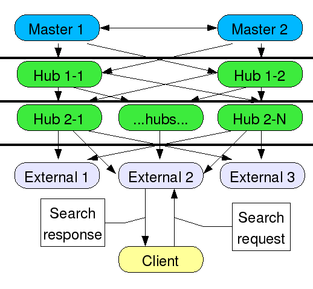
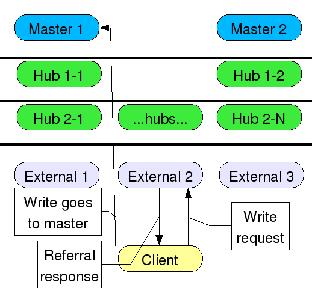
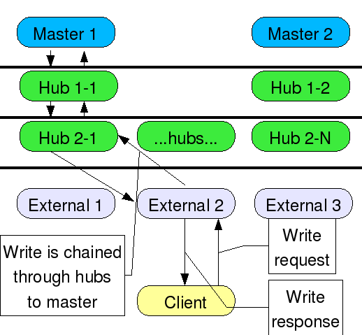

# Chain on Update
-----------------



### Introduction

The usual deployment for a large replication topology will have the client applications reading from hubs or dedicated consumers in order to spread out the load and off-load search request processing from the masters. Most clients know only about the server they have been configured to communicate with. 

Directory Servers are represented by rounded rectangles. The masters are blue, the hubs green, and the externally facing servers are gray. The lines between the servers represent replication agreements and the arrows show the direction of data flow (masters replicate to each other). The thick horizontal lines represent firewalls. "...hubs..." could be many hub replication servers used to spread the load out for many dedicated consumer replicas or other hubs. The externally facing servers could be on the public Internet, or on an extranet, at a remote location or a partner's site. This works fine for search requests. But if a client has to make a write request, the server will send back a referral to the master. This has a couple of problems:

-   Some client applications do not handle referrals very well - Some client applications do not understand referrals at all, while others may have problems with search bases, scopes and filters included in the LDAP URL in the referral
-   Some client applications may be separated by one or more layers of firewalls from the master (but not their local consumer) - this makes it difficult to configure the firewall properly if additional ports and/or incoming IP addresses must be configured, especially from potentially untrusted clients

Another problem with this scenario is password policy - account lockout after unsuccessful attempts. If, for example, your policy says that after 3 tries the user is locked out, that works fine for one server, but then the user can go to another replica and attempt login again, meaning your 3 tries is multiplied by the number of replicas the user can connect to directly. 

The replication agreements have been omitted from this diagram for clarity, but they are the same as in the above diagram. This shows a client attempting a write request to a read-only consumer, getting a referral response, and following the referral all the way to the master. In the case of a bind attempt, if the client did follow the referral, the session would be initiated and handled on the master, thus defeating the purpose of the local replica.

One solution to this problem has been the use of an LDAP router or a smart LDAP aware switching device. This router/device sits between the client and its local server. The router/device can redirect write requests to the master and read requests to the local server. Or the router/device may be able to follow the referrals on behalf of the client. There are some problems with this:

-   Most cannot send read and write requests to different servers
-   Another server/device to configure, manage, and maintain

### Solution - Chain On Update

Each replicated suffix already has 1 local backend. For each one of these, a chaining backend is created. Each chaining backend requires one or more farm servers to chain the operations to, so the immediate suppliers are used. This gives the ability to send updates back through 1 layer of firewall at a time. Of course, all chaining backends could be configured to simply send updates directly to the masters if desired. Chaining also requires a proxy user. In this case, the replication bind DN is used since it already exists on all servers. No additional users need to be created. The suffix is then configured to use the additional chaining backend. The replication plugin itself becomes the entry distribution plugin. Replication provides a function - repl\_chain\_on\_update. This function does the work - read requests are sent to the local backend and write/bind requests are sent to the chaining backend. There are certain cases where distribution is not done. All replicated operations are directed to the local backend, as well as all internal operations. All operations sent by directory manager are directed to the local backend. If the local backend is being initialized, all operations are sent to the chaining backend, not just write/bind operations. 

In this diagram, the client sends the write request to the local replica, which then chains the requests up through the hubs back to the master. Chaining uses failover, so if a hub or master is down, another path would be followed. The client sends the write request and gets back the write response as if the server it's talking to was handling the write itself. In the case of a bind operation, the master would contain the password policy attributes such as number of attempts, lockout state, and unlock time, and this data would be replicated to all other servers in the topology.

### Problems with Solution

Latency - there may be a long time lag between sending the write/bind request all the way up to the master and getting it back - there may also be a long time until the client can "read its write", that is, read back the data it just wrote. However, depending on the speed of replication vs. the speed of chaining, it may be very soon after the client gets the response that the modified data is available on the consumer. While this may not be ideal for all deployments, at least the designer has [options](../FAQ/mmrconsideredharmful.html).

Directory Manager does not chain - The directory manager user is local to each server, even read-only replicas. Chaining directory manager credentials would essentially give away the directory manager password from one server to another server. Directory Manager updates will affect even read-only replicas. Therefore **do not use Directory Manager to make updates to the read-only replicas**.

### Configuration

#### Master

The masters do not require very much configuration, only to grant the proxy right to the replication bind DN for the replicated suffix. For example, add this attribute and value to the suffix entry:

    aci: (targetattr = "*")(version 3.0; acl "Proxied authorization for database links";    
       allow (proxy) (userdn = "ldap:///cn=Replication Manager,cn=config");)    

#### Hub or Consumer

Step 1 (Hub and Consumer): the chaining backend must be created on the hub and consumer:

    dn: cn=chainbe1,cn=chaining database,cn=plugins,cn=config    
    objectclass: top    
    objectclass: extensibleObject    
    objectclass: nsBackendInstance    
    cn: chainbe1    
    nsslapd-suffix: <suffix to replicate>
    nsfarmserverurl: ldap://supplier1:port supplier2:port ... supplierN:port/ # also, ldaps can be used instead
                                                                              # of ldap for secure connections -
                                                                              # requires the secure port
    nsmultiplexorbinddn: cn=Replication Manager,cn=config # or whatever the replica bind DN is on the supplier
    nsmultiplexorcredentials: password    
    nsCheckLocalACI: on    

NOTE: You must add this entry using an LDAP ADD or MODIFY operation - you must send the clear text password for

    nsmultiplexorcredentials: password    

and let the directory server encrypt it. You cannot use a pre-hashed or pre-encrypted password.

Step 2 (Hub Only): the chaining backend plugin must be configured to allow chaining of certain controls:

    dn: cn=config,cn=chaining database,cn=plugins,cn=config    
    changetype: modify    
    add: nsTransmittedControl    
    nsTransmittedControl: 2.16.840.1.113730.3.4.18    
    nsTransmittedControl: 1.3.6.1.4.1.1466.29539.12    

Step 3 (Hub and Consumer): the suffix must be configured with the new chaining backend and the entry distribution plugin.

    dn: cn="<suffix to replicate>",cn=mapping tree,cn=config    
    changetype: modify    
    replace: nsslapd-state    
    nsslapd-state: backend    
    -    
    add: nsslapd-backend    
    nsslapd-backend: chainbe1    
    -    
    add: nsslapd-distribution-plugin    
    nsslapd-distribution-plugin: libreplication-plugin    
    -    
    add: nsslapd-distribution-funct    
    nsslapd-distribution-funct: repl_chain_on_update    

Note: This is for current versions of 389 on linux - for nsslapd-distribution-plugin you can just specify the name of the plugin. On other platforms, you may have to use the absolute path and suffix e.g.

    nsslapd-distribution-plugin: /usr/lib64/dirsrv/plugins/libreplication-plugin.so    

### Problems During Implementation

-   The replication consumer code assumes "referral on update" mode - some code had to be added to determine if chain on update was being used, and not to change the suffix state to referral or referral on update. The replication consumer still updates referrals sent from the supplier (both in the protocol and in the RUV), but it does not change the suffix state.
-   Had to change the API for entry distribution functions - there was no easy way in the API to determine the state of the backends, whether they were disabled (i.e. during import) or being deleted. It is necessary for repl\_chain\_on\_update to know the state of the backend. If the local backend is being initialized, all operations should be chained. So, an additional parameter was added - an array of backend states.
-   The chaining code did not like it when the local backend was being initialized. The chaining code assumes that there is a local backend for doing certain ACI lookups for security reasons. This backend is referred to as the associated backend. I had to change the chaining code in two ways
    -   add a mapping tree state change callback to keep track of when associated backends were taken off line or on line
    -   add an internal configuration parameter so that local acis are not used if the associated backend is off line
-   Directory Manager updates will not chain and will affect the read-only replica. **Do not use Directory Manager** to make changes to read only replicas.''' Instead, create an administrative user that exists in the chained area.

