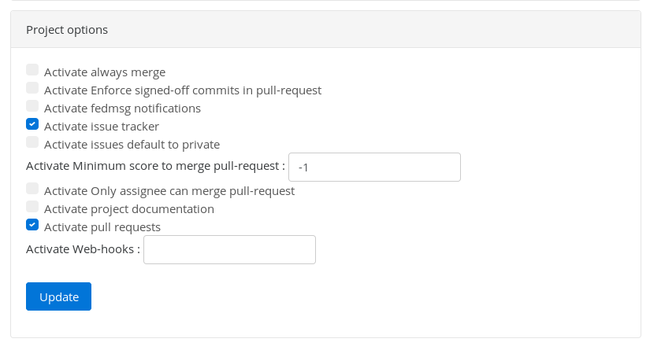
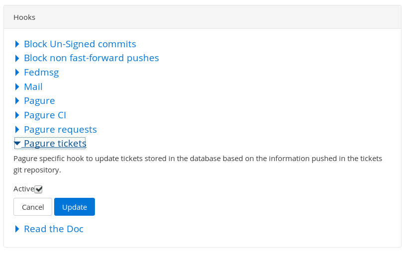
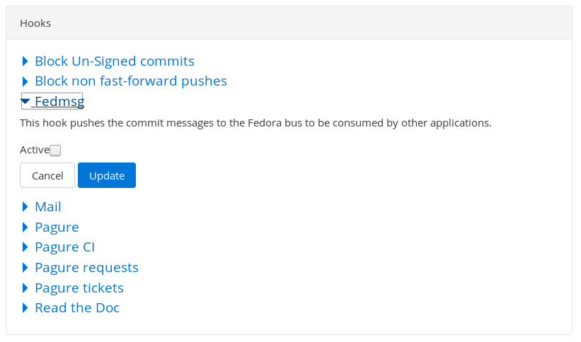
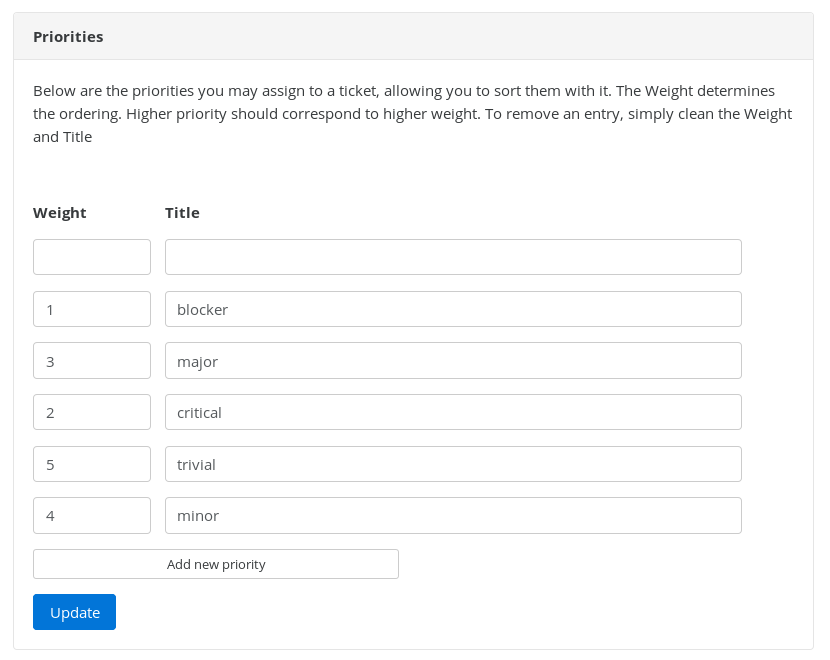
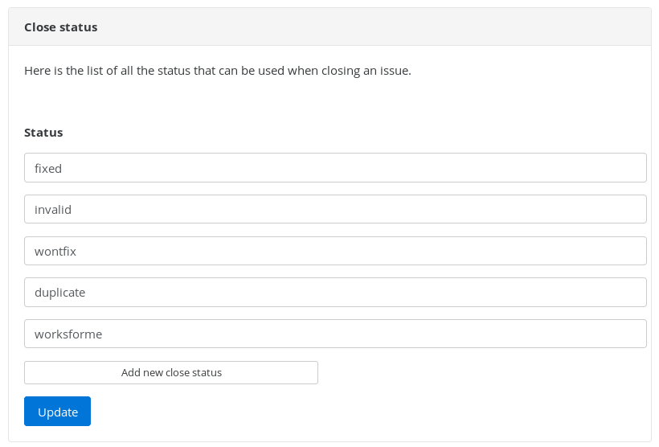
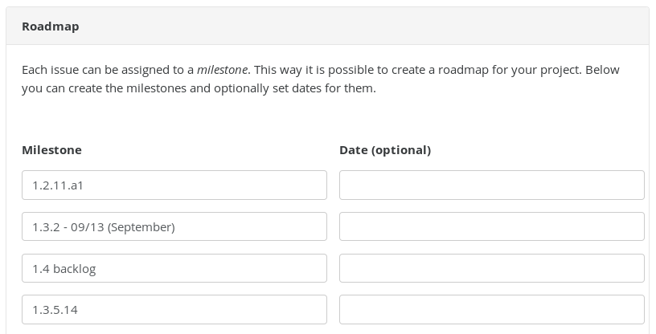
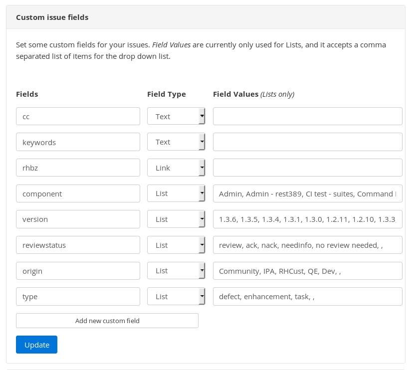
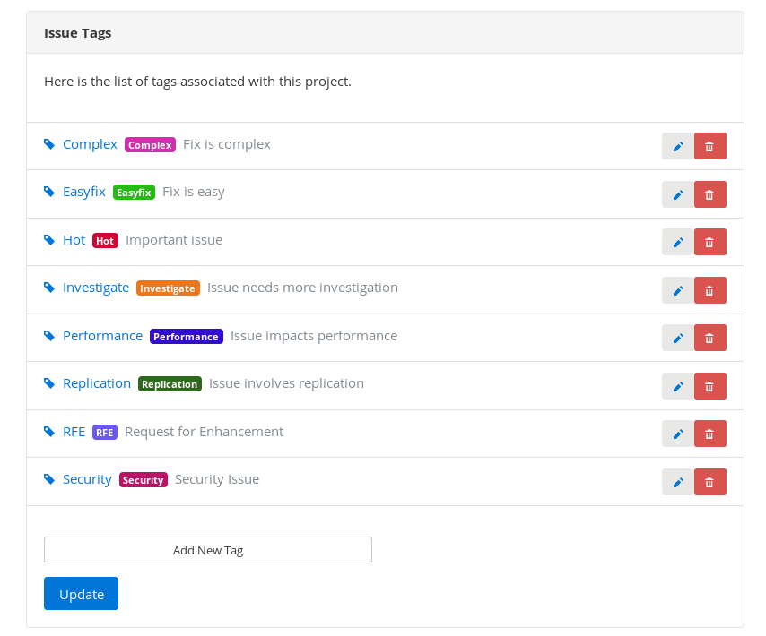
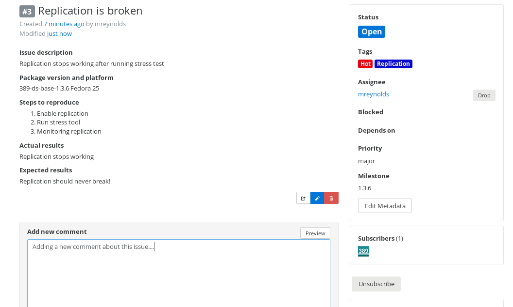
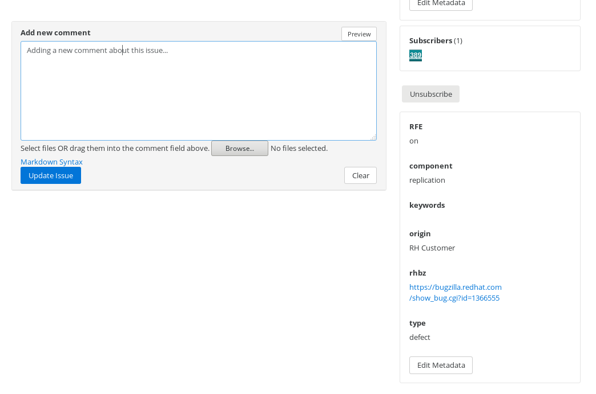

# Trac to Pagure Migration
----------------

This document discusses what needs to be done to migrate trac tickets to Pagure "Issues"



## Prepare Your Pagure Project
----------------

This section describes how to configure the various sections of your project

### Configure The Core Settings

On the project "settings" page you need to activate the issue tracker and turn off the Fedora Notifications (after the migration the fedmsg notifications should be activated)

 

#### "Project Options" Section

Activate "Issue Tracker", Deactivate Fedmsg Notifications, and Click on "Update"

 

#### "Hooks" Section

Select "Pagure tickets", and check "active", then "Update"

 

Uncheck fedmsg (just for the migration - turn this back on once the migration is complete)

 

### Configure the Default Fields

Then you need to configure these default fields:

#### Set the Priorities

Use the 'priority' list from trac

- "blocker" -> weight "1"
- "critical" -> weight "2"
- "major" -> weight "3"
- "minor" -> weight "4"
- "trivial" -> weight "5"

 

#### Set the "Closed as" options

Use the "resolution" fields from trac for these values

- Fixed
- Invalid
- wontfix
- duplicate
- worksforme

#### Milestones

You need to add every milestone from your project (this is long list)

 

 

### Configure Your Custom Fields

There are 4 types of custom fields:

  * Boolean (single checkboxes)
  * Text
  * Link
  * List (drop down list).

 

### Setup a Default Template for Issues

You can create a custom template for creating new issues.  This is in Markdown, so the format can easily be customized to your liking.

    ##### **Issue description**

    ##### **Package version and platform**

    ##### **Steps to reproduce**
    1.
    2.
    3.

    ##### **Actual results**

    ##### **Expected results**

You need to do a git clone of your projects ticket repo and create the default template

    $ git clone ssh://git@pagure.io/tickets/389-ds-base.git
    Cloning into '389-ds-base'...
    warning: You appear to have cloned an empty repository.
    Checking connectivity... done.

    $ cd 389-ds-base/
    $ mkdir templates
    $ vi templates/default.md  -->  Write your Markdown template!
    $ git add templates/default.md
    $ git commit -m "Add a default template for tickets"
    $ git push origin master
    

 

### Configure Tags

This next screenshot is just an example of using tags.  Tags are used for easy filtering and visual sorting

 

### Example of the Customized Metadata

Note - as of right now we have to use the field name that was used in trac, and not the field label.  So for bugzillas the field is "rhbz", not "Red Hat Bugzilla".  Also you must create a custom field for each trac field you want to migrate.  Any trac feild left out will be lost forever!

Here is an example of an Issue

 

#### Part 1 (Default Fields)
------------------

 

#### Part 2 (Custom Fields)
-----------------

 

## Migrate the Trac Tickets
--------------------------

### Install pagure-importer

Please follow this document:  [Pagure Importer](https://pagure.io/pagure-importer)

Then, there is a "patch" to the import that <mreynolds@redhat.com> has that you will need to properly import and migrate trac data to Pagure.  Bascially this patch just does wiki formating to Markdown conversions.  It is not yet determined if this patch for the importer will be accepted upstream.  So for now contact Mark for the new importer python scripts

### Clone your projects "ticket" repo

We are using the project name "TEST for these examples

    # pgimport clone ssh://git@pagure.io/tickets/TEST.git
    Cloning into bare repository '/tmp/TEST.git'...
    warning: You appear to have cloned an empty repository.

### Import the Trac Tickets

    # pgimport fedorahosted https://fedorahosted.org/389
    Enter your FAS Username: mreynolds
    Password: 
    #### Repo available ####
    1 - TEST.git

    Choose the import destination repo  [1]: 

### Push the migrated Issues to Pagure

Once the import is done, "push" the new pagure issues to your pagure project.  You only get one shot as this, so you better have properly configured all your default/custom fields, etc.

    # pgimport push TEST.git

 

## Wrap Things Up
---------------------

Now turn on/activate "fedmsg notifications" in the project **"Options"** and **"Hooks"** sections, and start working on Issues!

 

## Project Fields
-----------------

Here are the current custom fields coming from the following trac projects

 

### FreeIPA

 

#### Default Fields
-------------------

**priority**

blocker - 1

critical - 2

major - 3

minor - 4

trivial - 5

 
**resolution (close status)**

fixed 

invalid 

wontfix 

duplicate 

worksforme

 

**milestone**

FreeIPA 2.0 - 2010/06

FreeIPA 2.0 - 2010/07 

FreeIPA 2.0 - 2010/08 

FreeIPA 2.0 - 2010/09 

FreeIPA 2.0 - 2010/10 

FreeIPA 2.0 - 2010/11 

FreeIPA 2.0 - 2010/12 (FC) 

FreeIPA 2.0 - 2011/01 (cleanup) 

FreeIPA 2.0.1 RC (bug fixing) 

FreeIPA 2.0.2 RC2 (bug fixing)
 
FreeIPA 2.0.3 RC3 (bug fixing) 

FreeIPA 2.0.4 RC4 (bug fixing) 

FreeIPA 2.0.5 GA 

FreeIPA 2.0.6 Post GA Errata (bug fixing) 

Fedora Documentation 

FreeIPA 2.1 - 2011/05 

FreeIPA 2.1 - 2011/06 

FreeIPA 3.0 Trust Effort - 2011/06 

FreeIPA 2.1 - 2011/08 (Final) 

FreeIPA 2.1 - 2011/07 

FreeIPA 3.0 Trust Effort - 2011/07 

FreeIPA 2.1.1 (bug fixing) 

FreeIPA 3.0 Trust Effort - 2011/08 

FreeIPA 2.1.2 (bug fixing) 

FreeIPA 3.0 Trust Effort - 2011/09 

FreeIPA 3.0 Core Effort - 2011/09 

FreeIPA 2.1.3 (bug fixing) 

FreeIPA 2.1.4 (bug fixing) 

FreeIPA 3.0 Trust Effort - 2011/10 

FreeIPA 3.0 Core Effort - 2011/10 

FreeIPA 3.0 Core Effort - 2011/11 

FreeIPA 3.0 Trust Effort - 2011/11 

FreeIPA 3.0 Trust Effort - 2011/12 

FreeIPA 3.0 Core Effort - 2011/12 

FreeIPA 3.0 Core Effort Backlog 

FreeIPA 2.2 Core Effort - 2012/01 

FreeIPA 2.2 Core Effort - 2012/02 

FreeIPA 2.2 Core Effort - 2012/03 

FreeIPA 3.0 Trust Effort - 2012/01 

FreeIPA 3.0 Trust Effort - 2012/02 

FreeIPA 3.0 Trust Effort - 2012/03 

FreeIPA 2.2.0 Documentation 

FreeIPA 3.0 Core Effort - 2012/04 

FreeIPA 2.2 Core Effort - 2012/04 

FreeIPA 3.0 Core Effort - 2012/05 

FreeIPA 2.2 Core Effort - 2012/05 

FreeIPA 3.0 Trust Effort - 2012/04 

FreeIPA 3.0 Trust Effort - 2012/05 

FreeIPA 3.0 Beta 1 

FreeIPA 3.0 Beta 2 

FreeIPA 3.0 RC1 

FreeIPA 3.0 Beta 3 

FreeIPA 3.0 RC2 

FreeIPA 3.0 Core Effort Remaining Work 

FreeIPA 3.0 Trust Effort - 2012/06 

FreeIPA 3.0 Trust Effort - 2012/07 

FreeIPA 3.0 Trust Effort Backlog 

FreeIPA 3.0 Trust Effort NEEDS TRIAGE 

FreeIPA 3.0 GA 

FreeIPA 3.0.1 (bug fixing) 

FreeIPA 3.1 CS Features 

FreeIPA 3.1 Stabilization 

FreeIPA 3.0.2 

FreeIPA 3.2 - 2013/01 

FreeIPA 3.2 - 2013/02 

FreeIPA 3.2 - 2013/03 

FreeIPA 3.2 - 2013/04 (Beta) 

FreeIPA 3.2 - 2013/04-05 (GA) 

FreeIPA 3.2.x - 2013/05 (bug fixing) 

FreeIPA 3.3 - 2013/05 

FreeIPA 3.2.x - 2013/06 (bug fixing) 

FreeIPA 3.3 - 2013/06 

FreeIPA 2.2 Stabilization 

FreeIPA 4.0 - 2013/07 

FreeIPA 3.2.x - 2013/07 (bug fixing) 

FreeIPA 3.3 - 2013/07 

FreeIPA 4.0 - 2013/08 

FreeIPA 3.3.x - 2013/08 (bug fixing) 

FreeIPA 3.3.x - 2013/09 (bug fixing) 

FreeIPA 3.3.x - 2013/10 (bug fixing) 

FreeIPA 4.0 - 2013/09 

FreeIPA 4.0 - 2013/10 

FreeIPA 3.3.x - 2013/11 (bug fixing) 

FreeIPA 4.0 - 2013/11 

FreeIPA 3.3.x - 2013/12 (bug fixing) 

FreeIPA 3.3.x - 2014/01 (bug fixing) 

FreeIPA 4.0 - 2013/12 

FreeIPA 4.0 - 2014/01 

FreeIPA 4.0 - 2014/02 

FreeIPA Interim Bucket 

FreeIPA MIT OTP Work 

FreeIPA 3.3.5 (bug fixing) 

FreeIPA 4.0 - 2014/03 

FreeIPA 4.0 - 2014/04 

FreeIPA 4.0 - 2014/05 

FreeIPA 4.0 - 2014/06 

FreeIPA 4.0 Backlog 

FreeIPA 4.0 GA 

FreeIPA 4.0.1 

FreeIPA 4.0.2 

FreeIPA 4.0.3 

Revive FreeIPA guide 

FreeIPA 3.x Documentation 

FreeIPA 4.1
 
FreeIPA 4.0.4 

FreeIPA 4.0.5 

FreeIPA 4.1.1 

FreeIPA 4.1.2 

FreeIPA 3.0.3 (bug fixing) 

FreeIPA 4.1.3 

FreeIPA 4.1.4 

FreeIPA 4.2 

FreeIPA 4.2 Backlog 

FreeIPA 4.2.1 

FreeIPA 4.2.2 

FreeIPA 4.2.3 

FreeIPA 4.1.5 

FreeIPA 4.3 

FreeIPA 4.2.4 

FreeIPA 4.3.1 

FreeIPA 4.4 

FreeIPA 4.3.2 

FreeIPA 4.4.1 

FreeIPA 4.0.6 

FreeIPA 4.1.6 

FreeIPA 4.4.2 

FreeIPA 4.4 Backlog 

FreeIPA 4.4.x 

FreeIPA 4.4.3 

FreeIPA 3.3.6 (bug fixing) 

FreeIPA 4.2.5 

FreeIPA 4.3.3 

FreeIPA 4.5 

FreeIPA 4.4.4 

0.0 NEEDS_TRIAGE 

FreeIPA 4.5 backlog 

FreeIPA Community Portal 

FreeIPA Cross Project Integration 

FreeIPA Cross-distro support 

FreeIPA Documentation 

FreeIPA JBoss Integration 

FreeIPA OpenStack Integration 

FreeIPA Python 3 support 

Future Releases 

Plugins 

Ticket Backlog

Tickets Deferred

 

#### List Fields
----------------

**type**

defect

enhancement

task

refactoring

reference

 

**component**

Access control 

Backup 

Build System 

CLI 

Certificate management 

Client 

Command plugins 

Compatibility plugin 

DNS 

DS 

DS plugins 

Documentation 

Help subsystem 

IPA 

Installation 

Integration 

KDC LDAP driver 

KRA 

Man pages 

Management framework 

Migration 

NIS plugin 

NTP 

OTP 

Replication 

Samba code 

Schema 

Tests 

Troubleshooting 

Trusts 

Upgrade 

Web UI 

Wiki 

Winsync

 

**version**

git 

4.4.3 

4.4.2 

4.4.1 

4.3.2 

4.4.0 

4.3.1 

4.2.4 

4.3.0 

4.1.5 

4.2.3 

4.2.2 

4.2.1 

4.2.0 

4.1.4 

4.1.3 

4.1.2 

4.1.1 

4.1.0 

4.0.3 

4.0.2 

4.0.1 

4.0.0 

3.3.5 

3.3.4 

3.3.3 

3.3.2 

3.3.1 

3.3.0 

3.2.2 

3.2.1 

3.1.5 

3.2.0 

3.1.4 

3.1.3 

3.1.2 

3.1 

3.0 

2.2 

2.1.4 

2.1.3 

2.0'

 

**test_coverage**

wanted

yes 

no

 

**uxd**

Not needed 

Review 

Consult 

Design

 

**source**

Support 

TAM/SA 

RHEL 

Internal 

Fedora 

Upstream

 

**test_coverage**

wanted 

yes 

no

 

**expertise**

SSSD 

CS 

DS 

Kerberos

 

#### Text Fields
----------------

keywords

cc

reviewer

tester

feature_tag

changelog

 

#### Boolean Fields
-------------------

affects_doc

 

#### Link Fields
-----------------

rhbz

blockedby

blocking

design

on_review (Patch link)

external_tracker

test_case

 

### SSSD

 

#### Default fields
-------------------

**priority**

blocker 

critical 

major 

minor 

trivial

 

**resolution (closed status)**

fixed 

invalid 

wontfix 

duplicate 

worksforme 

cantfix

 

**milestone**

Iteration 2 

SSSD 0.5.0 

Iteration 3 

Iteration 4 

Iteration 5 

SSSD 0.6.1 

SSSD 0.7.0 

SSSD 1.0 RC 

SSSD 0.6.0 

SSSD 1.0 

SSSD 1.0.1 

SSSD 1.0.2 

SSSD 1.1 

SSSD 1.1.1 

SSSD 1.2.0 

SSSD 1.2.1 

SSSD 1.2.2 

SSSD 1.3.0 

SSSD 1.2.3 

SSSD 1.2.4 

SSSD 1.4.0 

SSSD 1.4.1 

SSSD 1.5.0 

SSSD 1.5.1 

SSSD 1.5.2 

SSSD 1.5.4 

SSSD 1.5.5 

SSSD 1.5.6 

SSSD 1.5.7 

SSSD 1.5.8 

SSSD 1.5.9 

SSSD 1.5.11 

SSSD 1.6.0 

SSSD 1.5.12 

SSSD 1.5.13 

SSSD 1.6.1 

SSSD 1.5.14 

SSSD 1.6.2 

SSSD 1.5.15 

SSSD 1.6.3 

SSSD 1.5.16 

SSSD 1.7.0 

SSSD 1.8 AD Integration NEEDS TRIAGE 

SSSD 1.8 beta 

SSSD 1.8.0 (LTM) 

SUDO Support 

SSSD AutoFS cleanup 

SSSD SSH Cleanup 

SSSD 1.8.1 (LTM) 

SSSD 1.8.2 (LTM) 

SSSD 1.8.3 (LTM) 

SSSD 1.9.0 beta 1 

SSSD 1.8.4 (LTM) 

SSSD 1.9.0 beta 2 

SSSD 1.9.0 beta 3 

SSSD 1.9.0 beta 4 

SSSD 1.9.0 beta 5 

SSSD 1.9.0 beta 6 

SSSD 1.9.0 SF 

SSSD 1.9.0 beta 7 

SSSD AD Trust Feature 

SSSD 1.9.0 RC1 

SSSD 1.9.0 

SSSD 1.9.1 

SSSD 1.9.2 

SSSD 1.9.3 

SSSD 1.9.4 

SSSD 1.8.5 (LTM) 

SSSD 1.8.6 (LTM) 

SSSD 1.5.17 

Tools 1.0 

SSSD 1.9.5 

SSSD 1.9.6 

SSSD 1.10 beta 

SSSD 1.10.0 

SSSD 1.11 beta 

SSSD 1.10.1 

SSSD 1.11 beta 2 

SSSD 1.11.0 

SSSD 1.11.1 

SSSD 1.11.2 

SSSD 1.11.3 

SSSD 1.11.4 

SSSD 1.11.5 

SSSD 1.11.5.1 

SSSD 1.12 beta 

SSSD 1.11.6 

SSSD 1.12 beta 2 

SSSD 1.12.0 

SSSD 1.12.1 

Tools Backlog 

SSSD AD Extensions Feature 

SSSD 1.10.2 

SSSD 1.5.18 

SSSD 1.8.7 (LTM) 

SSSD Kerberos Improvements Feature 

ding-libs 0.1.4 

Tools 1.0.1 

SSSD 1.11.7 

SSSD 1.12.2 

SSSD 1.12.3 

SSSD 1.12.4 

SSSD 1.12.5 

SSSD 1.13 alpha 

SSSD 1.13.0 

SSSD 1.13.1 

SSSD 1.13.2 

SSSD 1.13.3 

SSSD 1.11.8 

SSSD 1.13.4 

SSSD 1.14 alpha 

SSSD 1.14 beta 

SSSD 1.14.0 

SSSD 1.14.1 

SSSD 1.14.2 

SSSD 1.12.6 

SSSD 1.14 backlog 

SSSD 1.13.5 

SSSD 1.15 Beta 

SSSD 1.15 Alpha 

ding-libs 0.7.0 

1.11.2 

NEEDS_TRIAGE 

SSSD 1.9.7 

SSSD 1.11.9 

SSSD 1.13 backlog 

SSSD 1.14 

SSSD 1.14.3 

SSSD 1.16 

SSSD 1.17 Beta 

SSSD 2.0 

SSSD Continuous integration 

SSSD Design 

SSSD Future releases (no date set yet) 

SSSD Infopipe Feature 

SSSD Patches welcome 

SSSD Referrals Feature 

Temp milestone 

Tools 1.1 

Tools 2.0 

Tools Deferred 

User/Group Info Tool Feature 

Wiki Updates 

ding-libs 0.6.0 

ding-libs - May 2014 

ding-libs - Oct 2013 

void

 

#### List Fields
----------------

**type**

defect

enhancement

task

feature

documentation

 

**component**

AD Provider 

Async Resolver 

Audit Server 

AutoFS Responder 

Automount 

Build Environment 

Common 

Continuous integration 

DHash 

Data Provider 

Documentation 

ELAPI 

Failover 

INI Parser 

IPA Provider 

InfoPipe 

Kerberos Locator 

Kerberos Provider 

LDAP Provider 

Local Provider 

NSS 

PAC Responder 

PAM 

Path Utils 

Policy Engine 

PolicyKit 

Proxy Provider 

SBUS 

SELinux 

SSH Keys 

SSSD 

SSSD Wiki 

SSSDConfig API 

SUDO Responder 

Service Monitor 

Simple Provider 

Subdomain Provider 

SysDB 

Winbind Provider 

libcollection 

lwatch 

memberOf Plugin 

secrets 

sss_tools

 

**version**

master 

1.14.2 

1.14.1 

1.14.0 

1.14 beta 

1.14 Alpha 

1.13.4 

1.11.8 

1.13.3 

1.13.2 

1.13.1 

1.13.0 

1.13 Alpha 

1.12.5 

1.12.4 

1.12.3 

1.9.7 

1.12.2 

1.11.7 

1.12.1 

1.12.0 

SSSD 1.12 beta2 

1.11.6 

SSSD 1.12 beta 

1.11.5.1 

1.11.5 

1.11.4 

1.11.3 

1.9.6 

1.11.2 

1.11.0 

1.11.1 

1.10.1 

1.11 beta 1 

1.10.0 

1.9.5 

1.5.17 

1.9.4 

1.9.3 

1.9.2 

1.8.5 

1.9.1 

1.9.0 

1.9.0 RC1 

1.9.0 beta 7 

1.9.0 beta 6 

1.9.0 beta 5 

1.9.0 beta 4 

1.9.0 beta 3 

1.9.0 beta 2 

1.8.4 

1.9.0 beta 1 

1.8.3 

1.8.2 

1.8.1 

1.8.0 

1.8.0 beta 3 

1.8.0 beta 2 

1.8.0 beta 1 

1.7.0 

1.5.16 

1.6.4 

1.6.3 

1.5.15 

1.6.2 

1.5.14 

1.6.1 

1.5.13 

1.5.12 

1.6.0 

1.5.11 

1.5.10 

1.5.9 

1.5.8 

1.5.7 

1.5.6 

1.5.5 

1.5.4 

1.5.3 

1.5.2 

1.5.1 

1.5.0 

1.4.1 

1.4.0 

1.2.4 

1.3.1 

1.2.3 

1.1.2 

1.3.0 

1.2.2 

1.2.1 

1.2.0 

1.1.92 

1.1.91 

1.1.1 

1.1.0 

1.0.99 

1.0.5 

1.0.4 

1.0.3 

1.0.2 

1.0.1 

1.0.0 

0.99.1 

0.99.0 

0.7.1 

0.7.0 

0.6.1 

0.6.0 

0.5.0 

0.4.1 

0.4.0 

0.3.3 

0.3.2 

0.3.1 

0.3.0 

0.2.1 

0.2.0 

0.1.0

 

**selected**

Must 

Want 

May 

Not need

 

#### Boolean Fields
-------------------

sensitive

testsupdated

design_review

review

mark

patch

 

#### Link Fields
----------------

blockedby

blocking

rhbz

design

fedora_test_page

 

#### Text Fields
----------------

coverity

feature_milestone

changelog (Release notes)

cc

keywords

