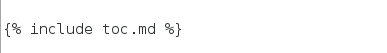
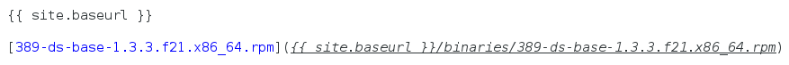

# How to Write a Wiki Page using MarkDown
------------------------------------------



### [MarkDown Documentation](http://daringfireball.net/projects/markdown/)

### Page Formatting

For page consistency please start each page like:

    ---
    title:  "Page Title"
    ---

    # Page Title
    ------------

### Headings

Use "pound" signs "#" for headings, the more pound signs the smaller the heading size

    # = Large font size
    ## = Slightly smaller
    ### = Smaller still (this is used for most topic headings)
    #### = Even smaller
    ##### = Doesn't get much smaller than this

    ### Typical Heading

You can also add horizontal lines by using a series of hyphens under the text

    My List of Topics
    -----------------

### Escaping Characters

Beware of using pipes "\|" and angled brackets "<>", they need to be escaped with a backslash unless they are inside a code block.

### Code Blocks

Simply use 4 leading spaces to trigger a code block.  If a code block is under a list item then you must use an additional 4 spaces for each level of indentation.

### Table Of Contents

TOC are not automatic you must add the following where you would like the table to appear.

Note, if you embed HTML anchors in headings, they must be on separate lines.  For example:

    ### My Topic

This causes issues with the TOC (where the item becomes unclickable).  This should be

    <a name="my-anchor">

    ### My Topic

### HTML

You can embed HTML code in a MarkDown file

### Tables

MarkDown uses pipes to create simple tables.  Links and HTML can be inserted into tables.

    | Header 1 | Header 2 |
    |----------|----------|
    |value|value|
    |value|value|

    |Attribute|Values|Reason|
    |-----------|---------|---------|
    |nsslapd-dynamic-plugins|on or off|Used with enable dynamic plugins|

### Links

There are two ways to insert links

-   The direct URL inside angled brackets:

        <http://port389.org>

-   Hyperlink

        [text describing the link](http://port389.org)

### Images

From the doc root dir, the link is:

../../images/image.png

    

### Downloads

Use the following exact text to reach the "binaries" directory

### Community Contributions

Please file a [ticket](https://github.com/389ds/389-ds-base/issues/new) and select "**wiki**" as the component and attach the new MarkDown file(file.md)

### Advanced Wiki Configuration (internal only)

Be careful when modifying these files as mistakes can break the entire site

- Modify the Navigation Bar content

        _includes/header.html

- Modify the Table of Contents

        _includes/toc.md
